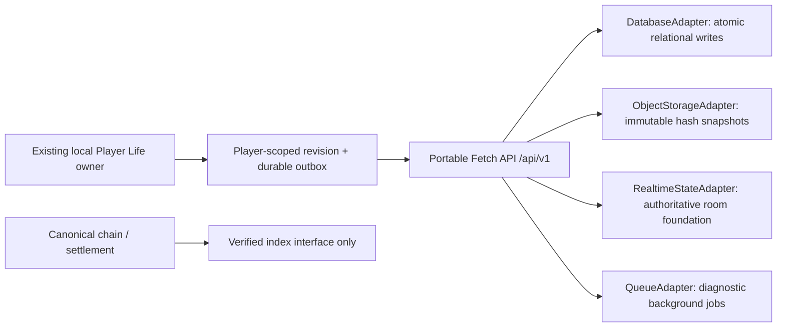

# KAIOS Backend V1 — review candidate

## Metadata

| Field | Value |
|---|---|
| VERSION | V1 |
| REVISION | 2026-10-06.CUSTOMER_PROJECT_LOCAL_EVIDENCE_METADATA.1 |
| STATUS | DRAFT |
| LAST_UPDATED | 2026-10-06 |
| UPDATED_BY | dot / TEMPORARY_EXTERNAL_ENGINEERING_MAINTAINER / HUMAN_AUTHORIZED_2026_10_05 |
| REVIEWED_BY | dot, scoped source review and metadata-scope approval only; no registered Reviewer role or authority grant |
| SOURCE_COMMIT | d2d6c892a9e2c1870638107f9193b3ff0a9c0e7f |
| TASK_ID | KAIOS_AI_COMPANY_CUSTOMER_PROJECT_RUNTIME_V2 |
| CHANGE_REASON | Record cumulative Customer Project local-simulation provenance and revision history; comment/docs-only correction. |
| ANCESTOR | KAIOS/backend/KAIOS_BACKEND_ARCHITECTURE.md at e26f3a76ef0be7f43058225f46def3fbe123371e; preserved local research lineage 0bbfa5cc5c6f4f391743a50f4b42f208ca397b4e |
| SOURCE_OF_TRUTH | FALSE |

This metadata describes the Customer Project candidate revision only. Existing
owner/document version identities and inherited governance content are preserved.
It does not promote this branch or its local prototype to a production authority.

This adds a service layer, not a second gameplay or financial engine. No production
service, paid resource or public multiplayer world is created by this PR.

## Canon inventory (main 14c6937078518e8026f31f642e82221ad0e3ab82)

| Domain | Existing owner | Backend role |
|---|---|---|
| Player Life | `K線西遊記/temples/11520/runtime/player-life-runtime.mjs` | Import the existing validator; authenticated durable projection |
| Player storage | `KAIOS_PLAYER_LIFE_V1`, player-scoped browser stores | Local-first remains; separate revision journal/outbox |
| Logistics / Player Courier | `digital-ant-logistics-runtime.mjs` | Completed mission/receipt projection using existing IDs |
| Market Life | `market-life-runtime.mjs`, `world-runtime.mjs` | Completed training growth only, never pending predictions |
| GA600 | Player Life Engine XP; full engine NOT_INTEGRATED | Game progress projection, no research-engine claim |
| Wallet | `evm-wallet-runtime.mjs`, `wallet-game-bridge.mjs` | Server challenge proof, never wallet custody or balance authority |
| Trading | `real-trading-order-intent.mjs`, existing settlement / chain | Read-model interface only; no settlement implementation |
| 12345 | Existing Heart runtime-main / runtime-state | No modifications |

Boot, AGENTS, Physics CURRENT, UniverseMap CURRENT, 11520 HANDOFF_CURRENT,
Player Life, Digital Ant, Market Life and V10 backend standards were read before
implementation. Existing Player Life documents propose cloud research but do not
select an operational provider. The old `11520/backend/server.mjs` is a simulation
service, not an authenticated Player Life recovery authority. This candidate follows
V10's service/adapter/security boundaries without adopting that simulation ledger.

## Three authorities

- **Blockchain**: financial/on-chain truth. Balances, allowance, deposit, position,
  claimable and withdrawals must be read from their canonical chain/settlement owner.
- **Backend**: authenticated game state, synchronization, version history and recovery.
  Client game progress remains an untrusted game candidate, not anti-cheat proof.
- **GitHub**: code and specification truth. A Draft PR does not activate a production authority.

## Ports and reference adapters

`src/primitives.mjs` defines DatabaseAdapter (get/all/atomic statements),
ObjectStorageAdapter (immutable put/get), RealtimeStateAdapter (owned command),
QueueAdapter (send), rate-limit policy and canonical serialization/hash primitives.
Core service/model/room modules use portable Web APIs; no Node or vendor SDK imports.
The Player Life validator is imported from its original source, including in the
Workers bundle. Generated copies are build assets, not separately edited authority.

| Port | Local reference | Cloudflare candidate |
|---|---|---|
| Database | SQLite / Node 24 `node:sqlite`, WAL, FK, BEGIN IMMEDIATE | D1 prepared statements / atomic batch |
| Object storage | Write-once files | R2 conditional immutable put |
| Realtime | Single local authoritative room owner | Private Durable Object binding, serialized durable room state |
| Queue | Local diagnostic queue, drain interface | Queue producer/diagnostic consumer |

Cloudflare bindings have **not** been provisioned or tested against a live provider.
They are a locally bundled reference candidate. Multi-isolate abuse control needs
provider ingress limits in addition to the bounded per-isolate middleware before
any production approval. The room is FOUNDATION_ONLY: WorldSession, Presence and
PlayerPositionProjection; MonsterProjection/MissionProjection placeholders are
empty arrays. It is not a live MMO or peer-to-peer trust system.

## Models and ownership

PlayerProfile (`/player/me`) contains playerId, lifeId (the canonical Player Life ID,
not an employee or browser fingerprint), verified wallet projection, createdAt,
updatedAt, schemaVersion, revision, gameProgress, level, XP, lastWorld, LOCAL XYZ,
homePlotId and settings. Wallet address plus chain context has a unique binding.
Account sessions select the independently enrolled Life. Wallet signatures cannot
claim a public ID. Legacy migration requires a trusted ownership proof adapter;
without one, preserve local saves and refuse enrollment rather than guessing ownership.

State is schemaVersion 2 plus the canonical game-only player, completed monster
training growth, game receipts and completed logistics missions. Player profile PII
is omitted/reset before transport and server persistence. Events, XP/level/home
constraints are validated by the existing Player Life validator; no new XP formula
is introduced. Inventory remains the existing player-scoped backpack **reference**;
V1 does not replicate the backpack's item ledger. Do not advertise a full backpack
restore or full GA600 integration.

The browser transport persists a fixed candidate + idempotency key before network
I/O. Timeouts replay that same request. Refresh never relabels stale local data with
a newer cloud revision. A stale device receives CONFLICT; both complete versions
remain in the server conflict journal. Recovery Center lets the player inspect,
preview/restore a preserved conflict candidate or historical version, or explicitly load the server version to local; it
never silently picks last-write-wins. Frame/animation/camera/pointer/modal/FX state
and pending monster predictions are excluded. Sync is explicitly requested through
the Recovery Center or the reusable outbox API; V1 does not background-sync every
gameplay event or silently enable a cloud provider.

## API

| Method | `/api/v1` path | Purpose |
|---|---|---|
| GET | `/health` | DB check, authority labels, configuration mode |
| GET | `/auth/challenge` | Bounded wallet/chain/player challenge issuance |
| POST | `/auth/verify` | One-time signature verification, 30-minute session |
| GET | `/player/me`, `/player/state` | Own profile/current health/conflict candidate |
| POST | `/player/state/sync` | Compare baseRevision; save durable sync snapshot |
| GET | `/backups`, `/backups/:id` | Own immutable version metadata/payload |
| POST | `/backups/create` | Manual/milestone/pre-migration backup |
| GET | `/backups/:id/verify`, `/backups/:id/export` | Verify or portable JSON export |
| POST | `/recovery/preview`, `/recovery/restore` | Snapshot/import preview; explicit confirmed restore |
| GET | `/game/receipts`, `/logistics/missions` | Durable game-only projections |
| GET | `/chain/receipts` | Fail-closed unconfigured verified-chain index boundary |
| POST | `/world/session` | Private authenticated room command, sequence/revision |

Every POST requires `Idempotency-Key` (8–128 safe characters). Auth challenge GET
is intentionally a fresh nonce issuance, not a player-state mutation. Reusing a POST
key with different content returns 409; response replay does not perform mutation
again. Auth response replay returns the same public metadata without issuing another
session; if the first cookie was lost, request a fresh challenge. No bearer token is
stored in response journals or displayed by the UI.

## Repository registration

README and `docs/KGEN_MASTER_INDEX.md` register the candidate and its file inventory.
Boot CURRENT is a protected authority and this task did not explicitly authorize a
Boot update; it remains unchanged. GM may register an approved service activation
in Boot under a separate explicit authorization after independent review.

Identity remediation adds Account/AccountSession/AccountLife ownership independently
of game snapshots. EmailProviderAdapter and TestEmailProvider remain portable. Private
SQL outbox dispatch is separate from request responses; credentials and PII never enter
game backup/export. `0002_identity.sql` is additive, not a second backend. Legacy
wallet sessions are invalid for Account access. Fresh signup creates a new Life;
it does not silently relabel/import existing local guest data as verified ownership.

Coordinate schema 2 uses `coordinates.universe` (KGEN_UNIVERSE_XYZ, xyz=null,
UNRESOLVED, explicit address anchor and no transform) and `coordinates.local`
(LOCAL_RENDER_SCENE, world ID, legacy scene units, lastXYZ/home XYZ). Existing
`player.lastXYZ`/`homePlot.xyz` remain compatibility aliases explicitly local-only.
No API promotes client-supplied universe triples. Human address examples are decimal
anchor metadata, not 3-axis position or currency exchange rates. A future authoritative
position adapter must supply provenance/frame/transform before coordinates can resolve.

## Customer project research prototype and future integration boundary

Task `KAIOS_AI_COMPANY_CUSTOMER_PROJECT_RUNTIME_V2`, source baseline
`b2a349c36d3670327aa419802f6a80a4ed339a4e`. The existing Company owner now has a
pure local test prototype for request -> immutable simulated quote -> explicit
acceptance -> planned project. It is `LOCAL_TEST_ONLY_NOT_DURABLE`. No Backend
service, route, data model, SQL migration, provider binding or deployment was
changed to enable it. Player schema 2 still rejects arbitrary project fields.

The cumulative owner map and acceptance rules are in
`KGEN-AI-Company/AI_COMPANY_OPERATING_SYSTEM.md`, section 8. The unchanged #97
library is used only by an explicit test planning adapter. No house completion,
asset registration, real customer/revenue, procurement or payment follows from
the prototype. #182/#410 remain HOLD with no stale code transplant.

If a later implementation is authorized, reuse this Backend's Account -> enrolled
Player session, DatabaseAdapter, idempotency journal, hashing and conflict policy.
The prototype's synchronous simulation identity context must be supplied only
after server authentication; it is not a new authenticator. Do not create a new
account, claim a legacy Life, configure persistent access or mutate a registry as
a shortcut to testing the project flow.

Proposed next changes, not implemented:

- `src/model.mjs`: separate strict customer-project aggregate, leaving Player
  `SCHEMA_VERSION=2` and game-only receipts unchanged.
- `src/service.mjs`: default-off owned workspace read/command routes; resolve
  session identity before reads, command execution and idempotency lookup.
- Additive `deploy/0003_customer_projects.sql`: current aggregate, append-only
  event and project-specific revision-guard tables in the existing database.
  Reuse the existing idempotency table; do not edit applied 0001/0002 migrations.
- `src/local-server.mjs`: load the additive migration only in the separately
  approved local prototype configuration. Do not enable production worker flags.
- Existing backend tests: add restart, statement-by-statement rollback,
  concurrent first submission, wrong-tenant and conflict preservation coverage.

The first database slice may have one workspace per enrolled Player as a bounded
technical scope, not a permanent product entitlement. Enforce workspace ID as the
primary key and `owner_player_id` independently UNIQUE; a composite uniqueness
constraint alone does not enforce the one-workspace bound. Use a stable
Account/Player/company/primary-slot command scope before a workspace ID exists.
Initial creation uses expected revision zero and a guarded absent row.

For state-changing commands, atomically check workspace revision and prior event
hash, replace the aggregate, append its event, and store the exact key/hash/response.
Accepted quote, simulated contract and planned project must become visible together.
For a new-key duplicate of the exact accepted intent, guard the immutable accepted
hash and cache only the ALREADY_ACCEPTED response; do not advance state/event
revision. Changed payload under an existing key fails with a content mismatch.
Retries never receive a silent new key. Cross-process guarantees must be tested
against the database; the pure prototype's in-memory queue does not prove them.

Project backup/export/import/restore must use a separately versioned project
envelope and preserve accepted-baseline history. The existing Player snapshot
loader is deliberately incompatible and must not be weakened. R2 snapshots,
Recovery Center integration, multi-device UI, full-house construction coverage,
Asset/Player projections and final simulated receipts are deferred. No automatic
cross-store Company IndexedDB writes or public REAL business events are planned.

Any future new file needs its full path/purpose registered in Backend README,
repository README and KGEN indexes. Boot CURRENT remains protected and requires
explicit scoped authorization. This existing-document appendix does not authorize
that update, production activation, heavy CI, funding, legal commitments or real
external effects.

### Local SQLite persistence prototype after the pure model checkpoint

Local ancestor `7dff3fa49646093dd4fce6b0a405c18106a61877` is the reviewed pure-model
checkpoint described above. A separate, explicitly opt-in exported helper in
`src/service.mjs` now exercises local persistence without connecting a service
route or modifying `createBackend`. The only Company-domain change factors the
existing synchronous trusted-context validator for reuse; the V1 planning/runtime
source remains unchanged. This helper does not load a planningAdapter.

The fixture schema is confined to `tests/universal-exchange.test.mjs`:

- `customer_project_workspaces`: stable workspace primary key, independently
  unique owner Player, Account binding, domain revision, storageVersion, payload/hash.
- `customer_project_events`: foreign key to the workspace,
  PRIMARY KEY(workspace_id, sequence), globally unique event ID, immutable payload/hash.
- `customer_project_guards`: expected storageVersion/payloadHash and current
  Account/Player binding, enforced by a RAISE(ABORT) trigger within atomic().
- Existing `idempotency` table: prototype-specific hashed owner/company/primary-slot
  namespace plus command type and client key. It cannot collide with existing routes.

The fixture applies existing 0001/0002 to disposable databases and seeds fictional
existing Account/Player bindings directly. It never calls signup, enrollment,
email, wallet or formal registry routines. No new or applied migration is edited,
and no production database is provisioned by the helper.

Each stored operation retains exact command, copied planner output, every consumed
clock observation, model-result hash, resulting-state hash and cached persistence
envelope. Replay must consume those observations exactly once and reconstruct the
unchanged pure-model response, including durable:false. The persistence envelope
is separate; committed:true is returned only after the local DB transaction succeeds
or a coherent reload verifies a previously committed matching response.

One SQL SELECT captures Account/Player binding, workspace, ordered event rows and
the entire namespaced idempotency journal in a single read snapshot. A concurrent
writer cannot make cache/event rows appear newer than the selected workspace.
Stored events exactly match replayed events; journal operations exactly match the
pure model's commandJournal. Missing, extra or inconsistent records block reads
and retries. No unchecked snapshot import, silent reconstruction or automatic reset
is provided.

Live commands compute a candidate off to the side. One DatabaseAdapter.atomic
transaction performs the trigger-based compare-and-set, aggregate replacement,
new domain-event inserts, idempotency response insert and guard cleanup. The port
returns no affected-row counts, so a zero-row UPDATE is never accepted as CAS proof.
On a race, lost acknowledgement or speculative planner/expiry failure, one coherent
snapshot/replay reload verifies any matching committed result without rerunning the
planner or mutation. Different-key losers receive a conflict and never
overwrite the winner. Response-only ALREADY_ACCEPTED checkpoints still advance
storageVersion to prevent lost response journals, while domain revision stays fixed.

The focused integration evidence covers SQLite file reopen, historical replay
without live clock/planner calls, independent connection races, Account/Player
isolation, two workspaces both using event sequence 1, every-statement rollback for
creation and acceptance, lost-response recovery, coherent reads during another
commit, revocation during asynchronous work and inconsistent cache/event/replay
records. These tests do not establish D1 behavior, cloud execution, production
authentication or end-user recovery/UI readiness.

Acceptance time remains the trusted service decision timestamp saved by the model.
The helper checks freshness before requesting the transaction; a lock wait may
commit later. This is not a database-commit-before-expiry guarantee. Replay keeps
the original decision and cannot reaccept an expired quote. Concurrent duplicate
issuance can evaluate the trusted side-effect-free planner twice, with one committed
outcome. Hashes/replay are corruption checks, not signatures or an external
anti-rollback anchor against coherent whole-database replacement.

Before a deployment migration is proposed, retain the registration and scoped
review gates above. No CURRENT/Boot update, registry write, new Life, worker dispatch,
supplier order, actual payment, house asset release or production activation is
authorized by this local checkpoint.

### Subsequent local execution-evidence experiment

The existing Company test adapter's `auditSubplan` is a read-only consumer of a
trusted accepted-project source and a quote-bound disposable V1 simulation. It
checks replay, request/quote/resource scope, explicit inspection measurements and
the quoted rework rest policy. It does not enter this Backend's model, route or
persistence command set; the SQLite helper still persists only the four original
request/quote/acceptance commands. No execution snapshot is durably stored here.

The bounded late-QA fixture reaches legacy coordinator `ACCEPTANCE_PENDING` without
customer acceptance or revenue recognition. An early physical rework fixture is
retained as `REPLAN_REQUIRED` on `REST_REQUIREMENT_CONFLICT`, with unchanged
downstream task state after the failed assignment. Full-house stage/location
coverage, canonical scheduler replanning, authoritative inspection, owner-provided
Asset/logistics projections and durable execution commands remain separate work.
See the cumulative Company operating-system section for exact coverage limits.

### Version-2 local subplan evidence journal (2026-10-06)

`createCustomerProjectPersistencePrototype` now accepts an optional code-level
`executionEvidenceSource.read` port for `CHECKPOINT_SUBPLAN_EVIDENCE`. The caller
command contains only exact project/acceptance/quote/input-digest bindings and
expected aggregate revision. It cannot provide the audit decision. The Company
owner invokes the existing frozen V1 auditor and creates a separate immutable
summary projection, leaving the held project and all asset/delivery/receipt
fields untouched. No authenticated Worker/Reviewer or real acceptance is claimed.
Object digests use the existing canonical JSON SHA-256 functions. They establish
content consistency, not an authenticated publisher, human review or byte-layout
identity for differently formatted but equivalent JSON text.

The same existing workspace row stores a version-2 replay envelope. Only checkpoint
operations gain an `evidence` observation containing complete resource-fixture and
V1 export bytes; a response-only identical checkpoint has `evidence:null`. Earlier
operations keep exactly their original shapes/results/state hashes. Version-1
journals are still accepted, but cannot contain the new command. There is no new
table, migration, route, schema-2 Player field, object-storage dual write, provider
binding or production startup change.

Replay consumes retained input observations exactly once, recomputes their
command-bound digests, replays the frozen auditor, and verifies model response,
projection/state hashes, append-only events and exact idempotency rows. A read
cannot substitute a fresh evidence source or fabricate missing inputs. Live
first-checkpoint storage uses the existing binding/storageVersion/payloadHash CAS
trigger and one `DatabaseAdapter.atomic` transaction for workspace replacement,
new event, exact response and guard cleanup. A concurrent loser reloads the
coherent winner only for an identical committed key/hash; otherwise it conflicts.
Lost acknowledgement uses the same verified recovery path. New-key identical
checkpoints increment storageVersion alone and remain revision-guarded.

The 512 KB workspace/read bound, 128-event bound, 256-operation bound and 16 KB
command bound are unchanged. Complete V1 input bytes are stored once, while the
state and response retain bounded audit summaries. If these bounds cannot hold a
future artifact, that dependency needs separate review; no implicit unbounded
blob store or cap increase is provided.

The scoped verification uses real disposable SQLite files with the existing
Node SQLite adapter, including a fresh OS process reopening the same file and
reconstructing evidence with all live sources disabled. This demonstrates the
local file/restart path only. It does not establish cloud/D1 behavior, power-loss
or hostile whole-file rollback resistance, recovery UI, multi-device readiness,
formal owner source authorization or a completed house. The pure model response
still says `durable:false`; the separate persistence envelope identifies only a
committed local database checkpoint.

Recovery is tested only against the recorded code revision. The frozen adapter
imports the installed V1 module path; it is not a Git-pinned runtime loader, and
the journal does not authenticate an auditor source commit. A later implementation
that rejects the retained V1 export or computes a different audit/model response
or state will fail the replay/result/state-hash checks. A source change that
computes identical results is not detected by those content hashes. Arbitrary-
version recovery is therefore NOT_VERIFIED. Source-version admission, retained
auditor availability and explicit journal migration are future dependencies, not
features silently added by this checkpoint.

A later house delivery/acceptance/receipt implementation must extend this same
aggregate boundary with current owner evidence, not create a second Company or
ledger. Source revision drift invalidates inspection and pending delivery; final
customer acceptance and a unique simulation receipt must commit together.
Restore/import must preserve consumed accepted baselines and receipts, rather
than reaccepting an older quote or deleting later acceptance history. Existing
Player backup/schema-2 recovery remains incompatible and unchanged. Production
migration/authentication, reviewed construction coverage, Asset/Logistics
projection contracts and explicit customer-delivery intent remain dependencies.

## Local revision history / release record

The aggregate seven-file record is in
[`AI_COMPANY_OPERATING_SYSTEM.md`](../../KGEN-AI-Company/AI_COMPANY_OPERATING_SYSTEM.md#local-revision-history--release-record).
It includes both root test files and the existing Universal workflow's ordinary
Node 24 lane; the scheduled worker stays on Node 20. This local Backend entry
records the same cumulative source and its recovery-specific compatibility limit.

| Date | Version / Revision | Task ID | Actor | Reviewer | Files | Reason | Compatibility | Rollback |
|---|---|---|---|---|---|---|---|---|
| 2026-10-06 | Backend V1; 2026-10-06.CUSTOMER_PROJECT_LOCAL_EVIDENCE_METADATA.1 | KAIOS_AI_COMPANY_CUSTOMER_PROJECT_RUNTIME_V2 | dot / TEMPORARY_EXTERNAL_ENGINEERING_MAINTAINER / HUMAN_AUTHORIZED_2026_10_05 | dot, scoped source review and metadata-scope approval only; no registered Reviewer role or authority grant | `KAIOS/backend/src/service.mjs`; `KAIOS/backend/KAIOS_BACKEND_ARCHITECTURE.md`; full seven-file scope in the linked aggregate record. | Record the inherited local persistence helper and reviewed immutable execution-evidence checkpoint; this successor changes comments/docs only. | No production migration or new route/table. The existing v2 journal reader retains v1 compatibility; metadata does not change payloads or executable code. | Reverting metadata alone restores the d2d6c892 behavior. A pre-checkpoint v1-only helper cannot read v2 evidence journals. Preserve the database, accepted history and artifacts; fail closed and require an explicit migration/admission plan, never an automatic reset or deletion. |

Backend V1 and the Company owner are unchanged identities; this record does not
introduce a replacement Runtime, public version authority, schema-2 Player
extension or production activation. Source/metadata-scope review is not a formal
Reviewer-role grant. The three passing CI runs and screenshot artifact on
`d2d6c892a9e2c1870638107f9193b3ff0a9c0e7f` remain historical exact-head evidence.
A later metadata successor must bind its own source and review instead of reusing
those results as if they ran on a new commit. The installed-auditor-only recovery,
local SQLite, no-cloud and held-house boundaries above continue to apply.
