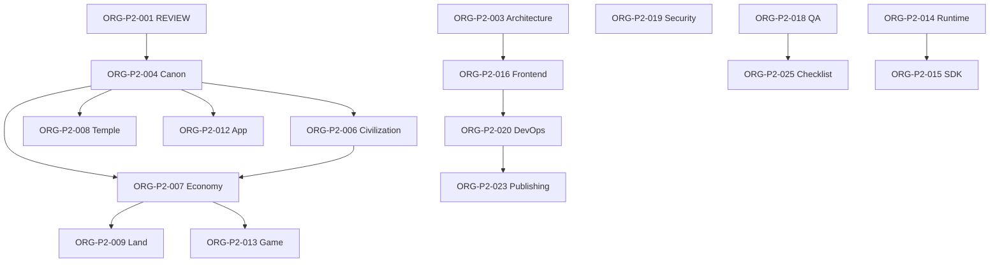

# ORG-P2-002 PMO 72-Hour Milestone Board

## Report Metadata

| Field | Value |
|---|---|
| Task ID | ORG-P2-002 |
| Date | 2026-07-09 |
| Base Commit | 7f62a7d8fec981308d927b5f0aed232ffd7043ea |
| Start Status | OPEN |
| End Status | REVIEW |
| Department | PMO |
| Priority | P1 |
| Owner | Cursor |
| Reviewer | Codex |
| Planning Window | 2026-07-09 20:00 UTC → 2026-07-12 20:00 UTC (72 hours) |

## Summary

Built a 72-hour cross-department milestone board from the Phase 2 central WorkQueue (`KGEN-Organization/WorkOrders/WORK_QUEUE.md`) and all 24 department-level `WORK_QUEUE.md` files. The board sequences **25 Phase 2 Cursor tasks** into three 24-hour waves by priority (P0 → P1 → P2/P3) and dependency. Department queues are uniform (readiness → Canon/risk → proposal) and remain **deferred** until Phase 2 central queue completes. No protected paths or core systems were modified.

## Queue Inventory (As-Is)

### Phase 2 Central Queue (`WorkOrders/WORK_QUEUE.md`)

| Status | Count | Task IDs |
|---|---|---|
| REVIEW | 1 | ORG-P2-001 |
| OPEN | 24 | ORG-P2-002 … ORG-P2-025 |
| IN_PROGRESS | 0 | — |
| DONE | 0 | — |
| BLOCKED | 0 | — |

### Department Queues (24 departments, excluding WorkOrders)

Each department queue follows the same template:

| Task Pattern | Status (all depts) | Purpose |
|---|---|---|
| `ORG-{Dept}-001` | OPEN | Read README, ROLE, RESPONSIBILITY, HANDOFF, REPORT_TEMPLATE |
| `ORG-{Dept}-002` | OPEN | Check Canon links and protected-path impact |
| `ORG-{Dept}-003` | REVIEW | Propose next department WorkOrder (awaiting Codex) |

| Metric | Value |
|---|---|
| Departments with queues | 24 |
| Department tasks total | 72 (24 × 3) |
| Department OPEN | 48 |
| Department REVIEW | 24 |
| Department DONE | 0 |

**Departments scanned:** App, Architecture, Backend, Building, Canon, CEO_Codex, Civilization, DevOps, Documentation, Economy, Frontend, Game, Land, NPC, PMO, Publishing, QA, Reports, Research, Runtime, SDK, Security, Temple, Universe.

## 72-Hour Milestone Board

### Wave 1 — Governance Foundation (Hour 0–24)

**Goal:** Establish command chain, Canon, Runtime, and Security baselines before domain QA.

| Order | Task ID | Department | Priority | Title | Milestone |
|---|---|---|---|---|---|
| — | ORG-P2-001 | CEO_Codex | P0 | Command chain review | **Codex REVIEW** (report exists; await approval) |
| 1 | ORG-P2-002 | PMO | P1 | 72-hour milestone board | **This report → REVIEW** |
| 2 | ORG-P2-004 | Canon | P0 | Canon alignment vs Genesis Library | Report due H+6 |
| 3 | ORG-P2-014 | Runtime | P0 | No duplicate Runtime CURRENT / bootstrap | Report due H+12 |
| 4 | ORG-P2-019 | Security | P0 | DO_NOT_TOUCH / protected path audit | Report due H+18 |
| 5 | ORG-P2-003 | Architecture | P1 | Duplicate folder / same-function check | Report due H+24 |

**Wave 1 exit criteria:** P0 governance reports in REVIEW or APPROVED; architecture duplicate list published.

### Wave 2 — Domain Standards QA (Hour 24–48)

**Goal:** Validate civilization, economy, temple, land, app, and game standards against Canon.

| Order | Task ID | Department | Priority | Title | Depends On |
|---|---|---|---|---|---|
| 6 | ORG-P2-006 | Civilization | P1 | Civilization stage map | P2-004 |
| 7 | ORG-P2-007 | Economy | P1 | Economy loop QA | P2-004, P2-006 |
| 8 | ORG-P2-008 | Temple | P1 | Temple organ / one-image-one-temple QA | P2-004 |
| 9 | ORG-P2-009 | Land | P1 | Land acquisition / rental / conquest language | P2-004, P2-007 |
| 10 | ORG-P2-012 | App | P1 | App life rules QA | P2-004 |
| 11 | ORG-P2-013 | Game | P1 | Game loop map | P2-006, P2-007 |
| 12 | ORG-P2-005 | Universe | P2 | Universe Map reference check | P2-014 |
| 13 | ORG-P2-010 | Building | P2 | Building evolution map | P2-009 |
| 14 | ORG-P2-011 | NPC | P2 | NPC evolution constraints | P2-012 |

**Wave 2 exit criteria:** All domain-standard reports submitted; cross-loop dependencies (economy ↔ civilization ↔ game) documented.

### Wave 3 — Infrastructure, Publishing, Closure (Hour 48–72)

**Goal:** Link validation, DevOps/Pages, documentation index, full QA sweep, final checklist.

| Order | Task ID | Department | Priority | Title | Depends On |
|---|---|---|---|---|---|
| 15 | ORG-P2-016 | Frontend | P1 | README / Pages entry links | P2-003 |
| 16 | ORG-P2-020 | DevOps | P1 | Pages workflow (no Jekyll) | P2-016 |
| 17 | ORG-P2-022 | Documentation | P1 | README / Master Index coverage | P2-003 |
| 18 | ORG-P2-023 | Publishing | P1 | GitHub Pages URL QA | P2-020 |
| 19 | ORG-P2-024 | WorkOrders | P1 | WorkOrder / report path consistency | P2-002 |
| 20 | ORG-P2-015 | SDK | P2 | SDK schema gap list | P2-014 |
| 21 | ORG-P2-017 | Backend | P2 | Backend boundary assumptions | P2-014 |
| 22 | ORG-P2-021 | Research | P3 | Research inputs for V2.1 (non-Canon) | P2-004 |
| 23 | ORG-P2-018 | QA | P0 | Protected path / link / JSON validation | All prior reports |
| 24 | ORG-P2-025 | Reports | P2 | Final Organization V2.0 report checklist | P2-018 |

**Wave 3 exit criteria:** Full QA validation pass recorded; final checklist ready for Codex Phase 2 closeout.

## Dependency Graph (Simplified)



## Department Queue Milestone (Post Phase 2)

Department `001`/`002`/`003` tasks are **not scheduled inside the 72-hour window**. PMO recommends activating them only after Codex marks Phase 2 central queue `DONE`:

| Phase | Trigger | Action |
|---|---|---|
| Dept Wave A | Phase 2 ≥ 80% REVIEW | Codex assigns `ORG-{Dept}-001` readiness batch (5 depts/day) |
| Dept Wave B | Dept-001 DONE | Cursor executes `ORG-{Dept}-002` Canon/risk per department |
| Dept Wave C | Dept-002 DONE | Codex reviews `ORG-{Dept}-003` proposals already in REVIEW |

## Cursor Throughput Assumption

| Parameter | Value |
|---|---|
| Tasks per Cursor session | 1 OPEN task |
| Average task duration | 1 session (~1–2 hours execution + report) |
| 72-hour Cursor capacity | ~24–36 tasks if continuously dispatched |
| Phase 2 OPEN backlog | 24 tasks (after P2-002) |
| Feasibility | **Achievable** within 72 hours if Codex reviews keep pace |

## Critical Path

```text
P2-001 (Codex approve) → P2-004 Canon → P2-007 Economy → P2-013 Game → P2-018 QA → P2-025 Checklist
```

Parallel tracks: Runtime (P2-014) + Security (P2-019) in Wave 1; Frontend/DevOps/Publishing in Wave 3.

## Files Read

- `KGEN-AI-Company/CURSOR_EMPLOYEE_BOOT.md`
- `KGEN-AI-Company/CURSOR_AUTO_WORK_PROTOCOL.md`
- `KGEN-AI-Company/CURSOR_REPORTING_RULES.md`
- `KGEN-Organization/WorkOrders/KGEN_WORKORDER_STANDARD.md`
- `KGEN-Organization/WorkOrders/WORK_QUEUE.md`
- `KGEN-Organization/PMO/README.md`
- `KGEN-Organization/PMO/ROLE.md`
- `KGEN-Organization/PMO/RESPONSIBILITY.md`
- `KGEN-Organization/PMO/WORK_QUEUE.md`
- All 24 department `WORK_QUEUE.md` files under `KGEN-Organization/*/WORK_QUEUE.md`
- `KGEN-Agent-Office/DO_NOT_TOUCH.md`
- `KGEN-Canon/KGEN_CANON_MASTER.json`
- `KGEN-AI-Company/reports/DISPATCHER_STATUS.md`

## Files Modified

- `KGEN-Organization/WorkOrders/WORK_QUEUE.md` — ORG-P2-002 status OPEN → REVIEW
- `KGEN-AI-Company/reports/ORG-P2-002_PMO_MILESTONE_BOARD.md` — this report (created)

## Protected Paths Checked

No modifications to:

- `contracts/`, `K線西遊記/temples/12345/`, `wallet/`, `bridge/`
- `PRIMEFORGE_GENESIS_BOOT_SEQUENCE_V1_4.md`
- `docs/physics/KGEN_Universe_Physics_Runtime_CURRENT.md`
- `docs/physics/final-whitepaper/`
- `KGEN/contracts/KGEN_Token_V7_5_2.sol`

## Checks Run

| Check | Method | Result |
|---|---|---|
| Git pull | `git pull --rebase origin main` | Rebased onto `1ca5763`; conflict on WORK_QUEUE resolved (P2-001 → REVIEW) |
| Base commit | `git rev-parse HEAD` | `7f62a7d8fec981308d927b5f0aed232ffd7043ea` |
| Department queue scan | `head` on 24 `WORK_QUEUE.md` | Uniform 001/002 OPEN, 003 REVIEW pattern |
| Phase 2 status grep | `WORK_QUEUE.md` summary table | 1 REVIEW, 24 OPEN |
| Protected path diff | `git diff --name-only` | No protected paths |

## Risks

| ID | Risk | Severity |
|---|---|---|
| R1 | ORG-P2-001 was BLOCKED on origin until rebase; Codex may need to re-inspect report now present | Medium |
| R2 | 72-hour plan assumes Codex review latency &lt; 4 hours per task; backlog if slower | Medium |
| R3 | Department `003` tasks already REVIEW without corresponding `001`/`002` completion — proposal queue ahead of readiness | Low |
| R4 | P2-018 (full QA) scheduled last; defects in early tasks may require rework | Low |
| R5 | `DISPATCHER_STATUS.md` stale (references missing commit `01c8095`); should update after Codex review | Low |

## Blockers

None for this task.

## Recommendation

1. **Codex:** Review and approve ORG-P2-001 and ORG-P2-002; update `CODEX_REVIEW_LOG.md` and `DISPATCHER_STATUS.md`.
2. **Cursor next session:** Accept **ORG-P2-004** (P0 Canon) per Wave 1 critical path — or **ORG-P2-003** if Codex prefers architecture-first.
3. **PMO:** Hold department `001`/`002` queues until Phase 2 central queue reaches ≥80% REVIEW to avoid parallel scope creep.

## Need Codex Review

**Yes.**

## Need Human Decision

**No.**
