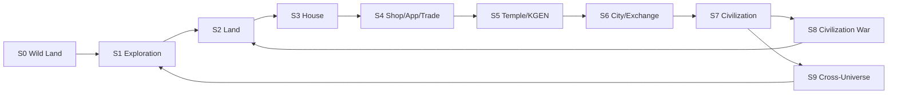

# ORG-P2-006 Civilization Stage Map

## Report Metadata

| Field | Value |
|---|---|
| Task ID | ORG-P2-006 |
| Date | 2026-07-09 |
| Base Commit | 0ae44be2647657e45544a773c9ee2f314aa9444b |
| Start Status | OPEN |
| End Status | REVIEW |
| Department | Civilization |
| Priority | P1 |
| Owner | Cursor |
| Reviewer | Codex |

## Summary

Mapped **10 civilization upgrade stages** (S0–S9) by aligning `KGEN_CIVILIZATION_CORE_CANON.md`, `KGEN_ECONOMY_LOOP.md`, Genesis GEN-004/GEN-006, and `KGEN_CANON_MASTER.json` economy loop. Economy and game loops are **compatible** when read as parallel views of the same progression. **Seven missing dependencies** were identified — chiefly the absence of a dedicated `KGEN_CIVILIZATION_STANDARD.md` under Organization and unmapped runtime/SDK schemas for stage transitions.

## Unified Stage Map

| Stage | Name | Economy loop node | Game loop actions | Upgrade trigger | Canon source |
|---|---|---|---|---|---|
| **S0** | Wild Land | Wild Land | Enter Portal; first explore | Universe entry via Portal | Economy §3; GEN-004 flow start |
| **S1** | Exploration | Exploration / Resource | Explore, gather, map coordinates | Discover coordinates on Universe Map | Economy §4; Canon §5–6 |
| **S2** | Claimed Land | Land | Occupy land; claim/build rights | Exploration → land claim / market / war outcome | Land Standard; GEN-004 Ch.4 |
| **S3** | House Organ | House | Build first house on land | One land → one house | Canon prime law; Economy §6 |
| **S4** | Shop & Trade | Shop / App / Trade | Produce, trade, shop ops | House evolves to shop; App life begins | Economy §7; App Standard |
| **S5** | Temple Service | Temple / KGEN | Build/upgraded temple; KGEN circulation | Temple upgrade; AMM/KGEN settlement | Canon §2; Economy §8–9 |
| **S6** | City | Exchange / City | Marketplace, NPC services, governance | Stable production + trade + governance nodes | Economy §9–10; GEN-004 Village→City case |
| **S7** | Civilization | Civilization / Civ. Technology | Govern, tech upgrade, public records | Technology + trust + defense thresholds | Economy §11; Canon「文明可升級」 |
| **S8** | Civilization War | Civilization War / New Land | Fight, conquer, territory change | Governed war rules; territory outcome | Economy §12; GEN-006 Ch.12 |
| **S9** | Cross-Universe | Cross-Universe / Exploration (renew) | Portal to new boundaries; inter-civ trade | Mature civ + Portal + Universe Map | Economy §13; Universe Office |

## Loop Alignment Diagram

### Economy vs Game loop (parallel views)

| Civilization Core Canon §5 | KGEN_ECONOMY_LOOP.md §2 | Alignment |
|---|---|---|
| Exploration → Resource → Land | Wild Land → Exploration → Land | ✅ |
| House → Shop | House → Shop | ✅ |
| App → AI → DNA → Trade → KGEN | (embedded in Shop/Temple) | ✅ App layer explicit in Canon only |
| Temple → Civ. Technology → Civ. War → New Land | Temple → Exchange → City → Civilization → War → Cross-Universe | ✅ City/Exchange explicit in Economy doc |
| — | Cross-Universe Civilization | ✅ Canon §6 Game Loop adds Portal step |

### Player lifecycle overlay (GEN-006 Ch.2)

| Player phase | Maps to stage |
|---|---|
| 入門 | S0 Portal entry |
| 探索 | S1–S2 |
| 建設 | S3–S4 |
| 交易 | S4–S6 |
| 修行 / 升級 / DNA·GA | S4–S7 (App/AI/DNA path) |
| 戰爭 | S8 |
| 治理 | S7–S9 |

## Stage Dependencies

| Stage | Requires (upstream) | Blocks (downstream) if missing |
|---|---|---|
| S0 | Boot V1.4, Universe Portal, Universe Map | All stages |
| S1 | Universe Map JSON, exploration runtime | S2+ |
| S2 | Land Standard, no creator total sale rule | S3+ |
| S3 | Building Standard, one-land-one-house | S4+ |
| S4 | App Life Standard, 11520 exchange concept | S5–S6 |
| S5 | Temple Standard, KGEN token facts | S6–S7 |
| S6 | NPC, Building (bank/warehouse), Exchange | S7 |
| S7 | Governance Runtime (COS-009), public records | S8–S9 |
| S8 | Civilization Constitution war rules | S2 renewal |
| S9 | Universe Office, Portal frontend, inter-civ trade rules | New exploration cycle |

## Missing Dependencies

| ID | Gap | Severity | Suggested owner |
|---|---|---|---|
| M1 | No `KGEN-Organization/Civilization/KGEN_CIVILIZATION_STANDARD.md` (only office README/ROLE) | **High** | Civilization Office / Codex |
| M2 | Stage transition criteria not machine-readable (no JSON schema) | Medium | SDK Office (ORG-P2-015) |
| M3 | `COS-009 Governance Runtime` not linked from Civilization Org docs | Medium | Runtime + Civilization |
| M4 | Village→City upgrade case in GEN-004 but no Org standard equivalent | Medium | Civilization + Building |
| M5 | Game loop detail map deferred to ORG-P2-013 | Low | Game Office (planned) |
| M6 | Cross-universe trade rules undefined beyond Economy §13 one-liner | Medium | Universe + Economy |
| M7 | AI/DNA/GA upgrade path spans S4–S7 but no single stage-gate doc | Low | App + GEN-007 |

## Document Coverage by Stage

| Stage | Org standard doc | Genesis doc | Runtime doc |
|---|---|---|---|
| S0–S2 | Land Standard | GEN-004 Ch.4 | COS-004 Land |
| S3–S4 | Building (implicit), App Standard | GEN-006 Ch.5–6 | COS-002 App |
| S5 | Temple Standard | GEN-002 Ch.5 | COS-003 Temple |
| S6 | Economy Loop §9–10 | GEN-006 Ch.6–7 | COS-006 Economy |
| S7 | Civilization Core Canon §4 | GEN-004 Ch.3,10 | COS-009 Governance |
| S8 | Economy §12 | GEN-004 Ch.7, GEN-006 Ch.12 | COS-008 Combat |
| S9 | Economy §13, Universe README | GEN-003 Universe | COS-001 Cosmic OS |

## Risks

| ID | Risk | Severity |
|---|---|---|
| R1 | Without M1, Cursor/agents lack Org-level civilization upgrade spec | High |
| R2 | Economy loop lists City before Civilization; Canon lists Technology before War — order ambiguity | Low |
| R3 | S4 merges Shop+App+Trade; implementers may skip App life layer | Medium |
| R4 | Cross-universe (S9) has no acceptance tests or demo shell | Medium |

## Blockers

None for this mapping report.

## Files Read

- `KGEN-AI-Company/CURSOR_EMPLOYEE_BOOT.md`
- `KGEN-AI-Company/CURSOR_AUTO_WORK_PROTOCOL.md`
- `KGEN-AI-Company/CURSOR_REPORTING_RULES.md`
- `KGEN-Organization/WorkOrders/KGEN_WORKORDER_STANDARD.md`
- `KGEN-Organization/WorkOrders/WORK_QUEUE.md`
- `KGEN-Organization/Civilization/README.md`
- `KGEN-Organization/Civilization/ROLE.md`
- `KGEN-Organization/Civilization/RESPONSIBILITY.md`
- `KGEN-Organization/Canon/KGEN_CIVILIZATION_CORE_CANON.md`
- `KGEN-Organization/Economy/KGEN_ECONOMY_LOOP.md`
- `KGEN-Organization/Game/README.md`
- `KGEN-Genesis/GEN-004_Civilization_Constitution/KGEN_Civilization_Constitution_V1.0.md`
- `KGEN-Genesis/GEN-006_Game_Design/KGEN_Game_Design_V1.0.md`
- `KGEN-Runtime/COS-009_Governance_Runtime/KGEN_Governance_Runtime_V1.0.md` (header)
- `KGEN-Canon/KGEN_CANON_MASTER.json`
- `KGEN-Agent-Office/DO_NOT_TOUCH.md`

## Files Modified

- `KGEN-Organization/WorkOrders/WORK_QUEUE.md` — ORG-P2-006 status OPEN → REVIEW
- `KGEN-AI-Company/reports/ORG-P2-006_CIVILIZATION_STAGE_MAP.md` — this report (created)

## Protected Paths Checked

No modifications to protected paths.

## Checks Run

| Check | Result |
|---|---|
| Git pull rebase | Success → `0ae44be` |
| Economy vs Canon loop compare | Compatible |
| GEN-004 upgrade flow extract | Wild Land → … → 文明升級 |
| Civilization Org folder scan | 6 office files only; no standard doc |
| Protected path diff | Clean |

## Recommendation

1. **Codex:** Accept ORG-P2-006 stage map; assign follow-up to create `KGEN_CIVILIZATION_STANDARD.md` (addresses M1).
2. **Cursor next:** ORG-P2-007 (Economy loop QA) — validates S0–S9 economic edges.
3. **Defer:** Machine-readable stage schema until ORG-P2-015 SDK gap review.

## Need Codex Review

**Yes.**

## Need Human Decision

**No.**
