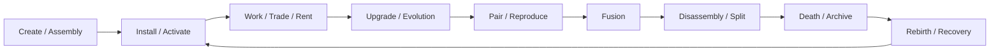

# ORG-P2-012 — App Life Rules QA

## Report Metadata

| Field | Value |
|---|---|
| Task ID | ORG-P2-012 |
| Worker ID | cursor-01 |
| Worker Agent ID | cursor-agent-0009 |
| Session ID | SESSION-20260716-10-EPHEMERAL |
| Claim ID | `CLAIM-ORG-P2-012-20260716T0624-cursor-01` |
| Date | 2026-07-16 |
| Base Commit | `89f3c351c488a0705f514adba974dd6c3dd3cb3a` |
| Branch | `cursor-handoff/ORG-P2-012-20260716` |
| Report Path | `KGEN-AI-Company/reports/ORG-P2-012_APP_LIFE_QA.md` |
| Supersedes Archive Tips | `152bd1e1` |
| Start Status | OPEN |
| End Status | REVIEW |
| Reviewer | codex-gm-01 |
| Priority | P1 |
| Department | App |

## Reissue Note

Prior `origin/cursor-handoff/ORG-P2-012` tip `152bd1e1` was dispositioned `ARCHIVE_EVIDENCE_ONLY` in V11 readiness reconciliation (missing claim lease; concurrent unauthorized submission). This reissue starts from current `origin/main` `89f3c35`, carries a single-task claim, and does **not** modify `WORK_QUEUE.md`, Canon, or protected paths per envelope constraints.

## Worker Boot SOP Evidence

### 1. BOOT

- Read `PRIMEFORGE_GENESIS_BOOT_SEQUENCE.md` header (ACTIVE; read-only — not in scope for edits).
- Confirmed task is report-only App life QA inside Cursor worker scope; Codex review required before merge.

### 2. MUST READ

- Read `KGEN-Canon/KGEN_CANON_MASTER.json`, `KGEN-Organization/WorkOrders/WORK_QUEUE.md` (read-only), `KGEN-Agent-Office/DO_NOT_TOUCH.md`, App department files, and KAIOS biological governance standards.
- Worker gate: `cursor-01`, type Cursor, report-only scope; no protected path writes.

### 3. PROTECTED PATH CHECK

- Scanned task scope against protected paths listed in WorkOrder ORG-P2-012.
- Result: no protected path in write scope. Task is documentation/report-only.

### 4. TASK PLAN

- Validate nine App life dimensions (DNA, pairing, reproduction, assembly, fusion, disassembly, death, rebirth) plus evolution/trade/inheritance where referenced in department charter.
- Cross-check Organization `KGEN_APP_LIFE_STANDARD.md` against Canon JSON, Civilization Core Canon, KAIOS V8.1/V10 standards, Organism Manifest, and Evolution Lineage.
- Modify only: this report and handoff artifacts under `KGEN-AI-Company/reports/`.

### 5. EXECUTION

- Claim → Handoff Branch → Report → Push Handoff → Stop for Codex Review.
- No standard, runtime, Canon, or WorkQueue document was changed.

### 6. FINAL REPORT

- Provided below: summary, life-dimension matrix, Canon alignment, checks, gaps, risks, recommendation.

---

## Summary

Validated **App life rules** across Organization `KGEN_APP_LIFE_STANDARD.md`, App department README/ROLE/RESPONSIBILITY, `KGEN_CANON_MASTER.json`, `KGEN_CIVILIZATION_CORE_CANON.md`, KAIOS V8.1 App Organism and Life Cycle standards, KAIOS V10 App Runtime Standard, Organism Manifest Standard, and Evolution Lineage Standard.

**All nine requested life dimensions (DNA, pairing, reproduction, assembly, fusion, disassembly, death, rebirth) are documented and Canon-aligned at the documentation layer.** Organization narrative terms (fusion, disassembly, death, rebirth) map cleanly to KAIOS operational terms (Merge, Split, Destroy, Recovery/Revive) via Evolution Lineage events. Evolution and trade/inheritance are also covered in Organization §7–§11 and have partial KAIOS/runtime backing.

**Verdict: PASS with minor gaps** — three low-severity naming/schema/documentation gaps; no hard Canon conflict.

---

## Primary Acceptance: Life Dimension Coverage

| Dimension | Organization (`KGEN_APP_LIFE_STANDARD`) | Canon / KAIOS backing | Status |
|---|---|---|---|
| **DNA** | §2 — identity, traits, compatibility, upgrade history, risk class, inheritance; machine-readable when exposed | Canon: DNA + GA evolution cores; manifest `dna_schema`; V8.1 `dna` field; V10 `dna` + `audit_refs` | ✅ PASS |
| **Pairing** | §3 — pair when governance, compatibility, resources satisfied | Organism manifest `compatible_mates`; implicit mate gate before REPRODUCE | ✅ PASS |
| **Reproduction** | §3 — new App life record; preserve ancestor lineage | V8.1 `Clone` (concept-layer); Life Cycle `Reproduce`; Lineage `REPRODUCE` (Codex review; no auto code gen) | ✅ PASS |
| **Assembly** | §4 — modules → one organism; source, version-free organ name, dependency, rollback | V8.1 `Create` + `dependencies`; V10 Create→Install; Lineage `CREATE`; manifest dependencies | ✅ PASS |
| **Fusion** | §5 — combine traits; inherited/destroyed traits, cost, probability, governance risk | V8.1 `Merge`; manifest `fusion_rules`; Lineage `FUSION` (Codex + security review) | ✅ PASS |
| **Disassembly** | §6 — modules/materials/DNA fragments; cannot erase official history | V8.1 `Split`; manifest `split_rules`; Lineage `SPLIT` (Codex + migration plan) | ✅ PASS |
| **Evolution** | §7 — level, skill, AI, market, runtime; traceable via reports/metadata | V8.1 `Upgrade`; Life Cycle `Upgrade`; Lineage `UPGRADE`/`MUTATE` | ✅ PASS |
| **Death** | §9 — no active runtime; preserve audit; may yield materials/tokens | V8.1 `Destroy` + `Archive`; status Retired/Archived; Lineage `DEPRECATE`/`ARCHIVE` | ✅ PASS |
| **Rebirth** | §10 — restore/reconstitute; cannot hide prior risk/ownership | V8.1 `Recovery`; V10 `Recover`; Lineage `REVIVE` (Codex + Human review) | ✅ PASS |

**Additional charter coverage (department README/ROLE):** trade (§8), inheritance (§11), AI organ (§12), marketplace 11520 (§13), risk anti-abuse (§14 — no infinite reproduction, hidden privilege, unauthorized data access, unreviewed runtime execution).

---

## Canon Alignment

| Source | App life statement | Aligned? |
|---|---|---|
| `KGEN_CANON_MASTER.json` canon_rules | "An App is not a tool; an App is life." | ✅ |
| `KGEN_CANON_MASTER.json` canon_rules | traded, assembled, fused, disassembled, upgraded, rented, reproduced, evolved | ✅ |
| `KGEN_CANON_MASTER.json` biological_governance.allowed_events | CREATE, MERGE, FUSION, SPLIT, REPRODUCE, REVIVE, … | ✅ |
| `KGEN_CANON_MASTER.json` index | `app_life_standard` → `KGEN-Organization/App/KGEN_APP_LIFE_STANDARD.md` | ✅ |
| `KGEN_CIVILIZATION_CORE_CANON.md` §2 | App 即生命；可組裝、可合成、可分解、可演化 | ✅ |
| `KGEN_CIVILIZATION_CORE_CANON.md` §5 economy | App in exploration→…→Trade loop | ✅ |
| `App/README.md` no-overreach | 不得把 App 降格為普通工具；不得新增與 Canon 衝突的 App 生命規則 | ✅ |

**Chain note (non-blocking):** Canon JSON `life_chain` omits NPC between Building and App; Civilization Core Canon §3 and `engineering_chain` include NPC. This is known chain vocabulary drift; it does not contradict App life rules.

---

## Terminology Crosswalk (Organization ↔ KAIOS ↔ Lineage)

| Organization term | KAIOS V8.1 action | Evolution Lineage event | V10 runtime lifecycle |
|---|---|---|---|
| Pairing | (implicit via `compatible_mates`) | — | — |
| Reproduction | Clone | REPRODUCE | — |
| Assembly | Create + dependencies | CREATE | Create → Install |
| Fusion | Merge | FUSION | — |
| Disassembly | Split | SPLIT | — |
| Death | Destroy / Archive | DEPRECATE / ARCHIVE | Suspend → Archive |
| Rebirth | Recovery | REVIVE | Recover |
| Evolution | Upgrade | UPGRADE / MUTATE | Upgrade |

Crosswalk is **semantic** at doc layer; runtime implementations must emit governed lineage records per `EVOLUTION_LINEAGE_STANDARD.md`.

---

## Governance and Safety Boundaries

| Rule | Source | Enforced at |
|---|---|---|
| Reproduction/fusion/split ≠ unlimited code generation | `EVOLUTION_LINEAGE_STANDARD.md` §Safety | Codex + Human review |
| Infinite reproduction blocked | `KGEN_APP_LIFE_STANDARD.md` §14 | App Office risk rules |
| Inheritance cannot clone protected secrets | §11 | Security + protected paths |
| AI organ obeys Canon + WorkOrders | §12 | AI Standard |
| 11520 listing requires identity, DNA summary, risk, ownership | §13 | Marketplace / listing standard |
| Assembly uses version-free official organ names | §4 | Temple/Building standards |
| V10: no bypass Security, Audit, Plugin, Marketplace | `APP_RUNTIME_STANDARD.md` | Runtime gate |
| Recovery mandatory; no silent history rewrite | `LIFE_CYCLE_STANDARD.md` §Recovery | Audit + lineage |

---

## Consolidated Lifecycle Flow

All transitions require **lineage + lifecycle hooks** (`from_stage`, `to_stage`, `recovery_path`, etc.) per KAIOS Life Cycle Standard.

---

## Checks Run

| # | Check | Method | Result |
|---|---|---|---|
| 1 | Nine life dimensions present in Organization standard | Section scan §2–§10 | ✅ PASS |
| 2 | Canon JSON App life bullets | Field compare | ✅ PASS |
| 3 | KAIOS V8.1 action table (Create/Merge/Split/Destroy/Recovery) | Table compare | ✅ PASS |
| 4 | Evolution Lineage events FUSION/SPLIT/REPRODUCE/REVIVE | Event table compare | ✅ PASS |
| 5 | Organism manifest fusion/split/mutation/compatible_mates fields | Required field list | ✅ PASS |
| 6 | V10 runtime lifecycle subset vs Organization full life model | Scope compare | ✅ PASS (V10 is runtime subset) |
| 7 | Canon JSON parse | `python3 -m json.tool` | ✅ PASS |
| 8 | Protected path diff | `git diff --name-only origin/main...HEAD` | ✅ PASS — reports/handoffs only |
| 9 | Single-task purity | Branch file list | ✅ PASS |

---

## Problems Found (Gaps — Non-Blocking)

| ID | Gap | Severity | Type |
|---|---|---|---|
| A1 | `APP_ORGANISM_STANDARD.md` documents Clone but not explicit **Pairing** action row (pairing lives in manifest `compatible_mates`) | Low | Documentation |
| A2 | Organization **Death/Rebirth** vs KAIOS **Destroy/Recovery/Revive** naming split | Low | Terminology |
| A3 | V10 App Runtime lifecycle (9 states) is shorter than Organization §2–§11 full life model | Low | Scope layering |
| A4 | `SDK-007_DNA_GA_API` schema covers genome fields but not App-organism lifecycle events (no conflict; separate concern) | Low | SDK coverage |

---

## Risks

| ID | Risk | Severity | Mitigation |
|---|---|---|---|
| R1 | Unbounded reproduction inflates 11520 marketplace | High | §14 + Lineage REPRODUCE gate + Codex review |
| R2 | Fusion without manifest `fusion_rules` | Medium | Block FUSION lineage event without manifest |
| R3 | Rebirth erases prior ownership/risk | Medium | §10 prohibition + V10 `audit_refs` + REVIVE Human review |
| R4 | Assembly with version-suffixed module names | Medium | §4 version-free organ rule |
| R5 | Frontend/marketing copy treats App as UI widget | Low | App Office no-overreach rule |

---

## Technical Debt

1. Publish a formal App life glossary crosswalk (Organization ↔ KAIOS ↔ Lineage ↔ V10) under App Office or KAIOS governance.
2. Add explicit Pairing row or cross-reference in `APP_ORGANISM_STANDARD.md` to manifest `compatible_mates`.
3. Extend SDK/App schema gap review (ORG-P2-015) with lifecycle event bindings for marketplace listings.

---

## Evolution Opportunities

- Machine-readable App life state schema linking `lifecycle_state`, lineage events, and 11520 listing records.
- Pairing compatibility validator against `compatible_mates` + resource requirements before REPRODUCE.

---

## Suggested WorkOrders (PROPOSED — status must remain PROPOSED until Codex assigns)

| Suggested ID | Scope | Reason |
|---|---|---|
| ORG-P2-012-PAIRING-XREF | Add pairing/`compatible_mates` cross-ref to `APP_ORGANISM_STANDARD.md` | Addresses A1 |
| ORG-P2-012-GLOSSARY | App life term crosswalk document (Org ↔ KAIOS ↔ Lineage ↔ V10) | Addresses A2 |
| ORG-P2-012-RUNTIME-MAP | Map V10 lifecycle states to Organization life sections | Addresses A3 |

---

## Do Not Do

- Do not downgrade App to "tool" or "widget" in official docs.
- Do not enable infinite reproduction without lineage + Codex review.
- Do not implement rebirth that erases audit history or prior risk class.
- Do not modify Canon, Boot CURRENT, Runtime CURRENT, WorkQueue, or protected paths in this handoff.

---

## Files Read

- `KGEN-AI-Company/CURSOR_EMPLOYEE_BOOT.md`
- `KGEN-AI-Company/CURSOR_AUTO_WORK_PROTOCOL.md`
- `KGEN-AI-Company/CURSOR_REPORTING_RULES.md`
- `KGEN-Organization/WorkOrders/KGEN_WORKORDER_STANDARD.md`
- `KGEN-Organization/WorkOrders/WORK_QUEUE.md` (read-only)
- `KGEN-Organization/App/README.md`
- `KGEN-Organization/App/ROLE.md`
- `KGEN-Organization/App/RESPONSIBILITY.md`
- `KGEN-Organization/App/KGEN_APP_LIFE_STANDARD.md`
- `KGEN-Organization/Canon/KGEN_CIVILIZATION_CORE_CANON.md`
- `KGEN-Canon/KGEN_CANON_MASTER.json`
- `KGEN-Agent-Office/DO_NOT_TOUCH.md`
- `PRIMEFORGE_GENESIS_BOOT_SEQUENCE.md` (header/read-only)
- `KGEN-KAIOS/V8.1/APP_ORGANISM_STANDARD.md`
- `KGEN-KAIOS/V8.1/LIFE_CYCLE_STANDARD.md`
- `KGEN-KAIOS/V10/APP_RUNTIME_STANDARD.md`
- `KGEN-KAIOS/ORGANISM_MANIFEST_STANDARD.md`
- `KGEN-KAIOS/EVOLUTION_LINEAGE_STANDARD.md`
- `KGEN-SDK/SDK-007_DNA_GA_API/schemas/sdk-007_schema.json`
- `KGEN-AI-Company/reports/V11_READINESS_HANDOFF_RECONCILIATION.md` (archive disposition context)

## Files Modified

| File | Change |
|---|---|
| `KGEN-AI-Company/reports/ORG-P2-012_APP_LIFE_QA.md` | Created (this report) |
| `KGEN-AI-Company/reports/handoffs/ORG-P2-012/HANDOFF.md` | Created |
| `KGEN-AI-Company/reports/handoffs/ORG-P2-012/handoff.json` | Created |
| `KGEN-AI-Company/reports/claims/ORG-P2-012_claim.json` | Created (claim lease evidence) |

## Protected Paths Checked

| Path | Status |
|---|---|
| `contracts` | ✅ Untouched |
| `K線西遊記/temples/12345` | ✅ Untouched |
| `wallet` | ✅ Untouched |
| `bridge` | ✅ Untouched |
| `PRIMEFORGE_GENESIS_BOOT_SEQUENCE.md` | ✅ Untouched |
| `docs/physics/KGEN_Universe_Physics_Runtime_CURRENT.md` | ✅ Untouched |
| `docs/physics/final-whitepaper/` | ✅ Untouched |
| `KGEN/contracts/KGEN_Token_V7_5_2.sol` | ✅ Untouched |
| `KGEN-Organization/WorkOrders/WORK_QUEUE.md` | ✅ Untouched (envelope: no WorkQueue edit) |
| `KGEN-Canon/` | ✅ Untouched |

---

## Task Result

**PASS with minor gaps.** App life rules are complete and Canon-aligned at documentation layer. Four low-severity gaps documented; zero hard Canon conflicts; zero protected path modifications.

---

## Blockers

None.

---

## Recommendation

**Accept for Codex Review.** Report-only deliverable meets acceptance criteria: life dimensions validated, Canon alignment confirmed, files read/modified/checks/risks/blockers/recommendation present, no protected path modified. End status **REVIEW** recorded in this report; `WORK_QUEUE.md` remains OPEN until Codex closeout per envelope constraint.

---

## Need Codex Review

Yes.

## Need Human Decision

No.

**End of report.**
