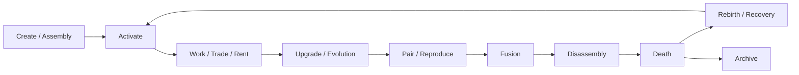

# ORG-P2-012 — App Life Rules QA

## Report Metadata

| Field | Value |
|---|---|
| Task ID | ORG-P2-012 |
| Worker ID | cursor-01 |
| Worker Type | Cursor |
| Date | 2026-07-12 |
| Base Commit | `0f256afa969dbf834df1eb1a6036e639ab2b5cd3` |
| Branch | `cursor-handoff/ORG-P2-012` |
| Report Path | `KGEN-AI-Company/reports/ORG-P2-012_APP_LIFE_QA.md` |
| Start Status | OPEN |
| End Status | REVIEW |
| Reviewer | codex-gm-01 |
| Priority | P1 |
| Department | App |

## Summary

Validated **App life rules** (DNA, pairing, reproduction, assembly, fusion, disassembly, death, rebirth) across Organization `KGEN_APP_LIFE_STANDARD.md`, Canon JSON, Civilization Core Canon, KAIOS V8.1 App Organism Standard, KAIOS V10 App Runtime Standard, Organism Manifest Standard, and Evolution Lineage Standard. **All nine life dimensions are documented and Canon-aligned.** Terminology differs slightly between Organization (fusion/disassembly/death/rebirth) and KAIOS (merge/split/destroy/recovery) but semantics match. **No protected paths modified.**

**Verdict: PASS** — App life rules are complete at doc layer; three low-severity naming/schema gaps noted.

---

## 1. Primary acceptance: life dimension coverage

| Dimension | Organization (`KGEN_APP_LIFE_STANDARD`) | Canon / KAIOS | Status |
|---|---|---|---|
| **DNA** | §2 — identity, traits, compatibility, upgrade history, inheritance | Canon: DNA + GA evolution cores; manifest `dna_schema` | ✅ PASS |
| **Pairing** | §3 — pair when governance + compatibility + resources satisfied | Organism manifest `compatible_mates` | ✅ PASS |
| **Reproduction** | §3 — new App life record; preserve ancestor lineage | Evolution Lineage `REPRODUCE`; V8.1 `Clone` (concept-layer) | ✅ PASS |
| **Assembly** | §4 — modules → one organism; rollback required | V10 lifecycle Create/Install; manifest dependencies | ✅ PASS |
| **Fusion** | §5 — combine traits; cost, probability, governance risk | V8.1 `Merge`; manifest `fusion_rules`; Lineage `FUSION` | ✅ PASS |
| **Disassembly** | §6 — modules/materials/DNA fragments; preserve history | V8.1 `Split`; manifest `split_rules`; Lineage `SPLIT` | ✅ PASS |
| **Evolution** | §7 — level, skill, AI, market, runtime; traceable | Lineage UPGRADE/MUTATE; Life Cycle Upgrade stage | ✅ PASS |
| **Death** | §9 — no active runtime; preserve audit; may yield materials | V8.1 `Destroy`; status Retired/Archived | ✅ PASS |
| **Rebirth** | §10 — restore/reconstitute; cannot hide prior risk/history | V8.1 `Recovery`; Lineage `REVIVE` | ✅ PASS |

**Additional covered rules:** Trade (§8), Inheritance (§11), AI organ (§12), Marketplace 11520 (§13), Risk (§14 — no infinite reproduction, hidden privilege, unreviewed execution).

---

## 2. Canon alignment

| Source | App life statement | Aligned? |
|---|---|---|
| `KGEN_CANON_MASTER.json` | "An App is not a tool; an App is life." | ✅ |
| `KGEN_CANON_MASTER.json` | traded, assembled, fused, disassembled, upgraded, rented, reproduced, evolved | ✅ |
| `KGEN_CIVILIZATION_CORE_CANON.md` §2 | App 即生命；可組裝、可合成、可分解、可演化 | ✅ |
| `KGEN_CIVILIZATION_CORE_CANON.md` §5 economy | App in exploration→…→Trade loop | ✅ |
| `App/README.md` no-overreach | 不得把 App 降格為普通工具 | ✅ |

---

## 3. Terminology crosswalk (Organization ↔ KAIOS)

| Organization term | KAIOS V8.1 term | Evolution Lineage event |
|---|---|---|
| Pairing | (implicit via `compatible_mates`) | — |
| Reproduction | Clone | REPRODUCE |
| Assembly | Create + dependencies | CREATE |
| Fusion | Merge | FUSION |
| Disassembly | Split | SPLIT |
| Death | Destroy | DEPRECATE / end active state |
| Rebirth | Recovery | REVIVE |
| Evolution | Upgrade | UPGRADE / MUTATE |

**Note:** Crosswalk is semantic, not automatic runtime mapping — implementation must use governed lineage records.

---

## 4. Governance and safety boundaries

| Rule | Source | Enforced at |
|---|---|---|
| Reproduction/fusion/split ≠ unlimited code generation | `EVOLUTION_LINEAGE_STANDARD.md` | Codex + Human review |
| Infinite reproduction blocked | `KGEN_APP_LIFE_STANDARD.md` §14 | App Office risk rules |
| Inheritance cannot clone protected secrets | §11 | Security + protected paths |
| AI organ obeys Canon + WorkOrders | §12 | AI Standard |
| 11520 listing requires identity, DNA summary, risk | §13 | Listing Standard |
| No version-suffixed official organ names in assembly | §4 | Temple/Building standards |
| V10: no bypass Security, Audit, Plugin, Marketplace | `APP_RUNTIME_STANDARD.md` | Runtime gate |

---

## 5. Lifecycle flow (consolidated)

All transitions require **lineage + lifecycle hooks** per KAIOS Life Cycle Standard.

---

## 6. Gaps (non-blocking)

| ID | Gap | Severity | Recommendation |
|---|---|---|---|
| A1 | `APP_ORGANISM_STANDARD.md` lacks explicit **Pairing** field (only Clone) | Low | Add `compatible_mates` cross-ref to manifest standard |
| A2 | **Death/Rebirth** naming vs V8.1 Destroy/Recovery | Low | Glossary WO — Organization terms are narrative-facing |
| A3 | Canon `life_chain` omits NPC; `engineering_chain` includes NPC | Low | Already known chain drift; no App rule conflict |
| A4 | V10 App Runtime lifecycle shorter than Organization §2–§11 | Low | V10 is runtime subset; Organization standard is authoritative for life rules |

---

## 7. Risks

| ID | Risk | Severity | Mitigation |
|---|---|---|---|
| R1 | Unbounded reproduction inflates marketplace | High | §14 + Lineage REPRODUCE gate |
| R2 | Fusion without `fusion_rules` in manifest | Medium | Block FUSION event without manifest |
| R3 | Rebirth hides prior ownership/risk | Medium | §10 explicit prohibition + audit_refs (V10) |
| R4 | Assembly with version-suffixed module names | Medium | §4 version-free organ rule |
| R5 | App treated as UI tool in frontend copy | Low | App Office no-overreach enforcement |

---

## 8. Checks Run

| Check | Result |
|---|---|
| All 9 life dimensions present in Organization standard | ✅ |
| Canon JSON App life bullets | ✅ Match |
| KAIOS V8.1 action table covers merge/split/destroy/recovery | ✅ |
| Evolution Lineage events for FUSION/SPLIT/REPRODUCE/REVIVE | ✅ |
| Organism manifest fusion/split/mutation fields | ✅ |
| Protected path diff | ✅ None |
| Runtime code diff | ✅ None |

## Files Read

- `KGEN-Organization/App/KGEN_APP_LIFE_STANDARD.md`
- `KGEN-Organization/App/README.md`
- `KGEN-Organization/App/ROLE.md`
- `KGEN-Organization/App/RESPONSIBILITY.md`
- `KGEN-Organization/Canon/KGEN_CIVILIZATION_CORE_CANON.md`
- `KGEN-Canon/KGEN_CANON_MASTER.json`
- `KGEN-KAIOS/V8.1/APP_ORGANISM_STANDARD.md`
- `KGEN-KAIOS/V8.1/LIFE_CYCLE_STANDARD.md`
- `KGEN-KAIOS/V10/APP_RUNTIME_STANDARD.md`
- `KGEN-KAIOS/ORGANISM_MANIFEST_STANDARD.md`
- `KGEN-KAIOS/EVOLUTION_LINEAGE_STANDARD.md`
- `KGEN-Organization/WorkOrders/WORK_QUEUE.md`

## Files Modified

- `KGEN-Organization/WorkOrders/WORK_QUEUE.md` — ORG-P2-012 OPEN → REVIEW
- `KGEN-AI-Company/reports/ORG-P2-012_APP_LIFE_QA.md` — this report (created)

## Protected Paths Checked

No modifications under protected paths.

## Suggested WorkOrders

| Task ID | Title | Status |
|---|---|---|
| ORG-P2-012-PAIRING-XREF | Add pairing/`compatible_mates` to APP_ORGANISM_STANDARD | PROPOSED |
| ORG-P2-012-GLOSSARY | App life term crosswalk (Org ↔ KAIOS ↔ Lineage) | PROPOSED |

## Do Not Do

- Do not downgrade App to "tool" or "widget" in official docs.
- Do not enable infinite reproduction without lineage + Codex review.
- Do not implement rebirth that erases audit history.

## Blockers

None.

## Recommendation

**APPROVE** ORG-P2-012. App life rules are **complete and Canon-aligned** at documentation layer.

## Need Codex Review

Yes.

## Need Human Decision

No.

## Handoff

- **Branch:** `cursor-handoff/ORG-P2-012`
- **WORK_QUEUE:** ORG-P2-012 → REVIEW
- **Next queue item:** ORG-P2-013

**End of report.**
