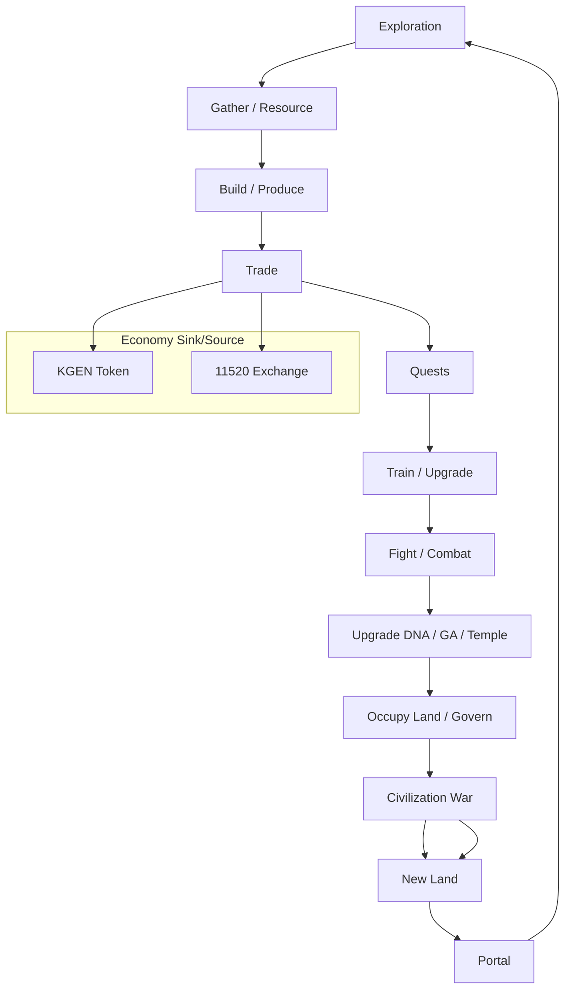

# ORG-P2-013 — Game Loop Map (Exploration → Portal)

## Report Metadata

| Field | Value |
|---|---|
| Task ID | ORG-P2-013 |
| Worker ID | cursor-01 |
| Worker Type | Cursor |
| Date | 2026-07-12 |
| Base Commit | `6a7f6d70fb571093b00cf62f55153761f8337ce0` |
| Branch | `cursor-handoff/ORG-P2-013` |
| Report Path | `KGEN-AI-Company/reports/ORG-P2-013_GAME_LOOP_MAP.md` |
| Start Status | OPEN |
| End Status | REVIEW |
| Reviewer | codex-gm-01 |
| Priority | P1 |
| Department | Game |

## Summary

Mapped the **full KGEN game loop** from exploration through Portal re-entry, aligning Civilization Core Canon §6, Economy Loop, Land Standard, Temple Gameplay Map, SDK-009 Game Loop API, and 5D production runtime. **All six requested dimensions** (exploration, quests, combat, upgrades, civilization war, Portal) are documented across Canon + implementation layers. **Gap:** Organization/Game lacks a dedicated `KGEN_GAME_LOOP_STANDARD.md`; gameplay detail lives in Canon, Economy, Temple map, and frontend build docs. **No protected paths modified.**

**Verdict: PASS** — Loop is mappable and closed; five missing-doc items proposed for Codex.

---

## 1. Master game loop (Canon spine)

**Source:** `KGEN_CIVILIZATION_CORE_CANON.md` §6

```
Explore → gather → build → produce → trade → accept quests → train → fight →
upgrade → evolve DNA → evolve GA → build temples → occupy land → govern civilization →
enter Portal → explore new universe boundaries
```

**Game Office rule** (`Game/README.md`): 不得做只有展示沒有閉環的玩法 — every step must chain to the next action.

**Economy intersection** (Canon §5):

```
Exploration → Resource → Land → House → Shop → App → AI → DNA → Trade → KGEN →
Temple → Civilization Technology → Civilization War → New Land → Exploration
```

---

## 2. Loop diagram (six task dimensions highlighted)



---

## 3. Dimension map

| Dimension | Canon / Organization | Runtime / SDK | Next action hook |
|---|---|---|---|
| **Exploration** | Land §1 Wild Land; Economy §4 Universe Map coords; Canon land explore | `kgen-5d-world-map.json`; SDK-009 `GameLoopStep` | Reveal land/resource → build or claim |
| **Quests** | Canon §6 "accept quests"; Temple §10 quest board organ | `temple-hub.js` missions; LevelNodes 21319–23333 任務/試煉 | Train / fight / reward → upgrade or trade |
| **Combat** | Canon §6 "fight"; Economy §12 governed war | 5D canyon towers/boss; 22188 貪婪魔影 Boss; 20888 風險場 | Territory/resource shift → war governance |
| **Upgrades** | Canon §6 upgrade, DNA, GA, temple; App life standard | Temple evolution §11; organ upgrades in 5D HUD | Stronger economy role → trade/war eligibility |
| **Civilization war** | Economy §12; Land §7 conquest; Canon economy tail | 5D 多方/空方推塔; K-line direction metaphor | New land control → re-explore |
| **Portal** | Canon Universe Portal; Temple §9; Universe Office | Portal V3.0; temple `index.html` → `../../index.html` | Cross-universe / new boundary exploration |

---

## 4. Temple gameplay nodes (runtime overlay)

**Source:** `docs/KGEN_TEMPLE_GAMEPLAY_MAP.md` + `K線西遊記/data/kgen-5d-world-map.json`

| Node class | IDs | Gameplay role | Loop stage |
|---|---|---|---|
| Heart / base | 12345, 16888 | 多方/空方基地 | Build / govern |
| Exchange | 11520 | Swap, LP, organ listing | Trade |
| Bank | 18888, 8888, 8895 | Treasury, lending, collateral | Trade / risk |
| AutoLP / forge | 18921 | LP forge, 斬妖 | Produce / combat |
| Risk arena | 20888 | 爆倉 / 燃燒教育 | Combat / sink |
| Level / quest | 21319–23333 | 試煉, 任務, Boss, 終局 | Quest / train / fight |
| Seat | 108000 | NFT seat / 分紅 | Upgrade / trade |

**5D battlefield** (K-line driven):

```
[12345 多方] —塔— [11520] — [18888] — [18921] —塔— [16888 空方]
```

- K-line up → 多方推進; down → 空方反撲
- Mid-lane capture → economic bonus
- Boss at 22188

**Note:** Frontend gameplay map is **narrative/demo** layer; does not modify Physics Runtime CURRENT.

---

## 5. SDK-009 Game Loop API binding

| SDK artifact | Purpose |
|---|---|
| `KGEN-SDK/SDK-009_Game_Loop_API/KGEN_Game_Loop_API_V1.0.md` | `GameLoopStep` entity: `stepId`, `name`, `next`, `runtimeRef` |
| `schemas/sdk-009_schema.json` | Validation |
| Economy loop text | Matches Canon §5 (Chinese chain) |

SDK maps **machine-readable steps** to runtime refs — suitable for Codex/Cursor validation, not yet a shipped npm package.

---

## 6. Cross-loop dependencies

| From | To | Dependency |
|---|---|---|
| Exploration | Land | Wild Land → meaningful via explore (Land §1) |
| Land | House/Shop | ORG-P2-010 building evolution |
| Shop/App | Trade | 11520 marketplace |
| Trade | KGEN | Token facts 0.30% AMM only |
| Quest | Train/Upgrade | XP, skill, DNA/GA |
| Combat | War | Governed territory change only |
| War | New land | Economy §12 → §13 cross-universe |
| Portal | Exploration | Universe Map + inter-civ trade |

**No-overreach check:** Finance (bank/exchange) and governance (war/conquest) are **in the loop**, not isolated (Game Office rule ✅).

---

## 7. Missing or weak documentation

| ID | Missing doc / gap | Severity | Recommendation |
|---|---|---|---|
| M1 | No `KGEN-Organization/Game/KGEN_GAME_LOOP_STANDARD.md` | Medium | Codex publish Game Loop Standard V2.0 |
| M2 | ORG-P2-006 civilization stage map **rejected** (bundled handoff) | Medium | Re-run ORG-P2-006 on clean branch |
| M3 | Quest/combat/train not standalone Organization sections | Low | Cross-ref from Game Standard to Temple gameplay |
| M4 | `Game/WORK_QUEUE.md` dept tasks ORG-Game-001/002 still OPEN | Low | Dept readiness after P2-013 merge |
| M5 | SDK-009 status Draft for Review | Low | Link from Game Standard when promoted |

---

## 8. Risks

| ID | Risk | Severity | Mitigation |
|---|---|---|---|
| R1 | Demo 5D combat presented as live governance | Medium | Label narrative overlay vs Canon war rules |
| R2 | Quest rewards without economy sink | Medium | Tie rewards to KGEN/temple sinks |
| R3 | Portal creates duplicate entry systems | Medium | Temple §9 official paths only |
| R4 | Game loop steps without `next` action | High | Game Office no-overreach + SDK `next` field |
| R5 | Stale ORG-P2-006 branch misleads civilization-stage mapping | Low | Keep REJECTED per CODEX_REVIEW_LOG |

---

## 9. Checks Run

| Check | Result |
|---|---|
| Canon §6 game loop activities enumerated | ✅ |
| Six task dimensions mapped to sources | ✅ |
| Economy loop closure (war → new land → explore) | ✅ |
| Temple gameplay map cross-check | ✅ |
| SDK-009 alignment | ✅ |
| Protected path diff | ✅ None |
| Runtime code diff | ✅ None (report-only) |

## Files Read

- `KGEN-Organization/Game/README.md`
- `KGEN-Organization/Game/ROLE.md`
- `KGEN-Organization/Game/RESPONSIBILITY.md`
- `KGEN-Organization/Game/WORK_QUEUE.md`
- `KGEN-Organization/Canon/KGEN_CIVILIZATION_CORE_CANON.md`
- `KGEN-Organization/Economy/KGEN_ECONOMY_LOOP.md`
- `KGEN-Organization/Land/KGEN_LAND_STANDARD.md`
- `KGEN-Organization/Temple/KGEN_TEMPLE_STANDARD.md`
- `KGEN-Canon/KGEN_CANON_MASTER.json`
- `docs/KGEN_TEMPLE_GAMEPLAY_MAP.md`
- `docs/KGEN_5D_GAME_PRODUCTION_BUILD_V0_2.md`
- `KGEN-SDK/SDK-009_Game_Loop_API/KGEN_Game_Loop_API_V1.0.md`
- `KGEN-AI-Company/reports/CODEX_REVIEW_LOG.md` (ORG-P2-006 status)
- `KGEN-Organization/WorkOrders/WORK_QUEUE.md`

## Files Modified

- `KGEN-Organization/WorkOrders/WORK_QUEUE.md` — ORG-P2-013 OPEN → REVIEW
- `KGEN-AI-Company/reports/ORG-P2-013_GAME_LOOP_MAP.md` — this report (created)

## Protected Paths Checked

No modifications under protected paths.

## Suggested WorkOrders

| Task ID | Title | Status |
|---|---|---|
| ORG-P2-013-GAME-STD | Create `KGEN_GAME_LOOP_STANDARD.md` in Game Office | PROPOSED |
| ORG-P2-006-REDO | Re-execute civilization stage map on clean handoff | PROPOSED |
| ORG-Game-001 | Department readiness (per Game WORK_QUEUE) | EXISTING OPEN |

## Do Not Do

- Do not ship display-only gameplay without `next` loop action.
- Do not treat 5D K-line combat as ungoverned conquest.
- Do not add hidden Portal entry paths.

## Blockers

None.

## Recommendation

**APPROVE** ORG-P2-013. Full game loop is **mappable and Canon-closed**; publish Organization Game Loop Standard to close M1.

## Need Codex Review

Yes.

## Need Human Decision

No.

## Handoff

- **Branch:** `cursor-handoff/ORG-P2-013`
- **WORK_QUEUE:** ORG-P2-013 → REVIEW
- **Next queue item:** ORG-P2-015 (ORG-P2-014 handoff exists on remote)

**End of report.**
