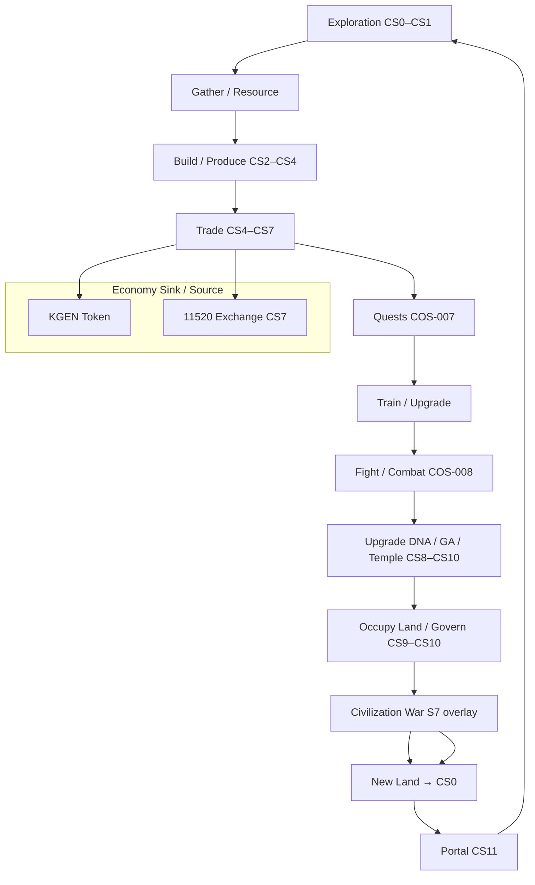

# ORG-P2-013 Game Loop Map

## Report Metadata

| Field | Value |
|---|---|
| Task ID | ORG-P2-013 |
| Worker ID | cursor-01 |
| Worker Agent ID | cursor-agent-0010 (Monkey Clone / 猴毛 #10; spawned by 本尊) |
| Session ID | SESSION-20260716-11-EPHEMERAL |
| Clone ID | null (Monkey Clone registry NOT_IMPLEMENTED) |
| Claim ID | CLAIM-ORG-P2-013-20260716T0624-cursor-01 |
| Date | 2026-07-16 |
| Observed origin/main | `89f3c351c488a0705f514adba974dd6c3dd3cb3a` |
| Branch | `cursor-handoff/ORG-P2-013-20260716` |
| Reviewer | codex-gm-01 |
| Department | Game (P1) |
| Start Status | OPEN (main; handoff-only — Cursor does not MODIFY_WORKQUEUE) |
| End Status | REVIEW (handoff submitted; main WQ update = Codex only) |
| Prior archive tips | `6313aad2` (2026-07-12 rejected handoff — SUPERSEDED) |
| Report Path | `KGEN-AI-Company/reports/ORG-P2-013_GAME_LOOP_MAP.md` |
| Dependencies | ORG-P2-006 civilization stage map (read-only: `cursor-handoff/ORG-P2-006-20260716` @ same base); ORG-P2-004 DONE |

## Summary

Mapped the **full KGEN game loop** from exploration through Portal re-entry across six requested dimensions: **exploration, quests, combat, upgrades, civilization war, and Portal**. Sources reconciled: Civilization Core Canon §6, Economy Loop, Land/Temple standards, SDK-009 Game Loop API, COS-007 Quest Runtime, COS-008 Combat Runtime, Temple Gameplay Map, and 5D production runtime (`kgen-game-core.js`, `kline-5d`).

**Cross-link:** Game verbs and loop stages bind to **ORG-P2-006 unified civilization stage IDs CS0–CS11** plus **S7 war overlay** (read-only reference on `cursor-handoff/ORG-P2-006-20260716`; not merged to main at time of writing).

**Verdict: PASS** — Loop is mappable, Canon-closed, and every verb has a documented next action (Game Office no-overreach rule). Six missing-doc / weak-binding items registered for Codex follow-up.

---

# Codex Coordination (如來佛 / codex-gm-01)

| Item | This session action |
|---|---|
| Dispatch | Handoff-only reissue from current `origin/main` @ `89f3c35`; Monkey Clone spawn by 本尊 |
| Scheduler context | PMO board lists ORG-P2-013 after ORG-P2-006 + ORG-P2-007; 006 stage map available read-only on handoff branch |
| Worker state | `cursor-01` via ephemeral clone `cursor-agent-0010`; branch-local claim only |
| What Codex should do next | Review this handoff; update `CODEX_REVIEW_LOG.md` + WORK_QUEUE closeout (Cursor forbidden MODIFY_WORKQUEUE) |
| Archive disposition | Mark tip `6313aad2` **SUPERSEDED** by this clean single-task reissue |
| Atomic claim service | NOT_IMPLEMENTED — see multi-window section |

---

# Session / Multi-Window Context (72变 / 猴毛分身)

| Field | Value |
|---|---|
| This chat window | SESSION-20260716-11-EPHEMERAL |
| Spawn authority | 本尊 (Sun Wukong) from parent Cursor session — Monkey Clone model |
| Registry worker | `cursor-01` (shared across all Cursor windows) |
| This clone | `cursor-agent-0010` — 猴毛 #10 |
| Problem P-MW1 | No live `clone_id` / Master Registry — Codex distinguishes windows via session block + claim_id |
| Problem P-MW2 | Branch-local claims are not company-atomic |
| This session rule | Single task only; claim in `handoff.json`; no concurrent ORG-P2-* work; no WORK_QUEUE edits |

---

# Worker Execution Report

## 1. CURSOR PREFLIGHT — PASS

| Check | Result |
|---|---|
| Task scope report-only | PASS |
| Worker registry `cursor-01` ACTIVE T2 (read-only verify) | PASS |
| `can_push_main` false | PASS |
| Required sources exist | PASS |
| Forbidden path write | none planned |
| Single-task purity | PASS (3 handoff paths only) |

## 2. CLAIM RECORD

Embedded in `KGEN-AI-Company/reports/handoffs/ORG-P2-013/handoff.json`.

## 3. Master Game Loop (Canon Spine)

**Source:** `KGEN-Organization/Canon/KGEN_CIVILIZATION_CORE_CANON.md` §6

```text
Explore → gather → build → produce → trade → accept quests → train → fight →
upgrade → evolve DNA → evolve GA → build temples → occupy land → govern civilization →
enter Portal → explore new universe boundaries
```

**Game Office rule** (`Game/README.md`, `ROLE.md`, `RESPONSIBILITY.md`): 不得做只有展示沒有閉環的玩法 — each step must chain to a clear next action.

**Economy intersection** (Canon §5 / Machine JSON `economy_loop`):

```text
Exploration → Resource → Land → House → Shop → App → AI → DNA → Trade → KGEN →
Temple → Civilization Technology → Civilization War → New Land → Exploration
```

**Loop closure:** War or Portal expansion yields **New Land / Wild Land (CS0)**, re-entering exploration — consistent across Canon §5, Org Economy §12–§13, ORG-P2-006 §4, and Temple §9 Portal rules.

## 4. Loop Diagram (Six Task Dimensions)



## 5. Six-Dimension Map

| Dimension | Canon / Organization | Civilization stage (ORG-P2-006) | Runtime / SDK | Implementation overlay | Next action hook |
|---|---|---|---|---|---|
| **Exploration** | Land §1 Wild Land; Economy §4 Universe Map; Canon §6 explore | CS0–CS1 | SDK-009 `LOOP-001`; COS-007 | `kgen-5d-world-map.json`; Universe Map V10.2 coords | Reveal land/resource → claim or map |
| **Quests** | Canon §6 accept quests; Temple §10 quest board organ | CS4+ (Shop+) | COS-007 Quest Runtime | LevelNodes 21319–23333; `quest-panel` in temple shells; `KGEN_TempleHub` | Train / fight / reward → upgrade or trade |
| **Combat** | Canon §6 fight; Economy §12 governed war; Land §7 conquest | S7 overlay (parallel CS9–CS10) | COS-008 Combat Runtime | 5D canyon towers; 22188 貪婪魔影 Boss; 20888 風險場 | Territory/resource shift → war governance |
| **Upgrades** | Canon §6 upgrade, DNA, GA, temple; App life standard | CS3+ transitions; CS8 temple evolution | SDK-009; Temple §11 | Temple evolution; organ upgrades in 5D HUD; V8.1 entity Upgrade | Stronger economy role → trade/war/Portal eligibility |
| **Civilization war** | Economy §12; Land §7; Canon economy tail | S7 → CS0 recovery | COS-008; SDK-009 war step | 5D 多方/空方推塔; K-line direction metaphor | New land control → re-explore |
| **Portal** | Canon Universe Portal; Temple §9; Universe Office; Economy §13 | CS11 Cross-Universe Node | Frontend Portal V3.0 paths | `../../index.html` galaxy portal; temple nav cards | Cross-universe / new boundary exploration |

## 6. Game Verb ↔ Stage ↔ Runtime Matrix

Derived from ORG-P2-006 §4.3 (read-only) with runtime refs added for ORG-P2-013 scope:

| Game verb | Min CS stage | Primary runtime / SDK | Economy segment | Player next action |
|---|---|---|---|---|
| Explore | CS0 | SDK-009 → COS-007 | Exploration cost | Claim coordinate or gather |
| Gather | CS0–CS1 | COS-007 | Resource → inventory | Build or trade |
| Build | CS2–CS3 | COS-004 Land; COS-007 | Construction resources | Open shop or temple path |
| Produce | CS4+ | COS-002 App Organism | Shop / App output | List on market |
| Trade | CS4+ | COS-006 Economy; SDK-008 | KGEN / barter | Reinvest or upgrade |
| Accept quests | CS4+ | **COS-007** | Quest rewards | Train or fight |
| Train | CS8+ | COS-007; Temple NPC | Temple / NPC services | Upgrade skills |
| Fight | S7 overlay | **COS-008** | War governance | Territory or new land |
| Upgrade | CS3+ | COS-003 Temple; V8.1 Life | Module / temple / civ tech | Next lifecycle gate |
| Evolve DNA / GA | CS4+ | SDK-007; COS-005 AI | Biological governance | New capabilities |
| Build temples | CS8 | COS-003 Temple | Temple service node | City governance |
| Occupy land | CS1+ | COS-004 Land | Land claim record | Develop |
| Govern civilization | CS9–CS10 | COS-009 Governance | Tax / public goods | War or Portal |
| Enter Portal | CS11 | Frontend + Universe Map | Portal expansion cost | Cross-universe explore |

**No-overreach check:** Every verb above has economy sink/market and next action — satisfies Game Office rule.

## 7. Temple Gameplay Nodes (Runtime Overlay)

**Source:** `docs/KGEN_TEMPLE_GAMEPLAY_MAP.md` + `K線西遊記/modules/kgen-game-core.js` NODES registry

| Node class | IDs | Gameplay role | Loop stage | CS binding |
|---|---|---|---|---|
| Heart / base | 12345, 16888 | 多方/空方基地 | Build / govern / combat anchor | CS8 temple; war factions |
| Exchange | 11520 | Swap, LP, organ listing | Trade | CS7 |
| Bank | 18888, 8888, 8895 | Treasury, lending, collateral | Trade / risk | CS6 |
| AutoLP / forge | 18921 | LP forge, 斬妖 | Produce / combat | CS6–CS7 |
| Risk arena | 20888 | 爆倉 / 燃燒教育 | Combat / sink | S7 training ground |
| Level / quest | 21319–23333 | 試煉, 任務, Boss, 終局 | Quest / train / fight | CS4+ quest chain |
| Seat | 108000 | NFT seat / 分紅 | Upgrade / trade | CS4+ asset tier |

**5D battlefield** (`K線西遊記/game/kline-5d/`, `README_5D_GAME.md`):

```text
[12345 多方] —塔— [11520] — [18888] — [18921] —塔— [16888 空方]
                      [8888]     [20888]
```

- K-line up → 多方推進; down → 空方反撲
- Mid-lane capture → economic bonus
- Boss at 22188 (貪婪魔影)

**Note:** Frontend gameplay map is **narrative/demo** layer; does not modify `KGEN_Universe_Physics_Runtime_CURRENT.md`. Governed civilization war rules (Economy §12) supersede demo combat for Canon truth.

## 8. SDK-009 and Runtime Library Binding

| Artifact | Purpose | Loop coverage |
|---|---|---|
| `SDK-009` `GameLoopStep` | `stepId`, `name`, `next`, `runtimeRef` | Machine-readable loop steps |
| `COS-007` Quest Runtime | Quest, progression, player lifecycle | Quests, train, gather-as-mission |
| `COS-008` Combat Runtime | Combat, civilization war, territory | Fight, war overlay |
| `COS-006` Economy Runtime | Trade, KGEN settlement | Trade segment |
| `COS-004` Land Runtime | Wild Land, claim, conquest | Explore, occupy land |
| `COS-003` Temple Runtime | Temple life, evolution | Build temples, upgrade |
| `COS-009` Governance Runtime | Civilization governance | Govern civilization |

Example payload (`sdk-009_example.json`): `LOOP-001` 探索 → 資源 → `COS-007`.

**Gap G-SDK:** SDK-009 ships one example step only; full `LOOP-001`…`LOOP-N` chain not enumerated in repo — see Missing Docs §9.

## 9. Portal Loop (Dedicated)

| Layer | Rule | Source |
|---|---|---|
| Canon | Universe Portal = public civilization universe entrance | Civilization Core Canon §2 |
| Temple | Portal connects temple, world, civilization, universe; **no hidden duplicate entry systems** | Temple Standard §9 |
| Economy | Cross-universe begins at mature civilization via Portal + Universe Map + inter-civ trade | Economy §13 |
| Stage | CS11 Cross-Universe Node | ORG-P2-006 §4 table |
| Frontend | Galaxy portal `K線西遊記/index.html`; temples link `../../index.html` + 5D game | Temple gameplay map §導航 |
| Game verb tail | `enter Portal` → `explore new universe boundaries` → CS0 re-entry | Canon §6 closure |

**Portal anti-pattern (blocked):** Alternate entry URLs that bypass official Portal tree — violates Temple §9 and risk R3.

## 10. Cross-Loop Dependencies

| From | To | Dependency | WorkOrder / owner |
|---|---|---|---|
| Exploration | Land | Wild Land → meaningful via explore | Land Office |
| Land | House/Shop | Building evolution | ORG-P2-010 (Building) |
| Shop/App | Trade | 11520 marketplace | Economy Office |
| Trade | KGEN | Token facts 0.30% AMM only | Blockchain loop §8 |
| Quest | Train/Upgrade | XP, skill, DNA/GA | Game + NPC |
| Combat | War | Governed territory change only | Civilization + Combat Runtime |
| War | New land | Economy §12 → CS0 | ORG-P2-006 S7 overlay |
| Portal | Exploration | Universe Map + inter-civ trade | Universe Office |
| CS stage advance | Game eligibility | Stage-transition criteria **undefined** (ORG-P2-006 D1) | Civilization Office |

## 11. Missing or Weak Documentation

| ID | Missing doc / gap | Severity | Recommendation |
|---|---|---|---|
| M1 | No `KGEN-Organization/Game/KGEN_GAME_LOOP_STANDARD.md` | **Medium** | Codex publish Game Loop Standard V2.0 |
| M2 | SDK-009 full step catalog (`LOOP-001`…`N`) not in repo | Medium | Extend SDK-009 examples from Canon §6 verb list |
| M3 | COS-007 / COS-008 are Draft shells; no quest/combat state schemas | Medium | Runtime Office implementation WorkOrder |
| M4 | ORG-P2-006 stage-transition criteria (D1) blocks measurable upgrade gates in game | **High** | Civilization Office — ties game Upgrade verb to CS gates |
| M5 | `Game/WORK_QUEUE.md` dept tasks ORG-Game-001/002 still OPEN | Low | Dept readiness after P2-013 merge |
| M6 | ORG-P2-007 (Economy loop QA) still OPEN — game↔economy sink validation pending | Medium | Run 007 before economy-facing game features ship |
| M7 | NPC evolution (ORG-P2-011) OPEN — quest NPC bindings at CS4–CS9 need reconciliation | Medium | NPC + Game cross-ref |

**Updated from archive `6313aad2`:** M2 in prior report cited rejected bundled ORG-P2-006 — superseded by clean `ORG-P2-006-20260716` handoff (read-only input for this map).

## 12. Risks

| ID | Risk | Severity | Mitigation |
|---|---|---|---|
| R1 | Demo 5D combat presented as live governance | Medium | Label narrative overlay vs Canon war rules (Economy §12) |
| R2 | Quest rewards without economy sink | Medium | Tie rewards to KGEN/temple sinks per Canon §5 |
| R3 | Portal creates duplicate entry systems | Medium | Temple §9 official paths only |
| R4 | Game loop steps without `next` action | **High** | Game Office no-overreach + SDK `next` field |
| R5 | CS vs game-verb ordering drift vs ORG-P2-006 | Low | Reuse CS IDs from 006; Codex promotes single vocabulary (006 W2) |
| R6 | Dual claim windows until atomic registry | **High (process)** | Codex uses claim_id + head_sha |

## 13. Technical Debt

- Quest panels in level-node temples use inline demo quests — not wired to COS-007 lifecycle.
- 5D game uses simulated K-line; Binance WebSocket listed as future in `README_5D_GAME.md`.
- `kgen-game-core.js` demo wallet mode default — on-chain loop optional.

## 14. Evolution Opportunities

- Publish full SDK-009 step graph binding each Canon §6 verb to `runtimeRef`.
- Link Physics Runtime CivilizationLevel (006 W4) to CS10 upgrade gates in a future WorkOrder.
- Wire quest completion events to economy sinks via COS-006.

## 15. Research Direction

- Governed war outcome schema: territory delta → CS0 wild land spawn rules.
- Portal session handoff: CS11 → new universe seed coordinates.

## 16. Suggested WorkOrders

| Task ID | Title | Status |
|---|---|---|
| ORG-P2-013-GAME-STD | Create `KGEN_GAME_LOOP_STANDARD.md` in Game Office | PROPOSED |
| ORG-P2-013-SDK-STEPS | Enumerate SDK-009 GameLoopStep chain from Canon §6 | PROPOSED |
| ORG-Game-001 | Department readiness (per Game WORK_QUEUE) | EXISTING OPEN |

## 17. Do Not Do

- Do not ship display-only gameplay without `next` loop action.
- Do not treat 5D K-line combat as ungoverned conquest.
- Do not add hidden Portal entry paths.
- Do not modify protected temple 12345 without human scoped approval.

## 18. Blockers

None for report-only delivery. Implementation blockers: M4 stage-transition criteria; M3 runtime schemas.

## 19. Files Read

- `KGEN-AI-Company/CURSOR_EMPLOYEE_BOOT.md`
- `KGEN-AI-Company/CURSOR_AUTO_WORK_PROTOCOL.md`
- `KGEN-AI-Company/CURSOR_REPORTING_RULES.md`
- `KGEN-Agent-Office/DO_NOT_TOUCH.md`
- `KGEN-Organization/WorkOrders/WORK_QUEUE.md` (read-only)
- `KGEN-Organization/WorkOrders/KGEN_WORKORDER_STANDARD.md`
- `KGEN-Organization/Game/README.md`, `ROLE.md`, `RESPONSIBILITY.md`, `WORK_QUEUE.md`, `REPORT_TEMPLATE.md`
- `KGEN-Organization/Canon/KGEN_CIVILIZATION_CORE_CANON.md`
- `KGEN-Organization/Economy/KGEN_ECONOMY_LOOP.md`
- `KGEN-Organization/Land/KGEN_LAND_STANDARD.md`
- `KGEN-Organization/Temple/KGEN_TEMPLE_STANDARD.md`
- `KGEN-Organization/Universe/README.md`, `ROLE.md`
- `KGEN-Canon/KGEN_CANON_MASTER.json`
- `KGEN-SDK/SDK-009_Game_Loop_API/KGEN_Game_Loop_API_V1.0.md`
- `KGEN-SDK/SDK-009_Game_Loop_API/examples/sdk-009_example.json`
- `KGEN-Runtime/COS-007_Quest_Runtime/KGEN_Quest_Runtime_V1.0.md`
- `KGEN-Runtime/COS-008_Combat_Runtime/KGEN_Combat_Runtime_V1.0.md`
- `docs/KGEN_TEMPLE_GAMEPLAY_MAP.md`
- `docs/KGEN_5D_GAME_PRODUCTION_BUILD_V0_2.md`
- `K線西遊記/game/README_5D_GAME.md`
- `K線西遊記/modules/kgen-game-core.js` (read-only; not under protected 12345 path)
- `KGEN-AI-Company/reports/ORG-P2-006_CIVILIZATION_STAGE_MAP.md` (read-only via `origin/cursor-handoff/ORG-P2-006-20260716`)
- `KGEN-KAIOS/worker_registry.json` (read-only verify)
- `PRIMEFORGE_GENESIS_BOOT_SEQUENCE.md` (header / gateway rule, read-only)
- Archive tip `6313aad2` prior report (superseded reference)

## 20. Files Modified (handoff-authorized only)

| File | Change |
|---|---|
| `KGEN-AI-Company/reports/ORG-P2-013_GAME_LOOP_MAP.md` | Created (this report) |
| `KGEN-AI-Company/reports/handoffs/ORG-P2-013/HANDOFF.md` | Created |
| `KGEN-AI-Company/reports/handoffs/ORG-P2-013/handoff.json` | Created |

**Not modified (forbidden / handoff-only governance):** WORK_QUEUE, worker_registry, CODEX_REVIEW_LOG, Canon bodies, Boot, Runtime CURRENT, protected paths.

## 21. Protected Paths Checked — PASS

No modifications under: `contracts`, `K線西遊記/temples/12345`, `wallet`, `bridge`, `PRIMEFORGE_GENESIS_BOOT_SEQUENCE.md`, `docs/physics/KGEN_Universe_Physics_Runtime_CURRENT.md`, `docs/physics/final-whitepaper/`, `KGEN/contracts/KGEN_Token_V7_5_2.sol`.

## 22. Checks Run

| Test | Command / method | Result |
|---|---|---|
| CURSOR_PREFLIGHT | Worker registry + scope | PASS |
| SOURCE_EXISTENCE | WORK_QUEUE input list + spawn list | PASS |
| CANON_JSON_PARSE | `python3 -c "import json; json.load(open('KGEN-Canon/KGEN_CANON_MASTER.json'))"` | PASS |
| SIX_DIMENSION_MAP | exploration, quests, combat, upgrades, war, Portal | PASS |
| ORG-P2-006_CROSSREF | CS0–CS11 + S7 read from 006 handoff branch | PASS |
| LOOP_CLOSURE | war/portal → new land → explore | PASS |
| TEMPLE_GAMEPLAY_CROSSCHECK | `KGEN_TEMPLE_GAMEPLAY_MAP.md` vs `kgen-game-core.js` NODES | PASS |
| SDK-009_ALIGNMENT | economy loop text + example schema | PASS |
| REPORT_SECTION_COMPLETENESS | CURSOR_REPORTING_RULES fields | PASS |
| SINGLE_TASK_PURITY | git diff scope | PASS (3 authorized paths only) |
| PROTECTED_PATH_DIFF | diff vs protected list | PASS |
| SECRET_SCAN | no secrets in diff | PASS |

## 23. Problems Found (for Codex inbox)

| ID | Problem | Owner |
|---|---|---|
| PF1 | WORK_QUEUE on main still OPEN while handoff REVIEW — Cursor did not modify per handoff-only governance | Codex |
| PF2 | Prior `6313aad2` rejected for missing claim lease + queue skip — superseded by this reissue | Codex archive |
| PF3 | ORG-P2-006 not merged to main — game map references handoff branch read-only | Codex merge order |

## 24. Recommendation

**APPROVE** ORG-P2-013. Full game loop is **mappable and Canon-closed**; publish Organization Game Loop Standard (M1) and complete SDK-009 step chain (M2) as follow-ups.

## 25. Need Codex Review

Yes.

## 26. Need Human Decision

No.

**End of report.**
