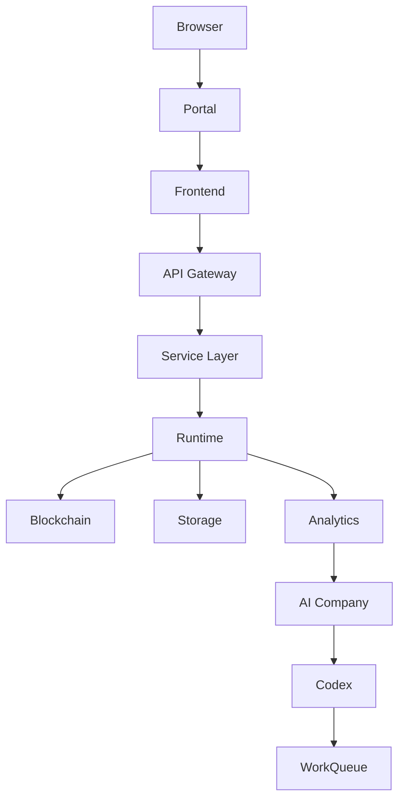

# KAIOS V10.0 KAIOS Operating System

**Version:** V10.0  
**Status:** Draft for Review / Operating System Baseline  
**Level:** L4 Runtime / L5 Implementation Standard  
**Author:** PrimeForge / 樂天帝 ⌖  
**Maintainer:** Codex  
**Scope:** Architecture + Runtime Standard only

KAIOS V10.0 is the KGEN Operating System layer. It does not add a single game feature; it defines how every KGEN system fits into one operating model: Universe, Temple, Land, Residence, Citizen, Business, Market, Exchange, Bank, Wallet, Membership, AI Company, Codex, Cursor, Portal, Game, App, Frontend, Backend, API, GitHub and Blockchain.

V10 is not allowed to implement real membership, real banking, real KYC, real payment, real token transfer, real MetaMask signing, real GitHub token usage or contract deployment. It defines architecture, boundaries, data contracts, runtime responsibilities and read-only observability.

## System Flow

## File Map

| File | Purpose |
|---|---|
| `KAIOS_OPERATING_SYSTEM.md` | V10 OS constitution |
| `SYSTEM_ARCHITECTURE.md` | Browser to AI Company architecture |
| `MICROSERVICE_STANDARD.md` | Service boundary standard |
| `API_GATEWAY_STANDARD.md` | API entry standard |
| `FRONTEND_STANDARD.md` | Portal, UI and dashboard standard |
| `BACKEND_STANDARD.md` | Service layer standard |
| `AUTHENTICATION_STANDARD.md` | Identity and session boundary |
| `MEMBERSHIP_STANDARD.md` | Guest to Founder membership model |
| `PLAYER_STANDARD.md` | Player profile and lifecycle |
| `WALLET_STANDARD.md` | Wallet runtime prototype |
| `PAYMENT_STANDARD.md` | Payment runtime and regulated boundary |
| `BANKING_RUNTIME_STANDARD.md` | Banking simulation standard |
| `BLOCKCHAIN_STANDARD.md` | Chain and bridge boundary |
| `TOKEN_STANDARD.md` | KGEN token fact boundary |
| `NFT_STANDARD.md` | Conceptual NFT standard |
| `MARKETPLACE_STANDARD.md` | Marketplace runtime standard |
| `APP_RUNTIME_STANDARD.md` | App as life runtime |
| `PLUGIN_STANDARD.md` | Plugin install/runtime standard |
| `AI_AGENT_STANDARD.md` | AI worker and reviewer standard |
| `SECURITY_STANDARD.md` | Identity, secrets, signing and rate limit |
| `AUDIT_STANDARD.md` | System, wallet, membership, AI and runtime audit |
| `DEPLOYMENT_STANDARD.md` | GitHub Pages / Actions / release standard |
| `schemas/` | Machine-readable JSON Schemas |
| `examples/` | Parseable examples |
| `dashboard/` | Read-only operating dashboard |
| `runtime/` | Runtime maps |
| `reports/` | Dry run, QA and release reports |

## Protected Path Rule

V10 does not modify:

- contracts
- `K線西遊記/temples/12345`
- wallet
- bridge
- `PRIMEFORGE_GENESIS_BOOT_SEQUENCE_V1_4.md`
- `docs/physics/KGEN_Universe_Physics_Runtime_CURRENT.md`
- `docs/physics/final-whitepaper/`
- `KGEN/contracts/KGEN_Token_V7_5_2.sol`

