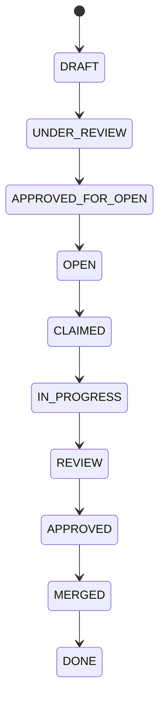
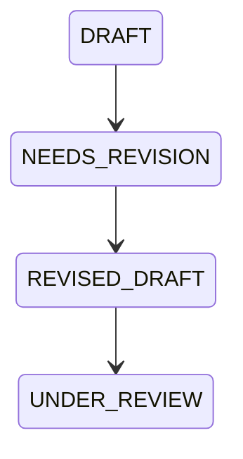
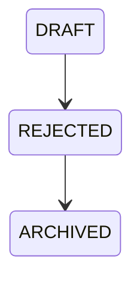
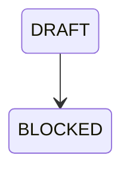

# AI WorkOrder Review Loop

**Document ID:** KAIOS-V9.1-REVIEW-LOOP  
**Version:** V9.1  
**Status:** Draft for Review  
**Owner:** Codex  
**Scope:** Formal review state machine for AI-generated WorkOrders.

## 1. Purpose

KAIOS V9.0 allows AI to generate DRAFT WorkOrders from civilization observations, reasoning, risk analysis and recommended actions. V9.1 defines the official loop that decides whether a DRAFT may become executable work.

The loop exists to prevent three failures:

1. AI directly opening tasks without Codex review.
2. Risky or duplicated recommendations entering the WorkQueue.
3. WorkOrders losing traceability to source state, decision evidence, Canon, dependencies and audit records.

## 2. Authority Model

| Actor | Authority |
|---|---|
| AI Advisor | May observe, reason, recommend and create DRAFT WorkOrders. |
| Codex | May review, promote, reject, request revision, block or archive DRAFT WorkOrders. |
| Human | Required for R3 decisions and any explicit override. |
| Cursor / Worker | May execute only OPEN WorkOrders assigned through the WorkQueue. |

AI cannot change `DRAFT` to `OPEN`. Cursor cannot promote a DRAFT. Human may override a Codex decision, but the override must be recorded.

## 3. Official Promotion State Machine

## 4. Revision Flow

Revision is used when the idea is valid but the draft lacks evidence, scope, acceptance criteria, dependency proof or legal/security clarity.

## 5. Rejection Flow

Rejection is used when the WorkOrder conflicts with Canon, duplicates a better active task, has no valid path to safe execution, or makes claims outside KGEN authority.

## 6. Blocking Flow

Blocking is used when the WorkOrder may become valid later but cannot move today because a dependency, legal review, security review, source file, report, branch or Human decision is missing.

## 7. Required Review Artifacts

Every DRAFT review must produce:

- Review Report
- Risk Decision
- Duplicate Check
- Dependency Check
- Promotion Decision
- Audit Log Event

If the result is revision, rejection or block, the review must also include the correction path or closure reason.

## 8. Non-Execution Rule

V9.1 review artifacts do not execute code, transfer tokens, deploy contracts, modify protected paths or merge to main by themselves. They only decide whether a WorkOrder may enter the KAIOS WorkQueue as `OPEN`.

## 9. Canon Alignment

Every promoted WorkOrder must preserve the KGEN Canon:

- AI is an advisor and organ, not an unchecked authority.
- Codex is the mainline reviewer.
- Human review is required for high-risk decisions.
- All state changes must be traceable to GitHub documents and machine-readable records.
