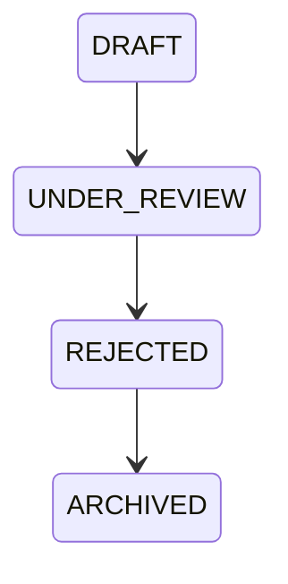

# Codex Rejection Protocol

**Document ID:** KAIOS-V9.1-CODEX-REJECTION  
**Version:** V9.1  
**Status:** Draft for Review  
**Owner:** Codex  
**Scope:** Rejecting invalid or unsafe DRAFT WorkOrders.

## 1. Rejection Definition

Rejection closes a DRAFT WorkOrder that should not enter the WorkQueue in its current form. It differs from revision: revision means the task is useful but incomplete, while rejection means the task is invalid, unsafe, duplicative or outside authority.

## 2. Rejection Reasons

Codex may reject a DRAFT when it:

- Conflicts with KGEN Canon.
- Duplicates an existing unresolved WorkOrder.
- Uses a protected path as an expected modification target.
- Cannot be verified with acceptance criteria.
- Claims real partnership, legal authority, financial license or production status that does not exist.
- Lacks a valid source decision or source state.
- Is too broad to become a single executable WorkOrder.
- Would require R4 execution.

## 3. Rejection Flow

## 4. Required Rejection Output

Every rejection must include:

- Rejection decision ID.
- WorkOrder ID.
- Risk level.
- Rejection reason.
- Evidence files.
- Suggested replacement, if any.
- Audit event.

## 5. Archive Requirement

Rejected DRAFT WorkOrders are retained for audit. They are not deleted. If the idea later becomes valid, Codex creates a new DRAFT or revision record instead of silently resurrecting the rejected one.
