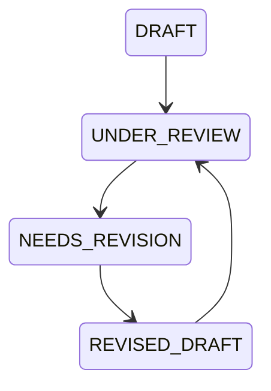

# Codex Revision Protocol

**Document ID:** KAIOS-V9.1-CODEX-REVISION  
**Version:** V9.1  
**Status:** Draft for Review  
**Owner:** Codex  
**Scope:** Requesting and validating revisions for AI DRAFT WorkOrders.

## 1. Revision Definition

Revision is used when a DRAFT is directionally valid but not ready for promotion. The task remains alive, but it must be corrected before another review.

## 2. Revision Triggers

Codex should request revision when:

- The report path is shared without clear grouping.
- Acceptance criteria are vague.
- Dependencies exist but are not tied to expected outputs.
- Risk level needs clarification.
- Legal or security boundary is named but not scoped.
- The WorkOrder is too broad and should be split.
- The owner or branch pattern is incomplete.

## 3. Revision Flow

## 4. Revision Request Fields

| Field | Meaning |
|---|---|
| `revision_id` | Unique revision request ID. |
| `workorder_id` | Target WorkOrder. |
| `requested_by` | Codex or Human. |
| `reason` | Why revision is required. |
| `required_changes` | Concrete required changes. |
| `risk_level` | Current risk level. |
| `due_status` | Expected next state, normally `REVISED_DRAFT`. |
| `audit_event` | Link to audit record. |

## 5. Revision Acceptance

A revised DRAFT must preserve its original decision trace unless Codex intentionally links it to a new AI decision. If the revised task changes scope materially, it must receive a new WorkOrder ID.
