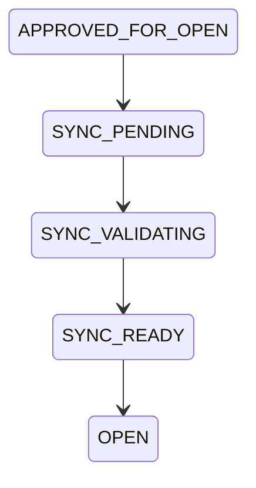
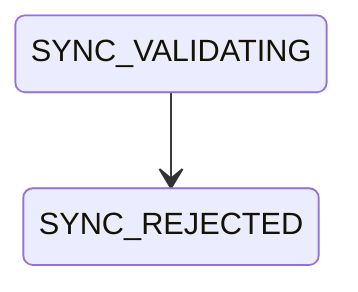
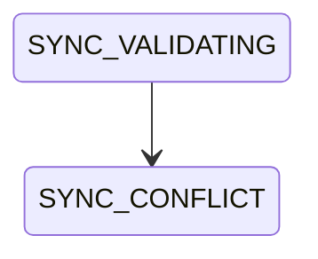
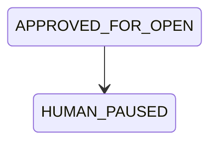
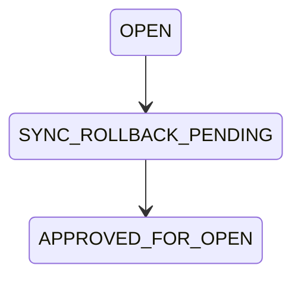

# Approved Draft Sync Standard

**Document ID:** KAIOS-V9.2-APPROVED-DRAFT-SYNC  
**Version:** V9.2  
**Status:** Draft for Review  
**Owner:** Codex  
**Scope:** Safe transition from `APPROVED_FOR_OPEN` to `OPEN`.

## 1. Purpose

V9.1 approves AI-generated DRAFT WorkOrders. V9.2 synchronizes those approved drafts into the official WorkQueue only after Codex performs a second validation pass. This prevents a reviewed draft from becoming executable work without checking WorkQueue conflicts, ID allocation, insertion safety and Human pause gates.

## 2. Official Sync State Machine

## 3. Failure State

## 4. Conflict State

## 5. Human Pause State

## 6. Rollback State

## 7. Non-Execution Rule

Sync creates an `OPEN` WorkQueue entry. It does not execute the task. In V9.2, synced tasks may include `Dispatch Hold: true` so Cursor cannot treat the sync event as an automatic execution order.

## 8. Source Integrity

Every synced WorkOrder must reference:

- Source AI decision.
- V9.1 promotion decision.
- V9.1 review report.
- V9.1 audit record.
- V9.2 sync validation.
- V9.2 sync audit event.
