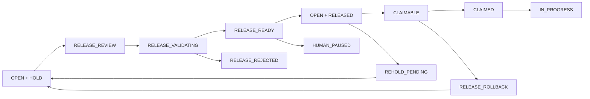

# KAIOS V9.3 Dispatch Hold Release Protocol

**Version:** V9.3  
**Status:** Draft for Review / Release Baseline  
**Level:** L4 Runtime Governance  
**Owner:** Codex  
**Protected Systems:** contracts, `K線西遊記/temples/12345`, wallet, bridge, Boot, Runtime CURRENT, final-whitepaper, KGEN Token contract

KAIOS V9.3 defines the Codex-only process for releasing an already-synced AI WorkOrder from dispatch hold. V9.2 created `AI-ECONOMY-2026-0001` as `OPEN` with `Dispatch Hold: true`; V9.3 decides whether that task can become claimable by a valid Worker.

V9.3 does not execute the task, does not assign a worker claim, does not merge worker output, and does not perform financial, contract, governance, or protected-path actions.

## Scope

| Path | Purpose |
|---|---|
| `DISPATCH_HOLD_STANDARD.md` | Canonical meaning of `OPEN + HOLD` |
| `CODEX_RELEASE_PROTOCOL.md` | 20-point Codex release checklist |
| `WORKER_ELIGIBILITY_PROTOCOL.md` | Worker requirements before a task becomes claimable |
| `DISPATCH_PRIORITY_POLICY.md` | Priority ordering used before release |
| `DISPATCH_DEPENDENCY_GATE.md` | Dependency validation rules |
| `DISPATCH_RISK_GATE.md` | R0-R4 release rules |
| `HUMAN_PAUSE_AND_REHOLD.md` | Human pause, re-hold, reassignment and rejection rules |
| `DISPATCH_ROLLBACK_POLICY.md` | Recovery path after mistaken release |
| `DISPATCH_AUDIT_STANDARD.md` | Audit fields for every release decision |
| `schemas/` | Machine-readable JSON Schema |
| `examples/` | Valid example payloads |
| `runtime/` | Runtime responsibilities for release checks |
| `dashboard/` | Read-only dispatch dashboard |
| `release/` | Actual release artifacts for `AI-ECONOMY-2026-0001` |
| `reports/` | QA, dry run, release review and audit reports |

## V9.3 State Machine

## Actual V9.3 Target

| Field | Value |
|---|---|
| WorkOrder | `AI-ECONOMY-2026-0001` |
| Source Draft | `V9-DRYRUN-001A` |
| Current Status Before V9.3 | `OPEN` |
| Dispatch Hold Before V9.3 | `true` |
| Expected Release Result | `OPEN + RELEASED`, `claimable: true`, if gates pass |
| Worker | Recommended `cursor-01`; actual claim still requires Cursor handoff workflow |

## Read-Only Boundary

V9.3 dashboard and release reports are informational. They do not write to GitHub, do not use a GitHub token, and do not auto-claim tasks. Cursor must still create a handoff branch and Codex must still review the result before any merge to main.

