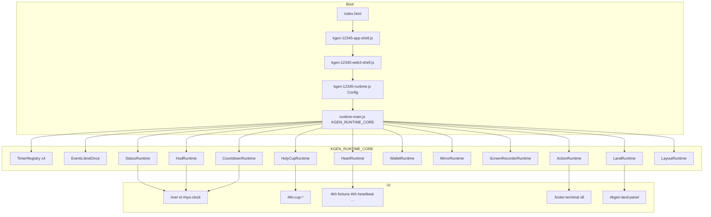

# 12345 Runtime Core Architecture (V2.0)

## Overview

Temple `12345` uses a **single runtime owner**: `KGEN_RUNTIME_CORE` in `modules/runtime-main.js`.

Legacy multi-IIFE UI fighting (`guard` / `seize` / `dedupe` / `MutationObserver` rebinding) is **quarantined** in:

- `modules/archive/kgen-12345-runtime.legacy.js` (not loaded)

Boot-only shells:

| File | Role |
|------|------|
| `kgen-12345-runtime.js` | Config (`KGEN_12345_CONFIG`) + wallet provider bridge + `app.init` patch |
| `kgen-12345-app-shell.js` | Game shell `window.app` (steer, warp, capture, guide) — no Heart UI timers |
| `kgen-12345-web3-shell.js` | `window.web3` wallet helpers for HTML `onclick` |
| `runtime-main.js` | **KGEN_RUNTIME_CORE** — all UI modules |
| `runtime-bootstrap.js` | LIFE_MANIFEST / RUNTIME_GENOME immune check |

## Architecture Diagram

## Boot Flow

1. Browser loads `app-shell` → `window.app`
2. Browser loads `web3-shell` → `window.web3`
3. `kgen-12345-runtime.js` sets `KGEN_12345_CONFIG`, patches `app.init` (no clock/version takeover)
4. On `DOMContentLoaded`: `app.init()` (Three.js, steer, warp, guide bind)
5. On `DOMContentLoaded`: `KGEN_RUNTIME_CORE.boot()` once
6. `TimerRegistry` starts 4 intervals

## Module Flow

| Module | Responsibility |
|--------|----------------|
| **StatusRuntime** | `#kgen-v902-left-status`, `#kh-log` |
| **HudRuntime** | Version HUD, Taiwan + UTC clock |
| **CountdownRuntime** | NY `HH:MM:SS`, festival countdown |
| **HolyCupRuntime** | 0/3→3/3 sequential cup |
| **HeartRuntime** | Chain read, wallet connect, Heart tx |
| **WalletRuntime** | `kh-connect`, `kh-refresh`, approve |
| **MirrorRuntime** | `bull-front` / `bear-rear` PNG swap |
| **ScreenRecorderRuntime** | `getDisplayMedia` + rec panel |
| **ActionRuntime** | Footer 8, right rule, claim delegate |
| **LandRuntime** | `KGEN_LAND_ENGINE` init |
| **LayoutRuntime** | Festival panel position, cup dedupe once, right rule default |

## Event Flow

- **One bind per element**: `Events.bindOnce(el, type, handler)`
- **Footer / cup / heart / wallet**: bound once in module `init()`
- **Claim cup gate**: `ActionRuntime` document delegate (fortune blocked if cup &lt; 3)
- **No** `cloneNode` rebinding, **no** periodic `setInterval` rebinding

## Timer Flow

| Timer | Interval | Owner |
|-------|----------|-------|
| `clock` | 1000 ms | HudRuntime.tick |
| `countdown` | 1000 ms | CountdownRuntime.tick |
| `heart` | 12000 ms | HeartRuntime.refreshChainData |
| `status` | 1000 ms | StatusRuntime.tick + HeartRuntime.statusTick |

## Reuse for 13145 / 16888 / 18888

`KGEN_RUNTIME_CORE` is temple-agnostic at the pattern level:

1. Copy `runtime-main.js` pattern or import as shared module
2. Provide temple-specific `KGEN_*_CONFIG` (chain, assets, cup keys)
3. Swap `index.html` organ IDs if layout differs
4. Keep **one** `boot()` and **four** timers per temple

## Legacy Quarantine

Removed from active load:

- `kgen-12345-runtime.legacy.js` — 200+ IIFE blocks (cups, countdown, footer rebind)
- Divine-regeneration UI patches when `KGEN_RUNTIME_CORE.version === "V2.0"` (recording API only)
