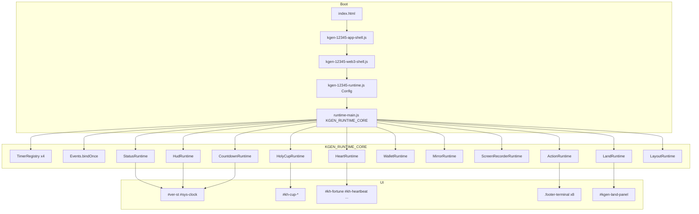

# 12345 Runtime Core Architecture (V2.0)

## 12345_LAYOUT_AUTHORITY_MAP — 2026-10-02, before reconstruction

Evidence baseline: origin/main `db35488e186e33ddc069cf9ec46f361aabe90a0c`.
Human real-device FAIL supersedes the #464/#465 presentation PASS. Public
390×844 reproduction also shows the market card crossing the Heart, GA beside
MOVE, a long right navigation column and eight persistent footer controls.

| Responsibility | Actual loaded authority |
| --- | --- |
| Layout / panel placement | `modules/runtime-main.js`: `LayoutRuntime`; `LandRuntime.mountDetails` moves the existing land organs |
| Responsive presentation | `modules/kgen-12345-ui.css`, last stylesheet after `runtime-main.css` and `kgen-12345-core.css` |
| Z-layer | Same active CSS cascade; native dialog top layer for land/AI/festival; UI overlay styles for Heart |
| Visibility / routing | `ActionRuntime`, `LayoutRuntime`, `kgen-12345-ui.js` Overlay/HeartOverlay and AI service; not the historic router files |
| Land state | Shared `../../modules/kgen-land-engine.js` via `LandRuntime`; local simulation, not ownership authority |
| Heart motion / MOVE | `MirrorRuntime` owns the core transform and joystick bindings |
| DRIVE / WARP | Existing app shell input handlers, with MirrorRuntime steering bridge; layout must not change value semantics |
| Audio / Portal | Shared `assets/kaios-world-audio.mjs`; local stylesheet positions its compact utility rail |

## ACTIVE_MODULE_MAP

ACTIVE, loaded by `index.html`: app-shell, web3-shell, kgen-12345-runtime
(config/bridge), mother-runtime, divine-regeneration (guarded), ai-service,
runtime-main, runtime-bootstrap, kgen-12345-ui; shared land, wallet-continuity
and world-audio modules. These remain the only loaded organs.

SUPERSEDED for this entry (present but NOT loaded):
`kgen-12345-layout-engine.js`, `kgen-12345-layout-runtime.js`,
`runtime-layout-fix.js`, `runtime-temple-layout.js`, `runtime-zlayer-engine.js`,
`runtime-visibility-engine.js`, `runtime-visual-semantic-control.js`,
`runtime-panel-registry.js`, `runtime-router-engine.js`,
`runtime-panel-window-restore.js`, `kgen-12345-panel-router.js`,
`kgen-12345-ui-runtime.js`. Do not activate them to repair this entry.

ARCHIVE: `modules/archive/kgen-12345-runtime.legacy.js`, not loaded.
LEGACY: historical inline release comments and old compatibility shells are
lineage evidence, not current placement authority. Prior architecture diagrams
below describe the core pattern, not an exhaustive contemporary load graph.

## REGRESSION_ROOT_CAUSE

The last mobile stylesheet positioned each organ independently, preserving too
many secondary panels as permanent HUD. Fixing land document flow did not fix
composition. In addition, the mobile core window was resized without matching
its 420px anchor, shifting the Heart off center. Previous QA checked bounds and
reachability, not unobstructed Heart area, hierarchy or control density.

Reconstruction contract: extend existing LayoutRuntime with one responsive
composition, move (never clone) original controls into named world/drive/action
zones and a More dialog, restore original parents on desktop. Replace the
previous mobile presentation rules in place. Land has one entry. Financial,
recording, AI, camera, Holy Cup, festival and universe handlers are preserved.
No new layout engine, bootstrap, runtime version or transaction path.

Release gate: screenshots and composition review at 390×844 / 844×390 plus
360/412/432/480, interaction and rotation tests, Draft PR only. No merge until
second visual review; local candidate evidence is not public production PASS.

### Candidate verification / provenance

- First-party repository UI/runtime/test changes only. No external code, art,
  music, dependencies or confidential source incorporated; added-line secret
  scan found no credential/private-key patterns.
- `tests/kaios-world-audio-browser.mjs` now checks Heart centering, minimum
  visual size, no primary-control intrusion, hidden secondary HUD, one Land
  entry, all eight original actions, pointer reachability, modal content,
  unchanged geometry, portrait/landscape rotation and desktop restoration.
- Real input tests exercise MOVE, thumb reset, DRIVE and WARP at 390×844 and
  844×390. Audio tests retain destination PCM sampling, no legacy playback,
  mute persistence and canonical Portal return. No wallet transaction is used.
- Review screenshots: CI artifact `kaios-portal-<HEAD>` contains
  `heart-390-final.png`, `heart-844-final.png`, `heart-*-more.png`,
  `heart-*-more-controls.png`, `heart-*-land-map.png`, `heart-*-ai.png`,
  `heart-*-festival.png`, `heart-*-heart.png` and `heart-*-movement.png`.
- Known unrelated baseline: optional WalletConnect 2.12.2 CDN script reports
  `process is not defined`. This change neither repairs nor suppresses it;
  only that exact existing external error is distinguished from new errors.
- TempleHeart audit remains separate: no contracts, addresses, ABI, approval,
  wallet/signing or V3.2.6-compatible transaction path changed here.

## Overview

Temple `12345` uses a **single runtime owner**: `KGEN_RUNTIME_CORE` in `modules/runtime-main.js`.

Legacy multi-IIFE UI fighting (`guard` / `seize` / `dedupe` / `MutationObserver` rebinding) is **quarantined** in:

- `modules/archive/kgen-12345-runtime.legacy.js` (not loaded)

Boot-only shells:

| File | Role |
|------|------|
| `kgen-12345-runtime.js` | Config (`KGEN_12345_CONFIG`) + wallet provider bridge + `app.init` patch |
| `kgen-12345-app-shell.js` | Game shell `window.app` (steer, warp, capture, guide) — no Heart UI timers |
| `kgen-12345-web3-shell.js` | `window.web3` wallet helpers for HTML `onclick` |
| `runtime-main.js` | **KGEN_RUNTIME_CORE** — all UI modules |
| `runtime-bootstrap.js` | LIFE_MANIFEST / RUNTIME_GENOME immune check |

## Architecture Diagram

```mermaid
flowchart TB
  subgraph Boot
    HTML[index.html]
    CFG[kgen-12345-runtime.js Config]
    APP[kgen-12345-app-shell.js]
    W3[kgen-12345-web3-shell.js]
    CORE[runtime-main.js KGEN_RUNTIME_CORE]
    HTML --> APP --> W3 --> CFG --> CORE
  end

  subgraph KGEN_RUNTIME_CORE
    TR[TimerRegistry x4]
    EV[Events.bindOnce]
    SR[StatusRuntime]
    HR[HudRuntime]
    CR[CountdownRuntime]
    HC[HolyCupRuntime]
    HE[HeartRuntime]
    WA[WalletRuntime]
    MI[MirrorRuntime]
    SC[ScreenRecorderRuntime]
    AC[ActionRuntime]
    LA[LandRuntime]
    LO[LayoutRuntime]
    CORE --> TR
    CORE --> EV
    CORE --> SR & HR & CR & HC & HE & WA & MI & SC & AC & LA & LO
  end

  subgraph UI
    HUD[#ver-st #sys-clock]
    CUP[#kh-cup-*]
    CLAIM[#kh-fortune #kh-heartbeat ...]
    FOOT[.footer-terminal x8]
    LAND[#kgen-land-panel]
    SR --> HUD
    HR --> HUD
    CR --> HUD
    HC --> CUP
    HE --> CLAIM
    AC --> FOOT
    LA --> LAND
  end
```

## Boot Flow

1. Browser loads `app-shell` → `window.app`
2. Browser loads `web3-shell` → `window.web3`
3. `kgen-12345-runtime.js` sets `KGEN_12345_CONFIG`, patches `app.init` (no clock/version takeover)
4. On `DOMContentLoaded`: `app.init()` (Three.js, steer, warp, guide bind)
5. On `DOMContentLoaded`: `KGEN_RUNTIME_CORE.boot()` once
6. `TimerRegistry` starts 4 intervals

## Module Flow

| Module | Responsibility |
|--------|----------------|
| **StatusRuntime** | `#kgen-v902-left-status`, `#kh-log` |
| **HudRuntime** | Version HUD, Taiwan + UTC clock |
| **CountdownRuntime** | NY `HH:MM:SS`, festival countdown |
| **HolyCupRuntime** | 0/3→3/3 sequential cup |
| **HeartRuntime** | Chain read, wallet connect, Heart tx |
| **WalletRuntime** | `kh-connect`, `kh-refresh`, approve |
| **MirrorRuntime** | `bull-front` / `bear-rear` PNG swap |
| **ScreenRecorderRuntime** | `getDisplayMedia` + rec panel |
| **ActionRuntime** | Footer 8, right rule, claim delegate |
| **LandRuntime** | `KGEN_LAND_ENGINE` init |
| **LayoutRuntime** | Festival panel position, cup dedupe once, right rule default |

## Event Flow

- **One bind per element**: `Events.bindOnce(el, type, handler)`
- **Footer / cup / heart / wallet**: bound once in module `init()`
- **Claim cup gate**: `ActionRuntime` document delegate (fortune blocked if cup &lt; 3)
- **No** `cloneNode` rebinding, **no** periodic `setInterval` rebinding

## Timer Flow

| Timer | Interval | Owner |
|-------|----------|-------|
| `clock` | 1000 ms | HudRuntime.tick |
| `countdown` | 1000 ms | CountdownRuntime.tick |
| `heart` | 12000 ms | HeartRuntime.refreshChainData |
| `status` | 1000 ms | StatusRuntime.tick + HeartRuntime.statusTick |

## Reuse for 13145 / 16888 / 18888

`KGEN_RUNTIME_CORE` is temple-agnostic at the pattern level:

1. Copy `runtime-main.js` pattern or import as shared module
2. Provide temple-specific `KGEN_*_CONFIG` (chain, assets, cup keys)
3. Swap `index.html` organ IDs if layout differs
4. Keep **one** `boot()` and **four** timers per temple

## Legacy Quarantine

Removed from active load:

- `kgen-12345-runtime.legacy.js` — 200+ IIFE blocks (cups, countdown, footer rebind)
- Divine-regeneration UI patches when `KGEN_RUNTIME_CORE.version === "V2.0"` (recording API only)
