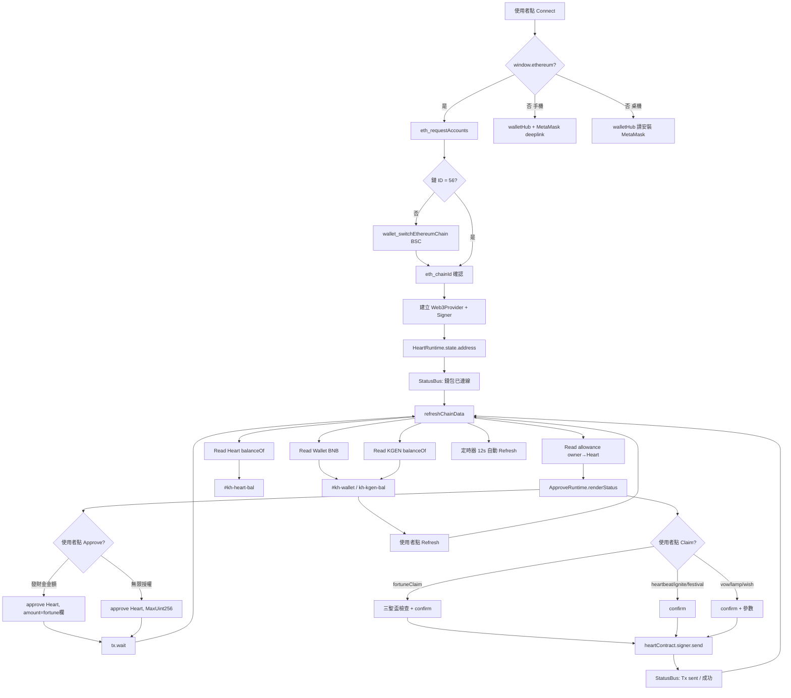

# 12345 Wallet Flow（V3.0）

> 權威實作：`KGEN_RUNTIME_CORE.modules.WalletRuntime` + `ApproveRuntime` + `HeartRuntime`

## 流程圖



## 階段說明

### 1. Connect

| 步驟 | 函式 | 輸出 |
|------|------|------|
| 偵測注入錢包 | `HeartRuntime.getEthereum()` | MetaMask / Trust / OKX |
| 請求帳戶 | `ethereum.request({method:'eth_requestAccounts'})` | `state.address` |
| 無錢包手機 | `WalletRuntime.openWalletHub` | MetaMask deeplink 按鈕 |
| 無錢包桌機 | `WalletRuntime.openWalletHub` | 安裝提示 |

正式 deeplink：
```
https://metamask.app.link/dapp/klineodyssey.github.io/kline-odyssey/K線西遊記/temples/12345/index.html
```

### 2. Switch BSC

| 步驟 | 函式 |
|------|------|
| 讀取鏈 | `eth_chainId` |
| 切換 | `wallet_switchEthereumChain` → `0x38` |
| 新增鏈 | `wallet_addEthereumChain`（4902 時） |
| UI | `#kh-chain` → `BSC 56` |

### 3. Read Wallet

- `provider.getBalance(address)` → gas 檢查
- `#kh-wallet` 顯示縮寫地址

### 4. Read KGEN

- `ERC20.balanceOf(user)` → `#kh-kgen-bal`
- `ERC20.decimals()` → 格式化

### 5. Read Heart

- `ERC20.balanceOf(HEART_ADDR)` → `#kh-heart-bal`
- `HEART_VIEW_ABI` 讀冷卻、ignite 視窗、festival 視窗
- 更新 `#kh-heartbeat-status`, `#kh-fortune-status`, `#kh-ignite-status`

### 6. Allowance

`ApproveRuntime` 統一管理：

| 欄位 | 用途 |
|------|------|
| Current | 鏈上 `allowance(user, Heart)` |
| Need: 發財金 | `#kh-fortune-amount` |
| Need: 許願 | `#kh-wish-amount` |
| Need: 還願 | `#kh-vow-amount` |
| Need: 點燈 | `#kh-lamp-days` |

顯示於 `#kh-allowance-status`，不足標 ✗。

### 7. Approve

| 按鈕 | 行為 |
|------|------|
| `#kh-approve-current` | `token.approve(Heart, fortuneAmount)` |
| `#kh-unlimited` | `token.approve(Heart, MaxUint256)` |

### 8. Claim

全部經 `HeartRuntime.sendHeart(label, runner)`：

1. 聖盃檢查（僅 fortuneClaim）
2. BSC 檢查
3. `window.confirm`
4. `contract.fortuneClaim / heartbeatClaim / …`
5. `tx.wait` → refresh

### 9. Refresh

| 觸發 | 函式 |
|------|------|
| `#kh-refresh` | `WalletRuntime.refresh` |
| 12s 定時器 | `HeartRuntime.refreshChainData(false)` |
| Approve/Claim 後 | 自動 refresh |
| `chainLive.refresh` stub | 同上 |

## 事件匯流

```
User Click
  → Events.bindOnce (runtime-main)
  → WalletRuntime / ApproveRuntime / HeartRuntime
  → StatusRuntime.push → #kh-log + #kgen-v902-left-status
  → DOM 更新 (#kh-*-bal, #kh-allowance-status, claim status)
```

## 與舊 web3-shell 的關係

| 舊 | V3 |
|----|-----|
| `web3.connect()` | 委派 `WalletRuntime.connect` |
| `web3.refresh()` pool | 委派 `HeartRuntime.refreshChainData` |
| `web3.approve()` betting | 委派 `ApproveRuntime` |
| `web3.openWalletHub` | `WalletRuntime.openWalletHub` |

`window.web3` 保留為相容層；**Heart 語意以 Runtime Core 為準**。
