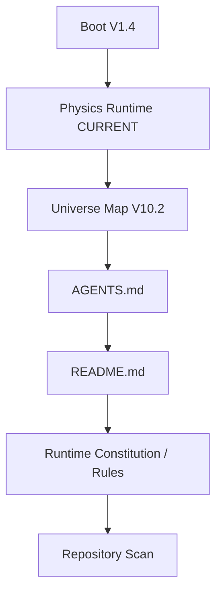

# KGEN BOOT_FLOW

## Old Boot References
| Source | Line | Ref |
| --- | --- | --- |
| C:\Desktop\kline-odyssey\archive\boot\PRIMEFORGE_GENESIS_BOOT_SEQUENCE_V1_0.md | 1 | PRIMEFORGE_GENESIS_BOOT_SEQUENCE_V1_0.md |
| C:\Desktop\kline-odyssey\archive\PRIMEFORGE_GENESIS_BOOT_SEQUENCE_V1_2.md | 74 | PRIMEFORGE_GENESIS_BOOT_SEQUENCE_V1_0.md |
| C:\Desktop\kline-odyssey\archive\PRIMEFORGE_GENESIS_BOOT_SEQUENCE_V1_2.md | 441 | PRIMEFORGE_GENESIS_BOOT_SEQUENCE_V1_2.md |
| C:\Desktop\kline-odyssey\archive\PRIMEFORGE_GENESIS_BOOT_SEQUENCE_V1_2.md | 517 | PRIMEFORGE_GENESIS_BOOT_SEQUENCE_V1_2.md |
| C:\Desktop\kline-odyssey\archive\PRIMEFORGE_GENESIS_BOOT_SEQUENCE_V1_2.md | 618 | PRIMEFORGE_GENESIS_BOOT_SEQUENCE_V1_2.md |
| C:\Desktop\kline-odyssey\archive\PRIMEFORGE_GENESIS_BOOT_SEQUENCE_V1_3.md | 74 | PRIMEFORGE_GENESIS_BOOT_SEQUENCE_V1_3.md |
| C:\Desktop\kline-odyssey\archive\PRIMEFORGE_GENESIS_BOOT_SEQUENCE_V1_3.md | 544 | PRIMEFORGE_GENESIS_BOOT_SEQUENCE_V1_3.md |
| C:\Desktop\kline-odyssey\archive\PRIMEFORGE_GENESIS_BOOT_SEQUENCE_V1_3.md | 622 | PRIMEFORGE_GENESIS_BOOT_SEQUENCE_V1_3.md |
| C:\Desktop\kline-odyssey\archive\PRIMEFORGE_GENESIS_BOOT_SEQUENCE_V1_3.md | 725 | PRIMEFORGE_GENESIS_BOOT_SEQUENCE_V1_3.md |
| C:\Desktop\kline-odyssey\archive\README_old_20260611.md | 21 | PRIMEFORGE_GENESIS_BOOT_SEQUENCE_V1_2.md |
| C:\Desktop\kline-odyssey\docs\KGEN_DEPENDENCY_GRAPH.md | 603 | PRIMEFORGE_GENESIS_BOOT_SEQUENCE_V1_2.md |
| C:\Desktop\kline-odyssey\docs\KGEN_DEPENDENCY_GRAPH.md | 604 | PRIMEFORGE_GENESIS_BOOT_SEQUENCE_V1_3.md |
| C:\Desktop\kline-odyssey\docs\KGEN_DEPENDENCY_GRAPH.md | 607 | PRIMEFORGE_GENESIS_BOOT_SEQUENCE_V1_0.md |
| C:\Desktop\kline-odyssey\docs\KGEN_DEPENDENCY_GRAPH.md | 1155 | PRIMEFORGE_GENESIS_BOOT_SEQUENCE_V1_2.md |
| C:\Desktop\kline-odyssey\docs\KGEN_DEPENDENCY_GRAPH.md | 1156 | PRIMEFORGE_GENESIS_BOOT_SEQUENCE_V1_3.md |
| C:\Desktop\kline-odyssey\docs\KGEN_DEPENDENCY_GRAPH.md | 1159 | PRIMEFORGE_GENESIS_BOOT_SEQUENCE_V1_0.md |
| C:\Desktop\kline-odyssey\docs\KGEN_DEPENDENCY_GRAPH.md | 1637 | PRIMEFORGE_GENESIS_BOOT_SEQUENCE_V1_2.md |
| C:\Desktop\kline-odyssey\docs\KGEN_DEPENDENCY_GRAPH.md | 1638 | PRIMEFORGE_GENESIS_BOOT_SEQUENCE_V1_3.md |
| C:\Desktop\kline-odyssey\docs\KGEN_DEPENDENCY_GRAPH.md | 1641 | PRIMEFORGE_GENESIS_BOOT_SEQUENCE_V1_0.md |
| C:\Desktop\kline-odyssey\docs\KGEN_DEPENDENCY_GRAPH.md | 1796 | PRIMEFORGE_GENESIS_BOOT_SEQUENCE_V1_2.md |
| C:\Desktop\kline-odyssey\docs\KGEN_DEPENDENCY_GRAPH.md | 1797 | PRIMEFORGE_GENESIS_BOOT_SEQUENCE_V1_3.md |
| C:\Desktop\kline-odyssey\docs\KGEN_DEPENDENCY_GRAPH.md | 1798 | PRIMEFORGE_GENESIS_BOOT_SEQUENCE_V1_0.md |
| C:\Desktop\kline-odyssey\docs\KGEN_DEPENDENCY_GRAPH.md | 2144 | PRIMEFORGE_GENESIS_BOOT_SEQUENCE_V1_2.md |
| C:\Desktop\kline-odyssey\docs\KGEN_DEPENDENCY_GRAPH.md | 3201 | PRIMEFORGE_GENESIS_BOOT_SEQUENCE_V1_2.md |
| C:\Desktop\kline-odyssey\docs\KGEN_DEPENDENCY_GRAPH.md | 3301 | PRIMEFORGE_GENESIS_BOOT_SEQUENCE_V1_2.md |
| C:\Desktop\kline-odyssey\docs\KGEN_DEPENDENCY_GRAPH.md | 3847 | PRIMEFORGE_GENESIS_BOOT_SEQUENCE_V1_3.md |
| C:\Desktop\kline-odyssey\docs\KGEN_DEPENDENCY_GRAPH.md | 3901 | PRIMEFORGE_GENESIS_BOOT_SEQUENCE_V1_2.md |
| C:\Desktop\kline-odyssey\docs\KGEN_DEPENDENCY_GRAPH.md | 3902 | PRIMEFORGE_GENESIS_BOOT_SEQUENCE_V1_0.md |
| C:\Desktop\kline-odyssey\docs\KGEN_DEPENDENCY_GRAPH.md | 3985 | PRIMEFORGE_GENESIS_BOOT_SEQUENCE_V1_2.md |
| C:\Desktop\kline-odyssey\docs\KGEN_DEPENDENCY_GRAPH.md | 3986 | PRIMEFORGE_GENESIS_BOOT_SEQUENCE_V1_0.md |
| C:\Desktop\kline-odyssey\docs\KGEN_DEPENDENCY_GRAPH.md | 4009 | PRIMEFORGE_GENESIS_BOOT_SEQUENCE_V1_2.md |
| C:\Desktop\kline-odyssey\docs\KGEN_DEPENDENCY_GRAPH.md | 4010 | PRIMEFORGE_GENESIS_BOOT_SEQUENCE_V1_2.md |
| C:\Desktop\kline-odyssey\docs\KGEN_DEPENDENCY_GRAPH.md | 4011 | PRIMEFORGE_GENESIS_BOOT_SEQUENCE_V1_2.md |
| C:\Desktop\kline-odyssey\docs\KGEN_DEPENDENCY_GRAPH.md | 4012 | PRIMEFORGE_GENESIS_BOOT_SEQUENCE_V1_2.md |
| C:\Desktop\kline-odyssey\docs\KGEN_DEPENDENCY_GRAPH.md | 4013 | PRIMEFORGE_GENESIS_BOOT_SEQUENCE_V1_2.md |
| C:\Desktop\kline-odyssey\docs\KGEN_DEPENDENCY_GRAPH.md | 4014 | PRIMEFORGE_GENESIS_BOOT_SEQUENCE_V1_2.md |
| C:\Desktop\kline-odyssey\docs\KGEN_DEPENDENCY_GRAPH.md | 4015 | PRIMEFORGE_GENESIS_BOOT_SEQUENCE_V1_2.md |
| C:\Desktop\kline-odyssey\docs\KGEN_DEPENDENCY_GRAPH.md | 4016 | PRIMEFORGE_GENESIS_BOOT_SEQUENCE_V1_2.md |
| C:\Desktop\kline-odyssey\docs\KGEN_DEPENDENCY_GRAPH.md | 4017 | PRIMEFORGE_GENESIS_BOOT_SEQUENCE_V1_2.md |
| C:\Desktop\kline-odyssey\docs\KGEN_DEPENDENCY_GRAPH.md | 4018 | PRIMEFORGE_GENESIS_BOOT_SEQUENCE_V1_2.md |
| C:\Desktop\kline-odyssey\docs\KGEN_DEPENDENCY_GRAPH.md | 4019 | PRIMEFORGE_GENESIS_BOOT_SEQUENCE_V1_2.md |
| C:\Desktop\kline-odyssey\docs\KGEN_DEPENDENCY_GRAPH.md | 4020 | PRIMEFORGE_GENESIS_BOOT_SEQUENCE_V1_2.md |
| C:\Desktop\kline-odyssey\docs\KGEN_DEPENDENCY_GRAPH.md | 4021 | PRIMEFORGE_GENESIS_BOOT_SEQUENCE_V1_2.md |
| C:\Desktop\kline-odyssey\docs\KGEN_DEPENDENCY_GRAPH.md | 4022 | PRIMEFORGE_GENESIS_BOOT_SEQUENCE_V1_2.md |
| C:\Desktop\kline-odyssey\docs\KGEN_DEPENDENCY_GRAPH.md | 4023 | PRIMEFORGE_GENESIS_BOOT_SEQUENCE_V1_2.md |
| C:\Desktop\kline-odyssey\docs\KGEN_DEPENDENCY_GRAPH.md | 4024 | PRIMEFORGE_GENESIS_BOOT_SEQUENCE_V1_2.md |
| C:\Desktop\kline-odyssey\docs\KGEN_DEPENDENCY_GRAPH.md | 4025 | PRIMEFORGE_GENESIS_BOOT_SEQUENCE_V1_2.md |
| C:\Desktop\kline-odyssey\docs\KGEN_DEPENDENCY_GRAPH.md | 4026 | PRIMEFORGE_GENESIS_BOOT_SEQUENCE_V1_2.md |
| C:\Desktop\kline-odyssey\docs\KGEN_DEPENDENCY_GRAPH.md | 4027 | PRIMEFORGE_GENESIS_BOOT_SEQUENCE_V1_2.md |
| C:\Desktop\kline-odyssey\docs\KGEN_DEPENDENCY_GRAPH.md | 4028 | PRIMEFORGE_GENESIS_BOOT_SEQUENCE_V1_2.md |
| C:\Desktop\kline-odyssey\docs\KGEN_DEPENDENCY_GRAPH.md | 4028 | PRIMEFORGE_GENESIS_BOOT_SEQUENCE_V1_0.md |
| C:\Desktop\kline-odyssey\docs\KGEN_DEPENDENCY_GRAPH.md | 4029 | PRIMEFORGE_GENESIS_BOOT_SEQUENCE_V1_2.md |
| C:\Desktop\kline-odyssey\docs\KGEN_DEPENDENCY_GRAPH.md | 4030 | PRIMEFORGE_GENESIS_BOOT_SEQUENCE_V1_2.md |
| C:\Desktop\kline-odyssey\docs\KGEN_DEPENDENCY_GRAPH.md | 4031 | PRIMEFORGE_GENESIS_BOOT_SEQUENCE_V1_2.md |
| C:\Desktop\kline-odyssey\docs\KGEN_DEPENDENCY_GRAPH.md | 4032 | PRIMEFORGE_GENESIS_BOOT_SEQUENCE_V1_2.md |
| C:\Desktop\kline-odyssey\docs\KGEN_DEPENDENCY_GRAPH.md | 4033 | PRIMEFORGE_GENESIS_BOOT_SEQUENCE_V1_2.md |
| C:\Desktop\kline-odyssey\docs\KGEN_DEPENDENCY_GRAPH.md | 4034 | PRIMEFORGE_GENESIS_BOOT_SEQUENCE_V1_2.md |
| C:\Desktop\kline-odyssey\docs\KGEN_DEPENDENCY_GRAPH.md | 4035 | PRIMEFORGE_GENESIS_BOOT_SEQUENCE_V1_2.md |
| C:\Desktop\kline-odyssey\docs\KGEN_DEPENDENCY_GRAPH.md | 4036 | PRIMEFORGE_GENESIS_BOOT_SEQUENCE_V1_2.md |
| C:\Desktop\kline-odyssey\docs\KGEN_DEPENDENCY_GRAPH.md | 4037 | PRIMEFORGE_GENESIS_BOOT_SEQUENCE_V1_2.md |
| C:\Desktop\kline-odyssey\docs\KGEN_DEPENDENCY_GRAPH.md | 4038 | PRIMEFORGE_GENESIS_BOOT_SEQUENCE_V1_2.md |
| C:\Desktop\kline-odyssey\docs\KGEN_DEPENDENCY_GRAPH.md | 4039 | PRIMEFORGE_GENESIS_BOOT_SEQUENCE_V1_2.md |
| C:\Desktop\kline-odyssey\docs\KGEN_DEPENDENCY_GRAPH.md | 4040 | PRIMEFORGE_GENESIS_BOOT_SEQUENCE_V1_2.md |
| C:\Desktop\kline-odyssey\docs\KGEN_DEPENDENCY_GRAPH.md | 4041 | PRIMEFORGE_GENESIS_BOOT_SEQUENCE_V1_2.md |
| C:\Desktop\kline-odyssey\docs\KGEN_DEPENDENCY_GRAPH.md | 4042 | PRIMEFORGE_GENESIS_BOOT_SEQUENCE_V1_3.md |
| C:\Desktop\kline-odyssey\docs\KGEN_DEPENDENCY_GRAPH.md | 4043 | PRIMEFORGE_GENESIS_BOOT_SEQUENCE_V1_3.md |
| C:\Desktop\kline-odyssey\docs\KGEN_DEPENDENCY_GRAPH.md | 4044 | PRIMEFORGE_GENESIS_BOOT_SEQUENCE_V1_3.md |
| C:\Desktop\kline-odyssey\docs\KGEN_DEPENDENCY_GRAPH.md | 4045 | PRIMEFORGE_GENESIS_BOOT_SEQUENCE_V1_3.md |
| C:\Desktop\kline-odyssey\docs\KGEN_DEPENDENCY_GRAPH.md | 4046 | PRIMEFORGE_GENESIS_BOOT_SEQUENCE_V1_3.md |
| C:\Desktop\kline-odyssey\docs\KGEN_DEPENDENCY_GRAPH.md | 4047 | PRIMEFORGE_GENESIS_BOOT_SEQUENCE_V1_3.md |
| C:\Desktop\kline-odyssey\docs\KGEN_DEPENDENCY_GRAPH.md | 4048 | PRIMEFORGE_GENESIS_BOOT_SEQUENCE_V1_3.md |
| C:\Desktop\kline-odyssey\docs\KGEN_DEPENDENCY_GRAPH.md | 4049 | PRIMEFORGE_GENESIS_BOOT_SEQUENCE_V1_3.md |
| C:\Desktop\kline-odyssey\docs\KGEN_DEPENDENCY_GRAPH.md | 4050 | PRIMEFORGE_GENESIS_BOOT_SEQUENCE_V1_3.md |
| C:\Desktop\kline-odyssey\docs\KGEN_DEPENDENCY_GRAPH.md | 4051 | PRIMEFORGE_GENESIS_BOOT_SEQUENCE_V1_3.md |
| C:\Desktop\kline-odyssey\docs\KGEN_DEPENDENCY_GRAPH.md | 4052 | PRIMEFORGE_GENESIS_BOOT_SEQUENCE_V1_3.md |
| C:\Desktop\kline-odyssey\docs\KGEN_DEPENDENCY_GRAPH.md | 4053 | PRIMEFORGE_GENESIS_BOOT_SEQUENCE_V1_3.md |
| C:\Desktop\kline-odyssey\docs\KGEN_DEPENDENCY_GRAPH.md | 4054 | PRIMEFORGE_GENESIS_BOOT_SEQUENCE_V1_3.md |
| C:\Desktop\kline-odyssey\docs\KGEN_DEPENDENCY_GRAPH.md | 4055 | PRIMEFORGE_GENESIS_BOOT_SEQUENCE_V1_3.md |
| C:\Desktop\kline-odyssey\docs\KGEN_DEPENDENCY_GRAPH.md | 4056 | PRIMEFORGE_GENESIS_BOOT_SEQUENCE_V1_3.md |
| C:\Desktop\kline-odyssey\docs\KGEN_DEPENDENCY_GRAPH.md | 4057 | PRIMEFORGE_GENESIS_BOOT_SEQUENCE_V1_3.md |
| C:\Desktop\kline-odyssey\docs\KGEN_DEPENDENCY_GRAPH.md | 4058 | PRIMEFORGE_GENESIS_BOOT_SEQUENCE_V1_3.md |
| C:\Desktop\kline-odyssey\docs\KGEN_DEPENDENCY_GRAPH.md | 4059 | PRIMEFORGE_GENESIS_BOOT_SEQUENCE_V1_3.md |
| C:\Desktop\kline-odyssey\docs\KGEN_DEPENDENCY_GRAPH.md | 4060 | PRIMEFORGE_GENESIS_BOOT_SEQUENCE_V1_3.md |
| C:\Desktop\kline-odyssey\docs\KGEN_DEPENDENCY_GRAPH.md | 4061 | PRIMEFORGE_GENESIS_BOOT_SEQUENCE_V1_3.md |
| C:\Desktop\kline-odyssey\docs\KGEN_DEPENDENCY_GRAPH.md | 4062 | PRIMEFORGE_GENESIS_BOOT_SEQUENCE_V1_3.md |
| C:\Desktop\kline-odyssey\docs\KGEN_DEPENDENCY_GRAPH.md | 4063 | PRIMEFORGE_GENESIS_BOOT_SEQUENCE_V1_3.md |
| C:\Desktop\kline-odyssey\docs\KGEN_DEPENDENCY_GRAPH.md | 4064 | PRIMEFORGE_GENESIS_BOOT_SEQUENCE_V1_3.md |
| C:\Desktop\kline-odyssey\docs\KGEN_DEPENDENCY_GRAPH.md | 4065 | PRIMEFORGE_GENESIS_BOOT_SEQUENCE_V1_3.md |
| C:\Desktop\kline-odyssey\docs\KGEN_DEPENDENCY_GRAPH.md | 4066 | PRIMEFORGE_GENESIS_BOOT_SEQUENCE_V1_3.md |
| C:\Desktop\kline-odyssey\docs\KGEN_DEPENDENCY_GRAPH.md | 4067 | PRIMEFORGE_GENESIS_BOOT_SEQUENCE_V1_3.md |
| C:\Desktop\kline-odyssey\docs\KGEN_DEPENDENCY_GRAPH.md | 4068 | PRIMEFORGE_GENESIS_BOOT_SEQUENCE_V1_3.md |
| C:\Desktop\kline-odyssey\docs\KGEN_DEPENDENCY_GRAPH.md | 4069 | PRIMEFORGE_GENESIS_BOOT_SEQUENCE_V1_3.md |
| C:\Desktop\kline-odyssey\docs\KGEN_DEPENDENCY_GRAPH.md | 4070 | PRIMEFORGE_GENESIS_BOOT_SEQUENCE_V1_3.md |
| C:\Desktop\kline-odyssey\docs\KGEN_DEPENDENCY_GRAPH.md | 4071 | PRIMEFORGE_GENESIS_BOOT_SEQUENCE_V1_3.md |
| C:\Desktop\kline-odyssey\docs\KGEN_DEPENDENCY_GRAPH.md | 4072 | PRIMEFORGE_GENESIS_BOOT_SEQUENCE_V1_3.md |
| C:\Desktop\kline-odyssey\docs\KGEN_DEPENDENCY_GRAPH.md | 4073 | PRIMEFORGE_GENESIS_BOOT_SEQUENCE_V1_3.md |
| C:\Desktop\kline-odyssey\docs\KGEN_DEPENDENCY_GRAPH.md | 4074 | PRIMEFORGE_GENESIS_BOOT_SEQUENCE_V1_3.md |
| C:\Desktop\kline-odyssey\docs\KGEN_DEPENDENCY_GRAPH.md | 4075 | PRIMEFORGE_GENESIS_BOOT_SEQUENCE_V1_3.md |
| C:\Desktop\kline-odyssey\docs\KGEN_DEPENDENCY_GRAPH.md | 4089 | PRIMEFORGE_GENESIS_BOOT_SEQUENCE_V1_2.md |
| C:\Desktop\kline-odyssey\docs\KGEN_DEPENDENCY_GRAPH.md | 4093 | PRIMEFORGE_GENESIS_BOOT_SEQUENCE_V1_0.md |
| C:\Desktop\kline-odyssey\docs\KGEN_DEPENDENCY_GRAPH.md | 4094 | PRIMEFORGE_GENESIS_BOOT_SEQUENCE_V1_0.md |
| C:\Desktop\kline-odyssey\docs\KGEN_DEPENDENCY_GRAPH.md | 4095 | PRIMEFORGE_GENESIS_BOOT_SEQUENCE_V1_0.md |
| C:\Desktop\kline-odyssey\docs\KGEN_DEPENDENCY_GRAPH.md | 4096 | PRIMEFORGE_GENESIS_BOOT_SEQUENCE_V1_0.md |
| C:\Desktop\kline-odyssey\docs\KGEN_DEPENDENCY_GRAPH.md | 4097 | PRIMEFORGE_GENESIS_BOOT_SEQUENCE_V1_0.md |
| C:\Desktop\kline-odyssey\docs\KGEN_DEPENDENCY_GRAPH.md | 4098 | PRIMEFORGE_GENESIS_BOOT_SEQUENCE_V1_0.md |
| C:\Desktop\kline-odyssey\docs\KGEN_DEPENDENCY_GRAPH.md | 4099 | PRIMEFORGE_GENESIS_BOOT_SEQUENCE_V1_0.md |
| C:\Desktop\kline-odyssey\docs\KGEN_DEPENDENCY_GRAPH.md | 5516 | PRIMEFORGE_GENESIS_BOOT_SEQUENCE_V1_2.md |
| C:\Desktop\kline-odyssey\docs\KGEN_DEPENDENCY_GRAPH.md | 5526 | PRIMEFORGE_GENESIS_BOOT_SEQUENCE_V1_2.md |
| C:\Desktop\kline-odyssey\docs\KGEN_DEPENDENCY_GRAPH.md | 5623 | PRIMEFORGE_GENESIS_BOOT_SEQUENCE_V1_2.md |
| C:\Desktop\kline-odyssey\docs\KGEN_DEPENDENCY_GRAPH.md | 5694 | PRIMEFORGE_GENESIS_BOOT_SEQUENCE_V1_2.md |
| C:\Desktop\kline-odyssey\docs\KGEN_DEPENDENCY_GRAPH.md | 5714 | PRIMEFORGE_GENESIS_BOOT_SEQUENCE_V1_2.md |
| C:\Desktop\kline-odyssey\docs\KGEN_DEPENDENCY_GRAPH.md | 5715 | PRIMEFORGE_GENESIS_BOOT_SEQUENCE_V1_0.md |
| C:\Desktop\kline-odyssey\docs\KGEN_DEPENDENCY_GRAPH.md | 5822 | PRIMEFORGE_GENESIS_BOOT_SEQUENCE_V1_3.md |
| C:\Desktop\kline-odyssey\docs\KGEN_DEPENDENCY_GRAPH.md | 5837 | PRIMEFORGE_GENESIS_BOOT_SEQUENCE_V1_2.md |
| C:\Desktop\kline-odyssey\docs\KGEN_MASTER_INDEX.md | 56 | PRIMEFORGE_GENESIS_BOOT_SEQUENCE_V1_0.md |
| C:\Desktop\kline-odyssey\docs\KGEN_MASTER_INDEX.md | 62 | PRIMEFORGE_GENESIS_BOOT_SEQUENCE_V1_2.md |
| C:\Desktop\kline-odyssey\docs\KGEN_MASTER_INDEX.md | 63 | PRIMEFORGE_GENESIS_BOOT_SEQUENCE_V1_3.md |
| C:\Desktop\kline-odyssey\docs\KGEN_MASTER_INDEX.md | 104 | PRIMEFORGE_GENESIS_BOOT_SEQUENCE_V1_2.md |
| C:\Desktop\kline-odyssey\docs\KGEN_MASTER_INDEX.md | 105 | PRIMEFORGE_GENESIS_BOOT_SEQUENCE_V1_3.md |
| C:\Desktop\kline-odyssey\docs\KGEN_RUNTIME_RULES.md | 84 | PRIMEFORGE_GENESIS_BOOT_SEQUENCE_V1_2.md |
| C:\Desktop\kline-odyssey\docs\KGEN_RUNTIME_RULES.md | 85 | PRIMEFORGE_GENESIS_BOOT_SEQUENCE_V1_3.md |
| C:\Desktop\kline-odyssey\docs\KGEN_VALIDATION_SECOND_STAGE.md | 152 | PRIMEFORGE_GENESIS_BOOT_SEQUENCE_V1_2.md |
| C:\Desktop\kline-odyssey\docs\KGEN_VALIDATION_SECOND_STAGE.md | 152 | PRIMEFORGE_GENESIS_BOOT_SEQUENCE_V1_2.md |
| C:\Desktop\kline-odyssey\docs\neural\CIVILIZATION_BRAIN_ROLLCALL.json | 17 | PRIMEFORGE_GENESIS_BOOT_SEQUENCE_V1_2.md |
| C:\Desktop\kline-odyssey\docs\neural\KGEN_Universe_Neural_System_V1_0.md | 80 | PRIMEFORGE_GENESIS_BOOT_SEQUENCE_V1_2.md |
| C:\Desktop\kline-odyssey\handoff\STRUCTURE_REPORT_V1.md | 19 | PRIMEFORGE_GENESIS_BOOT_SEQUENCE_V1_2.md |
| C:\Desktop\kline-odyssey\KGEN_BOOT_GRAPH.md | 635 | PRIMEFORGE_GENESIS_BOOT_SEQUENCE_V1_2.md |
| C:\Desktop\kline-odyssey\KGEN_BOOT_GRAPH.md | 636 | PRIMEFORGE_GENESIS_BOOT_SEQUENCE_V1_3.md |
| C:\Desktop\kline-odyssey\KGEN_BOOT_GRAPH.md | 639 | PRIMEFORGE_GENESIS_BOOT_SEQUENCE_V1_0.md |
| C:\Desktop\kline-odyssey\KGEN_BOOT_GRAPH.md | 1187 | PRIMEFORGE_GENESIS_BOOT_SEQUENCE_V1_2.md |
| C:\Desktop\kline-odyssey\KGEN_BOOT_GRAPH.md | 1188 | PRIMEFORGE_GENESIS_BOOT_SEQUENCE_V1_3.md |
| C:\Desktop\kline-odyssey\KGEN_BOOT_GRAPH.md | 1191 | PRIMEFORGE_GENESIS_BOOT_SEQUENCE_V1_0.md |
| C:\Desktop\kline-odyssey\KGEN_BOOT_GRAPH.md | 1658 | PRIMEFORGE_GENESIS_BOOT_SEQUENCE_V1_2.md |
| C:\Desktop\kline-odyssey\KGEN_BOOT_GRAPH.md | 1659 | PRIMEFORGE_GENESIS_BOOT_SEQUENCE_V1_3.md |
| C:\Desktop\kline-odyssey\KGEN_BOOT_GRAPH.md | 1662 | PRIMEFORGE_GENESIS_BOOT_SEQUENCE_V1_0.md |
| C:\Desktop\kline-odyssey\KGEN_BOOT_GRAPH.md | 1817 | PRIMEFORGE_GENESIS_BOOT_SEQUENCE_V1_2.md |
| C:\Desktop\kline-odyssey\KGEN_BOOT_GRAPH.md | 1818 | PRIMEFORGE_GENESIS_BOOT_SEQUENCE_V1_3.md |
| C:\Desktop\kline-odyssey\KGEN_BOOT_GRAPH.md | 1819 | PRIMEFORGE_GENESIS_BOOT_SEQUENCE_V1_0.md |
| C:\Desktop\kline-odyssey\KGEN_BOOT_GRAPH.md | 2163 | PRIMEFORGE_GENESIS_BOOT_SEQUENCE_V1_2.md |
| C:\Desktop\kline-odyssey\KGEN_BOOT_GRAPH.md | 3215 | PRIMEFORGE_GENESIS_BOOT_SEQUENCE_V1_2.md |
| C:\Desktop\kline-odyssey\KGEN_BOOT_GRAPH.md | 3315 | PRIMEFORGE_GENESIS_BOOT_SEQUENCE_V1_2.md |
| C:\Desktop\kline-odyssey\KGEN_BOOT_GRAPH.md | 3860 | PRIMEFORGE_GENESIS_BOOT_SEQUENCE_V1_3.md |
| C:\Desktop\kline-odyssey\KGEN_BOOT_GRAPH.md | 3908 | PRIMEFORGE_GENESIS_BOOT_SEQUENCE_V1_2.md |
| C:\Desktop\kline-odyssey\KGEN_BOOT_GRAPH.md | 3909 | PRIMEFORGE_GENESIS_BOOT_SEQUENCE_V1_0.md |
| C:\Desktop\kline-odyssey\KGEN_BOOT_GRAPH.md | 3992 | PRIMEFORGE_GENESIS_BOOT_SEQUENCE_V1_2.md |
| C:\Desktop\kline-odyssey\KGEN_BOOT_GRAPH.md | 3993 | PRIMEFORGE_GENESIS_BOOT_SEQUENCE_V1_0.md |
| C:\Desktop\kline-odyssey\KGEN_BOOT_GRAPH.md | 4016 | PRIMEFORGE_GENESIS_BOOT_SEQUENCE_V1_2.md |
| C:\Desktop\kline-odyssey\KGEN_BOOT_GRAPH.md | 4017 | PRIMEFORGE_GENESIS_BOOT_SEQUENCE_V1_2.md |
| C:\Desktop\kline-odyssey\KGEN_BOOT_GRAPH.md | 4018 | PRIMEFORGE_GENESIS_BOOT_SEQUENCE_V1_2.md |
| C:\Desktop\kline-odyssey\KGEN_BOOT_GRAPH.md | 4019 | PRIMEFORGE_GENESIS_BOOT_SEQUENCE_V1_2.md |
| C:\Desktop\kline-odyssey\KGEN_BOOT_GRAPH.md | 4020 | PRIMEFORGE_GENESIS_BOOT_SEQUENCE_V1_2.md |
| C:\Desktop\kline-odyssey\KGEN_BOOT_GRAPH.md | 4021 | PRIMEFORGE_GENESIS_BOOT_SEQUENCE_V1_2.md |
| C:\Desktop\kline-odyssey\KGEN_BOOT_GRAPH.md | 4022 | PRIMEFORGE_GENESIS_BOOT_SEQUENCE_V1_2.md |
| C:\Desktop\kline-odyssey\KGEN_BOOT_GRAPH.md | 4023 | PRIMEFORGE_GENESIS_BOOT_SEQUENCE_V1_2.md |
| C:\Desktop\kline-odyssey\KGEN_BOOT_GRAPH.md | 4024 | PRIMEFORGE_GENESIS_BOOT_SEQUENCE_V1_2.md |
| C:\Desktop\kline-odyssey\KGEN_BOOT_GRAPH.md | 4025 | PRIMEFORGE_GENESIS_BOOT_SEQUENCE_V1_2.md |
| C:\Desktop\kline-odyssey\KGEN_BOOT_GRAPH.md | 4026 | PRIMEFORGE_GENESIS_BOOT_SEQUENCE_V1_2.md |
| C:\Desktop\kline-odyssey\KGEN_BOOT_GRAPH.md | 4027 | PRIMEFORGE_GENESIS_BOOT_SEQUENCE_V1_2.md |
| C:\Desktop\kline-odyssey\KGEN_BOOT_GRAPH.md | 4028 | PRIMEFORGE_GENESIS_BOOT_SEQUENCE_V1_2.md |
| C:\Desktop\kline-odyssey\KGEN_BOOT_GRAPH.md | 4029 | PRIMEFORGE_GENESIS_BOOT_SEQUENCE_V1_2.md |
| C:\Desktop\kline-odyssey\KGEN_BOOT_GRAPH.md | 4030 | PRIMEFORGE_GENESIS_BOOT_SEQUENCE_V1_2.md |
| C:\Desktop\kline-odyssey\KGEN_BOOT_GRAPH.md | 4031 | PRIMEFORGE_GENESIS_BOOT_SEQUENCE_V1_2.md |
| C:\Desktop\kline-odyssey\KGEN_BOOT_GRAPH.md | 4032 | PRIMEFORGE_GENESIS_BOOT_SEQUENCE_V1_2.md |
| C:\Desktop\kline-odyssey\KGEN_BOOT_GRAPH.md | 4033 | PRIMEFORGE_GENESIS_BOOT_SEQUENCE_V1_2.md |
| C:\Desktop\kline-odyssey\KGEN_BOOT_GRAPH.md | 4034 | PRIMEFORGE_GENESIS_BOOT_SEQUENCE_V1_2.md |
| C:\Desktop\kline-odyssey\KGEN_BOOT_GRAPH.md | 4035 | PRIMEFORGE_GENESIS_BOOT_SEQUENCE_V1_2.md |
| C:\Desktop\kline-odyssey\KGEN_BOOT_GRAPH.md | 4035 | PRIMEFORGE_GENESIS_BOOT_SEQUENCE_V1_0.md |
| C:\Desktop\kline-odyssey\KGEN_BOOT_GRAPH.md | 4036 | PRIMEFORGE_GENESIS_BOOT_SEQUENCE_V1_2.md |
| C:\Desktop\kline-odyssey\KGEN_BOOT_GRAPH.md | 4037 | PRIMEFORGE_GENESIS_BOOT_SEQUENCE_V1_2.md |
| C:\Desktop\kline-odyssey\KGEN_BOOT_GRAPH.md | 4038 | PRIMEFORGE_GENESIS_BOOT_SEQUENCE_V1_2.md |
| C:\Desktop\kline-odyssey\KGEN_BOOT_GRAPH.md | 4039 | PRIMEFORGE_GENESIS_BOOT_SEQUENCE_V1_2.md |
| C:\Desktop\kline-odyssey\KGEN_BOOT_GRAPH.md | 4040 | PRIMEFORGE_GENESIS_BOOT_SEQUENCE_V1_2.md |
| C:\Desktop\kline-odyssey\KGEN_BOOT_GRAPH.md | 4041 | PRIMEFORGE_GENESIS_BOOT_SEQUENCE_V1_2.md |
| C:\Desktop\kline-odyssey\KGEN_BOOT_GRAPH.md | 4042 | PRIMEFORGE_GENESIS_BOOT_SEQUENCE_V1_2.md |
| C:\Desktop\kline-odyssey\KGEN_BOOT_GRAPH.md | 4043 | PRIMEFORGE_GENESIS_BOOT_SEQUENCE_V1_2.md |
| C:\Desktop\kline-odyssey\KGEN_BOOT_GRAPH.md | 4044 | PRIMEFORGE_GENESIS_BOOT_SEQUENCE_V1_2.md |
| C:\Desktop\kline-odyssey\KGEN_BOOT_GRAPH.md | 4045 | PRIMEFORGE_GENESIS_BOOT_SEQUENCE_V1_2.md |
| C:\Desktop\kline-odyssey\KGEN_BOOT_GRAPH.md | 4046 | PRIMEFORGE_GENESIS_BOOT_SEQUENCE_V1_2.md |
| C:\Desktop\kline-odyssey\KGEN_BOOT_GRAPH.md | 4047 | PRIMEFORGE_GENESIS_BOOT_SEQUENCE_V1_2.md |
| C:\Desktop\kline-odyssey\KGEN_BOOT_GRAPH.md | 4048 | PRIMEFORGE_GENESIS_BOOT_SEQUENCE_V1_2.md |
| C:\Desktop\kline-odyssey\KGEN_BOOT_GRAPH.md | 4049 | PRIMEFORGE_GENESIS_BOOT_SEQUENCE_V1_3.md |
| C:\Desktop\kline-odyssey\KGEN_BOOT_GRAPH.md | 4050 | PRIMEFORGE_GENESIS_BOOT_SEQUENCE_V1_3.md |
| C:\Desktop\kline-odyssey\KGEN_BOOT_GRAPH.md | 4051 | PRIMEFORGE_GENESIS_BOOT_SEQUENCE_V1_3.md |
| C:\Desktop\kline-odyssey\KGEN_BOOT_GRAPH.md | 4052 | PRIMEFORGE_GENESIS_BOOT_SEQUENCE_V1_3.md |
| C:\Desktop\kline-odyssey\KGEN_BOOT_GRAPH.md | 4053 | PRIMEFORGE_GENESIS_BOOT_SEQUENCE_V1_3.md |
| C:\Desktop\kline-odyssey\KGEN_BOOT_GRAPH.md | 4054 | PRIMEFORGE_GENESIS_BOOT_SEQUENCE_V1_3.md |
| C:\Desktop\kline-odyssey\KGEN_BOOT_GRAPH.md | 4055 | PRIMEFORGE_GENESIS_BOOT_SEQUENCE_V1_3.md |
| C:\Desktop\kline-odyssey\KGEN_BOOT_GRAPH.md | 4056 | PRIMEFORGE_GENESIS_BOOT_SEQUENCE_V1_3.md |
| C:\Desktop\kline-odyssey\KGEN_BOOT_GRAPH.md | 4057 | PRIMEFORGE_GENESIS_BOOT_SEQUENCE_V1_3.md |
| C:\Desktop\kline-odyssey\KGEN_BOOT_GRAPH.md | 4058 | PRIMEFORGE_GENESIS_BOOT_SEQUENCE_V1_3.md |
| C:\Desktop\kline-odyssey\KGEN_BOOT_GRAPH.md | 4059 | PRIMEFORGE_GENESIS_BOOT_SEQUENCE_V1_3.md |
| C:\Desktop\kline-odyssey\KGEN_BOOT_GRAPH.md | 4060 | PRIMEFORGE_GENESIS_BOOT_SEQUENCE_V1_3.md |
| C:\Desktop\kline-odyssey\KGEN_BOOT_GRAPH.md | 4061 | PRIMEFORGE_GENESIS_BOOT_SEQUENCE_V1_3.md |
| C:\Desktop\kline-odyssey\KGEN_BOOT_GRAPH.md | 4062 | PRIMEFORGE_GENESIS_BOOT_SEQUENCE_V1_3.md |
| C:\Desktop\kline-odyssey\KGEN_BOOT_GRAPH.md | 4063 | PRIMEFORGE_GENESIS_BOOT_SEQUENCE_V1_3.md |
| C:\Desktop\kline-odyssey\KGEN_BOOT_GRAPH.md | 4064 | PRIMEFORGE_GENESIS_BOOT_SEQUENCE_V1_3.md |
| C:\Desktop\kline-odyssey\KGEN_BOOT_GRAPH.md | 4065 | PRIMEFORGE_GENESIS_BOOT_SEQUENCE_V1_3.md |
| C:\Desktop\kline-odyssey\KGEN_BOOT_GRAPH.md | 4066 | PRIMEFORGE_GENESIS_BOOT_SEQUENCE_V1_3.md |
| C:\Desktop\kline-odyssey\KGEN_BOOT_GRAPH.md | 4067 | PRIMEFORGE_GENESIS_BOOT_SEQUENCE_V1_3.md |
| C:\Desktop\kline-odyssey\KGEN_BOOT_GRAPH.md | 4068 | PRIMEFORGE_GENESIS_BOOT_SEQUENCE_V1_3.md |
| C:\Desktop\kline-odyssey\KGEN_BOOT_GRAPH.md | 4069 | PRIMEFORGE_GENESIS_BOOT_SEQUENCE_V1_3.md |
| C:\Desktop\kline-odyssey\KGEN_BOOT_GRAPH.md | 4070 | PRIMEFORGE_GENESIS_BOOT_SEQUENCE_V1_3.md |
| C:\Desktop\kline-odyssey\KGEN_BOOT_GRAPH.md | 4071 | PRIMEFORGE_GENESIS_BOOT_SEQUENCE_V1_3.md |
| C:\Desktop\kline-odyssey\KGEN_BOOT_GRAPH.md | 4072 | PRIMEFORGE_GENESIS_BOOT_SEQUENCE_V1_3.md |
| C:\Desktop\kline-odyssey\KGEN_BOOT_GRAPH.md | 4073 | PRIMEFORGE_GENESIS_BOOT_SEQUENCE_V1_3.md |
| C:\Desktop\kline-odyssey\KGEN_BOOT_GRAPH.md | 4074 | PRIMEFORGE_GENESIS_BOOT_SEQUENCE_V1_3.md |
| C:\Desktop\kline-odyssey\KGEN_BOOT_GRAPH.md | 4075 | PRIMEFORGE_GENESIS_BOOT_SEQUENCE_V1_3.md |
| C:\Desktop\kline-odyssey\KGEN_BOOT_GRAPH.md | 4076 | PRIMEFORGE_GENESIS_BOOT_SEQUENCE_V1_3.md |
| C:\Desktop\kline-odyssey\KGEN_BOOT_GRAPH.md | 4077 | PRIMEFORGE_GENESIS_BOOT_SEQUENCE_V1_3.md |
| C:\Desktop\kline-odyssey\KGEN_BOOT_GRAPH.md | 4078 | PRIMEFORGE_GENESIS_BOOT_SEQUENCE_V1_3.md |
| C:\Desktop\kline-odyssey\KGEN_BOOT_GRAPH.md | 4079 | PRIMEFORGE_GENESIS_BOOT_SEQUENCE_V1_3.md |
| C:\Desktop\kline-odyssey\KGEN_BOOT_GRAPH.md | 4080 | PRIMEFORGE_GENESIS_BOOT_SEQUENCE_V1_3.md |
| C:\Desktop\kline-odyssey\KGEN_BOOT_GRAPH.md | 4081 | PRIMEFORGE_GENESIS_BOOT_SEQUENCE_V1_3.md |
| C:\Desktop\kline-odyssey\KGEN_BOOT_GRAPH.md | 4082 | PRIMEFORGE_GENESIS_BOOT_SEQUENCE_V1_3.md |
| C:\Desktop\kline-odyssey\KGEN_BOOT_GRAPH.md | 4096 | PRIMEFORGE_GENESIS_BOOT_SEQUENCE_V1_2.md |
| C:\Desktop\kline-odyssey\KGEN_BOOT_GRAPH.md | 4100 | PRIMEFORGE_GENESIS_BOOT_SEQUENCE_V1_0.md |
| C:\Desktop\kline-odyssey\KGEN_BOOT_GRAPH.md | 4101 | PRIMEFORGE_GENESIS_BOOT_SEQUENCE_V1_0.md |
| C:\Desktop\kline-odyssey\KGEN_BOOT_GRAPH.md | 4102 | PRIMEFORGE_GENESIS_BOOT_SEQUENCE_V1_0.md |
| C:\Desktop\kline-odyssey\KGEN_BOOT_GRAPH.md | 4103 | PRIMEFORGE_GENESIS_BOOT_SEQUENCE_V1_0.md |
| C:\Desktop\kline-odyssey\KGEN_BOOT_GRAPH.md | 4104 | PRIMEFORGE_GENESIS_BOOT_SEQUENCE_V1_0.md |
| C:\Desktop\kline-odyssey\KGEN_BOOT_GRAPH.md | 4105 | PRIMEFORGE_GENESIS_BOOT_SEQUENCE_V1_0.md |
| C:\Desktop\kline-odyssey\KGEN_BOOT_GRAPH.md | 4106 | PRIMEFORGE_GENESIS_BOOT_SEQUENCE_V1_0.md |
| C:\Desktop\kline-odyssey\KGEN_BOOT_GRAPH.md | 5522 | PRIMEFORGE_GENESIS_BOOT_SEQUENCE_V1_2.md |
| C:\Desktop\kline-odyssey\KGEN_BOOT_GRAPH.md | 5532 | PRIMEFORGE_GENESIS_BOOT_SEQUENCE_V1_2.md |
| C:\Desktop\kline-odyssey\KGEN_BOOT_GRAPH.md | 5624 | PRIMEFORGE_GENESIS_BOOT_SEQUENCE_V1_2.md |
| C:\Desktop\kline-odyssey\KGEN_BOOT_GRAPH.md | 5695 | PRIMEFORGE_GENESIS_BOOT_SEQUENCE_V1_2.md |
| C:\Desktop\kline-odyssey\KGEN_BOOT_GRAPH.md | 5715 | PRIMEFORGE_GENESIS_BOOT_SEQUENCE_V1_2.md |
| C:\Desktop\kline-odyssey\KGEN_BOOT_GRAPH.md | 5716 | PRIMEFORGE_GENESIS_BOOT_SEQUENCE_V1_0.md |
| C:\Desktop\kline-odyssey\KGEN_BOOT_GRAPH.md | 5823 | PRIMEFORGE_GENESIS_BOOT_SEQUENCE_V1_3.md |
| C:\Desktop\kline-odyssey\KGEN_BOOT_GRAPH.md | 5838 | PRIMEFORGE_GENESIS_BOOT_SEQUENCE_V1_2.md |
| C:\Desktop\kline-odyssey\KGEN_BOOT_GRAPH.md | 5887 | PRIMEFORGE_GENESIS_BOOT_SEQUENCE_V1_0.md |
| C:\Desktop\kline-odyssey\KGEN_BOOT_GRAPH.md | 5887 | PRIMEFORGE_GENESIS_BOOT_SEQUENCE_V1_2.md |
| C:\Desktop\kline-odyssey\KGEN_BOOT_GRAPH.md | 5887 | PRIMEFORGE_GENESIS_BOOT_SEQUENCE_V1_3.md |
| C:\Desktop\kline-odyssey\KGEN_MASTER_INDEX.md | 72 | PRIMEFORGE_GENESIS_BOOT_SEQUENCE_V1_0.md |
| C:\Desktop\kline-odyssey\KGEN_MASTER_INDEX.md | 78 | PRIMEFORGE_GENESIS_BOOT_SEQUENCE_V1_2.md |
| C:\Desktop\kline-odyssey\KGEN_MASTER_INDEX.md | 79 | PRIMEFORGE_GENESIS_BOOT_SEQUENCE_V1_3.md |
| C:\Desktop\kline-odyssey\KGEN_MASTER_INDEX.md | 611 | PRIMEFORGE_GENESIS_BOOT_SEQUENCE_V1_0.md |
| C:\Desktop\kline-odyssey\KGEN_MASTER_INDEX.md | 611 | PRIMEFORGE_GENESIS_BOOT_SEQUENCE_V1_2.md |
| C:\Desktop\kline-odyssey\KGEN_MASTER_INDEX.md | 611 | PRIMEFORGE_GENESIS_BOOT_SEQUENCE_V1_3.md |
| C:\Desktop\kline-odyssey\KGEN_MODULE_MAP.md | 395 | PRIMEFORGE_GENESIS_BOOT_SEQUENCE_V1_0.md |
| C:\Desktop\kline-odyssey\KGEN_MODULE_MAP.md | 397 | PRIMEFORGE_GENESIS_BOOT_SEQUENCE_V1_2.md |
| C:\Desktop\kline-odyssey\KGEN_MODULE_MAP.md | 398 | PRIMEFORGE_GENESIS_BOOT_SEQUENCE_V1_3.md |
| C:\Desktop\kline-odyssey\KGEN_RUNTIME_TREE.md | 34 | PRIMEFORGE_GENESIS_BOOT_SEQUENCE_V1_0.md |
| C:\Desktop\kline-odyssey\KGEN_RUNTIME_TREE.md | 35 | PRIMEFORGE_GENESIS_BOOT_SEQUENCE_V1_2.md |
| C:\Desktop\kline-odyssey\KGEN_RUNTIME_TREE.md | 36 | PRIMEFORGE_GENESIS_BOOT_SEQUENCE_V1_3.md |
| C:\Desktop\kline-odyssey\KGEN_RUNTIME_TREE.md | 96 | PRIMEFORGE_GENESIS_BOOT_SEQUENCE_V1_0.md |
| C:\Desktop\kline-odyssey\KGEN_RUNTIME_TREE.md | 97 | PRIMEFORGE_GENESIS_BOOT_SEQUENCE_V1_2.md |
| C:\Desktop\kline-odyssey\KGEN_RUNTIME_TREE.md | 98 | PRIMEFORGE_GENESIS_BOOT_SEQUENCE_V1_3.md |
| C:\Desktop\kline-odyssey\K線西遊記\temples\12345\index.html | 7 | PRIMEFORGE_GENESIS_BOOT_SEQUENCE_V1_2.md |
| C:\Desktop\kline-odyssey\K線西遊記\temples\12345\index.html | 305 | PRIMEFORGE_GENESIS_BOOT_SEQUENCE_V1_2.md |
| C:\Desktop\kline-odyssey\K線西遊記\temples\12345\LIFE_MANIFEST.json | 1654 | PRIMEFORGE_GENESIS_BOOT_SEQUENCE_V1_2.md |
| C:\Desktop\kline-odyssey\K線西遊記\temples\12345\modules\kgen-12345-civilization-brain-rollcall.js | 10 | PRIMEFORGE_GENESIS_BOOT_SEQUENCE_V1_2.md |
| C:\Desktop\kline-odyssey\neural\MISSING_NEURAL_LINK_REPORT.md | 25 | PRIMEFORGE_GENESIS_BOOT_SEQUENCE_V1_2.md |
| C:\Desktop\kline-odyssey\neural\NEURAL_MAP.json | 9 | PRIMEFORGE_GENESIS_BOOT_SEQUENCE_V1_2.md |
| C:\Desktop\kline-odyssey\neural\NEURAL_MAP.json | 28 | PRIMEFORGE_GENESIS_BOOT_SEQUENCE_V1_2.md |
| C:\Desktop\kline-odyssey\neural\NEURAL_MAP.json | 34 | PRIMEFORGE_GENESIS_BOOT_SEQUENCE_V1_0.md |
| C:\Desktop\kline-odyssey\PRIMEFORGE_GENESIS_BOOT_SEQUENCE.md | 74 | PRIMEFORGE_GENESIS_BOOT_SEQUENCE_V1_3.md |
| C:\Desktop\kline-odyssey\SHA256SUMS.txt | 2 | PRIMEFORGE_GENESIS_BOOT_SEQUENCE_V1_2.md |
| C:\Desktop\kline-odyssey\SHA256SUMS.txt | 5 | PRIMEFORGE_GENESIS_BOOT_SEQUENCE_V1_0.md |
| C:\Desktop\kline-odyssey\UPLOAD_LIST.txt | 1 | PRIMEFORGE_GENESIS_BOOT_SEQUENCE_V1_2.md |
| C:\Desktop\kline-odyssey\UPLOAD_LIST.txt | 3 | PRIMEFORGE_GENESIS_BOOT_SEQUENCE_V1_0.md |
| C:\Desktop\kline-odyssey\VALIDATION_REPORT.md | 285 | PRIMEFORGE_GENESIS_BOOT_SEQUENCE_V1_2.md |
| C:\Desktop\kline-odyssey\VALIDATION_REPORT.md | 285 | PRIMEFORGE_GENESIS_BOOT_SEQUENCE_V1_2.md |
| C:\Desktop\kline-odyssey\VALIDATION_REPORT.md | 683 | PRIMEFORGE_GENESIS_BOOT_SEQUENCE_V1_2.md |
| C:\Desktop\kline-odyssey\VALIDATION_REPORT.md | 683 | PRIMEFORGE_GENESIS_BOOT_SEQUENCE_V1_2.md |
| C:\Desktop\kline-odyssey\VALIDATION_REPORT.md | 709 | PRIMEFORGE_GENESIS_BOOT_SEQUENCE_V1_2.md |
| C:\Desktop\kline-odyssey\VALIDATION_REPORT.md | 709 | PRIMEFORGE_GENESIS_BOOT_SEQUENCE_V1_2.md |
| C:\Desktop\kline-odyssey\VALIDATION_REPORT.md | 1241 | PRIMEFORGE_GENESIS_BOOT_SEQUENCE_V1_2.md |
| C:\Desktop\kline-odyssey\VALIDATION_REPORT.md | 1241 | PRIMEFORGE_GENESIS_BOOT_SEQUENCE_V1_2.md |
| C:\Desktop\kline-odyssey\VALIDATION_REPORT.md | 1249 | PRIMEFORGE_GENESIS_BOOT_SEQUENCE_V1_2.md |
| C:\Desktop\kline-odyssey\VALIDATION_REPORT.md | 1249 | PRIMEFORGE_GENESIS_BOOT_SEQUENCE_V1_2.md |
| C:\Desktop\kline-odyssey\whitepaper\index.html | 62 | PRIMEFORGE_GENESIS_BOOT_SEQUENCE_V1_2.md |
| C:\Desktop\kline-odyssey\whitepaper\KGEN_COSMIC_CORE_V12_0_FULL.md | 1057 | PRIMEFORGE_GENESIS_BOOT_SEQUENCE_V1_3.md |

## Old Physics Runtime References
| Source | Line | Ref |
| --- | --- | --- |
| C:\Desktop\kline-odyssey\archive\boot\PRIMEFORGE_GENESIS_BOOT_SEQUENCE_V1_0.md | 157 | KGEN_Universe_Physics_Runtime_V1_2.md |
| C:\Desktop\kline-odyssey\archive\PRIMEFORGE_GENESIS_BOOT_SEQUENCE_V1_2.md | 224 | KGEN_Universe_Physics_Runtime_V1_7.md |
| C:\Desktop\kline-odyssey\archive\PRIMEFORGE_GENESIS_BOOT_SEQUENCE_V1_2.md | 445 | KGEN_Universe_Physics_Runtime_V1_2.md |
| C:\Desktop\kline-odyssey\archive\PRIMEFORGE_GENESIS_BOOT_SEQUENCE_V1_2.md | 520 | KGEN_Universe_Physics_Runtime_V1_2.md |
| C:\Desktop\kline-odyssey\archive\PRIMEFORGE_GENESIS_BOOT_SEQUENCE_V1_3.md | 88 | KGEN_Universe_Physics_Runtime_V3_1_Territory_Unified.md |
| C:\Desktop\kline-odyssey\archive\PRIMEFORGE_GENESIS_BOOT_SEQUENCE_V1_3.md | 95 | KGEN_Universe_Physics_Runtime_V1_2.md |
| C:\Desktop\kline-odyssey\archive\PRIMEFORGE_GENESIS_BOOT_SEQUENCE_V1_3.md | 250 | KGEN_Universe_Physics_Runtime_V3_1_Territory_Unified.md |
| C:\Desktop\kline-odyssey\archive\PRIMEFORGE_GENESIS_BOOT_SEQUENCE_V1_3.md | 483 | KGEN_Universe_Physics_Runtime_V3_1_Territory_Unified.md |
| C:\Desktop\kline-odyssey\archive\PRIMEFORGE_GENESIS_BOOT_SEQUENCE_V1_3.md | 549 | KGEN_Universe_Physics_Runtime_V3_1_Territory_Unified.md |
| C:\Desktop\kline-odyssey\archive\PRIMEFORGE_GENESIS_BOOT_SEQUENCE_V1_3.md | 626 | KGEN_Universe_Physics_Runtime_V3_1_Territory_Unified.md |
| C:\Desktop\kline-odyssey\docs\KGEN_DEPENDENCY_GRAPH.md | 364 | KGEN_Universe_Physics_Runtime_V1_6.md |
| C:\Desktop\kline-odyssey\docs\KGEN_DEPENDENCY_GRAPH.md | 639 | KGEN_Universe_Physics_Runtime_V1_2.md |
| C:\Desktop\kline-odyssey\docs\KGEN_DEPENDENCY_GRAPH.md | 640 | KGEN_Universe_Physics_Runtime_V1_3.md |
| C:\Desktop\kline-odyssey\docs\KGEN_DEPENDENCY_GRAPH.md | 641 | KGEN_Universe_Physics_Runtime_V1_4.md |
| C:\Desktop\kline-odyssey\docs\KGEN_DEPENDENCY_GRAPH.md | 642 | KGEN_Universe_Physics_Runtime_V1_6.md |
| C:\Desktop\kline-odyssey\docs\KGEN_DEPENDENCY_GRAPH.md | 643 | KGEN_Universe_Physics_Runtime_V1_7.md |
| C:\Desktop\kline-odyssey\docs\KGEN_DEPENDENCY_GRAPH.md | 644 | KGEN_Universe_Physics_Runtime_V3_1_Territory_Unified.md |
| C:\Desktop\kline-odyssey\docs\KGEN_DEPENDENCY_GRAPH.md | 645 | KGEN_Universe_Physics_Runtime_V3_3_EARTH_LIFE_CERTIFICATION.md |
| C:\Desktop\kline-odyssey\docs\KGEN_DEPENDENCY_GRAPH.md | 690 | KGEN_Universe_Physics_Runtime_V1_6.md |
| C:\Desktop\kline-odyssey\docs\KGEN_DEPENDENCY_GRAPH.md | 916 | KGEN_Universe_Physics_Runtime_V1_6.md |
| C:\Desktop\kline-odyssey\docs\KGEN_DEPENDENCY_GRAPH.md | 1191 | KGEN_Universe_Physics_Runtime_V1_2.md |
| C:\Desktop\kline-odyssey\docs\KGEN_DEPENDENCY_GRAPH.md | 1192 | KGEN_Universe_Physics_Runtime_V1_3.md |
| C:\Desktop\kline-odyssey\docs\KGEN_DEPENDENCY_GRAPH.md | 1193 | KGEN_Universe_Physics_Runtime_V1_4.md |
| C:\Desktop\kline-odyssey\docs\KGEN_DEPENDENCY_GRAPH.md | 1194 | KGEN_Universe_Physics_Runtime_V1_6.md |
| C:\Desktop\kline-odyssey\docs\KGEN_DEPENDENCY_GRAPH.md | 1195 | KGEN_Universe_Physics_Runtime_V1_7.md |
| C:\Desktop\kline-odyssey\docs\KGEN_DEPENDENCY_GRAPH.md | 1196 | KGEN_Universe_Physics_Runtime_V3_1_Territory_Unified.md |
| C:\Desktop\kline-odyssey\docs\KGEN_DEPENDENCY_GRAPH.md | 1197 | KGEN_Universe_Physics_Runtime_V3_3_EARTH_LIFE_CERTIFICATION.md |
| C:\Desktop\kline-odyssey\docs\KGEN_DEPENDENCY_GRAPH.md | 1242 | KGEN_Universe_Physics_Runtime_V1_6.md |
| C:\Desktop\kline-odyssey\docs\KGEN_DEPENDENCY_GRAPH.md | 1404 | KGEN_Universe_Physics_Runtime_V1_6.md |
| C:\Desktop\kline-odyssey\docs\KGEN_DEPENDENCY_GRAPH.md | 1671 | KGEN_Universe_Physics_Runtime_V1_2.md |
| C:\Desktop\kline-odyssey\docs\KGEN_DEPENDENCY_GRAPH.md | 1672 | KGEN_Universe_Physics_Runtime_V1_3.md |
| C:\Desktop\kline-odyssey\docs\KGEN_DEPENDENCY_GRAPH.md | 1673 | KGEN_Universe_Physics_Runtime_V1_4.md |
| C:\Desktop\kline-odyssey\docs\KGEN_DEPENDENCY_GRAPH.md | 1674 | KGEN_Universe_Physics_Runtime_V1_6.md |
| C:\Desktop\kline-odyssey\docs\KGEN_DEPENDENCY_GRAPH.md | 1675 | KGEN_Universe_Physics_Runtime_V1_7.md |
| C:\Desktop\kline-odyssey\docs\KGEN_DEPENDENCY_GRAPH.md | 1676 | KGEN_Universe_Physics_Runtime_V3_1_Territory_Unified.md |
| C:\Desktop\kline-odyssey\docs\KGEN_DEPENDENCY_GRAPH.md | 1677 | KGEN_Universe_Physics_Runtime_V3_3_EARTH_LIFE_CERTIFICATION.md |
| C:\Desktop\kline-odyssey\docs\KGEN_DEPENDENCY_GRAPH.md | 1718 | KGEN_Universe_Physics_Runtime_V1_6.md |
| C:\Desktop\kline-odyssey\docs\KGEN_DEPENDENCY_GRAPH.md | 1776 | KGEN_Universe_Physics_Runtime_V1_6.md |
| C:\Desktop\kline-odyssey\docs\KGEN_DEPENDENCY_GRAPH.md | 1806 | KGEN_Universe_Physics_Runtime_V1_2.md |
| C:\Desktop\kline-odyssey\docs\KGEN_DEPENDENCY_GRAPH.md | 1807 | KGEN_Universe_Physics_Runtime_V1_3.md |
| C:\Desktop\kline-odyssey\docs\KGEN_DEPENDENCY_GRAPH.md | 1808 | KGEN_Universe_Physics_Runtime_V1_4.md |
| C:\Desktop\kline-odyssey\docs\KGEN_DEPENDENCY_GRAPH.md | 1809 | KGEN_Universe_Physics_Runtime_V1_6.md |
| C:\Desktop\kline-odyssey\docs\KGEN_DEPENDENCY_GRAPH.md | 1810 | KGEN_Universe_Physics_Runtime_V1_7.md |
| C:\Desktop\kline-odyssey\docs\KGEN_DEPENDENCY_GRAPH.md | 1811 | KGEN_Universe_Physics_Runtime_V3_1_Territory_Unified.md |
| C:\Desktop\kline-odyssey\docs\KGEN_DEPENDENCY_GRAPH.md | 1812 | KGEN_Universe_Physics_Runtime_V3_3_EARTH_LIFE_CERTIFICATION.md |
| C:\Desktop\kline-odyssey\docs\KGEN_DEPENDENCY_GRAPH.md | 1828 | KGEN_Universe_Physics_Runtime_V1_6.md |
| C:\Desktop\kline-odyssey\docs\KGEN_DEPENDENCY_GRAPH.md | 2073 | KGEN_Universe_Physics_Runtime_V1_6.md |
| C:\Desktop\kline-odyssey\docs\KGEN_DEPENDENCY_GRAPH.md | 2074 | KGEN_Universe_Physics_Runtime_V1_6.md |
| C:\Desktop\kline-odyssey\docs\KGEN_DEPENDENCY_GRAPH.md | 2075 | KGEN_Universe_Physics_Runtime_V1_6.md |
| C:\Desktop\kline-odyssey\docs\KGEN_DEPENDENCY_GRAPH.md | 2075 | KGEN_Universe_Physics_Runtime_V1_2.md |
| C:\Desktop\kline-odyssey\docs\KGEN_DEPENDENCY_GRAPH.md | 2076 | KGEN_Universe_Physics_Runtime_V1_6.md |
| C:\Desktop\kline-odyssey\docs\KGEN_DEPENDENCY_GRAPH.md | 2092 | KGEN_Universe_Physics_Runtime_V1_6.md |
| C:\Desktop\kline-odyssey\docs\KGEN_DEPENDENCY_GRAPH.md | 2146 | KGEN_Universe_Physics_Runtime_V1_6.md |
| C:\Desktop\kline-odyssey\docs\KGEN_DEPENDENCY_GRAPH.md | 2333 | KGEN_Universe_Physics_Runtime_V1_6.md |
| C:\Desktop\kline-odyssey\docs\KGEN_DEPENDENCY_GRAPH.md | 2334 | KGEN_Universe_Physics_Runtime_V1_6.md |
| C:\Desktop\kline-odyssey\docs\KGEN_DEPENDENCY_GRAPH.md | 2405 | KGEN_Universe_Physics_Runtime_V1_6.md |
| C:\Desktop\kline-odyssey\docs\KGEN_DEPENDENCY_GRAPH.md | 2450 | KGEN_Universe_Physics_Runtime_V1_6.md |
| C:\Desktop\kline-odyssey\docs\KGEN_DEPENDENCY_GRAPH.md | 3153 | KGEN_Universe_Physics_Runtime_V1_6.md |
| C:\Desktop\kline-odyssey\docs\KGEN_DEPENDENCY_GRAPH.md | 3203 | KGEN_Universe_Physics_Runtime_V1_6.md |
| C:\Desktop\kline-odyssey\docs\KGEN_DEPENDENCY_GRAPH.md | 3297 | KGEN_Universe_Physics_Runtime_V1_6.md |
| C:\Desktop\kline-odyssey\docs\KGEN_DEPENDENCY_GRAPH.md | 3303 | KGEN_Universe_Physics_Runtime_V1_6.md |
| C:\Desktop\kline-odyssey\docs\KGEN_DEPENDENCY_GRAPH.md | 3855 | KGEN_Universe_Physics_Runtime_V1_2.md |
| C:\Desktop\kline-odyssey\docs\KGEN_DEPENDENCY_GRAPH.md | 3906 | KGEN_Universe_Physics_Runtime_V1_2.md |
| C:\Desktop\kline-odyssey\docs\KGEN_DEPENDENCY_GRAPH.md | 3990 | KGEN_Universe_Physics_Runtime_V1_2.md |
| C:\Desktop\kline-odyssey\docs\KGEN_DEPENDENCY_GRAPH.md | 4031 | KGEN_Universe_Physics_Runtime_V1_2.md |
| C:\Desktop\kline-odyssey\docs\KGEN_DEPENDENCY_GRAPH.md | 4032 | KGEN_Universe_Physics_Runtime_V1_7.md |
| C:\Desktop\kline-odyssey\docs\KGEN_DEPENDENCY_GRAPH.md | 4064 | KGEN_Universe_Physics_Runtime_V1_2.md |
| C:\Desktop\kline-odyssey\docs\KGEN_DEPENDENCY_GRAPH.md | 4065 | KGEN_Universe_Physics_Runtime_V3_1_Territory_Unified.md |
| C:\Desktop\kline-odyssey\docs\KGEN_DEPENDENCY_GRAPH.md | 4097 | KGEN_Universe_Physics_Runtime_V1_2.md |
| C:\Desktop\kline-odyssey\docs\KGEN_DEPENDENCY_GRAPH.md | 4311 | KGEN_Universe_Physics_Runtime_V1_6.md |
| C:\Desktop\kline-odyssey\docs\KGEN_DEPENDENCY_GRAPH.md | 4566 | KGEN_Universe_Physics_Runtime_V1_2.md |
| C:\Desktop\kline-odyssey\docs\KGEN_DEPENDENCY_GRAPH.md | 4567 | KGEN_Universe_Physics_Runtime_V1_3.md |
| C:\Desktop\kline-odyssey\docs\KGEN_DEPENDENCY_GRAPH.md | 4568 | KGEN_Universe_Physics_Runtime_V1_4.md |
| C:\Desktop\kline-odyssey\docs\KGEN_DEPENDENCY_GRAPH.md | 4569 | KGEN_Universe_Physics_Runtime_V1_6.md |
| C:\Desktop\kline-odyssey\docs\KGEN_DEPENDENCY_GRAPH.md | 4570 | KGEN_Universe_Physics_Runtime_V1_7.md |
| C:\Desktop\kline-odyssey\docs\KGEN_DEPENDENCY_GRAPH.md | 4571 | KGEN_Universe_Physics_Runtime_V3_1_Territory_Unified.md |
| C:\Desktop\kline-odyssey\docs\KGEN_DEPENDENCY_GRAPH.md | 4572 | KGEN_Universe_Physics_Runtime_V3_3_EARTH_LIFE_CERTIFICATION.md |
| C:\Desktop\kline-odyssey\docs\KGEN_DEPENDENCY_GRAPH.md | 4614 | KGEN_Universe_Physics_Runtime_V1_6.md |
| C:\Desktop\kline-odyssey\docs\KGEN_DEPENDENCY_GRAPH.md | 4715 | KGEN_Universe_Physics_Runtime_V1_6.md |
| C:\Desktop\kline-odyssey\docs\KGEN_DEPENDENCY_GRAPH.md | 4924 | KGEN_Universe_Physics_Runtime_V1_2.md |
| C:\Desktop\kline-odyssey\docs\KGEN_DEPENDENCY_GRAPH.md | 4925 | KGEN_Universe_Physics_Runtime_V1_3.md |
| C:\Desktop\kline-odyssey\docs\KGEN_DEPENDENCY_GRAPH.md | 4926 | KGEN_Universe_Physics_Runtime_V1_4.md |
| C:\Desktop\kline-odyssey\docs\KGEN_DEPENDENCY_GRAPH.md | 4927 | KGEN_Universe_Physics_Runtime_V1_6.md |
| C:\Desktop\kline-odyssey\docs\KGEN_DEPENDENCY_GRAPH.md | 4928 | KGEN_Universe_Physics_Runtime_V1_7.md |
| C:\Desktop\kline-odyssey\docs\KGEN_DEPENDENCY_GRAPH.md | 4929 | KGEN_Universe_Physics_Runtime_V3_1_Territory_Unified.md |
| C:\Desktop\kline-odyssey\docs\KGEN_DEPENDENCY_GRAPH.md | 4930 | KGEN_Universe_Physics_Runtime_V3_3_EARTH_LIFE_CERTIFICATION.md |
| C:\Desktop\kline-odyssey\docs\KGEN_DEPENDENCY_GRAPH.md | 4950 | KGEN_Universe_Physics_Runtime_V1_6.md |
| C:\Desktop\kline-odyssey\docs\KGEN_DEPENDENCY_GRAPH.md | 5129 | KGEN_Universe_Physics_Runtime_V1_6.md |
| C:\Desktop\kline-odyssey\docs\KGEN_DEPENDENCY_GRAPH.md | 5384 | KGEN_Universe_Physics_Runtime_V1_2.md |
| C:\Desktop\kline-odyssey\docs\KGEN_DEPENDENCY_GRAPH.md | 5385 | KGEN_Universe_Physics_Runtime_V1_3.md |
| C:\Desktop\kline-odyssey\docs\KGEN_DEPENDENCY_GRAPH.md | 5386 | KGEN_Universe_Physics_Runtime_V1_4.md |
| C:\Desktop\kline-odyssey\docs\KGEN_DEPENDENCY_GRAPH.md | 5387 | KGEN_Universe_Physics_Runtime_V1_6.md |
| C:\Desktop\kline-odyssey\docs\KGEN_DEPENDENCY_GRAPH.md | 5388 | KGEN_Universe_Physics_Runtime_V1_7.md |
| C:\Desktop\kline-odyssey\docs\KGEN_DEPENDENCY_GRAPH.md | 5389 | KGEN_Universe_Physics_Runtime_V3_1_Territory_Unified.md |
| C:\Desktop\kline-odyssey\docs\KGEN_DEPENDENCY_GRAPH.md | 5390 | KGEN_Universe_Physics_Runtime_V3_3_EARTH_LIFE_CERTIFICATION.md |
| C:\Desktop\kline-odyssey\docs\KGEN_DEPENDENCY_GRAPH.md | 5432 | KGEN_Universe_Physics_Runtime_V1_6.md |
| C:\Desktop\kline-odyssey\docs\KGEN_DEPENDENCY_GRAPH.md | 5507 | KGEN_Universe_Physics_Runtime_V1_6.md |
| C:\Desktop\kline-odyssey\docs\KGEN_DEPENDENCY_GRAPH.md | 5518 | KGEN_Universe_Physics_Runtime_V1_2.md |
| C:\Desktop\kline-odyssey\docs\KGEN_DEPENDENCY_GRAPH.md | 5519 | KGEN_Universe_Physics_Runtime_V1_6.md |
| C:\Desktop\kline-odyssey\docs\KGEN_DEPENDENCY_GRAPH.md | 5539 | KGEN_Universe_Physics_Runtime_V1_6.md |
| C:\Desktop\kline-odyssey\docs\KGEN_DEPENDENCY_GRAPH.md | 5545 | KGEN_Universe_Physics_Runtime_V1_2.md |
| C:\Desktop\kline-odyssey\docs\KGEN_DEPENDENCY_GRAPH.md | 5546 | KGEN_Universe_Physics_Runtime_V1_7.md |
| C:\Desktop\kline-odyssey\docs\KGEN_DEPENDENCY_GRAPH.md | 5548 | KGEN_Universe_Physics_Runtime_V1_2.md |
| C:\Desktop\kline-odyssey\docs\KGEN_DEPENDENCY_GRAPH.md | 5549 | KGEN_Universe_Physics_Runtime_V1_2.md |
| C:\Desktop\kline-odyssey\docs\KGEN_DEPENDENCY_GRAPH.md | 5550 | KGEN_Universe_Physics_Runtime_V1_2.md |
| C:\Desktop\kline-odyssey\docs\KGEN_DEPENDENCY_GRAPH.md | 5551 | KGEN_Universe_Physics_Runtime_V1_3.md |
| C:\Desktop\kline-odyssey\docs\KGEN_DEPENDENCY_GRAPH.md | 5552 | KGEN_Universe_Physics_Runtime_V1_3.md |
| C:\Desktop\kline-odyssey\docs\KGEN_DEPENDENCY_GRAPH.md | 5553 | KGEN_Universe_Physics_Runtime_V1_3.md |
| C:\Desktop\kline-odyssey\docs\KGEN_DEPENDENCY_GRAPH.md | 5553 | KGEN_Universe_Physics_Runtime_V1_2.md |
| C:\Desktop\kline-odyssey\docs\KGEN_DEPENDENCY_GRAPH.md | 5554 | KGEN_Universe_Physics_Runtime_V1_3.md |
| C:\Desktop\kline-odyssey\docs\KGEN_DEPENDENCY_GRAPH.md | 5555 | KGEN_Universe_Physics_Runtime_V1_4.md |
| C:\Desktop\kline-odyssey\docs\KGEN_DEPENDENCY_GRAPH.md | 5556 | KGEN_Universe_Physics_Runtime_V1_4.md |
| C:\Desktop\kline-odyssey\docs\KGEN_DEPENDENCY_GRAPH.md | 5557 | KGEN_Universe_Physics_Runtime_V1_4.md |
| C:\Desktop\kline-odyssey\docs\KGEN_DEPENDENCY_GRAPH.md | 5557 | KGEN_Universe_Physics_Runtime_V1_2.md |
| C:\Desktop\kline-odyssey\docs\KGEN_DEPENDENCY_GRAPH.md | 5558 | KGEN_Universe_Physics_Runtime_V1_4.md |
| C:\Desktop\kline-odyssey\docs\KGEN_DEPENDENCY_GRAPH.md | 5559 | KGEN_Universe_Physics_Runtime_V1_6.md |
| C:\Desktop\kline-odyssey\docs\KGEN_DEPENDENCY_GRAPH.md | 5559 | KGEN_Universe_Physics_Runtime_V1_6.md |
| C:\Desktop\kline-odyssey\docs\KGEN_DEPENDENCY_GRAPH.md | 5560 | KGEN_Universe_Physics_Runtime_V1_6.md |
| C:\Desktop\kline-odyssey\docs\KGEN_DEPENDENCY_GRAPH.md | 5561 | KGEN_Universe_Physics_Runtime_V1_6.md |
| C:\Desktop\kline-odyssey\docs\KGEN_DEPENDENCY_GRAPH.md | 5562 | KGEN_Universe_Physics_Runtime_V1_6.md |
| C:\Desktop\kline-odyssey\docs\KGEN_DEPENDENCY_GRAPH.md | 5562 | KGEN_Universe_Physics_Runtime_V1_2.md |
| C:\Desktop\kline-odyssey\docs\KGEN_DEPENDENCY_GRAPH.md | 5563 | KGEN_Universe_Physics_Runtime_V1_6.md |
| C:\Desktop\kline-odyssey\docs\KGEN_DEPENDENCY_GRAPH.md | 5564 | KGEN_Universe_Physics_Runtime_V1_7.md |
| C:\Desktop\kline-odyssey\docs\KGEN_DEPENDENCY_GRAPH.md | 5565 | KGEN_Universe_Physics_Runtime_V1_7.md |
| C:\Desktop\kline-odyssey\docs\KGEN_DEPENDENCY_GRAPH.md | 5566 | KGEN_Universe_Physics_Runtime_V1_7.md |
| C:\Desktop\kline-odyssey\docs\KGEN_DEPENDENCY_GRAPH.md | 5566 | KGEN_Universe_Physics_Runtime_V1_2.md |
| C:\Desktop\kline-odyssey\docs\KGEN_DEPENDENCY_GRAPH.md | 5567 | KGEN_Universe_Physics_Runtime_V1_7.md |
| C:\Desktop\kline-odyssey\docs\KGEN_DEPENDENCY_GRAPH.md | 5568 | KGEN_Universe_Physics_Runtime_V3_1_Territory_Unified.md |
| C:\Desktop\kline-odyssey\docs\KGEN_DEPENDENCY_GRAPH.md | 5568 | KGEN_Universe_Physics_Runtime_V1_6.md |
| C:\Desktop\kline-odyssey\docs\KGEN_DEPENDENCY_GRAPH.md | 5569 | KGEN_Universe_Physics_Runtime_V3_1_Territory_Unified.md |
| C:\Desktop\kline-odyssey\docs\KGEN_DEPENDENCY_GRAPH.md | 5570 | KGEN_Universe_Physics_Runtime_V3_1_Territory_Unified.md |
| C:\Desktop\kline-odyssey\docs\KGEN_DEPENDENCY_GRAPH.md | 5571 | KGEN_Universe_Physics_Runtime_V3_1_Territory_Unified.md |
| C:\Desktop\kline-odyssey\docs\KGEN_DEPENDENCY_GRAPH.md | 5571 | KGEN_Universe_Physics_Runtime_V1_2.md |
| C:\Desktop\kline-odyssey\docs\KGEN_DEPENDENCY_GRAPH.md | 5572 | KGEN_Universe_Physics_Runtime_V3_1_Territory_Unified.md |
| C:\Desktop\kline-odyssey\docs\KGEN_DEPENDENCY_GRAPH.md | 5572 | KGEN_Universe_Physics_Runtime_V1_7.md |
| C:\Desktop\kline-odyssey\docs\KGEN_DEPENDENCY_GRAPH.md | 5573 | KGEN_Universe_Physics_Runtime_V3_1_Territory_Unified.md |
| C:\Desktop\kline-odyssey\docs\KGEN_DEPENDENCY_GRAPH.md | 5574 | KGEN_Universe_Physics_Runtime_V3_3_EARTH_LIFE_CERTIFICATION.md |
| C:\Desktop\kline-odyssey\docs\KGEN_DEPENDENCY_GRAPH.md | 5574 | KGEN_Universe_Physics_Runtime_V1_6.md |
| C:\Desktop\kline-odyssey\docs\KGEN_DEPENDENCY_GRAPH.md | 5575 | KGEN_Universe_Physics_Runtime_V3_3_EARTH_LIFE_CERTIFICATION.md |
| C:\Desktop\kline-odyssey\docs\KGEN_DEPENDENCY_GRAPH.md | 5576 | KGEN_Universe_Physics_Runtime_V3_3_EARTH_LIFE_CERTIFICATION.md |
| C:\Desktop\kline-odyssey\docs\KGEN_DEPENDENCY_GRAPH.md | 5577 | KGEN_Universe_Physics_Runtime_V3_3_EARTH_LIFE_CERTIFICATION.md |
| C:\Desktop\kline-odyssey\docs\KGEN_DEPENDENCY_GRAPH.md | 5577 | KGEN_Universe_Physics_Runtime_V1_2.md |
| C:\Desktop\kline-odyssey\docs\KGEN_DEPENDENCY_GRAPH.md | 5578 | KGEN_Universe_Physics_Runtime_V3_3_EARTH_LIFE_CERTIFICATION.md |
| C:\Desktop\kline-odyssey\docs\KGEN_DEPENDENCY_GRAPH.md | 5578 | KGEN_Universe_Physics_Runtime_V1_7.md |
| C:\Desktop\kline-odyssey\docs\KGEN_DEPENDENCY_GRAPH.md | 5579 | KGEN_Universe_Physics_Runtime_V3_3_EARTH_LIFE_CERTIFICATION.md |
| C:\Desktop\kline-odyssey\docs\KGEN_DEPENDENCY_GRAPH.md | 5581 | KGEN_Universe_Physics_Runtime_V1_6.md |
| C:\Desktop\kline-odyssey\docs\KGEN_DEPENDENCY_GRAPH.md | 5587 | KGEN_Universe_Physics_Runtime_V1_2.md |
| C:\Desktop\kline-odyssey\docs\KGEN_DEPENDENCY_GRAPH.md | 5588 | KGEN_Universe_Physics_Runtime_V1_7.md |
| C:\Desktop\kline-odyssey\docs\KGEN_DEPENDENCY_GRAPH.md | 5602 | KGEN_Universe_Physics_Runtime_V3_1_Territory_Unified.md |
| C:\Desktop\kline-odyssey\docs\KGEN_DEPENDENCY_GRAPH.md | 5615 | KGEN_Universe_Physics_Runtime_V1_6.md |
| C:\Desktop\kline-odyssey\docs\KGEN_DEPENDENCY_GRAPH.md | 5626 | KGEN_Universe_Physics_Runtime_V1_6.md |
| C:\Desktop\kline-odyssey\docs\KGEN_DEPENDENCY_GRAPH.md | 5627 | KGEN_Universe_Physics_Runtime_V1_6.md |
| C:\Desktop\kline-odyssey\docs\KGEN_DEPENDENCY_GRAPH.md | 5635 | KGEN_Universe_Physics_Runtime_V1_6.md |
| C:\Desktop\kline-odyssey\docs\KGEN_DEPENDENCY_GRAPH.md | 5650 | KGEN_Universe_Physics_Runtime_V1_6.md |
| C:\Desktop\kline-odyssey\docs\KGEN_DEPENDENCY_GRAPH.md | 5651 | KGEN_Universe_Physics_Runtime_V1_6.md |
| C:\Desktop\kline-odyssey\docs\KGEN_DEPENDENCY_GRAPH.md | 5659 | KGEN_Universe_Physics_Runtime_V1_6.md |
| C:\Desktop\kline-odyssey\docs\KGEN_DEPENDENCY_GRAPH.md | 5666 | KGEN_Universe_Physics_Runtime_V1_6.md |
| C:\Desktop\kline-odyssey\docs\KGEN_DEPENDENCY_GRAPH.md | 5696 | KGEN_Universe_Physics_Runtime_V1_6.md |
| C:\Desktop\kline-odyssey\docs\KGEN_DEPENDENCY_GRAPH.md | 5705 | KGEN_Universe_Physics_Runtime_V1_6.md |
| C:\Desktop\kline-odyssey\docs\KGEN_DEPENDENCY_GRAPH.md | 5720 | KGEN_Universe_Physics_Runtime_V1_2.md |
| C:\Desktop\kline-odyssey\docs\KGEN_DEPENDENCY_GRAPH.md | 5721 | KGEN_Universe_Physics_Runtime_V1_6.md |
| C:\Desktop\kline-odyssey\docs\KGEN_DEPENDENCY_GRAPH.md | 5814 | KGEN_Universe_Physics_Runtime_V1_6.md |
| C:\Desktop\kline-odyssey\docs\KGEN_DEPENDENCY_GRAPH.md | 5830 | KGEN_Universe_Physics_Runtime_V1_6.md |
| C:\Desktop\kline-odyssey\docs\KGEN_DEPENDENCY_GRAPH.md | 5830 | KGEN_Universe_Physics_Runtime_V1_6.md |
| C:\Desktop\kline-odyssey\docs\KGEN_DEPENDENCY_GRAPH.md | 5831 | KGEN_Universe_Physics_Runtime_V1_6.md |
| C:\Desktop\kline-odyssey\docs\KGEN_DEPENDENCY_GRAPH.md | 5832 | KGEN_Universe_Physics_Runtime_V1_6.md |
| C:\Desktop\kline-odyssey\docs\KGEN_DEPENDENCY_GRAPH.md | 5833 | KGEN_Universe_Physics_Runtime_V1_6.md |
| C:\Desktop\kline-odyssey\docs\KGEN_DEPENDENCY_GRAPH.md | 5833 | KGEN_Universe_Physics_Runtime_V1_2.md |
| C:\Desktop\kline-odyssey\docs\KGEN_DEPENDENCY_GRAPH.md | 5834 | KGEN_Universe_Physics_Runtime_V1_6.md |
| C:\Desktop\kline-odyssey\docs\KGEN_FILE_DEPENDENCY.md | 97 | KGEN_Universe_Physics_Runtime_V1_2.md |
| C:\Desktop\kline-odyssey\docs\KGEN_FILE_DEPENDENCY.md | 98 | KGEN_Universe_Physics_Runtime_V1_3.md |
| C:\Desktop\kline-odyssey\docs\KGEN_FILE_DEPENDENCY.md | 99 | KGEN_Universe_Physics_Runtime_V1_4.md |
| C:\Desktop\kline-odyssey\docs\KGEN_FILE_DEPENDENCY.md | 100 | KGEN_Universe_Physics_Runtime_V1_6.md |
| C:\Desktop\kline-odyssey\docs\KGEN_FILE_DEPENDENCY.md | 101 | KGEN_Universe_Physics_Runtime_V1_7.md |
| C:\Desktop\kline-odyssey\docs\KGEN_FILE_DEPENDENCY.md | 102 | KGEN_Universe_Physics_Runtime_V3_1_Territory_Unified.md |
| C:\Desktop\kline-odyssey\docs\KGEN_FILE_DEPENDENCY.md | 103 | KGEN_Universe_Physics_Runtime_V3_3_EARTH_LIFE_CERTIFICATION.md |
| C:\Desktop\kline-odyssey\docs\KGEN_FILE_DEPENDENCY.md | 323 | KGEN_Universe_Physics_Runtime_V1_6.md |
| C:\Desktop\kline-odyssey\docs\KGEN_FILE_DEPENDENCY.md | 541 | KGEN_Universe_Physics_Runtime_V1_6.md |
| C:\Desktop\kline-odyssey\docs\KGEN_FRONTEND_INDEX.md | 211 | KGEN_Universe_Physics_Runtime_V1_6.md |
| C:\Desktop\kline-odyssey\docs\KGEN_MASTER_INDEX.md | 100 | KGEN_Universe_Physics_Runtime_V1_2.md |
| C:\Desktop\kline-odyssey\docs\KGEN_MASTER_INDEX.md | 100 | KGEN_Universe_Physics_Runtime_V1_6.md |
| C:\Desktop\kline-odyssey\docs\KGEN_MASTER_INDEX.md | 101 | KGEN_Universe_Physics_Runtime_V1_3.md |
| C:\Desktop\kline-odyssey\docs\KGEN_MASTER_INDEX.md | 102 | KGEN_Universe_Physics_Runtime_V1_4.md |
| C:\Desktop\kline-odyssey\docs\KGEN_MASTER_INDEX.md | 103 | KGEN_Universe_Physics_Runtime_V1_6.md |
| C:\Desktop\kline-odyssey\docs\KGEN_MASTER_INDEX.md | 104 | KGEN_Universe_Physics_Runtime_V1_7.md |
| C:\Desktop\kline-odyssey\docs\KGEN_MASTER_INDEX.md | 105 | KGEN_Universe_Physics_Runtime_V3_1_Territory_Unified.md |
| C:\Desktop\kline-odyssey\docs\KGEN_MASTER_INDEX.md | 106 | KGEN_Universe_Physics_Runtime_V3_3_EARTH_LIFE_CERTIFICATION.md |
| C:\Desktop\kline-odyssey\docs\KGEN_MASTER_INDEX.md | 336 | KGEN_Universe_Physics_Runtime_V1_6.md |
| C:\Desktop\kline-odyssey\docs\KGEN_MASTER_INDEX.md | 554 | KGEN_Universe_Physics_Runtime_V1_6.md |
| C:\Desktop\kline-odyssey\docs\KGEN_RUNTIME_INDEX.md | 221 | KGEN_Universe_Physics_Runtime_V1_2.md |
| C:\Desktop\kline-odyssey\docs\KGEN_RUNTIME_INDEX.md | 222 | KGEN_Universe_Physics_Runtime_V1_3.md |
| C:\Desktop\kline-odyssey\docs\KGEN_RUNTIME_INDEX.md | 223 | KGEN_Universe_Physics_Runtime_V1_4.md |
| C:\Desktop\kline-odyssey\docs\KGEN_RUNTIME_INDEX.md | 224 | KGEN_Universe_Physics_Runtime_V1_6.md |
| C:\Desktop\kline-odyssey\docs\KGEN_RUNTIME_INDEX.md | 225 | KGEN_Universe_Physics_Runtime_V1_7.md |
| C:\Desktop\kline-odyssey\docs\KGEN_RUNTIME_INDEX.md | 226 | KGEN_Universe_Physics_Runtime_V3_1_Territory_Unified.md |
| C:\Desktop\kline-odyssey\docs\KGEN_RUNTIME_INDEX.md | 227 | KGEN_Universe_Physics_Runtime_V3_3_EARTH_LIFE_CERTIFICATION.md |
| C:\Desktop\kline-odyssey\docs\KGEN_RUNTIME_INDEX.md | 248 | KGEN_Universe_Physics_Runtime_V1_6.md |
| C:\Desktop\kline-odyssey\docs\KGEN_RUNTIME_INDEX.md | 298 | KGEN_Universe_Physics_Runtime_V1_6.md |
| C:\Desktop\kline-odyssey\docs\KGEN_RUNTIME_RULES.md | 80 | KGEN_Universe_Physics_Runtime_V1_2.md |
| C:\Desktop\kline-odyssey\docs\KGEN_RUNTIME_RULES.md | 80 | KGEN_Universe_Physics_Runtime_V1_6.md |
| C:\Desktop\kline-odyssey\docs\KGEN_RUNTIME_RULES.md | 81 | KGEN_Universe_Physics_Runtime_V1_3.md |
| C:\Desktop\kline-odyssey\docs\KGEN_RUNTIME_RULES.md | 82 | KGEN_Universe_Physics_Runtime_V1_4.md |
| C:\Desktop\kline-odyssey\docs\KGEN_RUNTIME_RULES.md | 83 | KGEN_Universe_Physics_Runtime_V1_6.md |
| C:\Desktop\kline-odyssey\docs\KGEN_RUNTIME_RULES.md | 84 | KGEN_Universe_Physics_Runtime_V1_7.md |
| C:\Desktop\kline-odyssey\docs\KGEN_RUNTIME_RULES.md | 85 | KGEN_Universe_Physics_Runtime_V3_1_Territory_Unified.md |
| C:\Desktop\kline-odyssey\docs\KGEN_RUNTIME_RULES.md | 86 | KGEN_Universe_Physics_Runtime_V3_3_EARTH_LIFE_CERTIFICATION.md |
| C:\Desktop\kline-odyssey\docs\KGEN_RUNTIME_RULES.md | 302 | KGEN_Universe_Physics_Runtime_V1_6.md |
| C:\Desktop\kline-odyssey\docs\KGEN_SYSTEM_INDEX.md | 98 | KGEN_Universe_Physics_Runtime_V1_2.md |
| C:\Desktop\kline-odyssey\docs\KGEN_SYSTEM_INDEX.md | 99 | KGEN_Universe_Physics_Runtime_V1_3.md |
| C:\Desktop\kline-odyssey\docs\KGEN_SYSTEM_INDEX.md | 100 | KGEN_Universe_Physics_Runtime_V1_4.md |
| C:\Desktop\kline-odyssey\docs\KGEN_SYSTEM_INDEX.md | 101 | KGEN_Universe_Physics_Runtime_V1_6.md |
| C:\Desktop\kline-odyssey\docs\KGEN_SYSTEM_INDEX.md | 102 | KGEN_Universe_Physics_Runtime_V1_7.md |
| C:\Desktop\kline-odyssey\docs\KGEN_SYSTEM_INDEX.md | 103 | KGEN_Universe_Physics_Runtime_V3_1_Territory_Unified.md |
| C:\Desktop\kline-odyssey\docs\KGEN_SYSTEM_INDEX.md | 104 | KGEN_Universe_Physics_Runtime_V3_3_EARTH_LIFE_CERTIFICATION.md |
| C:\Desktop\kline-odyssey\docs\KGEN_SYSTEM_INDEX.md | 269 | KGEN_Universe_Physics_Runtime_V1_2.md |
| C:\Desktop\kline-odyssey\docs\KGEN_SYSTEM_INDEX.md | 270 | KGEN_Universe_Physics_Runtime_V1_3.md |
| C:\Desktop\kline-odyssey\docs\KGEN_SYSTEM_INDEX.md | 271 | KGEN_Universe_Physics_Runtime_V1_4.md |
| C:\Desktop\kline-odyssey\docs\KGEN_SYSTEM_INDEX.md | 272 | KGEN_Universe_Physics_Runtime_V1_6.md |
| C:\Desktop\kline-odyssey\docs\KGEN_SYSTEM_INDEX.md | 273 | KGEN_Universe_Physics_Runtime_V1_7.md |
| C:\Desktop\kline-odyssey\docs\KGEN_SYSTEM_INDEX.md | 274 | KGEN_Universe_Physics_Runtime_V3_1_Territory_Unified.md |
| C:\Desktop\kline-odyssey\docs\KGEN_SYSTEM_INDEX.md | 275 | KGEN_Universe_Physics_Runtime_V3_3_EARTH_LIFE_CERTIFICATION.md |
| C:\Desktop\kline-odyssey\docs\KGEN_SYSTEM_INDEX.md | 495 | KGEN_Universe_Physics_Runtime_V1_6.md |
| C:\Desktop\kline-odyssey\docs\KGEN_SYSTEM_INDEX.md | 713 | KGEN_Universe_Physics_Runtime_V1_6.md |
| C:\Desktop\kline-odyssey\docs\KGEN_TEMPLE_12345_MAP.md | 103 | KGEN_Universe_Physics_Runtime_V1_6.md |
| C:\Desktop\kline-odyssey\docs\KGEN_VALIDATION_SECOND_STAGE.md | 19 | KGEN_Universe_Physics_Runtime_V1_3.md |
| C:\Desktop\kline-odyssey\docs\KGEN_VALIDATION_SECOND_STAGE.md | 20 | KGEN_Universe_Physics_Runtime_V1_4.md |
| C:\Desktop\kline-odyssey\docs\KGEN_VALIDATION_SECOND_STAGE.md | 21 | KGEN_Universe_Physics_Runtime_V3_3_EARTH_LIFE_CERTIFICATION.md |
| C:\Desktop\kline-odyssey\docs\KGEN_VALIDATION_SECOND_STAGE.md | 47 | KGEN_Universe_Physics_Runtime_V1_3.md |
| C:\Desktop\kline-odyssey\docs\KGEN_VALIDATION_SECOND_STAGE.md | 48 | KGEN_Universe_Physics_Runtime_V1_4.md |
| C:\Desktop\kline-odyssey\docs\KGEN_VALIDATION_SECOND_STAGE.md | 49 | KGEN_Universe_Physics_Runtime_V3_3_EARTH_LIFE_CERTIFICATION.md |
| C:\Desktop\kline-odyssey\docs\KGEN_VALIDATION_SECOND_STAGE.md | 65 | KGEN_Universe_Physics_Runtime_V1_6.md |
| C:\Desktop\kline-odyssey\docs\KGEN_VALIDATION_SECOND_STAGE.md | 65 | KGEN_Universe_Physics_Runtime_V1_6.md |
| C:\Desktop\kline-odyssey\docs\KGEN_VALIDATION_SECOND_STAGE.md | 65 | KGEN_Universe_Physics_Runtime_V1_6.md |
| C:\Desktop\kline-odyssey\docs\neural\CIVILIZATION_BRAIN_ROLLCALL.json | 19 | KGEN_Universe_Physics_Runtime_V1_6.md |
| C:\Desktop\kline-odyssey\docs\neural\CIVILIZATION_BRAIN_ROLLCALL.json | 33 | KGEN_Universe_Physics_Runtime_V1_6.md |
| C:\Desktop\kline-odyssey\docs\neural\CIVILIZATION_BRAIN_ROLLCALL.json | 34 | KGEN_Universe_Physics_Runtime_V1_2.md |
| C:\Desktop\kline-odyssey\docs\physics\KGEN_Universe_Physics_Runtime_CURRENT.md | 18 | KGEN_Universe_Physics_Runtime_V1_7.md |
| C:\Desktop\kline-odyssey\docs\physics\KGEN_Universe_Physics_Runtime_CURRENT.md | 19 | KGEN_Universe_Physics_Runtime_V1_6.md |
| C:\Desktop\kline-odyssey\docs\physics\KGEN_Universe_Physics_Runtime_CURRENT.md | 20 | KGEN_Universe_Physics_Runtime_V1_2.md |
| C:\Desktop\kline-odyssey\docs\physics\KGEN_Universe_Physics_Runtime_CURRENT.md | 21 | KGEN_Universe_Physics_Runtime_V1_1.md |
| C:\Desktop\kline-odyssey\docs\physics\KGEN_Universe_Physics_Runtime_V1_2.md | 2 | KGEN_Universe_Physics_Runtime_V1_2.md |
| C:\Desktop\kline-odyssey\docs\physics\KGEN_Universe_Physics_Runtime_V1_2.md | 15 | KGEN_Universe_Physics_Runtime_V1_1.md |
| C:\Desktop\kline-odyssey\docs\physics\KGEN_Universe_Physics_Runtime_V1_3.md | 2 | KGEN_Universe_Physics_Runtime_V1_3.md |
| C:\Desktop\kline-odyssey\docs\physics\KGEN_Universe_Physics_Runtime_V1_3.md | 15 | KGEN_Universe_Physics_Runtime_V1_2.md |
| C:\Desktop\kline-odyssey\docs\physics\KGEN_Universe_Physics_Runtime_V1_3.md | 16 | KGEN_Universe_Physics_Runtime_V1_1.md |
| C:\Desktop\kline-odyssey\docs\physics\KGEN_Universe_Physics_Runtime_V1_4.md | 2 | KGEN_Universe_Physics_Runtime_V1_4.md |
| C:\Desktop\kline-odyssey\docs\physics\KGEN_Universe_Physics_Runtime_V1_4.md | 15 | KGEN_Universe_Physics_Runtime_V1_2.md |
| C:\Desktop\kline-odyssey\docs\physics\KGEN_Universe_Physics_Runtime_V1_4.md | 16 | KGEN_Universe_Physics_Runtime_V1_1.md |
| C:\Desktop\kline-odyssey\docs\physics\KGEN_Universe_Physics_Runtime_V1_6.md | 2 | KGEN_Universe_Physics_Runtime_V1_6.md |
| C:\Desktop\kline-odyssey\docs\physics\KGEN_Universe_Physics_Runtime_V1_6.md | 15 | KGEN_Universe_Physics_Runtime_V1_2.md |
| C:\Desktop\kline-odyssey\docs\physics\KGEN_Universe_Physics_Runtime_V1_6.md | 16 | KGEN_Universe_Physics_Runtime_V1_1.md |
| C:\Desktop\kline-odyssey\docs\physics\KGEN_Universe_Physics_Runtime_V1_7.md | 2 | KGEN_Universe_Physics_Runtime_V1_7.md |
| C:\Desktop\kline-odyssey\docs\physics\KGEN_Universe_Physics_Runtime_V1_7.md | 15 | KGEN_Universe_Physics_Runtime_V1_2.md |
| C:\Desktop\kline-odyssey\docs\physics\KGEN_Universe_Physics_Runtime_V1_7.md | 16 | KGEN_Universe_Physics_Runtime_V1_1.md |
| C:\Desktop\kline-odyssey\docs\physics\KGEN_Universe_Physics_Runtime_V3_1_Territory_Unified.md | 2 | KGEN_Universe_Physics_Runtime_V3_1_Territory_Unified.md |
| C:\Desktop\kline-odyssey\docs\physics\KGEN_Universe_Physics_Runtime_V3_1_Territory_Unified.md | 18 | KGEN_Universe_Physics_Runtime_V1_7.md |
| C:\Desktop\kline-odyssey\docs\physics\KGEN_Universe_Physics_Runtime_V3_1_Territory_Unified.md | 19 | KGEN_Universe_Physics_Runtime_V1_6.md |
| C:\Desktop\kline-odyssey\docs\physics\KGEN_Universe_Physics_Runtime_V3_1_Territory_Unified.md | 20 | KGEN_Universe_Physics_Runtime_V1_2.md |
| C:\Desktop\kline-odyssey\docs\physics\KGEN_Universe_Physics_Runtime_V3_1_Territory_Unified.md | 21 | KGEN_Universe_Physics_Runtime_V1_1.md |
| C:\Desktop\kline-odyssey\docs\physics\KGEN_Universe_Physics_Runtime_V3_3_EARTH_LIFE_CERTIFICATION.md | 2 | KGEN_Universe_Physics_Runtime_V3_3_EARTH_LIFE_CERTIFICATION.md |
| C:\Desktop\kline-odyssey\docs\physics\KGEN_Universe_Physics_Runtime_V3_3_EARTH_LIFE_CERTIFICATION.md | 18 | KGEN_Universe_Physics_Runtime_V1_7.md |
| C:\Desktop\kline-odyssey\docs\physics\KGEN_Universe_Physics_Runtime_V3_3_EARTH_LIFE_CERTIFICATION.md | 19 | KGEN_Universe_Physics_Runtime_V1_6.md |
| C:\Desktop\kline-odyssey\docs\physics\KGEN_Universe_Physics_Runtime_V3_3_EARTH_LIFE_CERTIFICATION.md | 20 | KGEN_Universe_Physics_Runtime_V1_2.md |
| C:\Desktop\kline-odyssey\docs\physics\KGEN_Universe_Physics_Runtime_V3_3_EARTH_LIFE_CERTIFICATION.md | 21 | KGEN_Universe_Physics_Runtime_V1_1.md |
| C:\Desktop\kline-odyssey\docs\physics\KGEN_Universe_Physics_Runtime_V3_7.md | 18 | KGEN_Universe_Physics_Runtime_V1_7.md |
| C:\Desktop\kline-odyssey\docs\physics\KGEN_Universe_Physics_Runtime_V3_7.md | 19 | KGEN_Universe_Physics_Runtime_V1_6.md |
| C:\Desktop\kline-odyssey\docs\physics\KGEN_Universe_Physics_Runtime_V3_7.md | 20 | KGEN_Universe_Physics_Runtime_V1_2.md |
| C:\Desktop\kline-odyssey\docs\physics\KGEN_Universe_Physics_Runtime_V3_7.md | 21 | KGEN_Universe_Physics_Runtime_V1_1.md |
| C:\Desktop\kline-odyssey\docs\spec\KGEN_Runtime_Specification_V1_0.md | 9 | KGEN_Universe_Physics_Runtime_V3_1_Territory_Unified.md |
| C:\Desktop\kline-odyssey\handoff\STRUCTURE_REPORT_V1.md | 17 | KGEN_Universe_Physics_Runtime_V1_6.md |
| C:\Desktop\kline-odyssey\handoff\STRUCTURE_REPORT_V1.md | 24 | KGEN_Universe_Physics_Runtime_V1_6.md |
| C:\Desktop\kline-odyssey\handoff\STRUCTURE_REPORT_V1.md | 25 | KGEN_Universe_Physics_Runtime_V1_6.md |
| C:\Desktop\kline-odyssey\KGEN_BOOT_GRAPH.md | 396 | KGEN_Universe_Physics_Runtime_V1_6.md |
| C:\Desktop\kline-odyssey\KGEN_BOOT_GRAPH.md | 671 | KGEN_Universe_Physics_Runtime_V1_2.md |
| C:\Desktop\kline-odyssey\KGEN_BOOT_GRAPH.md | 672 | KGEN_Universe_Physics_Runtime_V1_3.md |
| C:\Desktop\kline-odyssey\KGEN_BOOT_GRAPH.md | 673 | KGEN_Universe_Physics_Runtime_V1_4.md |
| C:\Desktop\kline-odyssey\KGEN_BOOT_GRAPH.md | 674 | KGEN_Universe_Physics_Runtime_V1_6.md |
| C:\Desktop\kline-odyssey\KGEN_BOOT_GRAPH.md | 675 | KGEN_Universe_Physics_Runtime_V1_7.md |
| C:\Desktop\kline-odyssey\KGEN_BOOT_GRAPH.md | 676 | KGEN_Universe_Physics_Runtime_V3_1_Territory_Unified.md |
| C:\Desktop\kline-odyssey\KGEN_BOOT_GRAPH.md | 677 | KGEN_Universe_Physics_Runtime_V3_3_EARTH_LIFE_CERTIFICATION.md |
| C:\Desktop\kline-odyssey\KGEN_BOOT_GRAPH.md | 722 | KGEN_Universe_Physics_Runtime_V1_6.md |
| C:\Desktop\kline-odyssey\KGEN_BOOT_GRAPH.md | 948 | KGEN_Universe_Physics_Runtime_V1_6.md |
| C:\Desktop\kline-odyssey\KGEN_BOOT_GRAPH.md | 1223 | KGEN_Universe_Physics_Runtime_V1_2.md |
| C:\Desktop\kline-odyssey\KGEN_BOOT_GRAPH.md | 1224 | KGEN_Universe_Physics_Runtime_V1_3.md |
| C:\Desktop\kline-odyssey\KGEN_BOOT_GRAPH.md | 1225 | KGEN_Universe_Physics_Runtime_V1_4.md |
| C:\Desktop\kline-odyssey\KGEN_BOOT_GRAPH.md | 1226 | KGEN_Universe_Physics_Runtime_V1_6.md |
| C:\Desktop\kline-odyssey\KGEN_BOOT_GRAPH.md | 1227 | KGEN_Universe_Physics_Runtime_V1_7.md |
| C:\Desktop\kline-odyssey\KGEN_BOOT_GRAPH.md | 1228 | KGEN_Universe_Physics_Runtime_V3_1_Territory_Unified.md |
| C:\Desktop\kline-odyssey\KGEN_BOOT_GRAPH.md | 1229 | KGEN_Universe_Physics_Runtime_V3_3_EARTH_LIFE_CERTIFICATION.md |
| C:\Desktop\kline-odyssey\KGEN_BOOT_GRAPH.md | 1274 | KGEN_Universe_Physics_Runtime_V1_6.md |
| C:\Desktop\kline-odyssey\KGEN_BOOT_GRAPH.md | 1437 | KGEN_Universe_Physics_Runtime_V1_6.md |
| C:\Desktop\kline-odyssey\KGEN_BOOT_GRAPH.md | 1692 | KGEN_Universe_Physics_Runtime_V1_2.md |
| C:\Desktop\kline-odyssey\KGEN_BOOT_GRAPH.md | 1693 | KGEN_Universe_Physics_Runtime_V1_3.md |
| C:\Desktop\kline-odyssey\KGEN_BOOT_GRAPH.md | 1694 | KGEN_Universe_Physics_Runtime_V1_4.md |
| C:\Desktop\kline-odyssey\KGEN_BOOT_GRAPH.md | 1695 | KGEN_Universe_Physics_Runtime_V1_6.md |
| C:\Desktop\kline-odyssey\KGEN_BOOT_GRAPH.md | 1696 | KGEN_Universe_Physics_Runtime_V1_7.md |
| C:\Desktop\kline-odyssey\KGEN_BOOT_GRAPH.md | 1697 | KGEN_Universe_Physics_Runtime_V3_1_Territory_Unified.md |
| C:\Desktop\kline-odyssey\KGEN_BOOT_GRAPH.md | 1698 | KGEN_Universe_Physics_Runtime_V3_3_EARTH_LIFE_CERTIFICATION.md |
| C:\Desktop\kline-odyssey\KGEN_BOOT_GRAPH.md | 1739 | KGEN_Universe_Physics_Runtime_V1_6.md |
| C:\Desktop\kline-odyssey\KGEN_BOOT_GRAPH.md | 1797 | KGEN_Universe_Physics_Runtime_V1_6.md |
| C:\Desktop\kline-odyssey\KGEN_BOOT_GRAPH.md | 1827 | KGEN_Universe_Physics_Runtime_V1_2.md |
| C:\Desktop\kline-odyssey\KGEN_BOOT_GRAPH.md | 1828 | KGEN_Universe_Physics_Runtime_V1_3.md |
| C:\Desktop\kline-odyssey\KGEN_BOOT_GRAPH.md | 1829 | KGEN_Universe_Physics_Runtime_V1_4.md |
| C:\Desktop\kline-odyssey\KGEN_BOOT_GRAPH.md | 1830 | KGEN_Universe_Physics_Runtime_V1_6.md |
| C:\Desktop\kline-odyssey\KGEN_BOOT_GRAPH.md | 1831 | KGEN_Universe_Physics_Runtime_V1_7.md |
| C:\Desktop\kline-odyssey\KGEN_BOOT_GRAPH.md | 1832 | KGEN_Universe_Physics_Runtime_V3_1_Territory_Unified.md |
| C:\Desktop\kline-odyssey\KGEN_BOOT_GRAPH.md | 1833 | KGEN_Universe_Physics_Runtime_V3_3_EARTH_LIFE_CERTIFICATION.md |
| C:\Desktop\kline-odyssey\KGEN_BOOT_GRAPH.md | 1849 | KGEN_Universe_Physics_Runtime_V1_6.md |
| C:\Desktop\kline-odyssey\KGEN_BOOT_GRAPH.md | 2092 | KGEN_Universe_Physics_Runtime_V1_6.md |
| C:\Desktop\kline-odyssey\KGEN_BOOT_GRAPH.md | 2093 | KGEN_Universe_Physics_Runtime_V1_6.md |
| C:\Desktop\kline-odyssey\KGEN_BOOT_GRAPH.md | 2094 | KGEN_Universe_Physics_Runtime_V1_6.md |
| C:\Desktop\kline-odyssey\KGEN_BOOT_GRAPH.md | 2094 | KGEN_Universe_Physics_Runtime_V1_2.md |
| C:\Desktop\kline-odyssey\KGEN_BOOT_GRAPH.md | 2095 | KGEN_Universe_Physics_Runtime_V1_6.md |
| C:\Desktop\kline-odyssey\KGEN_BOOT_GRAPH.md | 2111 | KGEN_Universe_Physics_Runtime_V1_6.md |
| C:\Desktop\kline-odyssey\KGEN_BOOT_GRAPH.md | 2165 | KGEN_Universe_Physics_Runtime_V1_6.md |
| C:\Desktop\kline-odyssey\KGEN_BOOT_GRAPH.md | 2352 | KGEN_Universe_Physics_Runtime_V1_6.md |
| C:\Desktop\kline-odyssey\KGEN_BOOT_GRAPH.md | 2353 | KGEN_Universe_Physics_Runtime_V1_6.md |
| C:\Desktop\kline-odyssey\KGEN_BOOT_GRAPH.md | 2424 | KGEN_Universe_Physics_Runtime_V1_6.md |
| C:\Desktop\kline-odyssey\KGEN_BOOT_GRAPH.md | 2469 | KGEN_Universe_Physics_Runtime_V1_6.md |
| C:\Desktop\kline-odyssey\KGEN_BOOT_GRAPH.md | 3171 | KGEN_Universe_Physics_Runtime_V1_6.md |
| C:\Desktop\kline-odyssey\KGEN_BOOT_GRAPH.md | 3217 | KGEN_Universe_Physics_Runtime_V1_6.md |
| C:\Desktop\kline-odyssey\KGEN_BOOT_GRAPH.md | 3311 | KGEN_Universe_Physics_Runtime_V1_6.md |
| C:\Desktop\kline-odyssey\KGEN_BOOT_GRAPH.md | 3317 | KGEN_Universe_Physics_Runtime_V1_6.md |
| C:\Desktop\kline-odyssey\KGEN_BOOT_GRAPH.md | 3865 | KGEN_Universe_Physics_Runtime_V1_2.md |
| C:\Desktop\kline-odyssey\KGEN_BOOT_GRAPH.md | 3913 | KGEN_Universe_Physics_Runtime_V1_2.md |
| C:\Desktop\kline-odyssey\KGEN_BOOT_GRAPH.md | 3997 | KGEN_Universe_Physics_Runtime_V1_2.md |
| C:\Desktop\kline-odyssey\KGEN_BOOT_GRAPH.md | 4038 | KGEN_Universe_Physics_Runtime_V1_2.md |
| C:\Desktop\kline-odyssey\KGEN_BOOT_GRAPH.md | 4039 | KGEN_Universe_Physics_Runtime_V1_7.md |
| C:\Desktop\kline-odyssey\KGEN_BOOT_GRAPH.md | 4071 | KGEN_Universe_Physics_Runtime_V1_2.md |
| C:\Desktop\kline-odyssey\KGEN_BOOT_GRAPH.md | 4072 | KGEN_Universe_Physics_Runtime_V3_1_Territory_Unified.md |
| C:\Desktop\kline-odyssey\KGEN_BOOT_GRAPH.md | 4104 | KGEN_Universe_Physics_Runtime_V1_2.md |
| C:\Desktop\kline-odyssey\KGEN_BOOT_GRAPH.md | 4318 | KGEN_Universe_Physics_Runtime_V1_6.md |
| C:\Desktop\kline-odyssey\KGEN_BOOT_GRAPH.md | 4573 | KGEN_Universe_Physics_Runtime_V1_2.md |
| C:\Desktop\kline-odyssey\KGEN_BOOT_GRAPH.md | 4574 | KGEN_Universe_Physics_Runtime_V1_3.md |
| C:\Desktop\kline-odyssey\KGEN_BOOT_GRAPH.md | 4575 | KGEN_Universe_Physics_Runtime_V1_4.md |
| C:\Desktop\kline-odyssey\KGEN_BOOT_GRAPH.md | 4576 | KGEN_Universe_Physics_Runtime_V1_6.md |
| C:\Desktop\kline-odyssey\KGEN_BOOT_GRAPH.md | 4577 | KGEN_Universe_Physics_Runtime_V1_7.md |
| C:\Desktop\kline-odyssey\KGEN_BOOT_GRAPH.md | 4578 | KGEN_Universe_Physics_Runtime_V3_1_Territory_Unified.md |
| C:\Desktop\kline-odyssey\KGEN_BOOT_GRAPH.md | 4579 | KGEN_Universe_Physics_Runtime_V3_3_EARTH_LIFE_CERTIFICATION.md |
| C:\Desktop\kline-odyssey\KGEN_BOOT_GRAPH.md | 4621 | KGEN_Universe_Physics_Runtime_V1_6.md |
| C:\Desktop\kline-odyssey\KGEN_BOOT_GRAPH.md | 4722 | KGEN_Universe_Physics_Runtime_V1_6.md |
| C:\Desktop\kline-odyssey\KGEN_BOOT_GRAPH.md | 4931 | KGEN_Universe_Physics_Runtime_V1_2.md |
| C:\Desktop\kline-odyssey\KGEN_BOOT_GRAPH.md | 4932 | KGEN_Universe_Physics_Runtime_V1_3.md |
| C:\Desktop\kline-odyssey\KGEN_BOOT_GRAPH.md | 4933 | KGEN_Universe_Physics_Runtime_V1_4.md |
| C:\Desktop\kline-odyssey\KGEN_BOOT_GRAPH.md | 4934 | KGEN_Universe_Physics_Runtime_V1_6.md |
| C:\Desktop\kline-odyssey\KGEN_BOOT_GRAPH.md | 4935 | KGEN_Universe_Physics_Runtime_V1_7.md |
| C:\Desktop\kline-odyssey\KGEN_BOOT_GRAPH.md | 4936 | KGEN_Universe_Physics_Runtime_V3_1_Territory_Unified.md |
| C:\Desktop\kline-odyssey\KGEN_BOOT_GRAPH.md | 4937 | KGEN_Universe_Physics_Runtime_V3_3_EARTH_LIFE_CERTIFICATION.md |
| C:\Desktop\kline-odyssey\KGEN_BOOT_GRAPH.md | 4957 | KGEN_Universe_Physics_Runtime_V1_6.md |
| C:\Desktop\kline-odyssey\KGEN_BOOT_GRAPH.md | 5136 | KGEN_Universe_Physics_Runtime_V1_6.md |
| C:\Desktop\kline-odyssey\KGEN_BOOT_GRAPH.md | 5391 | KGEN_Universe_Physics_Runtime_V1_2.md |
| C:\Desktop\kline-odyssey\KGEN_BOOT_GRAPH.md | 5392 | KGEN_Universe_Physics_Runtime_V1_3.md |
| C:\Desktop\kline-odyssey\KGEN_BOOT_GRAPH.md | 5393 | KGEN_Universe_Physics_Runtime_V1_4.md |
| C:\Desktop\kline-odyssey\KGEN_BOOT_GRAPH.md | 5394 | KGEN_Universe_Physics_Runtime_V1_6.md |
| C:\Desktop\kline-odyssey\KGEN_BOOT_GRAPH.md | 5395 | KGEN_Universe_Physics_Runtime_V1_7.md |
| C:\Desktop\kline-odyssey\KGEN_BOOT_GRAPH.md | 5396 | KGEN_Universe_Physics_Runtime_V3_1_Territory_Unified.md |
| C:\Desktop\kline-odyssey\KGEN_BOOT_GRAPH.md | 5397 | KGEN_Universe_Physics_Runtime_V3_3_EARTH_LIFE_CERTIFICATION.md |
| C:\Desktop\kline-odyssey\KGEN_BOOT_GRAPH.md | 5439 | KGEN_Universe_Physics_Runtime_V1_6.md |
| C:\Desktop\kline-odyssey\KGEN_BOOT_GRAPH.md | 5513 | KGEN_Universe_Physics_Runtime_V1_6.md |
| C:\Desktop\kline-odyssey\KGEN_BOOT_GRAPH.md | 5524 | KGEN_Universe_Physics_Runtime_V1_2.md |
| C:\Desktop\kline-odyssey\KGEN_BOOT_GRAPH.md | 5525 | KGEN_Universe_Physics_Runtime_V1_6.md |
| C:\Desktop\kline-odyssey\KGEN_BOOT_GRAPH.md | 5540 | KGEN_Universe_Physics_Runtime_V1_6.md |
| C:\Desktop\kline-odyssey\KGEN_BOOT_GRAPH.md | 5545 | KGEN_Universe_Physics_Runtime_V1_2.md |
| C:\Desktop\kline-odyssey\KGEN_BOOT_GRAPH.md | 5546 | KGEN_Universe_Physics_Runtime_V1_7.md |
| C:\Desktop\kline-odyssey\KGEN_BOOT_GRAPH.md | 5548 | KGEN_Universe_Physics_Runtime_V1_2.md |
| C:\Desktop\kline-odyssey\KGEN_BOOT_GRAPH.md | 5549 | KGEN_Universe_Physics_Runtime_V1_2.md |
| C:\Desktop\kline-odyssey\KGEN_BOOT_GRAPH.md | 5550 | KGEN_Universe_Physics_Runtime_V1_2.md |
| C:\Desktop\kline-odyssey\KGEN_BOOT_GRAPH.md | 5551 | KGEN_Universe_Physics_Runtime_V1_3.md |
| C:\Desktop\kline-odyssey\KGEN_BOOT_GRAPH.md | 5552 | KGEN_Universe_Physics_Runtime_V1_3.md |
| C:\Desktop\kline-odyssey\KGEN_BOOT_GRAPH.md | 5553 | KGEN_Universe_Physics_Runtime_V1_3.md |
| C:\Desktop\kline-odyssey\KGEN_BOOT_GRAPH.md | 5553 | KGEN_Universe_Physics_Runtime_V1_2.md |
| C:\Desktop\kline-odyssey\KGEN_BOOT_GRAPH.md | 5554 | KGEN_Universe_Physics_Runtime_V1_3.md |
| C:\Desktop\kline-odyssey\KGEN_BOOT_GRAPH.md | 5555 | KGEN_Universe_Physics_Runtime_V1_4.md |
| C:\Desktop\kline-odyssey\KGEN_BOOT_GRAPH.md | 5556 | KGEN_Universe_Physics_Runtime_V1_4.md |
| C:\Desktop\kline-odyssey\KGEN_BOOT_GRAPH.md | 5557 | KGEN_Universe_Physics_Runtime_V1_4.md |
| C:\Desktop\kline-odyssey\KGEN_BOOT_GRAPH.md | 5557 | KGEN_Universe_Physics_Runtime_V1_2.md |
| C:\Desktop\kline-odyssey\KGEN_BOOT_GRAPH.md | 5558 | KGEN_Universe_Physics_Runtime_V1_4.md |
| C:\Desktop\kline-odyssey\KGEN_BOOT_GRAPH.md | 5559 | KGEN_Universe_Physics_Runtime_V1_6.md |
| C:\Desktop\kline-odyssey\KGEN_BOOT_GRAPH.md | 5559 | KGEN_Universe_Physics_Runtime_V1_6.md |
| C:\Desktop\kline-odyssey\KGEN_BOOT_GRAPH.md | 5560 | KGEN_Universe_Physics_Runtime_V1_6.md |
| C:\Desktop\kline-odyssey\KGEN_BOOT_GRAPH.md | 5561 | KGEN_Universe_Physics_Runtime_V1_6.md |
| C:\Desktop\kline-odyssey\KGEN_BOOT_GRAPH.md | 5562 | KGEN_Universe_Physics_Runtime_V1_6.md |
| C:\Desktop\kline-odyssey\KGEN_BOOT_GRAPH.md | 5562 | KGEN_Universe_Physics_Runtime_V1_2.md |
| C:\Desktop\kline-odyssey\KGEN_BOOT_GRAPH.md | 5563 | KGEN_Universe_Physics_Runtime_V1_6.md |
| C:\Desktop\kline-odyssey\KGEN_BOOT_GRAPH.md | 5564 | KGEN_Universe_Physics_Runtime_V1_7.md |
| C:\Desktop\kline-odyssey\KGEN_BOOT_GRAPH.md | 5565 | KGEN_Universe_Physics_Runtime_V1_7.md |
| C:\Desktop\kline-odyssey\KGEN_BOOT_GRAPH.md | 5566 | KGEN_Universe_Physics_Runtime_V1_7.md |
| C:\Desktop\kline-odyssey\KGEN_BOOT_GRAPH.md | 5566 | KGEN_Universe_Physics_Runtime_V1_2.md |
| C:\Desktop\kline-odyssey\KGEN_BOOT_GRAPH.md | 5567 | KGEN_Universe_Physics_Runtime_V1_7.md |
| C:\Desktop\kline-odyssey\KGEN_BOOT_GRAPH.md | 5568 | KGEN_Universe_Physics_Runtime_V3_1_Territory_Unified.md |
| C:\Desktop\kline-odyssey\KGEN_BOOT_GRAPH.md | 5568 | KGEN_Universe_Physics_Runtime_V1_6.md |
| C:\Desktop\kline-odyssey\KGEN_BOOT_GRAPH.md | 5569 | KGEN_Universe_Physics_Runtime_V3_1_Territory_Unified.md |
| C:\Desktop\kline-odyssey\KGEN_BOOT_GRAPH.md | 5570 | KGEN_Universe_Physics_Runtime_V3_1_Territory_Unified.md |
| C:\Desktop\kline-odyssey\KGEN_BOOT_GRAPH.md | 5571 | KGEN_Universe_Physics_Runtime_V3_1_Territory_Unified.md |
| C:\Desktop\kline-odyssey\KGEN_BOOT_GRAPH.md | 5571 | KGEN_Universe_Physics_Runtime_V1_2.md |
| C:\Desktop\kline-odyssey\KGEN_BOOT_GRAPH.md | 5572 | KGEN_Universe_Physics_Runtime_V3_1_Territory_Unified.md |
| C:\Desktop\kline-odyssey\KGEN_BOOT_GRAPH.md | 5572 | KGEN_Universe_Physics_Runtime_V1_7.md |
| C:\Desktop\kline-odyssey\KGEN_BOOT_GRAPH.md | 5573 | KGEN_Universe_Physics_Runtime_V3_1_Territory_Unified.md |
| C:\Desktop\kline-odyssey\KGEN_BOOT_GRAPH.md | 5574 | KGEN_Universe_Physics_Runtime_V3_3_EARTH_LIFE_CERTIFICATION.md |
| C:\Desktop\kline-odyssey\KGEN_BOOT_GRAPH.md | 5574 | KGEN_Universe_Physics_Runtime_V1_6.md |
| C:\Desktop\kline-odyssey\KGEN_BOOT_GRAPH.md | 5575 | KGEN_Universe_Physics_Runtime_V3_3_EARTH_LIFE_CERTIFICATION.md |
| C:\Desktop\kline-odyssey\KGEN_BOOT_GRAPH.md | 5576 | KGEN_Universe_Physics_Runtime_V3_3_EARTH_LIFE_CERTIFICATION.md |
| C:\Desktop\kline-odyssey\KGEN_BOOT_GRAPH.md | 5577 | KGEN_Universe_Physics_Runtime_V3_3_EARTH_LIFE_CERTIFICATION.md |
| C:\Desktop\kline-odyssey\KGEN_BOOT_GRAPH.md | 5577 | KGEN_Universe_Physics_Runtime_V1_2.md |
| C:\Desktop\kline-odyssey\KGEN_BOOT_GRAPH.md | 5578 | KGEN_Universe_Physics_Runtime_V3_3_EARTH_LIFE_CERTIFICATION.md |
| C:\Desktop\kline-odyssey\KGEN_BOOT_GRAPH.md | 5578 | KGEN_Universe_Physics_Runtime_V1_7.md |
| C:\Desktop\kline-odyssey\KGEN_BOOT_GRAPH.md | 5579 | KGEN_Universe_Physics_Runtime_V3_3_EARTH_LIFE_CERTIFICATION.md |
| C:\Desktop\kline-odyssey\KGEN_BOOT_GRAPH.md | 5581 | KGEN_Universe_Physics_Runtime_V1_6.md |
| C:\Desktop\kline-odyssey\KGEN_BOOT_GRAPH.md | 5587 | KGEN_Universe_Physics_Runtime_V1_2.md |
| C:\Desktop\kline-odyssey\KGEN_BOOT_GRAPH.md | 5588 | KGEN_Universe_Physics_Runtime_V1_7.md |
| C:\Desktop\kline-odyssey\KGEN_BOOT_GRAPH.md | 5603 | KGEN_Universe_Physics_Runtime_V3_1_Territory_Unified.md |
| C:\Desktop\kline-odyssey\KGEN_BOOT_GRAPH.md | 5616 | KGEN_Universe_Physics_Runtime_V1_6.md |
| C:\Desktop\kline-odyssey\KGEN_BOOT_GRAPH.md | 5627 | KGEN_Universe_Physics_Runtime_V1_6.md |
| C:\Desktop\kline-odyssey\KGEN_BOOT_GRAPH.md | 5628 | KGEN_Universe_Physics_Runtime_V1_6.md |
| C:\Desktop\kline-odyssey\KGEN_BOOT_GRAPH.md | 5636 | KGEN_Universe_Physics_Runtime_V1_6.md |
| C:\Desktop\kline-odyssey\KGEN_BOOT_GRAPH.md | 5651 | KGEN_Universe_Physics_Runtime_V1_6.md |
| C:\Desktop\kline-odyssey\KGEN_BOOT_GRAPH.md | 5652 | KGEN_Universe_Physics_Runtime_V1_6.md |
| C:\Desktop\kline-odyssey\KGEN_BOOT_GRAPH.md | 5660 | KGEN_Universe_Physics_Runtime_V1_6.md |
| C:\Desktop\kline-odyssey\KGEN_BOOT_GRAPH.md | 5667 | KGEN_Universe_Physics_Runtime_V1_6.md |
| C:\Desktop\kline-odyssey\KGEN_BOOT_GRAPH.md | 5697 | KGEN_Universe_Physics_Runtime_V1_6.md |
| C:\Desktop\kline-odyssey\KGEN_BOOT_GRAPH.md | 5706 | KGEN_Universe_Physics_Runtime_V1_6.md |
| C:\Desktop\kline-odyssey\KGEN_BOOT_GRAPH.md | 5721 | KGEN_Universe_Physics_Runtime_V1_2.md |
| C:\Desktop\kline-odyssey\KGEN_BOOT_GRAPH.md | 5722 | KGEN_Universe_Physics_Runtime_V1_6.md |
| C:\Desktop\kline-odyssey\KGEN_BOOT_GRAPH.md | 5815 | KGEN_Universe_Physics_Runtime_V1_6.md |
| C:\Desktop\kline-odyssey\KGEN_BOOT_GRAPH.md | 5831 | KGEN_Universe_Physics_Runtime_V1_6.md |
| C:\Desktop\kline-odyssey\KGEN_BOOT_GRAPH.md | 5831 | KGEN_Universe_Physics_Runtime_V1_6.md |
| C:\Desktop\kline-odyssey\KGEN_BOOT_GRAPH.md | 5832 | KGEN_Universe_Physics_Runtime_V1_6.md |
| C:\Desktop\kline-odyssey\KGEN_BOOT_GRAPH.md | 5833 | KGEN_Universe_Physics_Runtime_V1_6.md |
| C:\Desktop\kline-odyssey\KGEN_BOOT_GRAPH.md | 5834 | KGEN_Universe_Physics_Runtime_V1_6.md |
| C:\Desktop\kline-odyssey\KGEN_BOOT_GRAPH.md | 5834 | KGEN_Universe_Physics_Runtime_V1_2.md |
| C:\Desktop\kline-odyssey\KGEN_BOOT_GRAPH.md | 5835 | KGEN_Universe_Physics_Runtime_V1_6.md |
| C:\Desktop\kline-odyssey\KGEN_MASTER_INDEX.md | 110 | KGEN_Universe_Physics_Runtime_V1_2.md |
| C:\Desktop\kline-odyssey\KGEN_MASTER_INDEX.md | 111 | KGEN_Universe_Physics_Runtime_V1_3.md |
| C:\Desktop\kline-odyssey\KGEN_MASTER_INDEX.md | 112 | KGEN_Universe_Physics_Runtime_V1_4.md |
| C:\Desktop\kline-odyssey\KGEN_MASTER_INDEX.md | 113 | KGEN_Universe_Physics_Runtime_V1_6.md |
| C:\Desktop\kline-odyssey\KGEN_MASTER_INDEX.md | 114 | KGEN_Universe_Physics_Runtime_V1_7.md |
| C:\Desktop\kline-odyssey\KGEN_MASTER_INDEX.md | 115 | KGEN_Universe_Physics_Runtime_V3_1_Territory_Unified.md |
| C:\Desktop\kline-odyssey\KGEN_MASTER_INDEX.md | 116 | KGEN_Universe_Physics_Runtime_V3_3_EARTH_LIFE_CERTIFICATION.md |
| C:\Desktop\kline-odyssey\KGEN_MASTER_INDEX.md | 346 | KGEN_Universe_Physics_Runtime_V1_6.md |
| C:\Desktop\kline-odyssey\KGEN_MASTER_INDEX.md | 564 | KGEN_Universe_Physics_Runtime_V1_6.md |
| C:\Desktop\kline-odyssey\KGEN_MASTER_INDEX.md | 637 | KGEN_Universe_Physics_Runtime_V1_6.md |
| C:\Desktop\kline-odyssey\KGEN_MASTER_INDEX.md | 637 | KGEN_Universe_Physics_Runtime_V1_6.md |
| C:\Desktop\kline-odyssey\KGEN_MASTER_INDEX.md | 637 | KGEN_Universe_Physics_Runtime_V1_6.md |
| C:\Desktop\kline-odyssey\KGEN_MASTER_INDEX.md | 637 | KGEN_Universe_Physics_Runtime_V1_6.md |
| C:\Desktop\kline-odyssey\KGEN_MASTER_INDEX.md | 671 | KGEN_Universe_Physics_Runtime_V1_6.md |
| C:\Desktop\kline-odyssey\KGEN_MASTER_INDEX.md | 671 | KGEN_Universe_Physics_Runtime_V1_6.md |
| C:\Desktop\kline-odyssey\KGEN_MASTER_INDEX.md | 671 | KGEN_Universe_Physics_Runtime_V1_6.md |
| C:\Desktop\kline-odyssey\KGEN_MODULE_MAP.md | 106 | KGEN_Universe_Physics_Runtime_V1_6.md |
| C:\Desktop\kline-odyssey\KGEN_MODULE_MAP.md | 423 | KGEN_Universe_Physics_Runtime_V1_2.md |
| C:\Desktop\kline-odyssey\KGEN_MODULE_MAP.md | 424 | KGEN_Universe_Physics_Runtime_V1_3.md |
| C:\Desktop\kline-odyssey\KGEN_MODULE_MAP.md | 425 | KGEN_Universe_Physics_Runtime_V1_4.md |
| C:\Desktop\kline-odyssey\KGEN_MODULE_MAP.md | 426 | KGEN_Universe_Physics_Runtime_V1_6.md |
| C:\Desktop\kline-odyssey\KGEN_MODULE_MAP.md | 427 | KGEN_Universe_Physics_Runtime_V1_7.md |
| C:\Desktop\kline-odyssey\KGEN_MODULE_MAP.md | 428 | KGEN_Universe_Physics_Runtime_V3_1_Territory_Unified.md |
| C:\Desktop\kline-odyssey\KGEN_MODULE_MAP.md | 429 | KGEN_Universe_Physics_Runtime_V3_3_EARTH_LIFE_CERTIFICATION.md |
| C:\Desktop\kline-odyssey\KGEN_MODULE_MAP.md | 517 | KGEN_Universe_Physics_Runtime_V1_6.md |
| C:\Desktop\kline-odyssey\KGEN_MODULE_MAP.md | 577 | KGEN_Universe_Physics_Runtime_V1_6.md |
| C:\Desktop\kline-odyssey\KGEN_MODULE_MAP.md | 695 | KGEN_Universe_Physics_Runtime_V1_6.md |
| C:\Desktop\kline-odyssey\KGEN_RUNTIME_TREE.md | 44 | KGEN_Universe_Physics_Runtime_V1_2.md |
| C:\Desktop\kline-odyssey\KGEN_RUNTIME_TREE.md | 45 | KGEN_Universe_Physics_Runtime_V1_3.md |
| C:\Desktop\kline-odyssey\KGEN_RUNTIME_TREE.md | 46 | KGEN_Universe_Physics_Runtime_V1_4.md |
| C:\Desktop\kline-odyssey\KGEN_RUNTIME_TREE.md | 47 | KGEN_Universe_Physics_Runtime_V1_6.md |
| C:\Desktop\kline-odyssey\KGEN_RUNTIME_TREE.md | 48 | KGEN_Universe_Physics_Runtime_V1_7.md |
| C:\Desktop\kline-odyssey\KGEN_RUNTIME_TREE.md | 49 | KGEN_Universe_Physics_Runtime_V3_1_Territory_Unified.md |
| C:\Desktop\kline-odyssey\KGEN_RUNTIME_TREE.md | 50 | KGEN_Universe_Physics_Runtime_V3_3_EARTH_LIFE_CERTIFICATION.md |
| C:\Desktop\kline-odyssey\KGEN_RUNTIME_TREE.md | 67 | KGEN_Universe_Physics_Runtime_V1_6.md |
| C:\Desktop\kline-odyssey\KGEN_RUNTIME_TREE.md | 83 | KGEN_Universe_Physics_Runtime_V1_6.md |
| C:\Desktop\kline-odyssey\KGEN_RUNTIME_TREE.md | 99 | KGEN_Universe_Physics_Runtime_V1_2.md |
| C:\Desktop\kline-odyssey\KGEN_RUNTIME_TREE.md | 100 | KGEN_Universe_Physics_Runtime_V1_3.md |
| C:\Desktop\kline-odyssey\KGEN_RUNTIME_TREE.md | 101 | KGEN_Universe_Physics_Runtime_V1_4.md |
| C:\Desktop\kline-odyssey\KGEN_RUNTIME_TREE.md | 102 | KGEN_Universe_Physics_Runtime_V1_6.md |
| C:\Desktop\kline-odyssey\KGEN_RUNTIME_TREE.md | 103 | KGEN_Universe_Physics_Runtime_V1_7.md |
| C:\Desktop\kline-odyssey\KGEN_RUNTIME_TREE.md | 104 | KGEN_Universe_Physics_Runtime_V3_1_Territory_Unified.md |
| C:\Desktop\kline-odyssey\KGEN_RUNTIME_TREE.md | 105 | KGEN_Universe_Physics_Runtime_V3_3_EARTH_LIFE_CERTIFICATION.md |
| C:\Desktop\kline-odyssey\KGEN_RUNTIME_TREE.md | 107 | KGEN_Universe_Physics_Runtime_V1_6.md |
| C:\Desktop\kline-odyssey\KGEN_RUNTIME_TREE.md | 108 | KGEN_Universe_Physics_Runtime_V1_6.md |
| C:\Desktop\kline-odyssey\K線西遊記\temples\12345\index.html | 9 | KGEN_Universe_Physics_Runtime_V1_6.md |
| C:\Desktop\kline-odyssey\K線西遊記\temples\12345\index.html | 307 | KGEN_Universe_Physics_Runtime_V1_6.md |
| C:\Desktop\kline-odyssey\K線西遊記\temples\12345\KGEN_Universe_Physics_Runtime_V1_6.md | 2 | KGEN_Universe_Physics_Runtime_V1_6.md |
| C:\Desktop\kline-odyssey\K線西遊記\temples\12345\KGEN_Universe_Physics_Runtime_V1_6.md | 15 | KGEN_Universe_Physics_Runtime_V1_2.md |
| C:\Desktop\kline-odyssey\K線西遊記\temples\12345\KGEN_Universe_Physics_Runtime_V1_6.md | 16 | KGEN_Universe_Physics_Runtime_V1_1.md |
| C:\Desktop\kline-odyssey\K線西遊記\temples\12345\LIFE_MANIFEST.json | 1656 | KGEN_Universe_Physics_Runtime_V1_6.md |
| C:\Desktop\kline-odyssey\K線西遊記\temples\12345\modules\kgen-12345-civilization-brain-rollcall.js | 12 | KGEN_Universe_Physics_Runtime_V1_6.md |
| C:\Desktop\kline-odyssey\K線西遊記\temples\12345\PHYSICS_RUNTIME_REFERENCE.md | 5 | KGEN_Universe_Physics_Runtime_V1_6.md |
| C:\Desktop\kline-odyssey\K線西遊記\temples\12345\RUNTIME_GENOME.json | 193 | KGEN_Universe_Physics_Runtime_V1_6.md |
| C:\Desktop\kline-odyssey\neural\CIVILIZATION_GRAPH.json | 5 | KGEN_Universe_Physics_Runtime_V1_6.md |
| C:\Desktop\kline-odyssey\neural\DNA_RELATIONS.json | 5 | KGEN_Universe_Physics_Runtime_V1_6.md |
| C:\Desktop\kline-odyssey\neural\DNA_RELATIONS.json | 72 | KGEN_Universe_Physics_Runtime_V1_6.md |
| C:\Desktop\kline-odyssey\neural\MISSING_NEURAL_LINK_REPORT.md | 22 | KGEN_Universe_Physics_Runtime_V1_6.md |
| C:\Desktop\kline-odyssey\neural\MISSING_NEURAL_LINK_REPORT.md | 26 | KGEN_Universe_Physics_Runtime_V1_6.md |
| C:\Desktop\kline-odyssey\neural\MISSING_NEURAL_LINK_REPORT.md | 28 | KGEN_Universe_Physics_Runtime_V1_6.md |
| C:\Desktop\kline-odyssey\neural\NEURAL_MAP.json | 7 | KGEN_Universe_Physics_Runtime_V1_6.md |
| C:\Desktop\kline-odyssey\neural\NEURAL_MAP.json | 12 | KGEN_Universe_Physics_Runtime_V1_6.md |
| C:\Desktop\kline-odyssey\neural\NEURAL_MAP.json | 54 | KGEN_Universe_Physics_Runtime_V1_6.md |
| C:\Desktop\kline-odyssey\neural\NEURAL_MAP.json | 58 | KGEN_Universe_Physics_Runtime_V1_2.md |
| C:\Desktop\kline-odyssey\neural\NEURAL_MAP.json | 61 | KGEN_Universe_Physics_Runtime_V1_2.md |
| C:\Desktop\kline-odyssey\PRIMEFORGE_GENESIS_BOOT_SEQUENCE.md | 98 | KGEN_Universe_Physics_Runtime_V1_2.md |
| C:\Desktop\kline-odyssey\SHA256SUMS.txt | 9 | KGEN_Universe_Physics_Runtime_V1_2.md |
| C:\Desktop\kline-odyssey\UPLOAD_LIST.txt | 7 | KGEN_Universe_Physics_Runtime_V1_2.md |
| C:\Desktop\kline-odyssey\VALIDATION_REPORT.md | 40 | KGEN_Universe_Physics_Runtime_V1_3.md |
| C:\Desktop\kline-odyssey\VALIDATION_REPORT.md | 41 | KGEN_Universe_Physics_Runtime_V1_4.md |
| C:\Desktop\kline-odyssey\VALIDATION_REPORT.md | 42 | KGEN_Universe_Physics_Runtime_V3_3_EARTH_LIFE_CERTIFICATION.md |
| C:\Desktop\kline-odyssey\VALIDATION_REPORT.md | 61 | KGEN_Universe_Physics_Runtime_V1_6.md |
| C:\Desktop\kline-odyssey\VALIDATION_REPORT.md | 61 | KGEN_Universe_Physics_Runtime_V1_6.md |
| C:\Desktop\kline-odyssey\VALIDATION_REPORT.md | 61 | KGEN_Universe_Physics_Runtime_V1_6.md |
| C:\Desktop\kline-odyssey\VALIDATION_REPORT.md | 87 | KGEN_Universe_Physics_Runtime_V1_6.md |
| C:\Desktop\kline-odyssey\VALIDATION_REPORT.md | 87 | KGEN_Universe_Physics_Runtime_V1_6.md |
| C:\Desktop\kline-odyssey\VALIDATION_REPORT.md | 87 | KGEN_Universe_Physics_Runtime_V1_6.md |
| C:\Desktop\kline-odyssey\VALIDATION_REPORT.md | 87 | KGEN_Universe_Physics_Runtime_V1_6.md |
| C:\Desktop\kline-odyssey\whitepaper\KGEN_COSMIC_CORE_V12_0_FULL.md | 1058 | KGEN_Universe_Physics_Runtime_V1_6.md |
| C:\Desktop\kline-odyssey\whitepaper\KGEN_Universe_Physics_Runtime_V1_6.md | 2 | KGEN_Universe_Physics_Runtime_V1_6.md |
| C:\Desktop\kline-odyssey\whitepaper\KGEN_Universe_Physics_Runtime_V1_6.md | 15 | KGEN_Universe_Physics_Runtime_V1_2.md |
| C:\Desktop\kline-odyssey\whitepaper\KGEN_Universe_Physics_Runtime_V1_6.md | 16 | KGEN_Universe_Physics_Runtime_V1_1.md |
