# KGEN_TEMPLE_12345_MAP

Generated: 2026-07-05
Temple root: C:\Desktop\kline-odyssey\K線西遊記\temples\12345
Files indexed: 201

## Actual Loaded Dependency Graph From index.html

```mermaid
flowchart TD
  Portal["C:\Desktop\kline-odyssey\K線西遊記\index.html"] --> T12345["C:\Desktop\kline-odyssey\K線西遊記\temples\12345\index.html"]
  T12345 --> Three["External: three.js r128"]
  T12345 --> Ethers["External: ethers 5.7.2 CDN"]
  T12345 --> Fonts["External: Google Fonts"]
  T12345 --> WalletConnect["External: WalletConnect provider"]
  T12345 --> CoreCSS["modules/kgen-12345-core.css"]
  T12345 --> RegenCSS["modules/kgen-12345-divine-regeneration.css"]
  T12345 --> RuntimeCSS["modules/runtime-main.css"]
  T12345 --> LandEngine["C:\Desktop\kline-odyssey\K線西遊記\modules\kgen-land-engine.js"]
  T12345 --> AppShell["modules/kgen-12345-app-shell.js"]
  T12345 --> Web3Shell["modules/kgen-12345-web3-shell.js"]
  T12345 --> LegacyRuntime["modules/kgen-12345-runtime.js"]
  T12345 --> MotherLegacy["modules/kgen-12345-mother-runtime.js"]
  T12345 --> RegenLegacy["modules/kgen-12345-divine-regeneration.js"]
  T12345 --> AIService["modules/kgen-12345-ai-service.js"]
  T12345 --> RuntimeMain["modules/runtime-main.js"]
  T12345 --> RuntimeBootstrap["modules/runtime-bootstrap.js"]
  T12345 --> LifeManifest["LIFE_MANIFEST.json"]
  T12345 --> RuntimeGenome["RUNTIME_GENOME.json"]
  T12345 --> LandDemo["data/kgen-land-demo.json"]
  RuntimeBootstrap --> RuntimeMain
  RuntimeMain --> LifeManifest
  RuntimeMain --> RuntimeGenome
  LandEngine --> LandDemo
```

## Temple 12345 File Inventory
| # | Full path | Category | Purpose | Status | Protection | Referenced by |
|---:|---|---|---|---|---|---|
| 1 | C:\Desktop\kline-odyssey\K線西遊記\temples\12345\archive\12345.html | Temple | Temple 12345 support file, governance file, module, data or asset. | historical/archive | Historical archive; do not rewrite. | count=6: KGEN_BOOT_GRAPH.md KGEN_MASTER_INDEX.md KGEN_MODULE_MAP.md docs/KGEN_FILE_DEPENDENCY.md docs/KGEN_RUNTIME_INDEX.md ... |
| 2 | C:\Desktop\kline-odyssey\K線西遊記\temples\12345\archive\12345.html.202605 | Temple | Temple 12345 support file, governance file, module, data or asset. | historical/archive | Historical archive; do not rewrite. | count=6: KGEN_BOOT_GRAPH.md KGEN_MASTER_INDEX.md KGEN_MODULE_MAP.md docs/KGEN_FILE_DEPENDENCY.md docs/KGEN_RUNTIME_INDEX.md ... |
| 3 | C:\Desktop\kline-odyssey\K線西遊記\temples\12345\archive\12345_AUTOPILOT_HANDOFF_V8_1.md | Temple | Temple 12345 support file, governance file, module, data or asset. | historical/archive | Historical archive; do not rewrite. | count=6: KGEN_BOOT_GRAPH.md KGEN_MASTER_INDEX.md KGEN_MODULE_MAP.md docs/KGEN_FILE_DEPENDENCY.md docs/KGEN_RUNTIME_INDEX.md ... |
| 4 | C:\Desktop\kline-odyssey\K線西遊記\temples\12345\archive\12345_VERSION_GOVERNANCE_V8_1.json | Temple | Temple 12345 support file, governance file, module, data or asset. | historical/archive | Historical archive; do not rewrite. | count=6: KGEN_BOOT_GRAPH.md KGEN_MASTER_INDEX.md KGEN_MODULE_MAP.md docs/KGEN_FILE_DEPENDENCY.md docs/KGEN_RUNTIME_INDEX.md ... |
| 5 | C:\Desktop\kline-odyssey\K線西遊記\temples\12345\archive\BOOT_REPORT.md | Temple | Temple 12345 support file, governance file, module, data or asset. | historical/archive | Historical archive; do not rewrite. | count=7: KGEN_BOOT_GRAPH.md KGEN_MASTER_INDEX.md KGEN_MODULE_MAP.md K線西遊記/temples/12345/verify_manifest.js docs/KGEN_FILE_DEPENDENCY.md ... |
| 6 | C:\Desktop\kline-odyssey\K線西遊記\temples\12345\archive\FILE_MANIFEST.md | Temple | Temple 12345 support file, governance file, module, data or asset. | historical/archive | Historical archive; do not rewrite. | count=9: KGEN_BOOT_GRAPH.md KGEN_MASTER_INDEX.md KGEN_MODULE_MAP.md K線西遊記/temples/12345/PACKAGE_MANIFEST.txt PACKAGE_MANIFEST.txt ... |
| 7 | C:\Desktop\kline-odyssey\K線西遊記\temples\12345\archive\index.html.v1.0 | Temple | Temple 12345 support file, governance file, module, data or asset. | historical/archive | Historical archive; do not rewrite. | count=6: KGEN_BOOT_GRAPH.md KGEN_MASTER_INDEX.md KGEN_MODULE_MAP.md docs/KGEN_FILE_DEPENDENCY.md docs/KGEN_RUNTIME_INDEX.md ... |
| 8 | C:\Desktop\kline-odyssey\K線西遊記\temples\12345\archive\index.html.v1.1 | Temple | Temple 12345 support file, governance file, module, data or asset. | historical/archive | Historical archive; do not rewrite. | count=6: KGEN_BOOT_GRAPH.md KGEN_MASTER_INDEX.md KGEN_MODULE_MAP.md docs/KGEN_FILE_DEPENDENCY.md docs/KGEN_RUNTIME_INDEX.md ... |
| 9 | C:\Desktop\kline-odyssey\K線西遊記\temples\12345\archive\index.html.v1.2 | Temple | Temple 12345 support file, governance file, module, data or asset. | historical/archive | Historical archive; do not rewrite. | count=6: KGEN_BOOT_GRAPH.md KGEN_MASTER_INDEX.md KGEN_MODULE_MAP.md docs/KGEN_FILE_DEPENDENCY.md docs/KGEN_RUNTIME_INDEX.md ... |
| 10 | C:\Desktop\kline-odyssey\K線西遊記\temples\12345\archive\index.html.v1.3 | Temple | Temple 12345 support file, governance file, module, data or asset. | historical/archive | Historical archive; do not rewrite. | count=6: KGEN_BOOT_GRAPH.md KGEN_MASTER_INDEX.md KGEN_MODULE_MAP.md docs/KGEN_FILE_DEPENDENCY.md docs/KGEN_RUNTIME_INDEX.md ... |
| 11 | C:\Desktop\kline-odyssey\K線西遊記\temples\12345\archive\index_test_v7213.html | Temple | Temple 12345 support file, governance file, module, data or asset. | historical/archive | Historical archive; do not rewrite. | count=6: KGEN_BOOT_GRAPH.md KGEN_MASTER_INDEX.md KGEN_MODULE_MAP.md docs/KGEN_FILE_DEPENDENCY.md docs/KGEN_RUNTIME_INDEX.md ... |
| 12 | C:\Desktop\kline-odyssey\K線西遊記\temples\12345\archive\INSTALL_CHECKLIST.md | Temple | Temple 12345 support file, governance file, module, data or asset. | historical/archive | Historical archive; do not rewrite. | count=7: KGEN_BOOT_GRAPH.md KGEN_MASTER_INDEX.md KGEN_MODULE_MAP.md K線西遊記/temples/12345/docs/KGEN_12345_V10_42_10_HEALTH_REGISTRY_CHECK.md docs/KGEN_FILE_DEPENDENCY.md ... |
| 13 | C:\Desktop\kline-odyssey\K線西遊記\temples\12345\archive\KGEN_12345_V10_49_2_FRONTEND_RITUAL_FIX_FULL.zip | Temple | Temple 12345 support file, governance file, module, data or asset. | historical/archive | Historical archive; do not rewrite. | count=8: 12345.html KGEN_BOOT_GRAPH.md KGEN_MASTER_INDEX.md KGEN_MODULE_MAP.md docs/KGEN_FILE_DEPENDENCY.md ... |
| 14 | C:\Desktop\kline-odyssey\K線西遊記\temples\12345\archive\KGEN_12345_V9_2_0_layout_final_polish_FULL_bundle.zip | Temple | Temple 12345 support file, governance file, module, data or asset. | historical/archive | Historical archive; do not rewrite. | count=8: KGEN_BOOT_GRAPH.md KGEN_MASTER_INDEX.md KGEN_MODULE_MAP.md K線西遊記/temples/12345/modules/archive/kgen-12345-runtime.legacy.js K線西遊記/temples/12345/modules/runtime-legacy.js ... |
| 15 | C:\Desktop\kline-odyssey\K線西遊記\temples\12345\archive\manifest.json.v1.0 | Temple | Temple 12345 support file, governance file, module, data or asset. | historical/archive | Historical archive; do not rewrite. | count=6: KGEN_BOOT_GRAPH.md KGEN_MASTER_INDEX.md KGEN_MODULE_MAP.md docs/KGEN_FILE_DEPENDENCY.md docs/KGEN_RUNTIME_INDEX.md ... |
| 16 | C:\Desktop\kline-odyssey\K線西遊記\temples\12345\archive\README20260515.md | Temple | Temple 12345 support file, governance file, module, data or asset. | historical/archive | Historical archive; do not rewrite. | count=6: KGEN_BOOT_GRAPH.md KGEN_MASTER_INDEX.md KGEN_MODULE_MAP.md docs/KGEN_FILE_DEPENDENCY.md docs/KGEN_RUNTIME_INDEX.md ... |
| 17 | C:\Desktop\kline-odyssey\K線西遊記\temples\12345\archive\VERSION_GOVERNANCE_V10_37_4.json | Temple | Temple 12345 support file, governance file, module, data or asset. | historical/archive | Historical archive; do not rewrite. | count=8: KGEN_BOOT_GRAPH.md KGEN_MASTER_INDEX.md KGEN_MODULE_MAP.md K線西遊記/temples/12345/PACKAGE_MANIFEST.txt PACKAGE_MANIFEST.txt ... |
| 18 | C:\Desktop\kline-odyssey\K線西遊記\temples\12345\ASSET_MANIFEST.md | Temple | Temple 12345 support file, governance file, module, data or asset. | active/support | Integrity/governance file; do not edit casually. | count=18: KGEN_BOOT_GRAPH.md KGEN_MASTER_INDEX.md KGEN_MODULE_MAP.md K線西遊記/temples/12345/LIFE_MANIFEST.json K線西遊記/temples/12345/MANIFEST.json ... |
| 19 | C:\Desktop\kline-odyssey\K線西遊記\temples\12345\assets\bear-rear.png | Temple | Temple 12345 support file, governance file, module, data or asset. | active/support | Check Boot, Runtime CURRENT, Universe Map, AGENTS and existing function before editing. | count=65: CHANGELOG.md KGEN_BOOT_GRAPH.md KGEN_MASTER_INDEX.md KGEN_MODULE_MAP.md K線西遊記/temples/12345/ASSET_MANIFEST.md ... |
| 20 | C:\Desktop\kline-odyssey\K線西遊記\temples\12345\assets\bull-front.png | Temple | Temple 12345 support file, governance file, module, data or asset. | active/support | Check Boot, Runtime CURRENT, Universe Map, AGENTS and existing function before editing. | count=65: CHANGELOG.md KGEN_BOOT_GRAPH.md KGEN_MASTER_INDEX.md KGEN_MODULE_MAP.md K線西遊記/temples/12345/ASSET_MANIFEST.md ... |
| 21 | C:\Desktop\kline-odyssey\K線西遊記\temples\12345\assets\ethers-5.7.2.umd.min.js | Temple | Temple 12345 support file, governance file, module, data or asset. | active/support | Check Boot, Runtime CURRENT, Universe Map, AGENTS and existing function before editing. | count=9: KGEN_BOOT_GRAPH.md KGEN_MASTER_INDEX.md KGEN_MODULE_MAP.md K線西遊記/temples/12345/archive/README20260515.md K線西遊記/temples/12345/assets/README.md ... |
| 22 | C:\Desktop\kline-odyssey\K線西遊記\temples\12345\assets\heart-drive.png | Temple | Temple 12345 support file, governance file, module, data or asset. | active/support | Check Boot, Runtime CURRENT, Universe Map, AGENTS and existing function before editing. | count=7: KGEN_BOOT_GRAPH.md KGEN_MASTER_INDEX.md KGEN_MODULE_MAP.md K線西遊記/temples/12345/ASSET_MANIFEST.md docs/KGEN_FILE_DEPENDENCY.md ... |
| 23 | C:\Desktop\kline-odyssey\K線西遊記\temples\12345\assets\heart.png | Temple | Temple 12345 support file, governance file, module, data or asset. | active/support | Check Boot, Runtime CURRENT, Universe Map, AGENTS and existing function before editing. | count=54: KGEN_BOOT_GRAPH.md KGEN_MASTER_INDEX.md KGEN_MODULE_MAP.md K線西遊記/temples/12345/ASSET_MANIFEST.md K線西遊記/temples/12345/CELL_REGISTRY.md ... |
| 24 | C:\Desktop\kline-odyssey\K線西遊記\temples\12345\assets\README.md | Temple | Temple 12345 support file, governance file, module, data or asset. | active/support | Check Boot, Runtime CURRENT, Universe Map, AGENTS and existing function before editing. | count=6: KGEN_BOOT_GRAPH.md KGEN_MASTER_INDEX.md KGEN_MODULE_MAP.md docs/KGEN_FILE_DEPENDENCY.md docs/KGEN_RUNTIME_INDEX.md ... |
| 25 | C:\Desktop\kline-odyssey\K線西遊記\temples\12345\assets\warp-core.png | Temple | Temple 12345 support file, governance file, module, data or asset. | active/support | Check Boot, Runtime CURRENT, Universe Map, AGENTS and existing function before editing. | count=65: CHANGELOG.md KGEN_BOOT_GRAPH.md KGEN_MASTER_INDEX.md KGEN_MODULE_MAP.md K線西遊記/temples/12345/ASSET_MANIFEST.md ... |
| 26 | C:\Desktop\kline-odyssey\K線西遊記\temples\12345\assets\warp-universe.png | Temple | Temple 12345 support file, governance file, module, data or asset. | active/support | Check Boot, Runtime CURRENT, Universe Map, AGENTS and existing function before editing. | count=11: KGEN_BOOT_GRAPH.md KGEN_MASTER_INDEX.md KGEN_MODULE_MAP.md K線西遊記/temples/12345/ASSET_MANIFEST.md K線西遊記/temples/12345/SOP/TEMPLE_12345_AI_SOP_V10_18_TRUE_LINK.md ... |
| 27 | C:\Desktop\kline-odyssey\K線西遊記\temples\12345\assets\wukong_center.png | Temple | Temple 12345 support file, governance file, module, data or asset. | active/support | Check Boot, Runtime CURRENT, Universe Map, AGENTS and existing function before editing. | count=6: KGEN_BOOT_GRAPH.md KGEN_MASTER_INDEX.md KGEN_MODULE_MAP.md docs/KGEN_FILE_DEPENDENCY.md docs/KGEN_RUNTIME_INDEX.md ... |
| 28 | C:\Desktop\kline-odyssey\K線西遊記\temples\12345\assets\wukong_heart_core.jpg | Temple | Temple 12345 support file, governance file, module, data or asset. | active/support | Check Boot, Runtime CURRENT, Universe Map, AGENTS and existing function before editing. | count=15: CHANGELOG.md KGEN_BOOT_GRAPH.md KGEN_MASTER_INDEX.md KGEN_MODULE_MAP.md K線西遊記/kline-app-game/index.html ... |
| 29 | C:\Desktop\kline-odyssey\K線西遊記\temples\12345\CELL_REGISTRY.md | Temple | Temple 12345 support file, governance file, module, data or asset. | active/support | Check Boot, Runtime CURRENT, Universe Map, AGENTS and existing function before editing. | count=16: CHANGELOG.md KGEN_BOOT_GRAPH.md KGEN_MASTER_INDEX.md KGEN_MODULE_MAP.md K線西遊記/temples/12345/CHANGELOG.md ... |
| 30 | C:\Desktop\kline-odyssey\K線西遊記\temples\12345\CHANGELOG.md | Temple | Temple 12345 support file, governance file, module, data or asset. | active/support | Check Boot, Runtime CURRENT, Universe Map, AGENTS and existing function before editing. | count=22: KGEN_BOOT_GRAPH.md KGEN_MASTER_INDEX.md KGEN_MODULE_MAP.md KGEN_RUNTIME_TREE.md K線西遊記/temples/12345/LIFE_MANIFEST.json ... |
| 31 | C:\Desktop\kline-odyssey\K線西遊記\temples\12345\data\kgen-land-demo.json | Temple | Temple 12345 support file, governance file, module, data or asset. | active/support | Check Boot, Runtime CURRENT, Universe Map, AGENTS and existing function before editing. | count=11: KGEN_BOOT_GRAPH.md KGEN_MASTER_INDEX.md KGEN_MODULE_MAP.md K線西遊記/modules/kgen-land-engine.js K線西遊記/temples/12345/LIFE_MANIFEST.json ... |
| 32 | C:\Desktop\kline-odyssey\K線西遊記\temples\12345\DEATH_CERTIFICATE.md | Temple | Temple 12345 support file, governance file, module, data or asset. | active/support | Check Boot, Runtime CURRENT, Universe Map, AGENTS and existing function before editing. | count=24: KGEN_BOOT_GRAPH.md KGEN_MASTER_INDEX.md KGEN_MODULE_MAP.md K線西遊記/temples/12345/LIFE_MANIFEST.json K線西遊記/temples/12345/MANIFEST.json ... |
| 33 | C:\Desktop\kline-odyssey\K線西遊記\temples\12345\DELETE_LIST.txt | Temple | Temple 12345 support file, governance file, module, data or asset. | active/support | Check Boot, Runtime CURRENT, Universe Map, AGENTS and existing function before editing. | count=24: KGEN_BOOT_GRAPH.md KGEN_MASTER_INDEX.md KGEN_MODULE_MAP.md K線西遊記/temples/12345/LIFE_MANIFEST.json K線西遊記/temples/12345/MANIFEST.json ... |
| 34 | C:\Desktop\kline-odyssey\K線西遊記\temples\12345\docs\12345_FUNCTION_STATUS.md | Temple | Temple 12345 support file, governance file, module, data or asset. | active/support | Check Boot, Runtime CURRENT, Universe Map, AGENTS and existing function before editing. | count=6: KGEN_BOOT_GRAPH.md KGEN_MASTER_INDEX.md KGEN_MODULE_MAP.md docs/KGEN_FILE_DEPENDENCY.md docs/KGEN_RUNTIME_INDEX.md ... |
| 35 | C:\Desktop\kline-odyssey\K線西遊記\temples\12345\docs\ANTI_GRAVITY_2D_ENGINE_SPEC.md | Temple | Temple 12345 support file, governance file, module, data or asset. | active/support | Check Boot, Runtime CURRENT, Universe Map, AGENTS and existing function before editing. | count=6: KGEN_BOOT_GRAPH.md KGEN_MASTER_INDEX.md KGEN_MODULE_MAP.md docs/KGEN_FILE_DEPENDENCY.md docs/KGEN_RUNTIME_INDEX.md ... |
| 36 | C:\Desktop\kline-odyssey\K線西遊記\temples\12345\docs\ASSET_BINDING_MAP.md | Temple | Temple 12345 support file, governance file, module, data or asset. | active/support | Check Boot, Runtime CURRENT, Universe Map, AGENTS and existing function before editing. | count=9: KGEN_BOOT_GRAPH.md KGEN_MASTER_INDEX.md KGEN_MODULE_MAP.md K線西遊記/temples/12345/PACKAGE_MANIFEST.txt K線西遊記/temples/12345/docs/AU_REBUILD_RULES.md ... |
| 37 | C:\Desktop\kline-odyssey\K線西遊記\temples\12345\docs\AU_REBUILD_RULES.md | Temple | Temple 12345 support file, governance file, module, data or asset. | active/support | Check Boot, Runtime CURRENT, Universe Map, AGENTS and existing function before editing. | count=8: KGEN_BOOT_GRAPH.md KGEN_MASTER_INDEX.md KGEN_MODULE_MAP.md K線西遊記/temples/12345/PACKAGE_MANIFEST.txt PACKAGE_MANIFEST.txt ... |
| 38 | C:\Desktop\kline-odyssey\K線西遊記\temples\12345\docs\EXECUTION_MAP.md | Temple | Temple 12345 support file, governance file, module, data or asset. | active/support | Check Boot, Runtime CURRENT, Universe Map, AGENTS and existing function before editing. | count=8: KGEN_BOOT_GRAPH.md KGEN_MASTER_INDEX.md KGEN_MODULE_MAP.md K線西遊記/temples/12345/PACKAGE_MANIFEST.txt PACKAGE_MANIFEST.txt ... |
| 39 | C:\Desktop\kline-odyssey\K線西遊記\temples\12345\docs\KGEN_12345_PROTO_STABILIZER_V10_42_2.md | Temple | Temple 12345 support file, governance file, module, data or asset. | active/support | Check Boot, Runtime CURRENT, Universe Map, AGENTS and existing function before editing. | count=6: KGEN_BOOT_GRAPH.md KGEN_MASTER_INDEX.md KGEN_MODULE_MAP.md docs/KGEN_FILE_DEPENDENCY.md docs/KGEN_RUNTIME_INDEX.md ... |
| 40 | C:\Desktop\kline-odyssey\K線西遊記\temples\12345\docs\KGEN_12345_V10_42_10_HEALTH_REGISTRY_CHECK.md | Temple | Temple 12345 support file, governance file, module, data or asset. | active/support | Check Boot, Runtime CURRENT, Universe Map, AGENTS and existing function before editing. | count=6: KGEN_BOOT_GRAPH.md KGEN_MASTER_INDEX.md KGEN_MODULE_MAP.md docs/KGEN_FILE_DEPENDENCY.md docs/KGEN_RUNTIME_INDEX.md ... |
| 41 | C:\Desktop\kline-odyssey\K線西遊記\temples\12345\docs\KGEN_12345_V10_42_4_RUNTIME_LOCKDOWN.md | Temple | Temple 12345 support file, governance file, module, data or asset. | active/support | Check Boot, Runtime CURRENT, Universe Map, AGENTS and existing function before editing. | count=7: KGEN_BOOT_GRAPH.md KGEN_MASTER_INDEX.md KGEN_MODULE_MAP.md KGEN_RUNTIME_TREE.md docs/KGEN_FILE_DEPENDENCY.md ... |
| 42 | C:\Desktop\kline-odyssey\K線西遊記\temples\12345\docs\KGEN_12345_V10_42_6_V10_2_MODULAR_ASSET_GOVERNANCE.md | Temple | Temple 12345 support file, governance file, module, data or asset. | active/support | Check Boot, Runtime CURRENT, Universe Map, AGENTS and existing function before editing. | count=12: KGEN_BOOT_GRAPH.md KGEN_MASTER_INDEX.md KGEN_MODULE_MAP.md K線西遊記/temples/12345/LIFE_MANIFEST.json K線西遊記/temples/12345/MANIFEST.json ... |
| 43 | C:\Desktop\kline-odyssey\K線西遊記\temples\12345\docs\KGEN_12345_V10_42_7_ORGAN_LIFECYCLE_SYSTEM.md | Temple | Temple 12345 support file, governance file, module, data or asset. | active/support | Check Boot, Runtime CURRENT, Universe Map, AGENTS and existing function before editing. | count=6: KGEN_BOOT_GRAPH.md KGEN_MASTER_INDEX.md KGEN_MODULE_MAP.md docs/KGEN_FILE_DEPENDENCY.md docs/KGEN_RUNTIME_INDEX.md ... |
| 44 | C:\Desktop\kline-odyssey\K線西遊記\temples\12345\docs\KGEN_12345_V10_42_8_NERVE_CONVERGENCE.md | Temple | Temple 12345 support file, governance file, module, data or asset. | active/support | Check Boot, Runtime CURRENT, Universe Map, AGENTS and existing function before editing. | count=6: KGEN_BOOT_GRAPH.md KGEN_MASTER_INDEX.md KGEN_MODULE_MAP.md docs/KGEN_FILE_DEPENDENCY.md docs/KGEN_RUNTIME_INDEX.md ... |
| 45 | C:\Desktop\kline-odyssey\K線西遊記\temples\12345\docs\KGEN_12345_V10_42_9_DEATH_CELL_CLEANUP.md | Temple | Temple 12345 support file, governance file, module, data or asset. | active/support | Check Boot, Runtime CURRENT, Universe Map, AGENTS and existing function before editing. | count=6: KGEN_BOOT_GRAPH.md KGEN_MASTER_INDEX.md KGEN_MODULE_MAP.md docs/KGEN_FILE_DEPENDENCY.md docs/KGEN_RUNTIME_INDEX.md ... |
| 46 | C:\Desktop\kline-odyssey\K線西遊記\temples\12345\docs\KGEN_12345_V10_43_FINAL_RUNTIME_ARCHITECTURE_CONSTITUTION.md | Temple | Temple 12345 support file, governance file, module, data or asset. | active/support | Check Boot, Runtime CURRENT, Universe Map, AGENTS and existing function before editing. | count=7: KGEN_BOOT_GRAPH.md KGEN_MASTER_INDEX.md KGEN_MODULE_MAP.md KGEN_RUNTIME_TREE.md docs/KGEN_FILE_DEPENDENCY.md ... |
| 47 | C:\Desktop\kline-odyssey\K線西遊記\temples\12345\docs\KGEN_12345_V10_44_0_PRIMEFORGE_MOTHER_RUNTIME_GROWTH.md | Temple | Temple 12345 support file, governance file, module, data or asset. | active/support | Check Boot, Runtime CURRENT, Universe Map, AGENTS and existing function before editing. | count=13: KGEN_BOOT_GRAPH.md KGEN_MASTER_INDEX.md KGEN_MODULE_MAP.md KGEN_RUNTIME_TREE.md K線西遊記/temples/12345/LIFE_MANIFEST.json ... |
| 48 | C:\Desktop\kline-odyssey\K線西遊記\temples\12345\docs\KGEN_12345_V10_44_1_DIVINE_REGENERATION_RECORDING_CELL.md | Temple | Temple 12345 support file, governance file, module, data or asset. | active/support | Check Boot, Runtime CURRENT, Universe Map, AGENTS and existing function before editing. | count=12: KGEN_BOOT_GRAPH.md KGEN_MASTER_INDEX.md KGEN_MODULE_MAP.md K線西遊記/temples/12345/LIFE_MANIFEST.json K線西遊記/temples/12345/MANIFEST.json ... |
| 49 | C:\Desktop\kline-odyssey\K線西遊記\temples\12345\docs\KGEN_12345_V10_44_2_FESTIVAL_HEART_CLOCK_RECORDING_SYNC.md | Temple | Temple 12345 support file, governance file, module, data or asset. | active/support | Check Boot, Runtime CURRENT, Universe Map, AGENTS and existing function before editing. | count=12: KGEN_BOOT_GRAPH.md KGEN_MASTER_INDEX.md KGEN_MODULE_MAP.md K線西遊記/temples/12345/LIFE_MANIFEST.json K線西遊記/temples/12345/MANIFEST.json ... |
| 50 | C:\Desktop\kline-odyssey\K線西遊記\temples\12345\docs\KGEN_12345_V10_45_3_VERSION_GENOME_FIX.md | Temple | Temple 12345 support file, governance file, module, data or asset. | active/support | Integrity/governance file; do not edit casually. | count=6: KGEN_BOOT_GRAPH.md KGEN_MASTER_INDEX.md KGEN_MODULE_MAP.md docs/KGEN_FILE_DEPENDENCY.md docs/KGEN_RUNTIME_INDEX.md ... |
| 51 | C:\Desktop\kline-odyssey\K線西遊記\temples\12345\docs\KGEN_12345_V10_46_0_MORPH_DNA_RUNTIME_GENESIS.md | Temple | Temple 12345 support file, governance file, module, data or asset. | active/support | Check Boot, Runtime CURRENT, Universe Map, AGENTS and existing function before editing. | count=7: KGEN_BOOT_GRAPH.md KGEN_MASTER_INDEX.md KGEN_MODULE_MAP.md KGEN_RUNTIME_TREE.md docs/KGEN_FILE_DEPENDENCY.md ... |
| 52 | C:\Desktop\kline-odyssey\K線西遊記\temples\12345\docs\KGEN_12345_V10_46_2_MORPH_DNA_ORGAN_TRANSPLANT.md | Temple | Temple 12345 support file, governance file, module, data or asset. | active/support | Check Boot, Runtime CURRENT, Universe Map, AGENTS and existing function before editing. | count=7: KGEN_BOOT_GRAPH.md KGEN_MASTER_INDEX.md KGEN_MODULE_MAP.md MANIFEST.json docs/KGEN_FILE_DEPENDENCY.md ... |
| 53 | C:\Desktop\kline-odyssey\K線西遊記\temples\12345\docs\KGEN_12345_V10_47_1_LAYOUT_REAL_FIX.md | Temple | Temple 12345 support file, governance file, module, data or asset. | active/support | Check Boot, Runtime CURRENT, Universe Map, AGENTS and existing function before editing. | count=10: KGEN_BOOT_GRAPH.md KGEN_MASTER_INDEX.md KGEN_MODULE_MAP.md K線西遊記/temples/12345/LIFE_MANIFEST.json K線西遊記/temples/12345/SHA256SUMS.txt ... |
| 54 | C:\Desktop\kline-odyssey\K線西遊記\temples\12345\docs\KGEN_AntiGravity_Core_Engine_ISO_V2_0.md | Temple | Temple 12345 support file, governance file, module, data or asset. | active/support | Check Boot, Runtime CURRENT, Universe Map, AGENTS and existing function before editing. | count=6: KGEN_BOOT_GRAPH.md KGEN_MASTER_INDEX.md KGEN_MODULE_MAP.md docs/KGEN_FILE_DEPENDENCY.md docs/KGEN_RUNTIME_INDEX.md ... |
| 55 | C:\Desktop\kline-odyssey\K線西遊記\temples\12345\docs\PANEL_CONTROL_MAP.md | Temple | Temple 12345 support file, governance file, module, data or asset. | active/support | Check Boot, Runtime CURRENT, Universe Map, AGENTS and existing function before editing. | count=9: KGEN_BOOT_GRAPH.md KGEN_MASTER_INDEX.md KGEN_MODULE_MAP.md K線西遊記/temples/12345/PACKAGE_MANIFEST.txt K線西遊記/temples/12345/docs/AU_REBUILD_RULES.md ... |
| 56 | C:\Desktop\kline-odyssey\K線西遊記\temples\12345\docs\RUNTIME_ARCHITECTURE.md | Temple | Temple 12345 support file, governance file, module, data or asset. | active/support | Check Boot, Runtime CURRENT, Universe Map, AGENTS and existing function before editing. | count=9: KGEN_BOOT_GRAPH.md KGEN_MASTER_INDEX.md KGEN_MODULE_MAP.md KGEN_RUNTIME_TREE.md K線西遊記/temples/12345/README_AI_FIRST.md ... |
| 57 | C:\Desktop\kline-odyssey\K線西遊記\temples\12345\docs\TEMPLE_ARCHITECTURE_MASTER.md | Temple | Temple 12345 support file, governance file, module, data or asset. | active/support | Check Boot, Runtime CURRENT, Universe Map, AGENTS and existing function before editing. | count=9: KGEN_BOOT_GRAPH.md KGEN_MASTER_INDEX.md KGEN_MODULE_MAP.md K線西遊記/temples/12345/PACKAGE_MANIFEST.txt K線西遊記/temples/12345/docs/AU_REBUILD_RULES.md ... |
| 58 | C:\Desktop\kline-odyssey\K線西遊記\temples\12345\docs\WALLET_FLOW.md | Temple | Temple 12345 support file, governance file, module, data or asset. | active/support | Check Boot, Runtime CURRENT, Universe Map, AGENTS and existing function before editing. | count=6: KGEN_BOOT_GRAPH.md KGEN_MASTER_INDEX.md KGEN_MODULE_MAP.md docs/KGEN_FILE_DEPENDENCY.md docs/KGEN_RUNTIME_INDEX.md ... |
| 59 | C:\Desktop\kline-odyssey\K線西遊記\temples\12345\docs\WARP_ELEVATOR_STRUCTURE.md | Temple | Temple 12345 support file, governance file, module, data or asset. | active/support | Check Boot, Runtime CURRENT, Universe Map, AGENTS and existing function before editing. | count=9: KGEN_BOOT_GRAPH.md KGEN_MASTER_INDEX.md KGEN_MODULE_MAP.md K線西遊記/temples/12345/PACKAGE_MANIFEST.txt K線西遊記/temples/12345/docs/AU_REBUILD_RULES.md ... |
| 60 | C:\Desktop\kline-odyssey\K線西遊記\temples\12345\embryo\FILE_EMBRYO_INDEX.json | Temple | Temple 12345 support file, governance file, module, data or asset. | active/support | Check Boot, Runtime CURRENT, Universe Map, AGENTS and existing function before editing. | count=13: KGEN_BOOT_GRAPH.md KGEN_MASTER_INDEX.md KGEN_MODULE_MAP.md K線西遊記/temples/12345/CHANGELOG.md K線西遊記/temples/12345/LIFE_MANIFEST.json ... |
| 61 | C:\Desktop\kline-odyssey\K線西遊記\temples\12345\embryo\README.md | Temple | Temple 12345 support file, governance file, module, data or asset. | active/support | Check Boot, Runtime CURRENT, Universe Map, AGENTS and existing function before editing. | count=11: KGEN_BOOT_GRAPH.md KGEN_MASTER_INDEX.md KGEN_MODULE_MAP.md K線西遊記/temples/12345/LIFE_MANIFEST.json K線西遊記/temples/12345/RUNTIME_GENOME.json ... |
| 62 | C:\Desktop\kline-odyssey\K線西遊記\temples\12345\GROWTH_LAW.md | Temple | Temple 12345 support file, governance file, module, data or asset. | active/support | Check Boot, Runtime CURRENT, Universe Map, AGENTS and existing function before editing. | count=16: CHANGELOG.md KGEN_BOOT_GRAPH.md KGEN_MASTER_INDEX.md KGEN_MODULE_MAP.md K線西遊記/temples/12345/CHANGELOG.md ... |
| 63 | C:\Desktop\kline-odyssey\K線西遊記\temples\12345\HEALTH_REPORT.md | Temple | Temple 12345 support file, governance file, module, data or asset. | active/support | Check Boot, Runtime CURRENT, Universe Map, AGENTS and existing function before editing. | count=16: KGEN_BOOT_GRAPH.md KGEN_MASTER_INDEX.md KGEN_MODULE_MAP.md K線西遊記/temples/12345/LIFE_MANIFEST.json K線西遊記/temples/12345/MANIFEST.json ... |
| 64 | C:\Desktop\kline-odyssey\K線西遊記\temples\12345\index.html | Temple | Temple 12345 formal frontend entry and runtime container. | formal/current | Protected source of truth; update only with explicit approval and Boot-aligned process. | count=114: 12345.html AGENTS.md CHANGELOG.md DEPLOY_STRUCTURE.md KGEN_AI_RULES.md ... |
| 65 | C:\Desktop\kline-odyssey\K線西遊記\temples\12345\KGEN_Universe_Physics_Runtime_V1_6.md | Temple | Temple 12345 support file, governance file, module, data or asset. | active/support | Check Boot, Runtime CURRENT, Universe Map, AGENTS and existing function before editing. | count=25: KGEN_BOOT_GRAPH.md KGEN_MASTER_INDEX.md KGEN_MODULE_MAP.md KGEN_RUNTIME_TREE.md K線西遊記/temples/12345/LIFE_MANIFEST.json ... |
| 66 | C:\Desktop\kline-odyssey\K線西遊記\temples\12345\LIFE_MANIFEST.json | Temple | Temple 12345 life manifest and required file registry. | formal/current | Protected source of truth; update only with explicit approval and Boot-aligned process. | count=22: KGEN_AI_RULES.md KGEN_BOOT_GRAPH.md KGEN_MASTER_INDEX.md KGEN_MODULE_MAP.md KGEN_RUNTIME_TREE.md ... |
| 67 | C:\Desktop\kline-odyssey\K線西遊記\temples\12345\LIFE_STANDARD.md | Temple | Temple 12345 support file, governance file, module, data or asset. | active/support | Check Boot, Runtime CURRENT, Universe Map, AGENTS and existing function before editing. | count=11: KGEN_BOOT_GRAPH.md KGEN_MASTER_INDEX.md KGEN_MODULE_MAP.md K線西遊記/temples/12345/LIFE_MANIFEST.json K線西遊記/temples/12345/RUNTIME_GENOME.json ... |
| 68 | C:\Desktop\kline-odyssey\K線西遊記\temples\12345\MANIFEST.json | Temple | Temple 12345 support file, governance file, module, data or asset. | active/support | Protected source of truth; update only with explicit approval and Boot-aligned process. | count=37: KGEN_AI_RULES.md KGEN_BOOT_GRAPH.md KGEN_MASTER_INDEX.md KGEN_MODULE_MAP.md KGEN_RUNTIME_TREE.md ... |
| 69 | C:\Desktop\kline-odyssey\K線西遊記\temples\12345\MISSING_LIFE_REPORT.md | Temple | Temple 12345 support file, governance file, module, data or asset. | active/support | Check Boot, Runtime CURRENT, Universe Map, AGENTS and existing function before editing. | count=11: KGEN_BOOT_GRAPH.md KGEN_MASTER_INDEX.md KGEN_MODULE_MAP.md K線西遊記/temples/12345/LIFE_MANIFEST.json K線西遊記/temples/12345/RUNTIME_GENOME.json ... |
| 70 | C:\Desktop\kline-odyssey\K線西遊記\temples\12345\MISSING_REPORT.md | Temple | Temple 12345 support file, governance file, module, data or asset. | active/support | Check Boot, Runtime CURRENT, Universe Map, AGENTS and existing function before editing. | count=14: KGEN_BOOT_GRAPH.md KGEN_MASTER_INDEX.md KGEN_MODULE_MAP.md K線西遊記/temples/12345/LIFE_MANIFEST.json K線西遊記/temples/12345/MANIFEST.json ... |
| 71 | C:\Desktop\kline-odyssey\K線西遊記\temples\12345\modules\archive\kgen-12345-runtime.legacy.js | Temple | Temple 12345 historical module archive. | historical/archive | Historical archive; do not rewrite. | count=10: KGEN_BOOT_GRAPH.md KGEN_MASTER_INDEX.md KGEN_MODULE_MAP.md K線西遊記/temples/12345/README_AI_FIRST.md K線西遊記/temples/12345/RUNTIME_GENOME.json ... |
| 72 | C:\Desktop\kline-odyssey\K線西遊記\temples\12345\modules\archive\kgen-12345-v10.10-core.css | Temple | Temple 12345 historical module archive. | historical/archive | Historical archive; do not rewrite. | count=7: KGEN_BOOT_GRAPH.md KGEN_MASTER_INDEX.md KGEN_MODULE_MAP.md K線西遊記/temples/12345/SOP/TEMPLE_12345_AI_SOP_V1_1.md docs/KGEN_FILE_DEPENDENCY.md ... |
| 73 | C:\Desktop\kline-odyssey\K線西遊記\temples\12345\modules\archive\kgen-12345-v10.10-holy-cup-simple.js | Temple | Temple 12345 historical module archive. | historical/archive | Historical archive; do not rewrite. | count=7: KGEN_BOOT_GRAPH.md KGEN_MASTER_INDEX.md KGEN_MODULE_MAP.md K線西遊記/temples/12345/SOP/TEMPLE_12345_AI_SOP_V1_1.md docs/KGEN_FILE_DEPENDENCY.md ... |
| 74 | C:\Desktop\kline-odyssey\K線西遊記\temples\12345\modules\archive\kgen-12345-v10.10-panel-router.js | Temple | Temple 12345 historical module archive. | historical/archive | Historical archive; do not rewrite. | count=7: KGEN_BOOT_GRAPH.md KGEN_MASTER_INDEX.md KGEN_MODULE_MAP.md K線西遊記/temples/12345/SOP/TEMPLE_12345_AI_SOP_V1_1.md docs/KGEN_FILE_DEPENDENCY.md ... |
| 75 | C:\Desktop\kline-odyssey\K線西遊記\temples\12345\modules\archive\kgen-12345-v10.10-stable-countdown.js | Temple | Temple 12345 historical module archive. | historical/archive | Historical archive; do not rewrite. | count=7: KGEN_BOOT_GRAPH.md KGEN_MASTER_INDEX.md KGEN_MODULE_MAP.md K線西遊記/temples/12345/SOP/TEMPLE_12345_AI_SOP_V1_1.md docs/KGEN_FILE_DEPENDENCY.md ... |
| 76 | C:\Desktop\kline-odyssey\K線西遊記\temples\12345\modules\archive\kgen-12345-v10.10-version.js | Temple | Temple 12345 historical module archive. | historical/archive | Historical archive; do not rewrite. | count=7: KGEN_BOOT_GRAPH.md KGEN_MASTER_INDEX.md KGEN_MODULE_MAP.md K線西遊記/temples/12345/SOP/TEMPLE_12345_AI_SOP_V1_1.md docs/KGEN_FILE_DEPENDENCY.md ... |
| 77 | C:\Desktop\kline-odyssey\K線西遊記\temples\12345\modules\archive\kgen-12345-v10.11-core.css | Temple | Temple 12345 historical module archive. | historical/archive | Historical archive; do not rewrite. | count=10: KGEN_BOOT_GRAPH.md KGEN_MASTER_INDEX.md KGEN_MODULE_MAP.md K線西遊記/temples/12345/PACKAGE_MANIFEST.txt K線西遊記/temples/12345/SOP/TEMPLE_12345_AI_SOP_V1_2.md ... |
| 78 | C:\Desktop\kline-odyssey\K線西遊記\temples\12345\modules\archive\kgen-12345-v10.11-holy-cup-simple.js | Temple | Temple 12345 historical module archive. | historical/archive | Historical archive; do not rewrite. | count=10: KGEN_BOOT_GRAPH.md KGEN_MASTER_INDEX.md KGEN_MODULE_MAP.md K線西遊記/temples/12345/PACKAGE_MANIFEST.txt K線西遊記/temples/12345/SOP/TEMPLE_12345_AI_SOP_V1_2.md ... |
| 79 | C:\Desktop\kline-odyssey\K線西遊記\temples\12345\modules\archive\kgen-12345-v10.11-panel-router.js | Temple | Temple 12345 historical module archive. | historical/archive | Historical archive; do not rewrite. | count=10: KGEN_BOOT_GRAPH.md KGEN_MASTER_INDEX.md KGEN_MODULE_MAP.md K線西遊記/temples/12345/PACKAGE_MANIFEST.txt K線西遊記/temples/12345/SOP/TEMPLE_12345_AI_SOP_V1_2.md ... |
| 80 | C:\Desktop\kline-odyssey\K線西遊記\temples\12345\modules\archive\kgen-12345-v10.11-stable-countdown.js | Temple | Temple 12345 historical module archive. | historical/archive | Historical archive; do not rewrite. | count=10: KGEN_BOOT_GRAPH.md KGEN_MASTER_INDEX.md KGEN_MODULE_MAP.md K線西遊記/temples/12345/PACKAGE_MANIFEST.txt K線西遊記/temples/12345/SOP/TEMPLE_12345_AI_SOP_V1_2.md ... |
| 81 | C:\Desktop\kline-odyssey\K線西遊記\temples\12345\modules\archive\kgen-12345-v10.11-version.js | Temple | Temple 12345 historical module archive. | historical/archive | Historical archive; do not rewrite. | count=10: KGEN_BOOT_GRAPH.md KGEN_MASTER_INDEX.md KGEN_MODULE_MAP.md K線西遊記/temples/12345/PACKAGE_MANIFEST.txt K線西遊記/temples/12345/SOP/TEMPLE_12345_AI_SOP_V1_2.md ... |
| 82 | C:\Desktop\kline-odyssey\K線西遊記\temples\12345\modules\archive\kgen-12345-v10.26-autopilot-fix.js | Temple | Temple 12345 historical module archive. | historical/archive | Historical archive; do not rewrite. | count=9: KGEN_BOOT_GRAPH.md KGEN_MASTER_INDEX.md KGEN_MODULE_MAP.md K線西遊記/temples/12345/PACKAGE_MANIFEST.txt PACKAGE_MANIFEST.txt ... |
| 83 | C:\Desktop\kline-odyssey\K線西遊記\temples\12345\modules\archive\kgen-12345-v10.27-stable-organ-check.js | Temple | Temple 12345 historical module archive. | historical/archive | Historical archive; do not rewrite. | count=9: KGEN_BOOT_GRAPH.md KGEN_MASTER_INDEX.md KGEN_MODULE_MAP.md K線西遊記/temples/12345/PACKAGE_MANIFEST.txt PACKAGE_MANIFEST.txt ... |
| 84 | C:\Desktop\kline-odyssey\K線西遊記\temples\12345\modules\archive\kgen-12345-xyz-state-engine.css | Temple | Temple 12345 historical module archive. | historical/archive | Historical archive; do not rewrite. | count=8: KGEN_BOOT_GRAPH.md KGEN_MASTER_INDEX.md KGEN_MODULE_MAP.md K線西遊記/temples/12345/SOP/TEMPLE_12345_AI_SOP_V1_5.md K線西遊記/temples/12345/SOP/TEMPLE_12345_AI_SOP_V1_6.md ... |
| 85 | C:\Desktop\kline-odyssey\K線西遊記\temples\12345\modules\archive\kgen-12345-xyz-state-engine.js | Temple | Temple 12345 historical module archive. | historical/archive | Historical archive; do not rewrite. | count=9: KGEN_BOOT_GRAPH.md KGEN_MASTER_INDEX.md KGEN_MODULE_MAP.md K線西遊記/temples/12345/SOP/TEMPLE_12345_AI_SOP_V1_5.md K線西遊記/temples/12345/SOP/TEMPLE_12345_AI_SOP_V1_6.md ... |
| 86 | C:\Desktop\kline-odyssey\K線西遊記\temples\12345\modules\archive\kgen-v109-holy-cup.js | Temple | Temple 12345 historical module archive. | historical/archive | Historical archive; do not rewrite. | count=6: KGEN_BOOT_GRAPH.md KGEN_MASTER_INDEX.md KGEN_MODULE_MAP.md docs/KGEN_FILE_DEPENDENCY.md docs/KGEN_RUNTIME_INDEX.md ... |
| 87 | C:\Desktop\kline-odyssey\K線西遊記\temples\12345\modules\archive\kgen-v109-panels.js | Temple | Temple 12345 historical module archive. | historical/archive | Historical archive; do not rewrite. | count=6: KGEN_BOOT_GRAPH.md KGEN_MASTER_INDEX.md KGEN_MODULE_MAP.md docs/KGEN_FILE_DEPENDENCY.md docs/KGEN_RUNTIME_INDEX.md ... |
| 88 | C:\Desktop\kline-odyssey\K線西遊記\temples\12345\modules\archive\kgen-v109-stable-fix.css | Temple | Temple 12345 historical module archive. | historical/archive | Historical archive; do not rewrite. | count=6: KGEN_BOOT_GRAPH.md KGEN_MASTER_INDEX.md KGEN_MODULE_MAP.md docs/KGEN_FILE_DEPENDENCY.md docs/KGEN_RUNTIME_INDEX.md ... |
| 89 | C:\Desktop\kline-odyssey\K線西遊記\temples\12345\modules\archive\kgen-v109-stable-timer.js | Temple | Temple 12345 historical module archive. | historical/archive | Historical archive; do not rewrite. | count=6: KGEN_BOOT_GRAPH.md KGEN_MASTER_INDEX.md KGEN_MODULE_MAP.md docs/KGEN_FILE_DEPENDENCY.md docs/KGEN_RUNTIME_INDEX.md ... |
| 90 | C:\Desktop\kline-odyssey\K線西遊記\temples\12345\modules\archive\kgen-v109-version-sync.js | Temple | Temple 12345 historical module archive. | historical/archive | Historical archive; do not rewrite. | count=6: KGEN_BOOT_GRAPH.md KGEN_MASTER_INDEX.md KGEN_MODULE_MAP.md docs/KGEN_FILE_DEPENDENCY.md docs/KGEN_RUNTIME_INDEX.md ... |
| 91 | C:\Desktop\kline-odyssey\K線西遊記\temples\12345\modules\kgen-12345-2d-antigravity-engine.js | Temple | Temple 12345 support file, governance file, module, data or asset. | active/support | Check Boot, Runtime CURRENT, Universe Map, AGENTS and existing function before editing. | count=6: KGEN_BOOT_GRAPH.md KGEN_MASTER_INDEX.md KGEN_MODULE_MAP.md docs/KGEN_FILE_DEPENDENCY.md docs/KGEN_RUNTIME_INDEX.md ... |
| 92 | C:\Desktop\kline-odyssey\K線西遊記\temples\12345\modules\kgen-12345-ai-service.js | Temple | Temple 12345 support file, governance file, module, data or asset. | active/support | Check Boot, Runtime CURRENT, Universe Map, AGENTS and existing function before editing. | count=7: KGEN_BOOT_GRAPH.md KGEN_MASTER_INDEX.md KGEN_MODULE_MAP.md K線西遊記/temples/12345/index.html docs/KGEN_FILE_DEPENDENCY.md ... |
| 93 | C:\Desktop\kline-odyssey\K線西遊記\temples\12345\modules\kgen-12345-app-shell.js | Temple | Temple 12345 support file, governance file, module, data or asset. | active/support | Check Boot, Runtime CURRENT, Universe Map, AGENTS and existing function before editing. | count=10: KGEN_BOOT_GRAPH.md KGEN_MASTER_INDEX.md KGEN_MODULE_MAP.md K線西遊記/temples/12345/README_AI_FIRST.md K線西遊記/temples/12345/RUNTIME_GENOME.json ... |
| 94 | C:\Desktop\kline-odyssey\K線西遊記\temples\12345\modules\kgen-12345-axis-c-scene.js | Temple | Temple 12345 support file, governance file, module, data or asset. | active/support | Check Boot, Runtime CURRENT, Universe Map, AGENTS and existing function before editing. | count=8: KGEN_BOOT_GRAPH.md KGEN_MASTER_INDEX.md KGEN_MODULE_MAP.md K線西遊記/temples/12345/PACKAGE_MANIFEST.txt PACKAGE_MANIFEST.txt ... |
| 95 | C:\Desktop\kline-odyssey\K線西遊記\temples\12345\modules\kgen-12345-boot-runtime.js | Temple | Temple 12345 support file, governance file, module, data or asset. | active/support | Check Boot, Runtime CURRENT, Universe Map, AGENTS and existing function before editing. | count=9: KGEN_BOOT_GRAPH.md KGEN_MASTER_INDEX.md KGEN_MODULE_MAP.md K線西遊記/temples/12345/docs/KGEN_12345_V10_43_FINAL_RUNTIME_ARCHITECTURE_CONSTITUTION.md docs/KGEN_FILE_DEPENDENCY.md ... |
| 96 | C:\Desktop\kline-odyssey\K線西遊記\temples\12345\modules\kgen-12345-cell-registry.json | Temple | Temple 12345 support file, governance file, module, data or asset. | active/support | Check Boot, Runtime CURRENT, Universe Map, AGENTS and existing function before editing. | count=26: CHANGELOG.md KGEN_BOOT_GRAPH.md KGEN_MASTER_INDEX.md KGEN_MODULE_MAP.md K線西遊記/temples/12345/CHANGELOG.md ... |
| 97 | C:\Desktop\kline-odyssey\K線西遊記\temples\12345\modules\kgen-12345-civilization-brain-rollcall.js | Temple | Temple 12345 support file, governance file, module, data or asset. | active/support | Check Boot, Runtime CURRENT, Universe Map, AGENTS and existing function before editing. | count=9: KGEN_BOOT_GRAPH.md KGEN_MASTER_INDEX.md KGEN_MODULE_MAP.md docs/KGEN_FILE_DEPENDENCY.md docs/KGEN_RUNTIME_INDEX.md ... |
| 98 | C:\Desktop\kline-odyssey\K線西遊記\temples\12345\modules\kgen-12345-core.css | Temple | Temple 12345 support file, governance file, module, data or asset. | active/support | Check Boot, Runtime CURRENT, Universe Map, AGENTS and existing function before editing. | count=42: CHANGELOG.md KGEN_BOOT_GRAPH.md KGEN_MASTER_INDEX.md KGEN_MODULE_MAP.md K線西遊記/temples/12345/CELL_REGISTRY.md ... |
| 99 | C:\Desktop\kline-odyssey\K線西遊記\temples\12345\modules\kgen-12345-countdown-engine.js | Temple | Temple 12345 support file, governance file, module, data or asset. | active/support | Check Boot, Runtime CURRENT, Universe Map, AGENTS and existing function before editing. | count=7: KGEN_BOOT_GRAPH.md KGEN_MASTER_INDEX.md KGEN_MODULE_MAP.md K線西遊記/temples/12345/VERSION_GOVERNANCE.json docs/KGEN_FILE_DEPENDENCY.md ... |
| 100 | C:\Desktop\kline-odyssey\K線西遊記\temples\12345\modules\kgen-12345-death-manager.js | Temple | Temple 12345 support file, governance file, module, data or asset. | active/support | Check Boot, Runtime CURRENT, Universe Map, AGENTS and existing function before editing. | count=7: KGEN_BOOT_GRAPH.md KGEN_MASTER_INDEX.md KGEN_MODULE_MAP.md K線西遊記/temples/12345/docs/KGEN_12345_V10_43_FINAL_RUNTIME_ARCHITECTURE_CONSTITUTION.md docs/KGEN_FILE_DEPENDENCY.md ... |
| 101 | C:\Desktop\kline-odyssey\K線西遊記\temples\12345\modules\kgen-12345-divine-regeneration.css | Temple | Temple 12345 support file, governance file, module, data or asset. | active/support | Check Boot, Runtime CURRENT, Universe Map, AGENTS and existing function before editing. | count=22: CHANGELOG.md KGEN_BOOT_GRAPH.md KGEN_MASTER_INDEX.md KGEN_MODULE_MAP.md K線西遊記/temples/12345/CELL_REGISTRY.md ... |
| 102 | C:\Desktop\kline-odyssey\K線西遊記\temples\12345\modules\kgen-12345-divine-regeneration.js | Temple | Temple 12345 support file, governance file, module, data or asset. | active/support | Check Boot, Runtime CURRENT, Universe Map, AGENTS and existing function before editing. | count=24: CHANGELOG.md KGEN_BOOT_GRAPH.md KGEN_MASTER_INDEX.md KGEN_MODULE_MAP.md K線西遊記/temples/12345/CELL_REGISTRY.md ... |
| 103 | C:\Desktop\kline-odyssey\K線西遊記\temples\12345\modules\kgen-12345-growth-policy.json | Temple | Temple 12345 support file, governance file, module, data or asset. | active/support | Check Boot, Runtime CURRENT, Universe Map, AGENTS and existing function before editing. | count=26: CHANGELOG.md KGEN_BOOT_GRAPH.md KGEN_MASTER_INDEX.md KGEN_MODULE_MAP.md K線西遊記/temples/12345/CHANGELOG.md ... |
| 104 | C:\Desktop\kline-odyssey\K線西遊記\temples\12345\modules\kgen-12345-holy-cup.js | Temple | Temple 12345 support file, governance file, module, data or asset. | active/support | Check Boot, Runtime CURRENT, Universe Map, AGENTS and existing function before editing. | count=15: KGEN_BOOT_GRAPH.md KGEN_MASTER_INDEX.md KGEN_MODULE_MAP.md K線西遊記/temples/12345/PACKAGE_MANIFEST.txt K線西遊記/temples/12345/SOP/TEMPLE_12345_AI_SOP_V10_18_TRUE_LINK.md ... |
| 105 | C:\Desktop\kline-odyssey\K線西遊記\temples\12345\modules\kgen-12345-immune-runtime.js | Temple | Temple 12345 support file, governance file, module, data or asset. | active/support | Check Boot, Runtime CURRENT, Universe Map, AGENTS and existing function before editing. | count=9: KGEN_BOOT_GRAPH.md KGEN_MASTER_INDEX.md KGEN_MODULE_MAP.md K線西遊記/temples/12345/docs/KGEN_12345_V10_43_FINAL_RUNTIME_ARCHITECTURE_CONSTITUTION.md docs/KGEN_FILE_DEPENDENCY.md ... |
| 106 | C:\Desktop\kline-odyssey\K線西遊記\temples\12345\modules\kgen-12345-input-governance.js | Temple | Temple 12345 support file, governance file, module, data or asset. | active/support | Check Boot, Runtime CURRENT, Universe Map, AGENTS and existing function before editing. | count=9: KGEN_BOOT_GRAPH.md KGEN_MASTER_INDEX.md KGEN_MODULE_MAP.md K線西遊記/temples/12345/PACKAGE_MANIFEST.txt K線西遊記/temples/12345/VERSION_GOVERNANCE_V10_39_0.json ... |
| 107 | C:\Desktop\kline-odyssey\K線西遊記\temples\12345\modules\kgen-12345-install-check.js | Temple | Temple 12345 support file, governance file, module, data or asset. | active/support | Check Boot, Runtime CURRENT, Universe Map, AGENTS and existing function before editing. | count=13: KGEN_BOOT_GRAPH.md KGEN_MASTER_INDEX.md KGEN_MODULE_MAP.md K線西遊記/temples/12345/PACKAGE_MANIFEST.txt K線西遊記/temples/12345/SOP/TEMPLE_12345_AI_SOP_V10_18_TRUE_LINK.md ... |
| 108 | C:\Desktop\kline-odyssey\K線西遊記\temples\12345\modules\kgen-12345-layout-engine.js | Temple | Temple 12345 support file, governance file, module, data or asset. | active/support | Check Boot, Runtime CURRENT, Universe Map, AGENTS and existing function before editing. | count=7: KGEN_BOOT_GRAPH.md KGEN_MASTER_INDEX.md KGEN_MODULE_MAP.md K線西遊記/temples/12345/VERSION_GOVERNANCE.json docs/KGEN_FILE_DEPENDENCY.md ... |
| 109 | C:\Desktop\kline-odyssey\K線西遊記\temples\12345\modules\kgen-12345-layout-runtime.js | Temple | Temple 12345 support file, governance file, module, data or asset. | active/support | Check Boot, Runtime CURRENT, Universe Map, AGENTS and existing function before editing. | count=7: KGEN_BOOT_GRAPH.md KGEN_MASTER_INDEX.md KGEN_MODULE_MAP.md K線西遊記/temples/12345/docs/KGEN_12345_V10_43_FINAL_RUNTIME_ARCHITECTURE_CONSTITUTION.md docs/KGEN_FILE_DEPENDENCY.md ... |
| 110 | C:\Desktop\kline-odyssey\K線西遊記\temples\12345\modules\kgen-12345-manifest-runtime.js | Temple | Temple 12345 support file, governance file, module, data or asset. | active/support | Check Boot, Runtime CURRENT, Universe Map, AGENTS and existing function before editing. | count=7: KGEN_BOOT_GRAPH.md KGEN_MASTER_INDEX.md KGEN_MODULE_MAP.md K線西遊記/temples/12345/docs/KGEN_12345_V10_43_FINAL_RUNTIME_ARCHITECTURE_CONSTITUTION.md docs/KGEN_FILE_DEPENDENCY.md ... |
| 111 | C:\Desktop\kline-odyssey\K線西遊記\temples\12345\modules\kgen-12345-morph-dna-organ-transplant.css | Temple | Temple 12345 support file, governance file, module, data or asset. | active/support | Check Boot, Runtime CURRENT, Universe Map, AGENTS and existing function before editing. | count=9: KGEN_BOOT_GRAPH.md KGEN_MASTER_INDEX.md KGEN_MODULE_MAP.md K線西遊記/temples/12345/DELETE_LIST.txt K線西遊記/temples/12345/docs/KGEN_12345_V10_46_2_MORPH_DNA_ORGAN_TRANSPLANT.md ... |
| 112 | C:\Desktop\kline-odyssey\K線西遊記\temples\12345\modules\kgen-12345-morph-dna-organ-transplant.js | Temple | Temple 12345 support file, governance file, module, data or asset. | active/support | Check Boot, Runtime CURRENT, Universe Map, AGENTS and existing function before editing. | count=9: KGEN_BOOT_GRAPH.md KGEN_MASTER_INDEX.md KGEN_MODULE_MAP.md K線西遊記/temples/12345/DELETE_LIST.txt K線西遊記/temples/12345/docs/KGEN_12345_V10_46_2_MORPH_DNA_ORGAN_TRANSPLANT.md ... |
| 113 | C:\Desktop\kline-odyssey\K線西遊記\temples\12345\modules\kgen-12345-mother-runtime.js | Temple | Temple 12345 support file, governance file, module, data or asset. | active/support | Check Boot, Runtime CURRENT, Universe Map, AGENTS and existing function before editing. | count=31: CHANGELOG.md KGEN_BOOT_GRAPH.md KGEN_MASTER_INDEX.md KGEN_MODULE_MAP.md K線西遊記/temples/12345/CELL_REGISTRY.md ... |
| 114 | C:\Desktop\kline-odyssey\K線西遊記\temples\12345\modules\kgen-12345-motion-control.js | Temple | Temple 12345 support file, governance file, module, data or asset. | active/support | Check Boot, Runtime CURRENT, Universe Map, AGENTS and existing function before editing. | count=15: KGEN_BOOT_GRAPH.md KGEN_MASTER_INDEX.md KGEN_MODULE_MAP.md K線西遊記/temples/12345/PACKAGE_MANIFEST.txt K線西遊記/temples/12345/SOP/TEMPLE_12345_AI_SOP_V10_18_TRUE_LINK.md ... |
| 115 | C:\Desktop\kline-odyssey\K線西遊記\temples\12345\modules\kgen-12345-organ-lifecycle.js | Temple | Temple 12345 support file, governance file, module, data or asset. | active/support | Check Boot, Runtime CURRENT, Universe Map, AGENTS and existing function before editing. | count=7: KGEN_BOOT_GRAPH.md KGEN_MASTER_INDEX.md KGEN_MODULE_MAP.md K線西遊記/temples/12345/docs/KGEN_12345_V10_43_FINAL_RUNTIME_ARCHITECTURE_CONSTITUTION.md docs/KGEN_FILE_DEPENDENCY.md ... |
| 116 | C:\Desktop\kline-odyssey\K線西遊記\temples\12345\modules\kgen-12345-organ-registry.json | Temple | Temple 12345 support file, governance file, module, data or asset. | active/support | Check Boot, Runtime CURRENT, Universe Map, AGENTS and existing function before editing. | count=9: KGEN_BOOT_GRAPH.md KGEN_MASTER_INDEX.md KGEN_MODULE_MAP.md K線西遊記/temples/12345/ORGAN_REGISTRY.md K線西遊記/temples/12345/docs/KGEN_12345_V10_42_8_NERVE_CONVERGENCE.md ... |
| 117 | C:\Desktop\kline-odyssey\K線西遊記\temples\12345\modules\kgen-12345-organ-system.css | Temple | Temple 12345 support file, governance file, module, data or asset. | active/support | Check Boot, Runtime CURRENT, Universe Map, AGENTS and existing function before editing. | count=12: KGEN_BOOT_GRAPH.md KGEN_MASTER_INDEX.md KGEN_MODULE_MAP.md K線西遊記/temples/12345/ORGAN_REGISTRY.md K線西遊記/temples/12345/docs/KGEN_12345_V10_42_7_ORGAN_LIFECYCLE_SYSTEM.md ... |
| 118 | C:\Desktop\kline-odyssey\K線西遊記\temples\12345\modules\kgen-12345-organ-system.js | Temple | Temple 12345 support file, governance file, module, data or asset. | active/support | Check Boot, Runtime CURRENT, Universe Map, AGENTS and existing function before editing. | count=11: KGEN_BOOT_GRAPH.md KGEN_MASTER_INDEX.md KGEN_MODULE_MAP.md K線西遊記/temples/12345/ORGAN_REGISTRY.md K線西遊記/temples/12345/docs/KGEN_12345_V10_42_7_ORGAN_LIFECYCLE_SYSTEM.md ... |
| 119 | C:\Desktop\kline-odyssey\K線西遊記\temples\12345\modules\kgen-12345-organ-wukong-control-console.js | Temple | Temple 12345 support file, governance file, module, data or asset. | active/support | Check Boot, Runtime CURRENT, Universe Map, AGENTS and existing function before editing. | count=10: KGEN_BOOT_GRAPH.md KGEN_MASTER_INDEX.md KGEN_MODULE_MAP.md K線西遊記/temples/12345/ORGAN_REGISTRY.md K線西遊記/temples/12345/docs/KGEN_12345_V10_42_8_NERVE_CONVERGENCE.md ... |
| 120 | C:\Desktop\kline-odyssey\K線西遊記\temples\12345\modules\kgen-12345-panel-router.js | Temple | Temple 12345 support file, governance file, module, data or asset. | active/support | Check Boot, Runtime CURRENT, Universe Map, AGENTS and existing function before editing. | count=18: KGEN_BOOT_GRAPH.md KGEN_MASTER_INDEX.md KGEN_MODULE_MAP.md K線西遊記/temples/12345/PACKAGE_MANIFEST.txt K線西遊記/temples/12345/SOP/TEMPLE_12345_AI_SOP_V10_18_TRUE_LINK.md ... |
| 121 | C:\Desktop\kline-odyssey\K線西遊記\temples\12345\modules\kgen-12345-proto-stabilizer.js | Temple | Temple 12345 support file, governance file, module, data or asset. | active/support | Check Boot, Runtime CURRENT, Universe Map, AGENTS and existing function before editing. | count=7: KGEN_BOOT_GRAPH.md KGEN_MASTER_INDEX.md KGEN_MODULE_MAP.md K線西遊記/temples/12345/docs/KGEN_12345_V10_42_4_RUNTIME_LOCKDOWN.md docs/KGEN_FILE_DEPENDENCY.md ... |
| 122 | C:\Desktop\kline-odyssey\K線西遊記\temples\12345\modules\kgen-12345-recursive-verify.js | Temple | Temple 12345 support file, governance file, module, data or asset. | active/support | Check Boot, Runtime CURRENT, Universe Map, AGENTS and existing function before editing. | count=7: KGEN_BOOT_GRAPH.md KGEN_MASTER_INDEX.md KGEN_MODULE_MAP.md K線西遊記/temples/12345/docs/KGEN_12345_V10_43_FINAL_RUNTIME_ARCHITECTURE_CONSTITUTION.md docs/KGEN_FILE_DEPENDENCY.md ... |
| 123 | C:\Desktop\kline-odyssey\K線西遊記\temples\12345\modules\kgen-12345-runtime.js | Temple | Temple 12345 support file, governance file, module, data or asset. | active/support | Check Boot, Runtime CURRENT, Universe Map, AGENTS and existing function before editing. | count=36: CHANGELOG.md KGEN_BOOT_GRAPH.md KGEN_MASTER_INDEX.md KGEN_MODULE_MAP.md K線西遊記/temples/12345/CELL_REGISTRY.md ... |
| 124 | C:\Desktop\kline-odyssey\K線西遊記\temples\12345\modules\kgen-12345-sphere-runtime.js | Temple | Temple 12345 support file, governance file, module, data or asset. | active/support | Check Boot, Runtime CURRENT, Universe Map, AGENTS and existing function before editing. | count=9: KGEN_BOOT_GRAPH.md KGEN_MASTER_INDEX.md KGEN_MODULE_MAP.md K線西遊記/temples/12345/docs/KGEN_12345_V10_43_FINAL_RUNTIME_ARCHITECTURE_CONSTITUTION.md docs/KGEN_FILE_DEPENDENCY.md ... |
| 125 | C:\Desktop\kline-odyssey\K線西遊記\temples\12345\modules\kgen-12345-stable-countdown.js | Temple | Temple 12345 support file, governance file, module, data or asset. | active/support | Check Boot, Runtime CURRENT, Universe Map, AGENTS and existing function before editing. | count=15: KGEN_BOOT_GRAPH.md KGEN_MASTER_INDEX.md KGEN_MODULE_MAP.md K線西遊記/temples/12345/PACKAGE_MANIFEST.txt K線西遊記/temples/12345/SOP/TEMPLE_12345_AI_SOP_V10_18_TRUE_LINK.md ... |
| 126 | C:\Desktop\kline-odyssey\K線西遊記\temples\12345\modules\kgen-12345-transformer-runtime.js | Temple | Temple 12345 support file, governance file, module, data or asset. | active/support | Check Boot, Runtime CURRENT, Universe Map, AGENTS and existing function before editing. | count=12: KGEN_BOOT_GRAPH.md KGEN_MASTER_INDEX.md KGEN_MODULE_MAP.md K線西遊記/temples/12345/PACKAGE_MANIFEST.txt K線西遊記/temples/12345/VERSION_GOVERNANCE_V10_39_0.json ... |
| 127 | C:\Desktop\kline-odyssey\K線西遊記\temples\12345\modules\kgen-12345-ui-runtime.js | Temple | Temple 12345 support file, governance file, module, data or asset. | active/support | Check Boot, Runtime CURRENT, Universe Map, AGENTS and existing function before editing. | count=9: KGEN_BOOT_GRAPH.md KGEN_MASTER_INDEX.md KGEN_MODULE_MAP.md K線西遊記/temples/12345/VERSION_GOVERNANCE.json docs/KGEN_FILE_DEPENDENCY.md ... |
| 128 | C:\Desktop\kline-odyssey\K線西遊記\temples\12345\modules\kgen-12345-universe-elevator.js | Temple | Temple 12345 support file, governance file, module, data or asset. | active/support | Check Boot, Runtime CURRENT, Universe Map, AGENTS and existing function before editing. | count=11: KGEN_BOOT_GRAPH.md KGEN_MASTER_INDEX.md KGEN_MODULE_MAP.md K線西遊記/temples/12345/PACKAGE_MANIFEST.txt K線西遊記/temples/12345/VERSION_GOVERNANCE_V10_39_0.json ... |
| 129 | C:\Desktop\kline-odyssey\K線西遊記\temples\12345\modules\kgen-12345-version.js | Temple | Temple 12345 support file, governance file, module, data or asset. | active/support | Check Boot, Runtime CURRENT, Universe Map, AGENTS and existing function before editing. | count=16: KGEN_BOOT_GRAPH.md KGEN_MASTER_INDEX.md KGEN_MODULE_MAP.md K線西遊記/temples/12345/PACKAGE_MANIFEST.txt K線西遊記/temples/12345/SOP/TEMPLE_12345_AI_SOP_V10_18_TRUE_LINK.md ... |
| 130 | C:\Desktop\kline-odyssey\K線西遊記\temples\12345\modules\kgen-12345-warp-runtime.js | Temple | Temple 12345 support file, governance file, module, data or asset. | active/support | Check Boot, Runtime CURRENT, Universe Map, AGENTS and existing function before editing. | count=7: KGEN_BOOT_GRAPH.md KGEN_MASTER_INDEX.md KGEN_MODULE_MAP.md K線西遊記/temples/12345/docs/KGEN_12345_V10_43_FINAL_RUNTIME_ARCHITECTURE_CONSTITUTION.md docs/KGEN_FILE_DEPENDENCY.md ... |
| 131 | C:\Desktop\kline-odyssey\K線西遊記\temples\12345\modules\kgen-12345-watchdog-runtime.js | Temple | Temple 12345 support file, governance file, module, data or asset. | active/support | Check Boot, Runtime CURRENT, Universe Map, AGENTS and existing function before editing. | count=9: KGEN_BOOT_GRAPH.md KGEN_MASTER_INDEX.md KGEN_MODULE_MAP.md K線西遊記/temples/12345/docs/KGEN_12345_V10_43_FINAL_RUNTIME_ARCHITECTURE_CONSTITUTION.md docs/KGEN_FILE_DEPENDENCY.md ... |
| 132 | C:\Desktop\kline-odyssey\K線西遊記\temples\12345\modules\kgen-12345-web3-shell.js | Temple | Temple 12345 support file, governance file, module, data or asset. | active/support | Check Boot, Runtime CURRENT, Universe Map, AGENTS and existing function before editing. | count=10: KGEN_BOOT_GRAPH.md KGEN_MASTER_INDEX.md KGEN_MODULE_MAP.md K線西遊記/temples/12345/README_AI_FIRST.md K線西遊記/temples/12345/RUNTIME_GENOME.json ... |
| 133 | C:\Desktop\kline-odyssey\K線西遊記\temples\12345\modules\kgen-12345-world-axis.js | Temple | Temple 12345 support file, governance file, module, data or asset. | active/support | Check Boot, Runtime CURRENT, Universe Map, AGENTS and existing function before editing. | count=7: KGEN_BOOT_GRAPH.md KGEN_MASTER_INDEX.md KGEN_MODULE_MAP.md K線西遊記/temples/12345/docs/12345_FUNCTION_STATUS.md docs/KGEN_FILE_DEPENDENCY.md ... |
| 134 | C:\Desktop\kline-odyssey\K線西遊記\temples\12345\modules\kgen-v1046-morph-dna-runtime.css | Temple | Temple 12345 support file, governance file, module, data or asset. | active/support | Check Boot, Runtime CURRENT, Universe Map, AGENTS and existing function before editing. | count=7: KGEN_BOOT_GRAPH.md KGEN_MASTER_INDEX.md KGEN_MODULE_MAP.md docs/KGEN_FILE_DEPENDENCY.md docs/KGEN_RUNTIME_INDEX.md ... |
| 135 | C:\Desktop\kline-odyssey\K線西遊記\temples\12345\modules\kgen-v1046-morph-dna-runtime.js | Temple | Temple 12345 support file, governance file, module, data or asset. | active/support | Check Boot, Runtime CURRENT, Universe Map, AGENTS and existing function before editing. | count=7: KGEN_BOOT_GRAPH.md KGEN_MASTER_INDEX.md KGEN_MODULE_MAP.md docs/KGEN_FILE_DEPENDENCY.md docs/KGEN_RUNTIME_INDEX.md ... |
| 136 | C:\Desktop\kline-odyssey\K線西遊記\temples\12345\modules\README.md | Temple | Temple 12345 support file, governance file, module, data or asset. | active/support | Check Boot, Runtime CURRENT, Universe Map, AGENTS and existing function before editing. | count=14: KGEN_BOOT_GRAPH.md KGEN_MASTER_INDEX.md KGEN_MODULE_MAP.md K線西遊記/temples/12345/LIFE_MANIFEST.json K線西遊記/temples/12345/MANIFEST.json ... |
| 137 | C:\Desktop\kline-odyssey\K線西遊記\temples\12345\modules\runtime-bootstrap.js | Temple | Temple 12345 formal runtime bootstrap module. | formal/current | Protected source of truth; update only with explicit approval and Boot-aligned process. | count=22: KGEN_AI_RULES.md KGEN_BOOT_GRAPH.md KGEN_MASTER_INDEX.md KGEN_MODULE_MAP.md K線西遊記/temples/12345/CHANGELOG.md ... |
| 138 | C:\Desktop\kline-odyssey\K線西遊記\temples\12345\modules\runtime-canvas-screen-recorder.js | Temple | Temple 12345 support file, governance file, module, data or asset. | active/support | Check Boot, Runtime CURRENT, Universe Map, AGENTS and existing function before editing. | count=6: KGEN_BOOT_GRAPH.md KGEN_MASTER_INDEX.md KGEN_MODULE_MAP.md docs/KGEN_FILE_DEPENDENCY.md docs/KGEN_RUNTIME_INDEX.md ... |
| 139 | C:\Desktop\kline-odyssey\K線西遊記\temples\12345\modules\runtime-cell-registry.json | Temple | Temple 12345 support file, governance file, module, data or asset. | active/support | Check Boot, Runtime CURRENT, Universe Map, AGENTS and existing function before editing. | count=16: KGEN_BOOT_GRAPH.md KGEN_MASTER_INDEX.md KGEN_MODULE_MAP.md K線西遊記/temples/12345/CHANGELOG.md K線西遊記/temples/12345/LIFE_MANIFEST.json ... |
| 140 | C:\Desktop\kline-odyssey\K線西遊記\temples\12345\modules\runtime-core.css | Temple | Temple 12345 support file, governance file, module, data or asset. | active/support | Check Boot, Runtime CURRENT, Universe Map, AGENTS and existing function before editing. | count=17: KGEN_BOOT_GRAPH.md KGEN_MASTER_INDEX.md KGEN_MODULE_MAP.md K線西遊記/temples/12345/CHANGELOG.md K線西遊記/temples/12345/LIFE_MANIFEST.json ... |
| 141 | C:\Desktop\kline-odyssey\K線西遊記\temples\12345\modules\runtime-festival-engine.js | Temple | Temple 12345 support file, governance file, module, data or asset. | active/support | Check Boot, Runtime CURRENT, Universe Map, AGENTS and existing function before editing. | count=9: KGEN_BOOT_GRAPH.md KGEN_MASTER_INDEX.md KGEN_MODULE_MAP.md K線西遊記/temples/12345/PACKAGE_MANIFEST.txt PACKAGE_MANIFEST.txt ... |
| 142 | C:\Desktop\kline-odyssey\K線西遊記\temples\12345\modules\runtime-growth-policy.json | Temple | Temple 12345 support file, governance file, module, data or asset. | active/support | Check Boot, Runtime CURRENT, Universe Map, AGENTS and existing function before editing. | count=16: KGEN_BOOT_GRAPH.md KGEN_MASTER_INDEX.md KGEN_MODULE_MAP.md K線西遊記/temples/12345/CHANGELOG.md K線西遊記/temples/12345/LIFE_MANIFEST.json ... |
| 143 | C:\Desktop\kline-odyssey\K線西遊記\temples\12345\modules\runtime-layout-fix.js | Temple | Temple 12345 support file, governance file, module, data or asset. | active/support | Check Boot, Runtime CURRENT, Universe Map, AGENTS and existing function before editing. | count=7: KGEN_BOOT_GRAPH.md KGEN_MASTER_INDEX.md KGEN_MODULE_MAP.md docs/KGEN_FILE_DEPENDENCY.md docs/KGEN_RUNTIME_INDEX.md ... |
| 144 | C:\Desktop\kline-odyssey\K線西遊記\temples\12345\modules\runtime-legacy.js | Temple | Temple 12345 support file, governance file, module, data or asset. | active/support | Check Boot, Runtime CURRENT, Universe Map, AGENTS and existing function before editing. | count=11: KGEN_BOOT_GRAPH.md KGEN_MASTER_INDEX.md KGEN_MODULE_MAP.md K線西遊記/temples/12345/LIFE_MANIFEST.json K線西遊記/temples/12345/SHA256SUMS.txt ... |
| 145 | C:\Desktop\kline-odyssey\K線西遊記\temples\12345\modules\runtime-main.css | Temple | Temple 12345 support file, governance file, module, data or asset. | active/support | Check Boot, Runtime CURRENT, Universe Map, AGENTS and existing function before editing. | count=27: KGEN_BOOT_GRAPH.md KGEN_MASTER_INDEX.md KGEN_MODULE_MAP.md K線西遊記/temples/12345/DELETE_LIST.txt K線西遊記/temples/12345/LIFE_MANIFEST.json ... |
| 146 | C:\Desktop\kline-odyssey\K線西遊記\temples\12345\modules\runtime-main.js | Temple | Temple 12345 formal runtime-main module. | formal/current | Protected source of truth; update only with explicit approval and Boot-aligned process. | count=32: KGEN_AI_RULES.md KGEN_BOOT_GRAPH.md KGEN_MASTER_INDEX.md KGEN_MODULE_MAP.md K線西遊記/temples/12345/DELETE_LIST.txt ... |
| 147 | C:\Desktop\kline-odyssey\K線西遊記\temples\12345\modules\runtime-mother.js | Temple | Temple 12345 support file, governance file, module, data or asset. | active/support | Check Boot, Runtime CURRENT, Universe Map, AGENTS and existing function before editing. | count=17: KGEN_BOOT_GRAPH.md KGEN_MASTER_INDEX.md KGEN_MODULE_MAP.md K線西遊記/temples/12345/CHANGELOG.md K線西遊記/temples/12345/LIFE_MANIFEST.json ... |
| 148 | C:\Desktop\kline-odyssey\K線西遊記\temples\12345\modules\runtime-panel-registry.js | Temple | Temple 12345 support file, governance file, module, data or asset. | active/support | Check Boot, Runtime CURRENT, Universe Map, AGENTS and existing function before editing. | count=8: KGEN_BOOT_GRAPH.md KGEN_MASTER_INDEX.md KGEN_MODULE_MAP.md K線西遊記/temples/12345/PACKAGE_MANIFEST.txt PACKAGE_MANIFEST.txt ... |
| 149 | C:\Desktop\kline-odyssey\K線西遊記\temples\12345\modules\runtime-panel-window-restore.js | Temple | Temple 12345 support file, governance file, module, data or asset. | active/support | Check Boot, Runtime CURRENT, Universe Map, AGENTS and existing function before editing. | count=9: KGEN_BOOT_GRAPH.md KGEN_MASTER_INDEX.md KGEN_MODULE_MAP.md K線西遊記/temples/12345/PACKAGE_MANIFEST.txt K線西遊記/temples/12345/archive/FILE_MANIFEST.md ... |
| 150 | C:\Desktop\kline-odyssey\K線西遊記\temples\12345\modules\runtime-recording-engine.js | Temple | Temple 12345 support file, governance file, module, data or asset. | active/support | Check Boot, Runtime CURRENT, Universe Map, AGENTS and existing function before editing. | count=9: KGEN_BOOT_GRAPH.md KGEN_MASTER_INDEX.md KGEN_MODULE_MAP.md K線西遊記/temples/12345/PACKAGE_MANIFEST.txt K線西遊記/temples/12345/archive/FILE_MANIFEST.md ... |
| 151 | C:\Desktop\kline-odyssey\K線西遊記\temples\12345\modules\runtime-regeneration.css | Temple | Temple 12345 support file, governance file, module, data or asset. | active/support | Check Boot, Runtime CURRENT, Universe Map, AGENTS and existing function before editing. | count=17: KGEN_BOOT_GRAPH.md KGEN_MASTER_INDEX.md KGEN_MODULE_MAP.md K線西遊記/temples/12345/CHANGELOG.md K線西遊記/temples/12345/LIFE_MANIFEST.json ... |
| 152 | C:\Desktop\kline-odyssey\K線西遊記\temples\12345\modules\runtime-regeneration.js | Temple | Temple 12345 support file, governance file, module, data or asset. | active/support | Check Boot, Runtime CURRENT, Universe Map, AGENTS and existing function before editing. | count=17: KGEN_BOOT_GRAPH.md KGEN_MASTER_INDEX.md KGEN_MODULE_MAP.md K線西遊記/temples/12345/CHANGELOG.md K線西遊記/temples/12345/LIFE_MANIFEST.json ... |
| 153 | C:\Desktop\kline-odyssey\K線西遊記\temples\12345\modules\runtime-router-engine.js | Temple | Temple 12345 support file, governance file, module, data or asset. | active/support | Check Boot, Runtime CURRENT, Universe Map, AGENTS and existing function before editing. | count=8: KGEN_BOOT_GRAPH.md KGEN_MASTER_INDEX.md KGEN_MODULE_MAP.md K線西遊記/temples/12345/PACKAGE_MANIFEST.txt PACKAGE_MANIFEST.txt ... |
| 154 | C:\Desktop\kline-odyssey\K線西遊記\temples\12345\modules\runtime-state.js | Temple | Temple 12345 support file, governance file, module, data or asset. | active/support | Check Boot, Runtime CURRENT, Universe Map, AGENTS and existing function before editing. | count=9: KGEN_BOOT_GRAPH.md KGEN_MASTER_INDEX.md KGEN_MODULE_MAP.md K線西遊記/temples/12345/PACKAGE_MANIFEST.txt K線西遊記/temples/12345/VERSION_GOVERNANCE_V10_39_0.json ... |
| 155 | C:\Desktop\kline-odyssey\K線西遊記\temples\12345\modules\runtime-temple-layout.js | Temple | Temple 12345 support file, governance file, module, data or asset. | active/support | Check Boot, Runtime CURRENT, Universe Map, AGENTS and existing function before editing. | count=8: KGEN_BOOT_GRAPH.md KGEN_MASTER_INDEX.md KGEN_MODULE_MAP.md K線西遊記/temples/12345/PACKAGE_MANIFEST.txt PACKAGE_MANIFEST.txt ... |
| 156 | C:\Desktop\kline-odyssey\K線西遊記\temples\12345\modules\runtime-universe-axis.js | Temple | Temple 12345 support file, governance file, module, data or asset. | active/support | Check Boot, Runtime CURRENT, Universe Map, AGENTS and existing function before editing. | count=8: KGEN_BOOT_GRAPH.md KGEN_MASTER_INDEX.md KGEN_MODULE_MAP.md K線西遊記/temples/12345/PACKAGE_MANIFEST.txt PACKAGE_MANIFEST.txt ... |
| 157 | C:\Desktop\kline-odyssey\K線西遊記\temples\12345\modules\runtime-v10-40-6-stable-patch.js | Temple | Temple 12345 support file, governance file, module, data or asset. | active/support | Check Boot, Runtime CURRENT, Universe Map, AGENTS and existing function before editing. | count=8: KGEN_BOOT_GRAPH.md KGEN_MASTER_INDEX.md KGEN_MODULE_MAP.md PACKAGE_MANIFEST.txt docs/KGEN_FILE_DEPENDENCY.md ... |
| 158 | C:\Desktop\kline-odyssey\K線西遊記\temples\12345\modules\runtime-visibility-engine.js | Temple | Temple 12345 support file, governance file, module, data or asset. | active/support | Check Boot, Runtime CURRENT, Universe Map, AGENTS and existing function before editing. | count=8: KGEN_BOOT_GRAPH.md KGEN_MASTER_INDEX.md KGEN_MODULE_MAP.md K線西遊記/temples/12345/PACKAGE_MANIFEST.txt PACKAGE_MANIFEST.txt ... |
| 159 | C:\Desktop\kline-odyssey\K線西遊記\temples\12345\modules\runtime-visual-semantic-control.js | Temple | Temple 12345 support file, governance file, module, data or asset. | active/support | Check Boot, Runtime CURRENT, Universe Map, AGENTS and existing function before editing. | count=8: KGEN_BOOT_GRAPH.md KGEN_MASTER_INDEX.md KGEN_MODULE_MAP.md K線西遊記/temples/12345/PACKAGE_MANIFEST.txt PACKAGE_MANIFEST.txt ... |
| 160 | C:\Desktop\kline-odyssey\K線西遊記\temples\12345\modules\runtime-warp-elevator.js | Temple | Temple 12345 support file, governance file, module, data or asset. | active/support | Check Boot, Runtime CURRENT, Universe Map, AGENTS and existing function before editing. | count=8: KGEN_BOOT_GRAPH.md KGEN_MASTER_INDEX.md KGEN_MODULE_MAP.md K線西遊記/temples/12345/PACKAGE_MANIFEST.txt PACKAGE_MANIFEST.txt ... |
| 161 | C:\Desktop\kline-odyssey\K線西遊記\temples\12345\modules\runtime-zlayer-engine.js | Temple | Temple 12345 support file, governance file, module, data or asset. | active/support | Check Boot, Runtime CURRENT, Universe Map, AGENTS and existing function before editing. | count=8: KGEN_BOOT_GRAPH.md KGEN_MASTER_INDEX.md KGEN_MODULE_MAP.md K線西遊記/temples/12345/PACKAGE_MANIFEST.txt PACKAGE_MANIFEST.txt ... |
| 162 | C:\Desktop\kline-odyssey\K線西遊記\temples\12345\MOTHER_RUNTIME.md | Temple | Temple 12345 support file, governance file, module, data or asset. | active/support | Check Boot, Runtime CURRENT, Universe Map, AGENTS and existing function before editing. | count=17: CHANGELOG.md KGEN_BOOT_GRAPH.md KGEN_MASTER_INDEX.md KGEN_MODULE_MAP.md KGEN_RUNTIME_TREE.md ... |
| 163 | C:\Desktop\kline-odyssey\K線西遊記\temples\12345\music\Bruno Mars - Just The Way You Are.mp3 | Temple | Temple 12345 support file, governance file, module, data or asset. | active/support | Check Boot, Runtime CURRENT, Universe Map, AGENTS and existing function before editing. | count=14: KGEN_BOOT_GRAPH.md KGEN_MASTER_INDEX.md KGEN_MODULE_MAP.md K線西遊記/kline-app-game/index.html K線西遊記/kline-app-game/index_12345_Heart_UI_V8_5_1_audio_version_hotfix.html ... |
| 164 | C:\Desktop\kline-odyssey\K線西遊記\temples\12345\music\Greatest Love Of All.mp3 | Temple | Temple 12345 support file, governance file, module, data or asset. | active/support | Check Boot, Runtime CURRENT, Universe Map, AGENTS and existing function before editing. | count=14: KGEN_BOOT_GRAPH.md KGEN_MASTER_INDEX.md KGEN_MODULE_MAP.md K線西遊記/kline-app-game/index.html K線西遊記/kline-app-game/index_12345_Heart_UI_V8_5_1_audio_version_hotfix.html ... |
| 165 | C:\Desktop\kline-odyssey\K線西遊記\temples\12345\music\playlist.json | Temple | Temple 12345 support file, governance file, module, data or asset. | active/support | Check Boot, Runtime CURRENT, Universe Map, AGENTS and existing function before editing. | count=18: KGEN_BOOT_GRAPH.md KGEN_MASTER_INDEX.md KGEN_MODULE_MAP.md K線西遊記/kline-app-game/index.html K線西遊記/kline-app-game/index_12345_Heart_UI_V8_5_1_audio_version_hotfix.html ... |
| 166 | C:\Desktop\kline-odyssey\K線西遊記\temples\12345\music\Take My Breath Away.mp3 | Temple | Temple 12345 support file, governance file, module, data or asset. | active/support | Check Boot, Runtime CURRENT, Universe Map, AGENTS and existing function before editing. | count=14: KGEN_BOOT_GRAPH.md KGEN_MASTER_INDEX.md KGEN_MODULE_MAP.md K線西遊記/kline-app-game/index.html K線西遊記/kline-app-game/index_12345_Heart_UI_V8_5_1_audio_version_hotfix.html ... |
| 167 | C:\Desktop\kline-odyssey\K線西遊記\temples\12345\ORGAN_REGISTRY.md | Temple | Temple 12345 support file, governance file, module, data or asset. | active/support | Check Boot, Runtime CURRENT, Universe Map, AGENTS and existing function before editing. | count=7: KGEN_BOOT_GRAPH.md KGEN_MASTER_INDEX.md KGEN_MODULE_MAP.md K線西遊記/temples/12345/docs/KGEN_12345_V10_42_7_ORGAN_LIFECYCLE_SYSTEM.md docs/KGEN_FILE_DEPENDENCY.md ... |
| 168 | C:\Desktop\kline-odyssey\K線西遊記\temples\12345\ORPHAN_REPORT.md | Temple | Temple 12345 support file, governance file, module, data or asset. | active/support | Check Boot, Runtime CURRENT, Universe Map, AGENTS and existing function before editing. | count=14: KGEN_BOOT_GRAPH.md KGEN_MASTER_INDEX.md KGEN_MODULE_MAP.md K線西遊記/temples/12345/LIFE_MANIFEST.json K線西遊記/temples/12345/MANIFEST.json ... |
| 169 | C:\Desktop\kline-odyssey\K線西遊記\temples\12345\PACKAGE_MANIFEST.txt | Temple | Temple 12345 support file, governance file, module, data or asset. | active/support | Integrity/governance file; do not edit casually. | count=7: KGEN_BOOT_GRAPH.md KGEN_MASTER_INDEX.md KGEN_MODULE_MAP.md PACKAGE_MANIFEST.txt docs/KGEN_FILE_DEPENDENCY.md ... |
| 170 | C:\Desktop\kline-odyssey\K線西遊記\temples\12345\PHYSICS_RUNTIME_REFERENCE.md | Temple | Temple 12345 support file, governance file, module, data or asset. | active/support | Check Boot, Runtime CURRENT, Universe Map, AGENTS and existing function before editing. | count=7: KGEN_BOOT_GRAPH.md KGEN_MASTER_INDEX.md KGEN_MODULE_MAP.md KGEN_RUNTIME_TREE.md docs/KGEN_FILE_DEPENDENCY.md ... |
| 171 | C:\Desktop\kline-odyssey\K線西遊記\temples\12345\PROGRAM_HISTORY.md | Temple | Temple 12345 support file, governance file, module, data or asset. | active/support | Check Boot, Runtime CURRENT, Universe Map, AGENTS and existing function before editing. | count=16: KGEN_BOOT_GRAPH.md KGEN_MASTER_INDEX.md KGEN_MODULE_MAP.md K線西遊記/temples/12345/LIFE_MANIFEST.json K線西遊記/temples/12345/MANIFEST.json ... |
| 172 | C:\Desktop\kline-odyssey\K線西遊記\temples\12345\README.md | Temple | Temple 12345 support file, governance file, module, data or asset. | active/support | Check Boot, Runtime CURRENT, Universe Map, AGENTS and existing function before editing. | count=45: .github/scripts/update_latest_video.py .github/workflows/update-latest-video-rss.yml DEPLOY_STRUCTURE.md KGEN/README.md KGEN_BOOT_GRAPH.md ... |
| 173 | C:\Desktop\kline-odyssey\K線西遊記\temples\12345\README_AI_FIRST.md | Temple | Temple 12345 support file, governance file, module, data or asset. | active/support | Check Boot, Runtime CURRENT, Universe Map, AGENTS and existing function before editing. | count=7: KGEN_BOOT_GRAPH.md KGEN_MASTER_INDEX.md KGEN_MODULE_MAP.md K線西遊記/temples/12345/RUNTIME_GENOME.json docs/KGEN_FILE_DEPENDENCY.md ... |
| 174 | C:\Desktop\kline-odyssey\K線西遊記\temples\12345\REFERENCE_AUDIT.md | Temple | Temple 12345 support file, governance file, module, data or asset. | active/support | Check Boot, Runtime CURRENT, Universe Map, AGENTS and existing function before editing. | count=9: KGEN_BOOT_GRAPH.md KGEN_MASTER_INDEX.md KGEN_MODULE_MAP.md K線西遊記/temples/12345/ORGAN_REGISTRY.md K線西遊記/temples/12345/docs/KGEN_12345_V10_42_9_DEATH_CELL_CLEANUP.md ... |
| 175 | C:\Desktop\kline-odyssey\K線西遊記\temples\12345\RUNTIME_GENOME.json | Temple | Temple 12345 runtime DNA / dependency memory. | formal/current | Protected source of truth; update only with explicit approval and Boot-aligned process. | count=27: KGEN_AI_RULES.md KGEN_BOOT_GRAPH.md KGEN_MASTER_INDEX.md KGEN_MODULE_MAP.md KGEN_RUNTIME_TREE.md ... |
| 176 | C:\Desktop\kline-odyssey\K線西遊記\temples\12345\scenes\README.md | Temple | Temple 12345 support file, governance file, module, data or asset. | active/support | Check Boot, Runtime CURRENT, Universe Map, AGENTS and existing function before editing. | count=8: KGEN_BOOT_GRAPH.md KGEN_MASTER_INDEX.md KGEN_MODULE_MAP.md K線西遊記/temples/12345/PACKAGE_MANIFEST.txt PACKAGE_MANIFEST.txt ... |
| 177 | C:\Desktop\kline-odyssey\K線西遊記\temples\12345\scenes\README_宇宙電梯樓層圖.md | Temple | Temple 12345 support file, governance file, module, data or asset. | active/support | Check Boot, Runtime CURRENT, Universe Map, AGENTS and existing function before editing. | count=8: KGEN_BOOT_GRAPH.md KGEN_MASTER_INDEX.md KGEN_MODULE_MAP.md K線西遊記/temples/12345/PACKAGE_MANIFEST.txt PACKAGE_MANIFEST.txt ... |
| 178 | C:\Desktop\kline-odyssey\K線西遊記\temples\12345\scenes\SCENE_MANIFEST.json | Temple | Temple 12345 support file, governance file, module, data or asset. | active/support | Integrity/governance file; do not edit casually. | count=8: KGEN_BOOT_GRAPH.md KGEN_MASTER_INDEX.md KGEN_MODULE_MAP.md K線西遊記/temples/12345/PACKAGE_MANIFEST.txt PACKAGE_MANIFEST.txt ... |
| 179 | C:\Desktop\kline-odyssey\K線西遊記\temples\12345\SHA256SUMS.txt | Temple | Temple 12345 support file, governance file, module, data or asset. | active/support | Protected source of truth; update only with explicit approval and Boot-aligned process. | count=20: KGEN_AI_RULES.md KGEN_BOOT_GRAPH.md KGEN_MASTER_INDEX.md KGEN_MODULE_MAP.md K線西遊記/temples/12345/LIFE_MANIFEST.json ... |
| 180 | C:\Desktop\kline-odyssey\K線西遊記\temples\12345\SOP\scenes\README.md | Temple | Temple 12345 support file, governance file, module, data or asset. | active/support | Check Boot, Runtime CURRENT, Universe Map, AGENTS and existing function before editing. | count=6: KGEN_BOOT_GRAPH.md KGEN_MASTER_INDEX.md KGEN_MODULE_MAP.md docs/KGEN_FILE_DEPENDENCY.md docs/KGEN_RUNTIME_INDEX.md ... |
| 181 | C:\Desktop\kline-odyssey\K線西遊記\temples\12345\SOP\scenes\README_宇宙電梯樓層圖.md | Temple | Temple 12345 support file, governance file, module, data or asset. | active/support | Check Boot, Runtime CURRENT, Universe Map, AGENTS and existing function before editing. | count=6: KGEN_BOOT_GRAPH.md KGEN_MASTER_INDEX.md KGEN_MODULE_MAP.md docs/KGEN_FILE_DEPENDENCY.md docs/KGEN_RUNTIME_INDEX.md ... |
| 182 | C:\Desktop\kline-odyssey\K線西遊記\temples\12345\SOP\scenes\SCENE_MANIFEST.json | Temple | Temple 12345 support file, governance file, module, data or asset. | active/support | Integrity/governance file; do not edit casually. | count=6: KGEN_BOOT_GRAPH.md KGEN_MASTER_INDEX.md KGEN_MODULE_MAP.md docs/KGEN_FILE_DEPENDENCY.md docs/KGEN_RUNTIME_INDEX.md ... |
| 183 | C:\Desktop\kline-odyssey\K線西遊記\temples\12345\SOP\TEMPLE_12345_AI_SOP_CURRENT.md | Temple | Temple 12345 support file, governance file, module, data or asset. | active/support | Check Boot, Runtime CURRENT, Universe Map, AGENTS and existing function before editing. | count=8: KGEN_BOOT_GRAPH.md KGEN_MASTER_INDEX.md KGEN_MODULE_MAP.md K線西遊記/temples/12345/PACKAGE_MANIFEST.txt PACKAGE_MANIFEST.txt ... |
| 184 | C:\Desktop\kline-odyssey\K線西遊記\temples\12345\SOP\TEMPLE_12345_AI_SOP_V1.md | Temple | Temple 12345 support file, governance file, module, data or asset. | active/support | Check Boot, Runtime CURRENT, Universe Map, AGENTS and existing function before editing. | count=6: KGEN_BOOT_GRAPH.md KGEN_MASTER_INDEX.md KGEN_MODULE_MAP.md docs/KGEN_FILE_DEPENDENCY.md docs/KGEN_RUNTIME_INDEX.md ... |
| 185 | C:\Desktop\kline-odyssey\K線西遊記\temples\12345\SOP\TEMPLE_12345_AI_SOP_V10_18_TRUE_LINK.md | Temple | Temple 12345 support file, governance file, module, data or asset. | active/support | Check Boot, Runtime CURRENT, Universe Map, AGENTS and existing function before editing. | count=9: KGEN_BOOT_GRAPH.md KGEN_MASTER_INDEX.md KGEN_MODULE_MAP.md K線西遊記/temples/12345/PACKAGE_MANIFEST.txt PACKAGE_MANIFEST.txt ... |
| 186 | C:\Desktop\kline-odyssey\K線西遊記\temples\12345\SOP\TEMPLE_12345_AI_SOP_V1_1.md | Temple | Temple 12345 support file, governance file, module, data or asset. | active/support | Check Boot, Runtime CURRENT, Universe Map, AGENTS and existing function before editing. | count=6: KGEN_BOOT_GRAPH.md KGEN_MASTER_INDEX.md KGEN_MODULE_MAP.md docs/KGEN_FILE_DEPENDENCY.md docs/KGEN_RUNTIME_INDEX.md ... |
| 187 | C:\Desktop\kline-odyssey\K線西遊記\temples\12345\SOP\TEMPLE_12345_AI_SOP_V1_2.md | Temple | Temple 12345 support file, governance file, module, data or asset. | active/support | Check Boot, Runtime CURRENT, Universe Map, AGENTS and existing function before editing. | count=9: KGEN_BOOT_GRAPH.md KGEN_MASTER_INDEX.md KGEN_MODULE_MAP.md K線西遊記/temples/12345/PACKAGE_MANIFEST.txt PACKAGE_MANIFEST.txt ... |
| 188 | C:\Desktop\kline-odyssey\K線西遊記\temples\12345\SOP\TEMPLE_12345_AI_SOP_V1_3.md | Temple | Temple 12345 support file, governance file, module, data or asset. | active/support | Check Boot, Runtime CURRENT, Universe Map, AGENTS and existing function before editing. | count=9: KGEN_BOOT_GRAPH.md KGEN_MASTER_INDEX.md KGEN_MODULE_MAP.md K線西遊記/temples/12345/PACKAGE_MANIFEST.txt PACKAGE_MANIFEST.txt ... |
| 189 | C:\Desktop\kline-odyssey\K線西遊記\temples\12345\SOP\TEMPLE_12345_AI_SOP_V1_4.md | Temple | Temple 12345 support file, governance file, module, data or asset. | active/support | Check Boot, Runtime CURRENT, Universe Map, AGENTS and existing function before editing. | count=8: KGEN_BOOT_GRAPH.md KGEN_MASTER_INDEX.md KGEN_MODULE_MAP.md K線西遊記/temples/12345/PACKAGE_MANIFEST.txt PACKAGE_MANIFEST.txt ... |
| 190 | C:\Desktop\kline-odyssey\K線西遊記\temples\12345\SOP\TEMPLE_12345_AI_SOP_V1_5.md | Temple | Temple 12345 support file, governance file, module, data or asset. | active/support | Check Boot, Runtime CURRENT, Universe Map, AGENTS and existing function before editing. | count=6: KGEN_BOOT_GRAPH.md KGEN_MASTER_INDEX.md KGEN_MODULE_MAP.md docs/KGEN_FILE_DEPENDENCY.md docs/KGEN_RUNTIME_INDEX.md ... |
| 191 | C:\Desktop\kline-odyssey\K線西遊記\temples\12345\SOP\TEMPLE_12345_AI_SOP_V1_6.md | Temple | Temple 12345 support file, governance file, module, data or asset. | active/support | Check Boot, Runtime CURRENT, Universe Map, AGENTS and existing function before editing. | count=6: KGEN_BOOT_GRAPH.md KGEN_MASTER_INDEX.md KGEN_MODULE_MAP.md docs/KGEN_FILE_DEPENDENCY.md docs/KGEN_RUNTIME_INDEX.md ... |
| 192 | C:\Desktop\kline-odyssey\K線西遊記\temples\12345\SURVIVOR_LIST.txt | Temple | Temple 12345 support file, governance file, module, data or asset. | active/support | Check Boot, Runtime CURRENT, Universe Map, AGENTS and existing function before editing. | count=14: KGEN_BOOT_GRAPH.md KGEN_MASTER_INDEX.md KGEN_MODULE_MAP.md K線西遊記/temples/12345/LIFE_MANIFEST.json K線西遊記/temples/12345/MANIFEST.json ... |
| 193 | C:\Desktop\kline-odyssey\K線西遊記\temples\12345\UNIVERSE_MAP_REFERENCE.md | Universe Map | Temple 12345 support file, governance file, module, data or asset. | active/support | Check Boot, Runtime CURRENT, Universe Map, AGENTS and existing function before editing. | count=7: KGEN_BOOT_GRAPH.md KGEN_MASTER_INDEX.md KGEN_MODULE_MAP.md KGEN_RUNTIME_TREE.md docs/KGEN_FILE_DEPENDENCY.md ... |
| 194 | C:\Desktop\kline-odyssey\K線西遊記\temples\12345\UPLOAD_LIST.txt | Temple | Temple 12345 support file, governance file, module, data or asset. | active/support | Check Boot, Runtime CURRENT, Universe Map, AGENTS and existing function before editing. | count=21: KGEN_BOOT_GRAPH.md KGEN_MASTER_INDEX.md KGEN_MODULE_MAP.md K線西遊記/temples/12345/LIFE_MANIFEST.json K線西遊記/temples/12345/MANIFEST.json ... |
| 195 | C:\Desktop\kline-odyssey\K線西遊記\temples\12345\verify_manifest.js | Temple | Temple 12345 support file, governance file, module, data or asset. | active/support | Check Boot, Runtime CURRENT, Universe Map, AGENTS and existing function before editing. | count=11: KGEN_BOOT_GRAPH.md KGEN_MASTER_INDEX.md KGEN_MODULE_MAP.md K線西遊記/temples/12345/REFERENCE_AUDIT.md K線西遊記/temples/12345/archive/BOOT_REPORT.md ... |
| 196 | C:\Desktop\kline-odyssey\K線西遊記\temples\12345\VERSION | Temple | Temple 12345 support file, governance file, module, data or asset. | active/support | Protected source of truth; update only with explicit approval and Boot-aligned process. | count=250: .github/WORKFLOW_HANDBOOK.md .github/workflows/_autopilot_core.yml .github/workflows/autopilot_all.yml .github/workflows/taifex_auto_validate.yml .github/workflows/update-latest-video-rss.yml ... |
| 197 | C:\Desktop\kline-odyssey\K線西遊記\temples\12345\VERSION.md | Temple | Temple 12345 support file, governance file, module, data or asset. | active/support | Protected source of truth; update only with explicit approval and Boot-aligned process. | count=7: KGEN_AI_RULES.md KGEN_BOOT_GRAPH.md KGEN_MASTER_INDEX.md KGEN_MODULE_MAP.md docs/KGEN_FILE_DEPENDENCY.md ... |
| 198 | C:\Desktop\kline-odyssey\K線西遊記\temples\12345\VERSION_GOVERNANCE.json | Temple | Temple 12345 support file, governance file, module, data or asset. | active/support | Protected source of truth; update only with explicit approval and Boot-aligned process. | count=10: KGEN_AI_RULES.md KGEN_BOOT_GRAPH.md KGEN_MASTER_INDEX.md KGEN_MODULE_MAP.md K線西遊記/temples/12345/PACKAGE_MANIFEST.txt ... |
| 199 | C:\Desktop\kline-odyssey\K線西遊記\temples\12345\VERSION_GOVERNANCE_V10_39_0.json | Temple | Temple 12345 support file, governance file, module, data or asset. | active/support | Integrity/governance file; do not edit casually. | count=8: KGEN_BOOT_GRAPH.md KGEN_MASTER_INDEX.md KGEN_MODULE_MAP.md K線西遊記/temples/12345/PACKAGE_MANIFEST.txt PACKAGE_MANIFEST.txt ... |
| 200 | C:\Desktop\kline-odyssey\K線西遊記\temples\12345\VERSION_INFO.txt | Temple | Temple 12345 support file, governance file, module, data or asset. | active/support | Integrity/governance file; do not edit casually. | count=8: KGEN_BOOT_GRAPH.md KGEN_MASTER_INDEX.md KGEN_MODULE_MAP.md K線西遊記/temples/12345/SOP/TEMPLE_12345_AI_SOP_V10_18_TRUE_LINK.md SHA256SUMS_V10_30_MASTER_STABLE.txt ... |
| 201 | C:\Desktop\kline-odyssey\K線西遊記\temples\12345\wallet-12345.html | Temple | Temple 12345 support file, governance file, module, data or asset. | active/support | Check Boot, Runtime CURRENT, Universe Map, AGENTS and existing function before editing. | count=36: DEPLOY_STRUCTURE.md KGEN_BOOT_GRAPH.md KGEN_MASTER_INDEX.md KGEN_MODULE_MAP.md K線西遊記/temples/12345/LIFE_MANIFEST.json ... |
