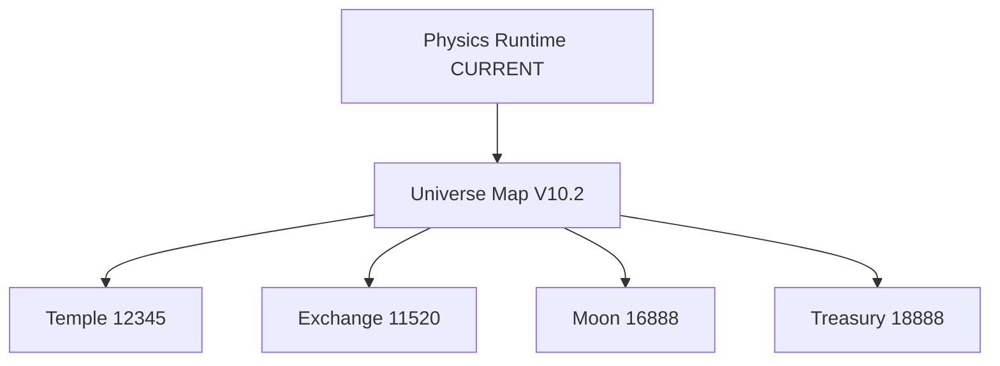

# KGEN UNIVERSE_MAP

Formal file: `C:\Desktop\kline-odyssey\docs\maps\UniverseMap_V10_2_DISTANCE_COMPLETE_ALL_POINTS.json`

| Metric | Value |
| --- | --- |
| JSON valid | True |
| Version | KLINE_UNIVERSE_MAP_V10_2_DISTANCE_COMPLETE_ALL_POINTS |
| Detected point records | 246 |
| 12345 hits | 19 |
| 16888 hits | 399 |
| 11520 hits | 5 |

## Universe Files
| Full path | Category | Purpose | Rule |
| --- | --- | --- | --- |
| C:\Desktop\kline-odyssey\constrains\UNIVERSE_CONSTRAINTS_V1_0.md | Markdown | Repository document/config. | NORMAL |
| C:\Desktop\kline-odyssey\docs\KGEN_TEMPLE_12345_MAP.md | Markdown | Repository document/config. | NORMAL |
| C:\Desktop\kline-odyssey\docs\maps\README.md | Markdown | Repository document/config. | NORMAL |
| C:\Desktop\kline-odyssey\docs\maps\UniverseMap_V10_2_DISTANCE_COMPLETE_ALL_POINTS.json | Universe Map, JSON | Formal Universe Map V10.2. | NORMAL |
| C:\Desktop\kline-odyssey\docs\neural\KGEN_Universe_Neural_System_V1_0.md | Markdown, Neural | Repository document/config. | NORMAL |
| C:\Desktop\kline-odyssey\docs\physics\KGEN_Universe_Physics_Runtime_CURRENT.md | Runtime, Physics, Markdown | Formal Physics Runtime CURRENT. | DO_NOT_MODIFY |
| C:\Desktop\kline-odyssey\docs\physics\KGEN_Universe_Physics_Runtime_V1_2.md | Runtime, Physics, Markdown | Runtime file/documentation. | NORMAL |
| C:\Desktop\kline-odyssey\docs\physics\KGEN_Universe_Physics_Runtime_V1_3.md | Runtime, Physics, Markdown | Runtime file/documentation. | NORMAL |
| C:\Desktop\kline-odyssey\docs\physics\KGEN_Universe_Physics_Runtime_V1_4.md | Runtime, Physics, Markdown | Runtime file/documentation. | NORMAL |
| C:\Desktop\kline-odyssey\docs\physics\KGEN_Universe_Physics_Runtime_V1_6.md | Runtime, Physics, Markdown | Runtime file/documentation. | NORMAL |
| C:\Desktop\kline-odyssey\docs\physics\KGEN_Universe_Physics_Runtime_V1_7.md | Runtime, Physics, Markdown | Runtime file/documentation. | NORMAL |
| C:\Desktop\kline-odyssey\docs\physics\KGEN_Universe_Physics_Runtime_V3_1_Territory_Unified.md | Runtime, Physics, Markdown | Runtime file/documentation. | NORMAL |
| C:\Desktop\kline-odyssey\docs\physics\KGEN_Universe_Physics_Runtime_V3_3_EARTH_LIFE_CERTIFICATION.md | Runtime, Physics, Markdown | Runtime file/documentation. | NORMAL |
| C:\Desktop\kline-odyssey\docs\physics\KGEN_Universe_Physics_Runtime_V3_7.md | Runtime, Physics, Markdown | Runtime file/documentation. | NORMAL |
| C:\Desktop\kline-odyssey\KGEN\contracts\KGEN_16888_Universe_V5_20_0.sol | Contract | Solidity contract source/archive. | CONTRACT_REVIEW |
| C:\Desktop\kline-odyssey\KGEN\whitepaper\math\KGEN_SignedUniverse_MathLaw_V7.5-GENESIS-01.md | Markdown, Whitepaper | Cumulative whitepaper/documentation. | CUMULATIVE_ONLY |
| C:\Desktop\kline-odyssey\KGEN_MODULE_MAP.md | Markdown | Repository document/config. | NORMAL |
| C:\Desktop\kline-odyssey\K線西遊記\data\kgen-5d-world-map.json | JSON | Repository document/config. | NORMAL |
| C:\Desktop\kline-odyssey\K線西遊記\temples\12345\assets\warp-universe.png | Temple, Assets | Temple 12345 file. | NORMAL |
| C:\Desktop\kline-odyssey\K線西遊記\temples\12345\docs\ASSET_BINDING_MAP.md | Temple, Markdown | Temple 12345 file. | NORMAL |
| C:\Desktop\kline-odyssey\K線西遊記\temples\12345\docs\EXECUTION_MAP.md | Temple, Markdown | Temple 12345 file. | NORMAL |
| C:\Desktop\kline-odyssey\K線西遊記\temples\12345\docs\PANEL_CONTROL_MAP.md | Temple, Markdown | Temple 12345 file. | NORMAL |
| C:\Desktop\kline-odyssey\K線西遊記\temples\12345\KGEN_Universe_Physics_Runtime_V1_6.md | Runtime, Physics, Temple, Markdown | Temple 12345 file. | NORMAL |
| C:\Desktop\kline-odyssey\K線西遊記\temples\12345\modules\kgen-12345-universe-elevator.js | Temple, Frontend | Temple 12345 file. | 12345_RUNTIME_REVIEW |
| C:\Desktop\kline-odyssey\K線西遊記\temples\12345\modules\runtime-universe-axis.js | Runtime, Temple, Frontend | Temple 12345 file. | 12345_RUNTIME_REVIEW |
| C:\Desktop\kline-odyssey\K線西遊記\temples\12345\UNIVERSE_MAP_REFERENCE.md | Universe Map, Temple, Markdown | Temple 12345 file. | NORMAL |
| C:\Desktop\kline-odyssey\neural\NEURAL_MAP.json | JSON, Neural | Repository document/config. | NORMAL |
| C:\Desktop\kline-odyssey\whitepaper\KGEN Universe Runtime Autopilot V0.1.md | Runtime, Markdown, Whitepaper | Cumulative whitepaper/documentation. | CUMULATIVE_ONLY |
| C:\Desktop\kline-odyssey\whitepaper\KGEN_COSMIC_CORE_UNIVERSE_MAP_V12_0_FULL.json | Universe Map, JSON, Whitepaper | Cumulative whitepaper/documentation. | CUMULATIVE_ONLY |
| C:\Desktop\kline-odyssey\whitepaper\KGEN_SignedUniverse_MathLaw_V7.5-GENESIS-01.md | Markdown, Whitepaper | Cumulative whitepaper/documentation. | CUMULATIVE_ONLY |
| C:\Desktop\kline-odyssey\whitepaper\KGEN_Universe_Civilization_Life_Engine_Whitepaper_V2_0_FULL_ARCHIVE_CONSTITUTION.md | Markdown, Whitepaper, Archive | Cumulative whitepaper/documentation. | ARCHIVE_KEEP |
| C:\Desktop\kline-odyssey\whitepaper\KGEN_Universe_Physics_Runtime_V1_6.md | Runtime, Physics, Markdown, Whitepaper | Cumulative whitepaper/documentation. | CUMULATIVE_ONLY |
| C:\Desktop\kline-odyssey\whitepaper\KGEN_UNIVERSE_RESEARCH_BOOK_V1_1.md | Markdown, Whitepaper | Cumulative whitepaper/documentation. | CUMULATIVE_ONLY |
