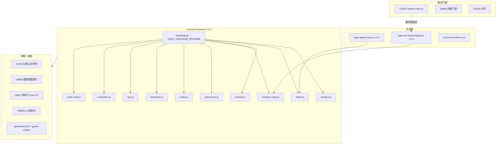

# KGEN Universe Runtime V1.0 — 架構文件

## 概述

Universe Runtime 是 KGEN 5D 宇宙的唯一共用執行時，所有神殿（11520 / 18888 / 18921 / 108000）與 K線5D 遊戲共用，**不修改** 12345 `runtime-main.js` 與任何合約。

## 架構圖



## 模組關係

| 模組 | 全域符號 | 職責 |
|------|----------|------|
| Game Core | `KGEN_5D`, `KGEN_Wallet`, `KGEN_KlineFeed` | 常數、錢包、行情、Canvas 工具 |
| Physics | `KGEN_UNIVERSE_PHYSICS` | K 軸、vK 多空、稅率拆分、Warp 成本 |
| Wallet | `KGEN_UNIVERSE_WALLET` | 錢包連線、ERC20 讀取、eth_call |
| Camera | `KGEN_UNIVERSE_CAMERA` | 2D 視口平移/縮放 |
| Universe Map | `KGEN_UNIVERSE_MAP` | 載入 world-map JSON、航道圖、導覽 Dock |
| Status Bus | `KGEN_UNIVERSE_STATUS_BUS` | 跨模組事件匯流排 |
| Audio | `KGEN_UNIVERSE_AUDIO` | 單一 Web Audio 引擎 |
| Animation | `KGEN_UNIVERSE_ANIMATION` | rAF 動畫迴圈 |
| NPC | `KGEN_UNIVERSE_NPC` | 神猴交易員、銀行使者等 |
| Civilization | `KGEN_UNIVERSE_CIVILIZATION` | 等級、任務、裝備、技能 |
| Chain Read | `KGEN_UNIVERSE_CHAIN` | Treasury、LP Pair、安全儀表板 |
| Bootstrap | `KGEN_UNIVERSE_RUNTIME` | 統一 boot 入口 |

## Script 載入順序（神殿標準）

```html
<link rel="stylesheet" href="../../modules/kgen-game-core.css">
<link rel="stylesheet" href="../../modules/universe-runtime/universe-runtime.css">
<script src="../../modules/kgen-game-core.js"></script>
<script src="../../modules/universe-runtime/physics.js"></script>
<script src="../../modules/universe-runtime/status-bus.js"></script>
<script src="../../modules/universe-runtime/wallet.js"></script>
<script src="../../modules/universe-runtime/camera.js"></script>
<script src="../../modules/universe-runtime/audio.js"></script>
<script src="../../modules/universe-runtime/animation.js"></script>
<script src="../../modules/universe-runtime/universe-map.js"></script>
<script src="../../modules/universe-runtime/npc.js"></script>
<script src="../../modules/universe-runtime/civilization.js"></script>
<script src="../../modules/universe-runtime/chain-read.js"></script>
<script src="../../modules/universe-runtime/bootstrap.js"></script>
```

Boot 範例：

```javascript
KGEN_UNIVERSE_RUNTIME.boot({
  nodeId: '11520',
  statusElementId: 'kgen-status-text',
  universeDockId: 'universe-dock',
  npcContainerId: 'npc-panel',
  civContainerId: 'civ-hud',
  cosmicMapCanvasId: 'cosmic-map',
  walletButtonId: 'btn-wallet',
});
```

## 邊界規則

| 項目 | 是否修改 |
|------|----------|
| 12345 `runtime-main.js` | **NO** |
| KGEN 合約 / 部署 | **NO** |
| 12345 Heart / Wallet Hub / Bridge / 倒數 | **NO** |
| GitHub Pages 路徑 | **NO**（僅新增相對連結） |
| 11520 / 18888 / 18921 / 108000 / 5D Game | YES（接入 Runtime） |

## 驗收清單

- [x] Universe Runtime 模組齊全
- [x] world-map.json 單一資料源
- [x] 花果山：Order Book / Depth / Swap / Land / NPC
- [x] 靈霄寶殿：Treasury read / Security Dashboard
- [x] 斬妖台：LP Dashboard / Pair Reserve / Animation
- [x] 火星豪宅：500 席位表 + 鏈上 mint 保留
- [x] 5D Game：Boss / 任務 / 裝備 / Warp / 世界地圖
