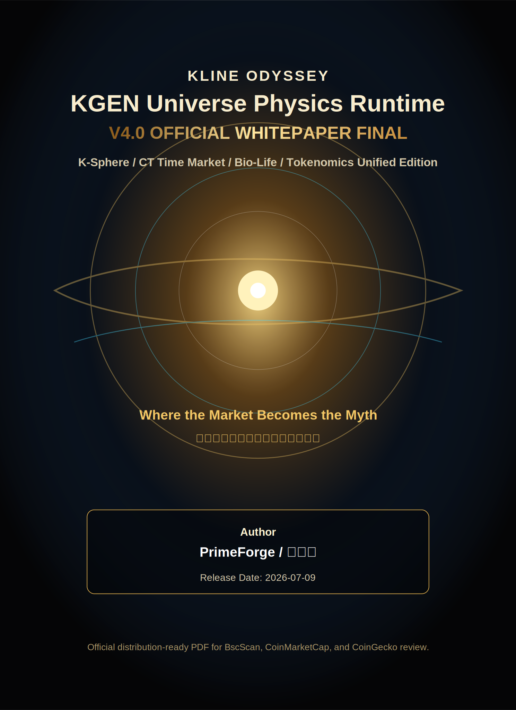
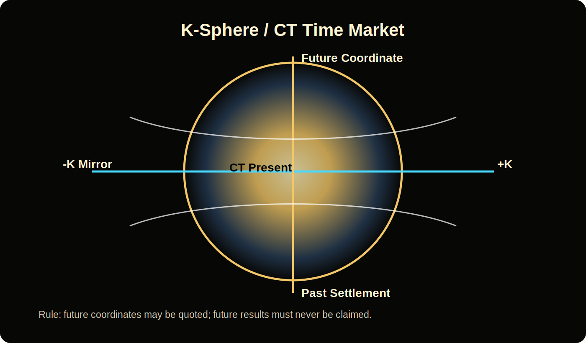
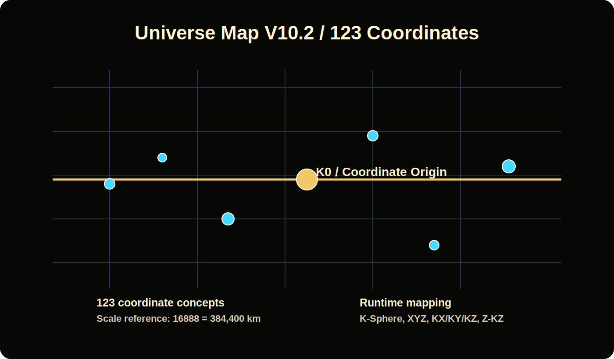

# KGEN Universe Physics Runtime V4.0 Official Whitepaper Final

**KLINE ODYSSEY / KLINE GENESIS (KGEN)**
**Version:** V4.0 OFFICIAL WHITEPAPER FINAL
**Release date:** 2026-07-09
**Author:** PrimeForge / 樂天帝
**Official website:** https://klineodyssey.github.io/kline-odyssey/
**Repository:** https://github.com/klineodyssey/kline-odyssey

> Where the Market Becomes the Myth.

## Document Status

This document is the publication-ready official whitepaper edition of the KGEN Universe Physics Runtime. It is based on `docs/physics/KGEN_Universe_Physics_Runtime_CURRENT.md`, aligned with `KGEN/contracts/KGEN_Token_V7_5_2.sol`, and organized for public review by BscScan, CoinMarketCap, CoinGecko, GeckoTerminal, community partners, and ecosystem contributors.

This V4.0 FINAL whitepaper is not a raw export of the Runtime source file. It is an editorially consolidated official edition that translates the living Runtime constitution into a public-facing project, tokenomics, governance, and ecosystem document.

## Table of Contents

1. Executive Summary
2. Project Overview
3. Runtime Source and Editorial Method
4. KGEN Universe Physics Model
5. K-Sphere, CT, and Time Market
6. Universe Map and Coordinate System
7. Program Lifeform and Bio-Life Implementation
8. Ecosystem Architecture
9. KGEN Tokenomics
10. Fair Launch Statement
11. Governance and Immutability
12. Official Links
13. Risk and Legal Notice
14. Appendix A: Contract-Aligned Constants
15. Appendix B: Source Map

---

## 1. Executive Summary

KLINE ODYSSEY is a Web3 x financial civilization project that treats market structure, application systems, and on-chain assets as a unified living universe. KGEN, the KLINE GENESIS token, is the base energy and accounting unit of that universe. The project combines a narrative universe, static public frontends, KGEN temple interfaces, runtime documentation, and BNB Smart Chain token infrastructure.

The KGEN Universe Physics Runtime defines the conceptual rules of the universe. In the Runtime, price, position, time, leverage, territory, application life, exchange functions, and player actions are treated as components of a coherent civilization model. The V4.0 Official Whitepaper translates that Runtime into a public document with clear definitions, reviewable tokenomics, official links, and platform-ready disclosures.

KGEN is deployed on BNB Smart Chain as a BEP-20 token named **KLINE GENESIS** with symbol **KGEN**. The contract supply is **72,000,000 KGEN** with **18 decimals**. The tax model is fixed at **0.30% only on AMM buy/sell interactions**, split into Burn 0.10%, Bank 0.10%, Reward 0.05%, and AutoLP 0.05%. Wallet-to-wallet transfers are not taxed. These values are aligned with `KGEN_Token_V7_5_2.sol`.

The project declares a fair-launch posture for public sale history: **No ICO / No IEO / No Presale**. This whitepaper does not offer securities, promise returns, or solicit investment. It documents the KGEN ecosystem, its official token contract, runtime model, and civilization architecture.

---

## 2. Project Overview

### 2.1 Project Identity

| Item | Official Information |
|---|---|
| Project | KLINE ODYSSEY |
| Token | KLINE GENESIS |
| Symbol | KGEN |
| Chain | BNB Smart Chain |
| Standard | BEP-20 |
| Official Website | https://klineodyssey.github.io/kline-odyssey/ |
| Official GitHub | https://github.com/klineodyssey/kline-odyssey |
| Author / Founder Identity | PrimeForge / 樂天帝 |

KLINE ODYSSEY is built as a public Web3 project and a mythic financial civilization. The public repository contains static website pages, temple frontends, KGEN whitepapers, physics and biology runtimes, maps, and optional smart contract source files.

### 2.2 What KGEN Represents

KGEN is the base unit of the KLINE ODYSSEY universe. In the universe physics model, KGEN is treated as:

- a mass and energy unit for civilization accounting;
- a participation and governance medium inside the ecosystem;
- the token representation of the KLINE GENESIS project on BNB Smart Chain;
- a bridge between financial behavior, application life, temple systems, and runtime documentation.

The Runtime uses mythic language to describe market mechanics, but the token contract remains simple and reviewable: a BEP-20 ERC20-style token with fixed supply and a constrained AMM buy/sell tax path.

### 2.3 Public Website and Portal

The official homepage is:

https://klineodyssey.github.io/kline-odyssey/

The public portal links the official website, YouTube, whitepapers, Universe Map, temple frontends, KGEN token dashboard, and community channels.

---

## 3. Runtime Source and Editorial Method

The primary source for this whitepaper is:

`docs/physics/KGEN_Universe_Physics_Runtime_CURRENT.md`

That Runtime is a living constitution with a long cumulative history. It contains 100 major Runtime parts and more than 230 numbered rules. This V4.0 whitepaper does not delete or supersede that archive. Instead, it extracts, consolidates, and edits the public-facing meaning of the CURRENT Runtime into an official publication format.

The editorial method is:

1. Preserve the CURRENT Runtime as the authoritative internal constitution.
2. Translate the Runtime into public project language.
3. Align tokenomics with `KGEN_Token_V7_5_2.sol`.
4. Keep financial, legal, and launch statements clear and non-promissory.
5. Provide official links and file paths for external review.

---

## 4. KGEN Universe Physics Model

### 4.1 Core Premise

The KGEN Universe Physics Runtime models markets as a civilization field. It does not treat price as a detached chart. Instead, it treats price, position, time, velocity, leverage, collateral, land, applications, and user actions as interacting components in a single universe.

The Runtime's conceptual primitives include:

- **KGEN Mass:** the base unit of civilization energy.
- **XYZ Space:** observable local market coordinates.
- **K-Sphere:** the unified field in which market motion becomes directional work.
- **CT Boundary:** the current-time boundary where orders, observation, and settlement become meaningful.
- **Direction Switch:** the long/short directional control model.
- **Universe Elevator:** a conceptual coordinate layer for moving between K levels.
- **Program Lifeform:** the rule that code, apps, files, folders, functions, and documents may operate as living organs of the project.

### 4.2 KGEN as Mass and Energy

The Runtime frames KGEN as the unit that gives position and civilization mass. This is symbolic and system-design language. It does not by itself imply a guaranteed asset price, investment return, or physical commodity claim. In the project model, KGEN is the unit used to describe participation, governance, ecosystem energy, and on-chain accounting.

### 4.3 Market Motion

The Runtime rejects a simple angle-only interpretation of bull and bear states. Instead, it describes market direction through velocity and work along the K axis. This gives the project a consistent vocabulary for long/short direction, mirrored universes, settlement, and risk.

### 4.4 Collateral, Land, and Civilization Survival

Later Runtime sections introduce LandNFT, AppNFT, VehicleNFT, collateral pools, liquidation, and civilization survival mechanics. These represent design layers for ecosystem development. They are not all necessarily deployed token contracts at the time of this publication. Their role in this whitepaper is architectural: they define the design language of future KGEN ecosystem modules.

---

## 5. K-Sphere, CT, and Time Market

### 5.1 K-Sphere

K-Sphere is the Runtime's unified field model. It allows KGEN to describe local price action, directional work, leverage capacity, and civilization movement in a single coordinate language.

Key concepts:

- **+K Universe:** direction of positive K-axis work.
- **-K Mirror Universe:** mirrored direction for reverse market structure.
- **Z-KZ Axis:** profit and loss interpretation layer.
- **X-KX / Y-KY Axes:** exploration and lateral coordinate concepts.

### 5.2 CT Time Market

The CURRENT Runtime includes a CT Time Market layer. CT means the current-time boundary: the point where observation, order placement, and settlement can be meaningfully separated.

The Runtime distinguishes:

- **Past:** historical settlement and evidence.
- **Present:** the current execution and observation boundary.
- **Future:** a coordinate that may be modeled but must not be represented as a guaranteed result.

This rule is essential for public communication. KGEN may model future coordinates as scenarios, but it must not claim future profits or guaranteed outcomes.

### 5.3 Time-Market Rule

Future coordinates can be discussed as design, modeling, or scenario space. Future results cannot be promised. This principle protects the project from confusing a runtime model with financial guarantees.

---

## 6. Universe Map and Coordinate System

The Universe Map source is:

`docs/maps/UniverseMap_V10_2_DISTANCE_COMPLETE_ALL_POINTS.json`

The map identifies **123 coordinate concepts**. It is used as a worldbuilding and runtime mapping source for the KGEN universe. The CURRENT map includes a scale reference in which **16888 = 384,400 km**, tying the mythic coordinate layer to a recognizable astronomical distance reference.

The map is not presented as a complete geographic or scientific dataset. It is a runtime map for KLINE ODYSSEY's mythic-financial civilization system.

### 6.1 Coordinate Roles

The Universe Map and Runtime connect:

- market observation;
- K-Sphere coordinates;
- player movement;
- boundary coordinates;
- temple locations;
- exchange and settlement concepts;
- civilization territory and land models.

### 6.2 Temple Coordinates

KLINE ODYSSEY uses temple IDs as public-facing civilization nodes. Important examples include:

| Temple | Public Role |
|---|---|
| 12345 五指山悟空財神殿 | Heart, wallet, player entry, fortune temple |
| 16888 廣寒宮 | Moon / market observation and engine concept |
| 11520 花果山交易所 | Universe exchange and asset liquidity concept |
| 18888 神明銀行 | Banking, collateral, treasury, liquidation concept |
| 18921 斬妖台 | AutoLP and purification / LP forge concept |
| 108000 火星豪宅 | Seat, distribution, Mars base, 5D entry concept |

---

## 7. Program Lifeform and Bio-Life Implementation

The Runtime uses the statement **Code = Life** as a design principle. Within the KGEN universe, files are not treated as inert storage. They are treated as organs in a larger system:

| Runtime Term | Software Interpretation |
|---|---|
| Folder | Body |
| File | Organ |
| Function | Cell |
| DNA | Civilization gene |
| RNA | Runtime instruction |
| README | Civilization memory |

The purpose of this metaphor is operational. It creates rules for how agents, developers, and AI systems should modify the repository:

- avoid duplicate organs for the same function;
- preserve CURRENT runtimes as formal versions;
- avoid arbitrary patch/fix/hotfix/stable filenames for formal organs;
- read Boot, Runtime, Universe Map, and AGENTS before construction;
- treat documentation as an active part of the system.

### 7.1 Bio-Life Implementation Gate

The CURRENT Runtime's final layer describes a Bio-Life implementation gate. It indicates that future implementation work must treat temple frontends, contracts, maps, runtime files, AI agents, and documentation as an integrated organism.

This whitepaper records that governance posture for public reviewers, while the actual executable implementation remains in the repository.

---

## 8. Ecosystem Architecture

KLINE ODYSSEY is organized as a layered ecosystem:

1. **Official Website:** public portal and project homepage.
2. **KGEN Token:** BEP-20 token on BNB Smart Chain.
3. **Temples:** static frontend experiences and runtime organs.
4. **Universe Map:** JSON coordinate map and worldbuilding data.
5. **Runtime Documents:** physics, biology, boot, and specification files.
6. **Whitepapers:** public explanatory documents.
7. **Contracts:** optional on-chain components including KGEN token source.
8. **AI / Autopilot Rules:** repository governance and work-system instructions.

### 8.1 12345 Heart Temple

The 12345 temple is the public heart temple of the current KLINE ODYSSEY experience. It is a frontend and runtime shell for the 悟空財神殿 concept, player entry, wallet flows, and public-facing temple interactions.

### 8.2 11520 Universe Exchange

11520 is defined in the Runtime as a universe exchange concept. It functions as the design point for tradable organs, exchange flows, and civilization liquidity.

### 8.3 18888 Divine Bank

18888 is the banking layer concept, tied to collateral, treasury, credit, settlement, and civilization survival mechanics.

### 8.4 5D and App Life

The Runtime includes application-life concepts such as AppNFT, Game Organism, VehicleNFT, and bio-life listing standards. These are ecosystem architecture concepts unless a specific deployed contract or production frontend is explicitly identified in the repository.

---

## 9. KGEN Tokenomics

This section is aligned with:

`KGEN/contracts/KGEN_Token_V7_5_2.sol`

### 9.1 Token Identity

| Item | Value |
|---|---|
| Name | KLINE GENESIS |
| Symbol | KGEN |
| Chain | BNB Smart Chain |
| Standard | BEP-20 |
| Total Supply | 72,000,000 KGEN |
| Decimals | 18 |
| Contract | `0xBA3d3810e58735cb6813bC1CDc5458C0d71432Be` |

### 9.2 Tax Scope

The tax applies **only on AMM buy/sell interactions**. Wallet-to-wallet transfers are not taxed.

The contract implements this by checking whether either side of a transfer is marked as a market maker pair and whether either side is tax-exempt. If the transfer is not an AMM pair interaction, or if a tax-exempt address is involved, the transfer proceeds with no tax.

### 9.3 Tax Split

| Component | Rate | Basis Points |
|---|---:|---:|
| Total Tax | 0.30% | 30 bps |
| Burn | 0.10% | 10 bps |
| Bank | 0.10% | 10 bps |
| Reward | 0.05% | 5 bps |
| AutoLP | 0.05% | 5 bps |

The burn component is sent to the null address. Bank, Reward, and AutoLP are routed to their configured wallets.

### 9.4 Transfer Rules

| Transfer Type | Tax Treatment |
|---|---|
| AMM buy | 0.30% total tax |
| AMM sell | 0.30% total tax |
| Wallet-to-wallet transfer | No tax |
| Mint / burn internal update | No tax path |
| Tax-exempt address transfer | No tax |

### 9.5 Immutability of Tax Rate

The contract defines tax basis points as constants:

- `TAX_BPS_TOTAL = 30`
- `TAX_BPS_BURN = 10`
- `TAX_BPS_BANK = 10`
- `TAX_BPS_REWARD = 5`
- `TAX_BPS_AUTOLP = 5`

The contract does not expose a tax-rate setter such as `setTax`, `updateTax`, `setFees`, or `updateFees`. Administrative functions can manage tax wallets, tax-exempt addresses, and market maker pair labels, but they do not change the fixed basis point values.

---

## 10. Fair Launch Statement

KGEN is presented with the following fair-launch statement for public documentation:

**No ICO / No IEO / No Presale.**

This whitepaper is not an offering document. It does not sell tokens, solicit funds, guarantee listing, promise returns, or represent that any user will earn profit. KGEN is an ecosystem participation token for the KLINE ODYSSEY project and should be evaluated through the official contract, public links, and repository records.

---

## 11. Governance and Immutability

### 11.1 Repository Governance

KLINE ODYSSEY uses repository-level governance rules for AI and human contributors. The permanent work rules require agents to read the Boot Sequence, Runtime CURRENT, Universe Map, and AGENTS before modification.

This is part of the project's internal safety model:

- formal runtimes must not be duplicated arbitrarily;
- CURRENT runtime files govern active interpretation;
- new official documents should be cumulative and self-contained;
- program files should not be modified before checking existing same-function files;
- commits and pushes require explicit authorization.

### 11.2 Contract Governance

The KGEN token contract includes owner-controlled functions for operational configuration, such as setting tax wallets, tax-exempt status, and AMM pair status. These functions do not modify the fixed tax basis points.

### 11.3 Whitepaper Governance

This V4.0 FINAL whitepaper is a cumulative public edition. It does not require readers to consult older whitepaper versions to understand the official project overview, tokenomics, launch statement, or links.

---

## 12. Official Links

| Category | URL |
|---|---|
| Website | https://klineodyssey.github.io/kline-odyssey/ |
| GitHub | https://github.com/klineodyssey/kline-odyssey |
| BscScan | https://bscscan.com/token/0xBA3d3810e58735cb6813bC1CDc5458C0d71432Be |
| GeckoTerminal | https://www.geckoterminal.com/bsc/pools/0xf36640d7327b53ba3d7fcc1d98dfc1b85574b6c2 |
| Telegram | https://t.me/klineodyssey |
| X | https://x.com/klineodyssey |
| YouTube | https://www.youtube.com/@klineodyssey |

Additional useful links:

| Category | URL |
|---|---|
| PancakeSwap | https://pancakeswap.finance/swap?outputCurrency=0xBA3d3810e58735cb6813bC1CDc5458C0d71432Be |
| CMC DexScan | https://coinmarketcap.com/dexscan/bsc/0xf36640d7327b53ba3d7fcc1d98dfc1b85574b6c2/ |
| LP Pair on BscScan | https://bscscan.com/address/0xf36640d7327b53ba3d7fcc1d98dfc1b85574b6c2 |

---

## 13. Risk and Legal Notice

KGEN is a decentralized digital asset deployed on BNB Smart Chain. Participation in any cryptocurrency or Web3 ecosystem involves risk, including but not limited to smart contract risk, market volatility, liquidity risk, regulatory uncertainty, UI risk, and total loss of funds.

This whitepaper is for informational and documentation purposes. It is not financial advice, legal advice, investment advice, a securities offering, a guarantee of profit, or a promise of future performance. Users are responsible for their own research, wallet security, tax obligations, and transaction decisions.

References to universe physics, temples, civilization, energy, mass, DNA, or lifeforms are project metaphors and system-design concepts. They do not imply physical asset backing, guaranteed market value, or guaranteed returns.

---

## 14. Appendix A: Contract-Aligned Constants

| Constant / Rule | Official Value |
|---|---|
| Contract source | `KGEN/contracts/KGEN_Token_V7_5_2.sol` |
| ERC20 constructor name | `KLINE GENESIS` |
| ERC20 constructor symbol | `KGEN` |
| Total supply constant | `72_000_000 * 1e18` |
| Decimals | 18 |
| Total tax | 30 bps |
| Burn tax | 10 bps |
| Bank tax | 10 bps |
| Reward tax | 5 bps |
| AutoLP tax | 5 bps |
| Tax condition | AMM pair buy/sell only |
| Wallet-to-wallet transfers | No tax |
| Tax-rate setter | None |

---

## 15. Appendix B: Source Map

| Source | Role in V4.0 FINAL |
|---|---|
| `docs/physics/KGEN_Universe_Physics_Runtime_CURRENT.md` | Primary universe physics runtime source |
| `docs/maps/UniverseMap_V10_2_DISTANCE_COMPLETE_ALL_POINTS.json` | Universe coordinate and map source |
| `README.md` | Official project links and public identity reference |
| `KGEN/contracts/KGEN_Token_V7_5_2.sol` | Tokenomics, tax, supply, and transfer-rule source |
| `KGEN/whitepaper/` | Existing KGEN whitepaper archive and public knowledge base |
| `whitepaper/` | Existing broader KLINE ODYSSEY whitepaper archive |
| `logo.png` | Official KGEN logo asset |
| `kgen32.svg` | Official small-format KGEN logo asset |

---

## Final Statement

KGEN Universe Physics Runtime V4.0 Official Whitepaper Final is the public bridge between the living KGEN Runtime and the external review world. It documents KLINE ODYSSEY as a Web3 financial civilization project, records KGEN's tokenomics against the deployed source contract, and presents the universe physics model in a form that can be reviewed, cited, and distributed.

**PrimeForge / 樂天帝**
**2026-07-09**
